# PingIsland 架構文件

這份文件描述 PingIsland（macOS 選單列 app）的完整內部架構：每個子系統的責任、關鍵型別、核心流程（mermaid），以及跨子系統的端到端資料流。它是一份**活文件**，跟程式碼一起維護，覆蓋率以檔案級 100% 為目標並用 script 驗證。

閱讀順序建議：先讀「系統總覽」建立骨架，再讀「跨切面流程索引」理解資料怎麼流過整個 app，最後按需求跳到對應章節。每章結構一致：檔案清單、責任、關鍵型別、核心流程圖、資料契約表、棘手分支/地雷、與其他子系統的邊界。

---

## 這份文件如何維持存活（活文件契約）

這份文件的存在前提是「改 code 就改 doc」。契約如下：

- **覆蓋率 metric = 檔案級 100%**。每個 production source `.swift` 檔都必須被某一章記載其責任與關鍵型別，並出現在「附錄 B 檔案覆蓋矩陣」。分母是 177 個檔（`PingIsland/` 157 + `Prototype/Sources/` 20）。`Prototype/Tests/` 的 12 個測試檔不計入（測試不是架構，其涵蓋範圍在 §15 概述）。
- **粒度刻意停在檔案／型別／流程級，不逐 if/else**。行級細節看 code；文件記的是「改介面或改流程才需要動」的結構。流程用 mermaid，規則與資料契約用散文加表格。這是為了讓文件維護得動——逐行複製 code 的文件一次 commit 就死。
- **只要 code 或架構有改，`ARCHITECTURE.md` 就一起改** — code change 沒改到 doc 就不算完成。這是以「每次改 code」為單位，不綁 PR 或 commit 邊界：改到的檔 → 更新對應章的敘述與圖；新增檔 → 加進附錄 B 矩陣並歸入某章；刪檔 → 移除矩陣列與相關敘述；改跨子系統流程 → 更新「跨切面流程索引」與相關章的圖。
- **docs-first 開發要把 doc 更新寫進 plan**：本專案常用 superpowers（`brainstorming` → `writing-plans`，spec/plan 放 `docs/superpowers/`）先寫文件再開發。當 spec/plan 描述某個 code change 時，那份 plan 必須把「更新 `ARCHITECTURE.md` 與覆蓋矩陣」列成明確 task／步驟 — doc 更新是工作項的一部分，跟著實作一起出，不落後。
- **commit 前跑 `scripts/check-arch-coverage.sh`**。它列出所有 doc 未提及的 source 檔，非空則 exit 1，可當 CI gate。這條規則釘在 `CLAUDE.md` 與 `AGENTS.md`，不是靠記性。

驗證指令：

```sh
./scripts/check-arch-coverage.sh   # 未覆蓋清單非空則失敗
```

---

## 系統總覽

PingIsland 把多家 agent CLI／app（Claude Code、Codex、Gemini、Hermes、Qwen、Kimi 等）的 session 狀態，正規化成單一真相來源後呈現成 Dynamic Island 風格的選單列 UI。核心資料路徑是「六路 ingress → `SessionStore`（唯一真相）→ `SessionMonitor` / `ChatHistoryManager` 讀側橋接 → `NotchViewModel` → docked / detached 兩種 SwiftUI 呈現面」。

`SessionStore` 是全 app 的中樞，一個 `actor` singleton，唯一寫入點是 `process(_ event: SessionEvent)`，唯一讀出點是 `nonisolated` 的 Combine `sessionsPublisher`。所有 ingress 都先轉成 `SessionEvent` 才進 store，所有 UI 都只讀 publisher，沒有旁路。點擊 session 會走另一條獨立路徑：`SessionLauncher` 依 provider 與終端機類型做 fallback 鏈聚焦。

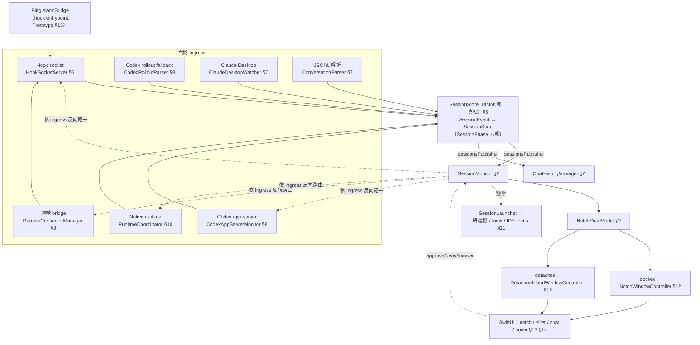
```mermaid
flowchart TB
  Bridge["PingIslandBridge<br/>（hook entrypoint, Prototype §15）"]
  subgraph ingress["六路 ingress"]
    H["Hook socket<br/>HookSocketServer §6"]
    C["Codex app-server<br/>CodexAppServerMonitor §8"]
    CR["Codex rollout fallback<br/>CodexRolloutParser §8"]
    RT["Native runtime<br/>RuntimeCoordinator §10"]
    DW["Claude Desktop<br/>ClaudeDesktopWatcher §7"]
    RB["遠端 bridge<br/>RemoteConnectorManager §9"]
    JP["JSONL 解析<br/>ConversationParser §7"]
  end
  Bridge --> H
  RB --> H
  H --> SS
  C --> SS
  CR --> SS
  RT --> SS
  DW --> SS
  JP --> SS
  SS["SessionStore（actor, 唯一真相）§5<br/>SessionEvent → SessionState（SessionPhase 六態）"]
  SS -->|sessionsPublisher| SM["SessionMonitor §7"]
  SS -->|sessionsPublisher| CH["ChatHistoryManager §7"]
  SM --> VM["NotchViewModel §2"]
  VM --> DOCK["docked：NotchWindowController §12"]
  VM --> DET["detached：DetachedIslandWindowController §12"]
  DOCK --> UI["SwiftUI：notch / 列表 / chat / hover §13 §14"]
  DET --> UI
  SM -.點擊.-> SL["SessionLauncher →<br/>終端機 / tmux / IDE focus §11"]
  UI -.approve/deny/answer.-> SM
  SM -.依 ingress 反向路由.-> H & C & RB & RT
```

---

## 跨切面流程索引

沒有任何單一章節「擁有」以下流程，它們穿越多個子系統。這張表是導覽脊椎：給觸發點、型別鏈、要對照的章節。細節圖在各章。

| # | 流程 | 觸發 | 型別鏈（依序） | 對照章節 |
|---|------|------|----------------|----------|
| 1 | Hook 通知事件 | agent hook 觸發 | `PingIslandBridge` → `HookSocketServer` 解碼 `BridgeEnvelope` → `.hookEvent` 正規化 → `SessionMonitor.handleHookEvent` → `SessionStore.process(.hookReceived)` → `sessionsPublisher` → UI | §15 §6 §5 §2 |
| 2 | Hook 待答（審批／提問） | PreToolUse / permission | `HookSocketServer` 建 `PendingPermission`（保持 fd 開啟）→ `SessionStore` 彈卡 → 使用者作答 → `SessionMonitor.respondToPermission/Intervention` → `HookSocketServer.writeBridgeResponse`（沿原 socket 回 `BridgeResponse`） | §6 §5 §14 |
| 3 | Codex 雙路 ingress | app-server 通知 / 無 hook | `CodexAppServerMonitor`（WS JSON-RPC, port 41241）**或** fallback `CodexRolloutParser`（讀 rollout JSONL）→ `CodexThreadSnapshot` → `SessionStore.upsertCodexSession` / `syncCodexThreadSnapshot`。切換點在 `SessionStore.scheduleCodexRolloutSync`（先 `readThread`，catch 才退 rollout） | §8 §5 |
| 4 | Session 生命週期 | 任一 ingress / end / archive | `SessionEvent` → `SessionStore.process` → `SessionPhase` 六態；provider end → `markSessionEnded`（轉 `.ended`、**留在字典**）；使用者 archive → 刪除；背景 `sweepDeadOrEndedSessions`（5s）GC | §5 §4 |
| 5 | 使用者作答反向路由 | UI approve/deny/answer | `SessionMonitor` 查 `SessionState.ingress` → 分派 `HookSocketServer` / `CodexAppServerMonitor` / `RemoteConnectorManager` / `RuntimeCoordinator` → 再 `SessionStore.process(.interventionResolved)` | §7 §6 §8 §9 §10 |
| 6 | 點擊 → focus 終端機 | 點 session 列 | `SessionListView` → `SessionLauncher.activate`（硬編碼 fallback 鏈）→ `TerminalSessionFocuser`（AppleScript）/ `TmuxController`（切 pane）/ `IDEExtensionInstaller.makeURI`（IDE 內嵌終端機） | §11 §14 |
| 7 | drag-detach ↔ redock | 拖曳瀏海 / 浮動寵物 | `NotchViewModel` 手勢（`IslandDetachmentGestureGate`）→ callback → `IslandPresentationCoordinator` → `DetachedIslandWindowController`；redock 命中 notch zone → `onRedockRequested` → 回寫 `AppSettings.surfaceMode` | §1 §2 §12 |
| 8 | surface mode 切換 | 設定 / onboarding | `AppSettings.$surfaceMode` sink → `IslandPresentationCoordinator.applySurfaceMode` → `showDockedIsland` / `presentFloatingPet` | §1 §3 §12 |
| 9 | idle 導回終端機 | 使用者閒置達門檻 | `UserIdleAutoProtection` → `Settings.setIdleAutoRoutePromptsToTerminalActive` → `BridgeRuntimeConfigWriter.write`（runtime config JSON）→ `PingIslandBridge` hook time 讀取 | §3 §6 §15 |
| 10 | 遠端轉發 | SSH 連線 | `RemoteConnectorManager.connect` → bootstrap + attach（常駐 ssh）→ `RemoteInboundMessage` → `HookEvent(ingress: .remoteBridge)` → `SessionMonitor` → `SessionStore`；決策回送 `sendDecision` | §9 §15 §5 |
| 11 | 即時用量刷新 | `SessionMonitor` 週期（180s 節流） | `ClaudeUsageAPIClient.fetch`（OAuth，失敗退 status-line 快取）/ `CodexUsageLoader.load` → `UsageSnapshotCacheStore` → `UsageSummaryPresenter.providers` → `NotchView` / `UsageSummaryStripView` | §9 |
| 12 | 歷史花費記帳 | hook / transcript 活動 | `SessionStore` → `AgentUsageStore.recordTokenUsage` / `recordHookEvent` → `AgentUsageDailyBucket`（per-source baseline delta）→ 分析 UI | §9 §5 |
| 13 | 完成彈窗 | session 轉完成 | `SessionMonitor.$instances` → `NotchView` completion queue → `SessionCompletionNotificationPolicy`（去重、5s 自動消失）→ `SessionCompletionNotificationView` | §13 |
| 14 | global shortcut | 系統熱鍵 | `AppSettings.$openActiveSessionShortcut` → `GlobalShortcutManager`（Carbon HotKey）→ `NotificationCenter` → `NotchViewModel` / `WindowManager` | §10 |
| 15 | 螢幕遷移 | 螢幕變更 / 游標追隨 | `ScreenObserver` / `EventMonitors` → `NotchScreenMigrationDecider.evaluate` → `ScreenSelector.migrateToScreen` → `NotchWindowController.moveToScreen`（刻意不重建視窗） | §1 §2 |

---

## 章節導覽

按上面「系統總覽」的資料流順序排列。§ 編號同時是「附錄 B 覆蓋矩陣」的章節代號。

1. §1 App 與呈現編排 — app 生命週期、docked/detached 呈現編排、螢幕遷移
2. §2 Notch 幾何與狀態 — `NotchViewModel` 狀態機、frame 縮放、hover、拖曳分離手勢
3. §3 Core 政策與設定 — `EnergyGovernor` 省電政策、`Settings` 全鍵、idle 保護、feature flag、音效
4. §4 領域模型 — `SessionState` / `SessionEvent` / `SessionPhase` / `ClientProfile` 資料契約
5. §5 SessionStore 狀態中樞 — 六路 ingress 正規化、生命週期、關聯持久化
6. §6 Hook 接入層 — socket server、envelope 正規化、各家 client 安裝
7. §7 Session 橋接與解析 — transcript 解析、store→UI 橋接、作答反向路由
8. §8 Codex 接入 — app-server 監控與 rollout fallback 雙路 ingress
9. §9 Usage 與 Remote — 用量／配額讀取、遠端 SSH bootstrap 與轉發
10. §10 Runtime / 更新 / 共用 / 工具 — native runtime scaffold、Sparkle、global shortcut、診斷、utilities
11. §11 Tmux 與終端機 focus — 點擊聚焦 fallback 鏈、各終端機／IDE 分派
12. §12 UI 元件與視窗控制器 — AppKit window controller、frame 縮放、drag/redock、mascot 動畫
13. §13 UI：Notch 與 Detached 呈現 — 展開內容 routing、完成彈窗佇列
14. §14 UI：Session 列表 / Chat / 設定 — 列表互動、hover 預覽、chat、設定視窗
15. §15 Prototype / IslandBridge — 統一 hook entrypoint、context 捕捉、envelope 契約、測試涵蓋

附錄 A：已知不一致與孤兒碼（掃描期觀察）
附錄 B：檔案覆蓋矩陣（177 檔逐檔對應章節）

---
## §01 App 與呈現編排

**檔案：**
- `PingIsland/App/PingIslandApp.swift`
- `PingIsland/App/AppDelegate.swift`
- `PingIsland/App/StatusBarController.swift`
- `PingIsland/App/MenuBarIconStyle.swift`
- `PingIsland/App/AppLaunchConfiguration.swift`
- `PingIsland/App/IslandPresentationCoordinator.swift`
- `PingIsland/App/WindowManager.swift`
- `PingIsland/App/ScreenObserver.swift`
- `PingIsland/App/NotchScreenMigrationDecider.swift`
- `PingIsland/Core/IslandPresentation.swift`

**責任：** 掌管 app 生命週期（單一實例、啟動編排、首次啟動 onboarding 分流）、把 docked notch 與 detached 浮動寵物兩種呈現面（surface mode）在單一 `NotchViewModel` 上切換編排，以及螢幕變更 / 焦點 / 游標追隨時的 notch 螢幕遷移。

**關鍵型別與進入點：**

- `PingIslandApp`（`@main`）→ SwiftUI `App`。只做兩件事：用 `@NSApplicationDelegateAdaptor` 掛上 `AppDelegate`，並宣告一個 SwiftUI `Settings` scene（承載 `SettingsWindowView`，注入 `settings.locale`）。真正的 runtime 全在 `AppDelegate`。
- `AppDelegate`（`@MainActor`）→ 生命週期中樞。持有 `WindowManager`、`ScreenObserver`、`StatusBarController`、`AppLaunchConfiguration`、一個啟動期 `SessionMonitor`、`GlobalShortcutManager.shared`；用兩個 bool 旗標（`shouldPresentSettingsAfterOnboarding`、`shouldRunHookWalkthroughAfterOnboarding`）串接 onboarding 後續動作。啟動時（非測試）建立常駐 `StatusBarController`。
- `StatusBarController`（`@MainActor`, `final`）→ 常駐選單列狀態項（`NSStatusItem` + `NSMenu`），accessory app 進設定的逃生口。選單版面由純函式 `StatusBarMenuBuilder.menu(...)` 產生（開啟設定 / 展示模式 submenu 附 checkmark / 版本資訊行 / 檢查更新（App Store 建置隱藏）/ 離開），只寫 `AppSettings.surfaceMode` 交由 coordinator 的 `$surfaceMode` sink 套用；`menuWillOpen` 重建選單刷新 checkmark 與版本行。檢查更新用階段機訂閱 `UpdateManager.$state` + `NSAlert` 小視窗回報(最新 / 發現新版·安裝 / 錯誤),不開設定 GUI。狀態項圖示由 `AppSettings.menuBarIconStyle` 決定,`$menuBarIconStyle` sink 即時換圖。純建構器與 `StatusMenuItem` / `StatusMenuAction` 值型別可單測（`StatusBarMenuBuilderTests`）。
- `MenuBarIconStyle`（`String` enum, `CaseIterable`）→ 可切換的選單列圖示樣式(瀏海三點 / 實心島鏤空 / 程式碼火花 / 指令泡泡 / 游標火花)。每個 case 對應 `Assets.xcassets` 內一個 template imageset(單色向量,`preserves-vector-representation` + template 染色,原始 SVG 收在 `design/menubar-icons/`),`templateImage(pointSize:)` 載入並複製快取影像設成 template。選擇持久化在 `AppSettings.menuBarIconStyle`,Settings「顯示 > 選單列圖示」的 `MenuBarIconStylePicker` 提供預覽切換。可單測（`MenuBarIconStyleTests`)。
- `AppLaunchConfiguration`（`struct`, `Equatable`）→ 純環境變數解析：把 XCTest / UI test / 環境旗標映射成「這次啟動該不該裝整合、建視窗、觀察螢幕、強制單實例、開設定視窗」以及 activation policy。無副作用，可測。
- `AppLaunchFlow`（`struct`, `Equatable`）→ 純決策：吃 `AppLaunchConfiguration` + `presentationModeOnboardingPending`，算出五個啟動旗標（是否立即監控、是否跑 surface-mode onboarding、是否建初始 Island 視窗、是否立即 / onboarding 後開設定視窗）。
- `NotchDetachmentHintExperience`（`enum`-風格 `struct`）→ 一次性版本升級偵測，決定升級後是否標記 detach 提示與浮動寵物提示待顯示。
- `IslandPresentationCoordinator`（`@MainActor`, `final`）→ 呈現編排核心。擁有單一 `NotchViewModel` 與 `SessionMonitor`，在 `NotchWindowController`（docked）與 `DetachedIslandWindowController`（detached）之間切換，處理 detach 拖曳、re-dock、螢幕更新、浮動寵物 anchor 持久化。
- `WindowManager`（`@MainActor`）→ 螢幕生命週期外殼。持有 `IslandPresentationCoordinator`，訂閱焦點與游標事件觸發跨螢幕遷移；`setupNotchWindow()` 是 coordinator 建立 / 重建的唯一入口。
- `ScreenObserver`（非 `@MainActor` class）→ 薄封裝 `NSApplication.didChangeScreenParametersNotification`，callback 回 `AppDelegate.handleScreenChange`。
- `NotchScreenMigrationDecider`（純 `enum`）→ 游標追隨遷移的純決策函式，所有時間參數外部傳入以利決定性測試，回傳 `NotchMigrationAction`（`none` / `beginDwell` / `migrate`）。
- `Core/IslandPresentation.swift` → 呈現面的共享型別詞彙表：`IslandPresentationMode`（docked/detached）、`IslandSurfaceMode`（實際列舉在別處，此處被消費）、activation policy、detach 手勢 gate、detach 內容正規化器、mascot 來源選擇器。

---

### 核心流程

**流程一：啟動編排與 onboarding 分流。** `applicationDidFinishLaunching` 是主入口，其中 onboarding 是一條靠 bool 旗標接力的分支鏈，且 `#if APP_STORE` 會改變分支。下圖是端到端流程（省略 telemetry / 音效等旁支）。

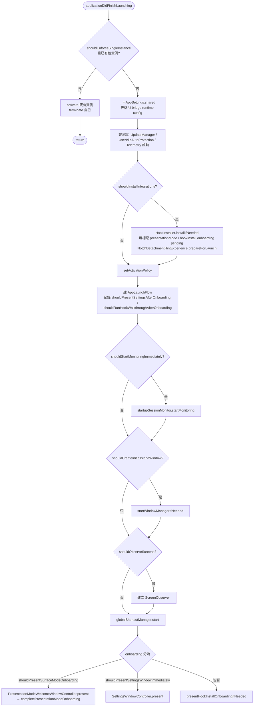
```mermaid
flowchart TD
    Start([applicationDidFinishLaunching]) --> Single{shouldEnforceSingleInstance<br/>且已有他實例?}
    Single -- 是 --> Activate[activate 既有實例<br/>terminate 自己] --> End0([return])
    Single -- 否 --> Touch[_ = AppSettings.shared<br/>先落地 bridge runtime config]
    Touch --> Services[非測試: UpdateManager /<br/>UserIdleAutoProtection / Telemetry 啟動]
    Services --> Install{shouldInstallIntegrations?}
    Install -- 是 --> Hooks["HookInstaller.installIfNeeded<br/>可標記 presentationMode / hookInstall onboarding pending<br/>NotchDetachmentHintExperience.prepareForLaunch"]
    Install -- 否 --> Policy
    Hooks --> Policy[setActivationPolicy]
    Policy --> Flow["建 AppLaunchFlow<br/>記錄 shouldPresentSettingsAfterOnboarding /<br/>shouldRunHookWalkthroughAfterOnboarding"]
    Flow --> Mon{shouldStartMonitoringImmediately?}
    Mon -- 是 --> StartMon[startupSessionMonitor.startMonitoring]
    Mon -- 否 --> Win
    StartMon --> Win{shouldCreateInitialIslandWindow?}
    Win -- 是 --> MakeWin[startWindowManagerIfNeeded]
    Win -- 否 --> Obs
    MakeWin --> Obs{shouldObserveScreens?}
    Obs -- 是 --> ScreenObs[建立 ScreenObserver]
    Obs -- 否 --> Shortcut
    ScreenObs --> Shortcut[globalShortcutManager.start]
    Shortcut --> Branch{onboarding 分流}
    Branch -- shouldPresentSurfaceModeOnboarding --> Welcome[PresentationModeWelcomeWindowController.present<br/>→ completePresentationModeOnboarding]
    Branch -- shouldPresentSettingsWindowImmediately --> Settings[SettingsWindowController.present]
    Branch -- 皆否 --> HookOnboard[presentHookInstallOnboardingIfNeeded]
```

**流程二：onboarding 接力鏈（surface-mode → hook-install → walkthrough）。** onboarding 的三個階段用旗標接力，`completePresentationModeOnboarding` 是承接點。這是本子系統最容易踩雷的分支。

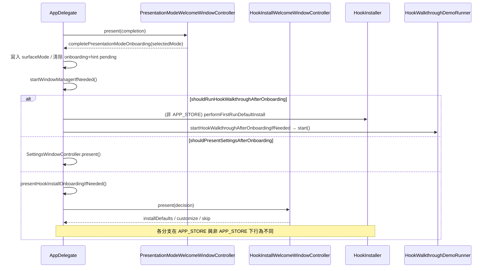
```mermaid
sequenceDiagram
    participant AD as AppDelegate
    participant PW as PresentationModeWelcomeWindowController
    participant HW as HookInstallWelcomeWindowController
    participant HI as HookInstaller
    participant WD as HookWalkthroughDemoRunner

    AD->>PW: present(completion)
    PW-->>AD: completePresentationModeOnboarding(selectedMode)
    AD->>AD: 寫入 surfaceMode / 清除 onboarding+hint pending
    AD->>AD: startWindowManagerIfNeeded()
    alt shouldRunHookWalkthroughAfterOnboarding
        AD->>HI: (非 APP_STORE) performFirstRunDefaultInstall
        AD->>WD: startHookWalkthroughAfterOnboardingIfNeeded → start()
    else shouldPresentSettingsAfterOnboarding
        AD->>AD: SettingsWindowController.present()
    else
        AD->>AD: presentHookInstallOnboardingIfNeeded()
        AD->>HW: present(decision)
        HW-->>AD: installDefaults / customize / skip
        Note over AD,HI: 各分支在 APP_STORE 與非 APP_STORE 下行為不同
    end
```

**流程三：surface mode 切換狀態機（docked ↔ detached/floatingPet）。** `IslandPresentationCoordinator.applySurfaceMode` 是唯一切換點，同時被 `AppSettings.$surfaceMode` 訂閱、init、drag、re-dock 觸發。

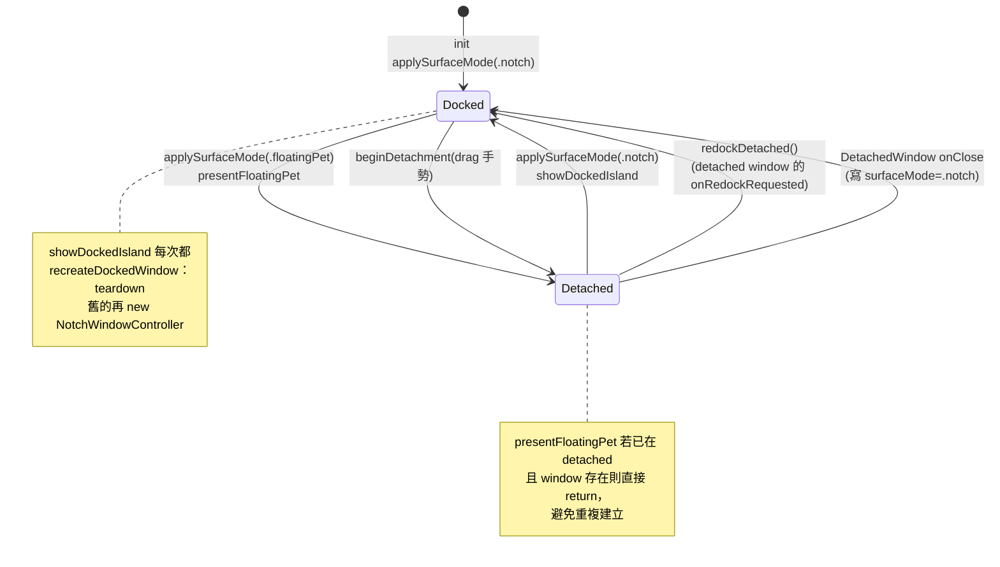
```mermaid
stateDiagram-v2
    [*] --> Docked: init applySurfaceMode(.notch)
    Docked --> Detached: applySurfaceMode(.floatingPet)<br/>presentFloatingPet
    Docked --> Detached: beginDetachment(drag 手勢)
    Detached --> Docked: applySurfaceMode(.notch)<br/>showDockedIsland
    Detached --> Docked: redockDetached()<br/>(detached window 的 onRedockRequested)
    Detached --> Docked: DetachedWindow onClose<br/>(寫 surfaceMode=.notch)
    note right of Docked
        showDockedIsland 每次都
        recreateDockedWindow：teardown
        舊的再 new NotchWindowController
    end note
    note right of Detached
        presentFloatingPet 若已在 detached
        且 window 存在則直接 return，
        避免重複建立
    end note
```

---

### 資料契約 / 規則

**`AppLaunchConfiguration` 環境變數對應（`init` 讀 `ProcessInfo.processInfo.environment`）：**

| 欄位 | 型別 | 決定來源 | 說明 |
|---|---|---|---|
| `isUITesting` | Bool | `PING_ISLAND_UI_TEST_MODE == "1"` | UI 測試模式 |
| `isRunningTests` | Bool | `isUITesting \|\| XCTestConfigurationFilePath != nil` | 任一測試環境 |
| `shouldInstallIntegrations` | Bool | `!isRunningTests` | 是否裝 hook / 整合 |
| `shouldCreateNotchWindow` | Bool | `!isRunningTests` | 是否建 Island 視窗 |
| `shouldObserveScreens` | Bool | `!isRunningTests` | 是否觀察螢幕參數變更 |
| `shouldEnforceSingleInstance` | Bool | `!isRunningTests && !PING_ISLAND_ALLOW_MULTIPLE_INSTANCES` | 單實例強制 |
| `shouldPresentSettingsWindowOnLaunch` | Bool | `isUITesting \|\| PING_ISLAND_SHOW_SETTINGS_ON_LAUNCH == "1"` | 啟動開設定視窗 |
| `activationPolicy` | `NSApplication.ActivationPolicy` | `isUITesting ? .regular : .accessory` | 正常是 menu bar app（`.accessory`，無 Dock 圖示） |

`detectDebuggerAttached()` 用 `sysctl` 讀 `P_TRACED` flag；目前 `init` 的 `isDebuggerAttached` 參數接了但未實際使用（預留）。

**`AppLaunchFlow` 衍生旗標規則（關鍵：onboarding pending 時延後建視窗與設定視窗）：**

| 旗標 | 公式 |
|---|---|
| `shouldStartMonitoringImmediately` | `!isRunningTests` |
| `shouldPresentSurfaceModeOnboarding` | `shouldCreateNotchWindow && presentationModeOnboardingPending` |
| `shouldCreateInitialIslandWindow` | `shouldCreateNotchWindow && !shouldPresentSurfaceModeOnboarding` |
| `shouldPresentSettingsWindowImmediately` | `shouldPresentSettingsWindowOnLaunch && !shouldPresentSurfaceModeOnboarding` |
| `shouldPresentSettingsWindowAfterOnboarding` | `shouldPresentSettingsWindowOnLaunch && shouldPresentSurfaceModeOnboarding` |

重點：surface-mode onboarding 進行中時，初始 Island 視窗與設定視窗都會延後到 `completePresentationModeOnboarding` 才建；但監控（`startupSessionMonitor`）不延後，即使沒有視窗，hook / app-server 事件仍持續進來。

**Onboarding pending 旗標（存於 `AppSettings`，跨啟動持久）：**

| 旗標 | 意義 | 由誰設 pending / 清除 |
|---|---|---|
| `AppSettings.presentationModeOnboardingPending` | 尚未選過 surface mode | `HookInstaller.installIfNeeded` 標記；`completePresentationModeOnboarding` 清除 |
| `AppSettings.hookInstallOnboardingPending` | 尚未跑過 hook 安裝歡迎 | 同上標記；各 decision 分支清除 |
| `AppSettings.notchDetachmentHintPending` / `floatingPetSettingsHintPending` | 升級後提示 | `NotchDetachmentHintExperience` 標記；選完 surface mode 一併清除 |

**`NotchDetachmentHintExperience.prepareForLaunch` 觸發條件：** 用獨立 defaults key `notchDetachmentHintExperiencePreparedVersion` 做每版本一次性 guard。只有在「已準備版本為空」且「previousVersion 非空且 != currentVersion」（即真實升級，非全新安裝）時才標記提示 pending，最後 `defer` 寫入當前版本。

**`Core/IslandPresentation.swift` 型別契約：**

| 型別 | 用途 | 關鍵規則 |
|---|---|---|
| `IslandPresentationMode` | docked / detached | `NotchViewModel` 追蹤目前呈現面 |
| `IslandPresentationActivationPolicy` | interactive / silent | `.silent` 時 `activatesApplication`、`presentsAutomaticContent` 皆 false（init 時套用，避免啟動就搶焦點 / 自動展開） |
| `IslandDetachmentGestureGate` | detach 手勢判定 | 需 `hasSatisfiedLongPress`（0.35s）+ 向下位移 ≥ 20pt + 向下 > 水平；即「長按後向下拖」才算 detach |
| `IslandDetachmentRequest` / `IslandDetachmentPayload` | 拖曳資料 | 帶起始 / 目前螢幕座標與 `cursorWindowOffset` |
| `IslandDetachedContentResolver.resolve` | detach 時內容正規化 | 見下方規則 |
| `IslandMascotResolver.sourceSession` | 選 mascot 來源 session | 過濾 active 或 needsManualAttention，依 `attentionRequestedAt ?? lastActivity` 降序取第一 |

**`IslandDetachedContentResolver.resolve` 正規化規則：** `shouldNormalizeContent` 決定是否覆寫既有 `contentType`——`status != .opened` 一律正規化；`.opened` 時只有 `openReason` 為 `.hover` / `.notification` 才正規化，`.click` / `.boot` / `.unknown` 保留原內容。正規化時挑 `preferredSession`（先 `needsManualAttention` 依 attention 時間、否則 active session 依 `lastActivity`）轉成 `.chat(session)`，無 session 則 `.instances`。

---

### 棘手分支 / 地雷

- **APP_STORE 條件編譯改變 onboarding 行為。** `presentHookInstallOnboardingIfNeeded` 與 `completePresentationModeOnboarding` 內大量 `#if APP_STORE`：App Store lane 需要使用者授權才能裝 hook（`performFirstRunDefaultInstallWithUserAuthorization` 回傳是否成功、據此決定 pending 是否清除；customize 分支開的是 `.integration` 分類設定頁），非 App Store lane 直接 `performFirstRunDefaultInstall`。改 onboarding 流程時兩個 lane 都要顧。
- **onboarding 旗標接力順序有先後依賴。** `completePresentationModeOnboarding` 內優先跑 walkthrough（`shouldRunHookWalkthroughAfterOnboarding`），其次設定視窗（`shouldPresentSettingsAfterOnboarding`），最後才 hook-install onboarding。每個分支都會把對應旗標歸位（設 false）避免重入。改動任一階段要確認旗標在所有出口都被清乾淨。
- **`_ = AppSettings.shared` 的順序依賴。** 必須在任何 hook 觸發前先 touch，讓 bridge runtime config 落地到磁碟；這行不是無意義的暖身，是硬性排序需求（註解明載）。
- **`WindowManager.setupNotchWindow()` 的同螢幕快速路徑。** 若 coordinator 已存在且 `activeScreenNumber == 新螢幕號` → 只呼叫 `coordinator.updateScreen`（便宜重定位）並回傳 nil；否則 `invalidate()` 舊 coordinator 再 new 一個。回傳值兩路都是 nil（回傳型別 `NotchWindowController?` 目前是 vestigial，呼叫端 `startWindowManagerIfNeeded` 也丟棄）。
- **`updateScreen` 刻意不重建 notch（leak 修復）。** 游標追隨遷移時只 `moveToScreen` 重定位既有 docked window；只有在 `surfaceMode == .floatingPet` 或還沒有 docked window 時才 `applySurfaceMode`。原因：重建 notch 每次遷移會洩漏一個 hover-sensor panel，堆疊出陰影。改遷移邏輯時勿退回「每次都 applySurfaceMode」。
- **`updateScreen` 內部順序：** 先 `viewModel.updateScreenGeometry`（同步更新 flag），再 `dockedWindowController.moveToScreen`。順序反了幾何會用到舊值。
- **dwell 定時器補償靜止游標。** `handleCursorMovement` 只在 `mouseMoved` 事件裡跑，游標停在新螢幕後不再有事件 → 永遠不會滿足 elapsed-dwell 分支。`scheduleDwellCheck` 用一次性 `DispatchWorkItem`（dwell + 0.03s 後）在目前游標位置重評估。改 dwell 邏輯要保留這個補償計時器。
- **兩套遷移觸發並存。** 焦點變更（`didActivateApplication` + `didBecomeKey`，debounce 1s）與游標追隨（`mouseLocation`，dwell 0.1s）都會呼叫 `migrate(to:)`，都只在 `ScreenSelector.selectionMode == .automatic` 生效。焦點路徑用「游標所在螢幕」當目標，不是被啟動 app 的螢幕。
- **surfaceMode 寫入會回授。** `beginDetachment` 寫 `.floatingPet`、`redockDetached` / detached `onClose` 寫 `.notch`，這些寫入都會經 `AppSettings.$surfaceMode` sink 再觸發 `applySurfaceMode`；靠 `removeDuplicates` + `showDockedIsland`/`presentFloatingPet` 內的 `presentationMode == .detached` 守衛避免重複建視窗。改 surface 切換路徑要注意這條隱性回授迴圈。
- **`dockedWindowHeight = 750` 硬編碼常數。** `IslandPresentationCoordinator` 內建立幾何用固定 750pt（docked canvas 高度）；notch 視窗實際 frame 是狀態縮放的（見 `NotchWindowController`），這裡的 750 是「完整展開畫布」高度，不是永遠的視窗高度。
- **`showDockedIsland` 無條件 `recreateDockedWindow`。** 每次切回 docked 都 teardown + new `NotchWindowController`（不是重用）。這是刻意的（確保乾淨狀態），但代表 surface 切換有重建成本。

---

### 與其他子系統的邊界

**被誰呼叫（入口）：**
- `PingIslandApp`（SwiftUI `@main`）→ 透過 `@NSApplicationDelegateAdaptor` 實例化 `AppDelegate`；SwiftUI `Settings` scene 承載 `SettingsWindowView`（設定 UI 子系統）。
- `ScreenObserver` ← 系統 `NSApplication.didChangeScreenParametersNotification` → `AppDelegate.handleScreenChange` → `startWindowManagerIfNeeded`。
- `WindowManager` ← `NSWorkspace.didActivateApplicationNotification`、`NSWindow.didBecomeKeyNotification`、`EventMonitors.shared.mouseLocation`（能源治理 / 事件監控子系統）。

**呼叫誰（出口接點）：**

| 本子系統接點 | 目標型別.方法 | 目標子系統 |
|---|---|---|
| `AppDelegate.applicationDidFinishLaunching` | `HookInstaller.installIfNeeded` / `performFirstRunDefaultInstall(WithUserAuthorization)` | Hook 安裝（`Services/Hooks`） |
| `AppDelegate` | `UpdateManager.shared.start` / `UserIdleAutoProtection.shared.start` / `TelemetryService.shared.*` / `GlobalShortcutManager.shared.start` | 更新 / idle 保護 / 遙測 / 快捷鍵 |
| `AppDelegate` | `PresentationModeWelcomeWindowController.shared.present`、`HookInstallWelcomeWindowController.shared.present`、`HookWalkthroughDemoRunner.shared.start`、`SettingsWindowController.shared.present` | Onboarding / 設定視窗 UI |
| `AppDelegate.startupSessionMonitor` | `SessionMonitor.startMonitoring` / `stopMonitoring` | Session 監控橋接 |
| `WindowManager.setupNotchWindow` / `migrate` | `ScreenSelector.shared`（`refreshScreens` / `selectedScreen` / `selectionMode` / `screenContaining` / `screenID` / `migrateToScreen`） | 螢幕選擇（`Services/Window`） |
| `WindowManager.handleCursorMovement` | `NotchScreenMigrationDecider.evaluate` | 本子系統純決策 |
| `IslandPresentationCoordinator` | `NotchWindowController(screen:viewModel:sessionMonitor:performBootAnimation:)` / `moveToScreen` / `teardown` | Docked notch 視窗（`UI/Window`） |
| `IslandPresentationCoordinator` | `DetachedIslandWindowController`（`present` / `dismiss` / `updateDragPosition` / `windowOrigin` / `petAnchor` / `windowSize`） | Detached 浮動寵物視窗（`UI/Window`） |
| `IslandPresentationCoordinator` | `NotchViewModel`（`updateScreenGeometry` / `beginDetachedPresentation` / `redockAfterDetached`；接收 `onDetachmentRequested/Updated/Finished` callback） | Notch 狀態（`Core/NotchViewModel`） |
| `IslandPresentationCoordinator` | `AppSettings.surfaceMode` / `.floatingPetAnchor` / `.notchModuleWidth`（讀寫 + `$surfaceMode` 訂閱） | App 設定（`Core/Settings`） |
| `IslandPresentationCoordinator.presentFloatingPet` | `ActiveWindowFrameResolver.currentActiveWindowFrame` | 視窗定位（`Services/Window`） |
| `IslandDetachedContentResolver` / `IslandMascotResolver` | 消費 `SessionState`、`SessionMonitor.instances` | Session 狀態 |

---

## §02 Notch 幾何與狀態

**檔案:**
- `PingIsland/Core/NotchViewModel.swift`
- `PingIsland/Core/NotchGeometry.swift`
- `PingIsland/Core/ScreenNotchMetrics.swift`
- `PingIsland/Core/ScreenSelector.swift`
- `PingIsland/Core/NotchHoverSensorFrame.swift`
- `PingIsland/Core/NotchAutoOpenPolicy.swift`
- `PingIsland/Core/NotchActivityCoordinator.swift`
- `PingIsland/Core/Ext+NSScreen.swift`

**責任:** 這層負責 notch 的「幾何真相」與「開合狀態機」。它把螢幕的實體 notch/menu bar 尺寸偵測成 metrics、選定要落在哪個螢幕、計算 closed/opened/detached 各狀態的 frame 與 hit-test 矩形，並驅動 hover 開啟、click 開啟、拖曳分離(detach)、fullscreen 自適應等狀態轉移。它只提供尺寸與狀態；實際搬移 window frame 的動作由 UI 層(`NotchWindowController` / `IslandPresentationCoordinator`)執行。

---

**關鍵型別與進入點:**

| 型別 | 角色 |
| --- | --- |
| `NotchViewModel` (`@MainActor ObservableObject`) | 核心狀態機。持有 `status`、`presentationMode`、`contentType`、幾何、hover/detach 計時器,對外暴露 `openedSize`/`closedSize`/各種 hit-test rect。所有開合動作(`notchOpen`/`notchClose`/`notchPop`/`beginDetachedPresentation`/`redockAfterDetached`)的唯一入口。 |
| `NotchStatus` | 三態列舉 `closed` / `opened` / `popping`。 |
| `NotchOpenReason` | 開啟來源 `click` / `hover` / `notification` / `boot` / `unknown`,決定面板尺寸與是否自動收合。 |
| `NotchContentType` | 面板內容 `instances`(session 列表)或 `chat(SessionState)`。 |
| `NotchGeometry` (`struct`, `Equatable`, `Sendable`) | 純幾何計算,無狀態。從 `deviceNotchRect` / `screenRect` / `windowHeight` / `menuBarHeight` 算出 `notchScreenRect`、`openedScreenRect(for:)` 及點命中判斷。 |
| `ScreenNotchMetrics` (`struct`) | 把 `safeAreaTop` + 左右輔助區寬度偵測成 notch `size` 與 `hasPhysicalNotch`,含 fallback。 |
| `ScreenSelector` (`@MainActor` singleton) | 決定 notch 落在哪個 `NSScreen`;automatic(cursor-follow)/specificScreen 兩模式,含 `ScreenIdentifier` 持久化。 |
| `ScreenIdentifier` (`Codable`) | 螢幕持久化識別:`displayID` 為主、`localizedName` 為輔的比對。 |
| `NotchHoverSensorFrame` (純 `enum`) | 純函式:依 detached/suppressed/fullscreenReveal 選出 hover 感應窗的 frame 或回傳 `nil`。 |
| `NotchAutoOpenPolicy` (純 `enum`) | 純決策:feed 模式 vs session 模式下「何時可自動開啟」的可測邏輯。 |
| `NotchActivityCoordinator` (`@MainActor` singleton) | 管 notch 向兩側展開的 activity(目前僅 `.claude` / `.none`),含自動隱藏 `Task`。 |
| `Ext+NSScreen` | `NSScreen` 擴充:`notchMetrics`、`isBuiltinDisplay`、`builtin`、`hasPhysicalNotch`。 |

---

**核心流程:**

### 1. NotchStatus 狀態機

下圖是 `status` 的合法轉移。注意 `presentationMode`(docked/detached)與 `detachedDisplayMode`(compact/hoverExpanded)是**正交**的另兩維,見下方資料契約。

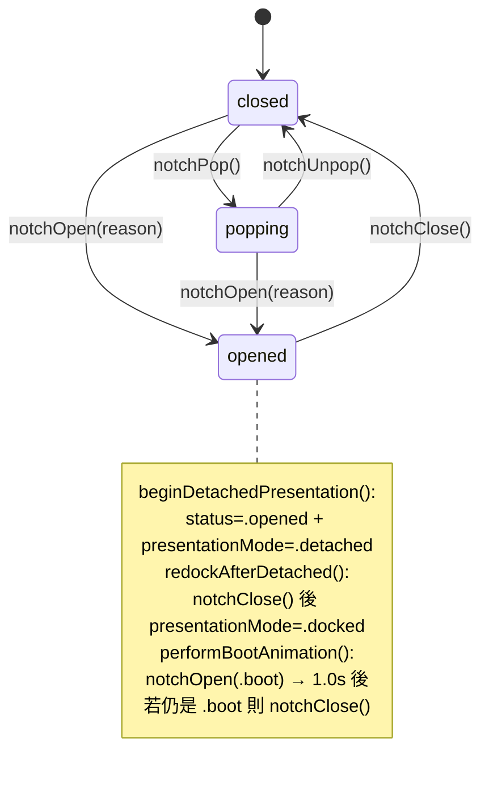
```mermaid
stateDiagram-v2
    [*] --> closed
    closed --> opened: notchOpen(reason)
    closed --> popping: notchPop()
    popping --> closed: notchUnpop()
    popping --> opened: notchOpen(reason)
    opened --> closed: notchClose()

    note right of opened
      beginDetachedPresentation():
        status=.opened + presentationMode=.detached
      redockAfterDetached():
        notchClose() 後 presentationMode=.docked
      performBootAnimation():
        notchOpen(.boot) → 1.0s 後若仍是 .boot 則 notchClose()
    end note
```

`notchPop`/`notchUnpop` 有守衛:`notchPop` 只在 `.closed` 生效、`notchUnpop` 只在 `.popping` 生效,其餘呼叫是 no-op。

### 2. Frame 縮放時序(狀態驅動的 window 尺寸,跨邊界地雷)

`NotchViewModel` 只**計算**尺寸(`closedSize` / `openedSize` / `closedScreenRect`);真正把 window frame 從 closed 條放大到 opened 畫布、再縮回去的唯一 chokepoint 是 UI 層的 `NotchWindowController.updateWindowPresentation`。此流程有嚴格的順序依賴:

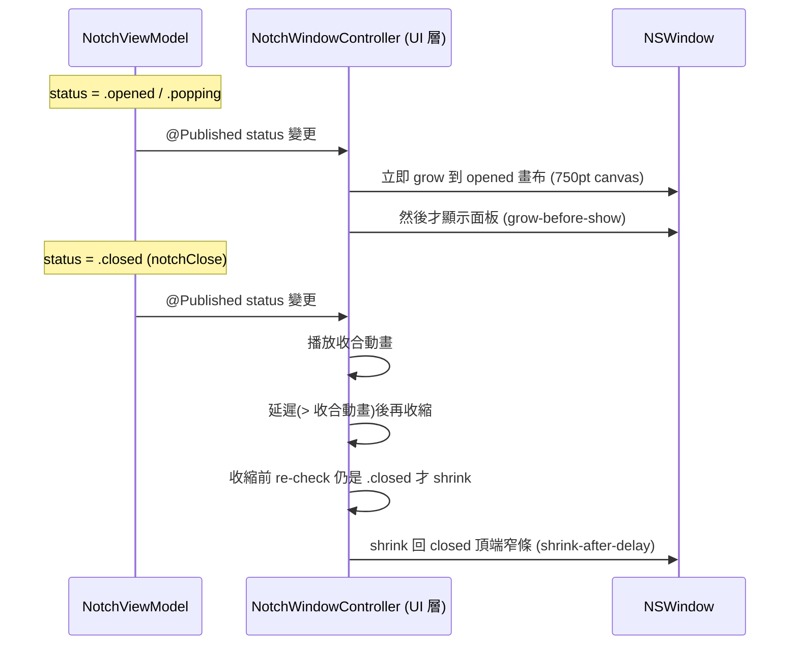
```mermaid
sequenceDiagram
    participant VM as NotchViewModel
    participant WC as NotchWindowController (UI 層)
    participant Win as NSWindow

    Note over VM: status = .opened / .popping
    VM->>WC: @Published status 變更
    WC->>Win: 立即 grow 到 opened 畫布 (750pt canvas)
    WC->>Win: 然後才顯示面板 (grow-before-show)

    Note over VM: status = .closed (notchClose)
    VM->>WC: @Published status 變更
    WC->>WC: 播放收合動畫
    WC->>WC: 延遲(> 收合動畫)後再收縮
    WC->>WC: 收縮前 re-check 仍是 .closed 才 shrink
    WC->>Win: shrink 回 closed 頂端窄條 (shrink-after-delay)
```

- **grow-before-show / shrink-after-delay**:放大必須在顯示面板「之前」完成,收縮必須在收合動畫「之後」延遲執行,且收縮前要重新確認 `status == .closed`,避免動畫途中又被開啟造成畫布跳動。這條規則寫在 `NotchWindowController`,但它讀的尺寸完全來自本層。
- `NotchWindowController.updateWindowPresentation` 與 `moveToScreen` 共用 `targetWindowFrame(status:screenFrame:closedHeight:)`;`NotchViewController.panelHitRect` 讀**即時 window 高度**而非硬寫 750,所以本層改 `closedHeight`/`openedSize` 時,hit-test 會自動跟上,不需同步硬編碼常數。

### 3. Hover 開啟 → 自動收合流程

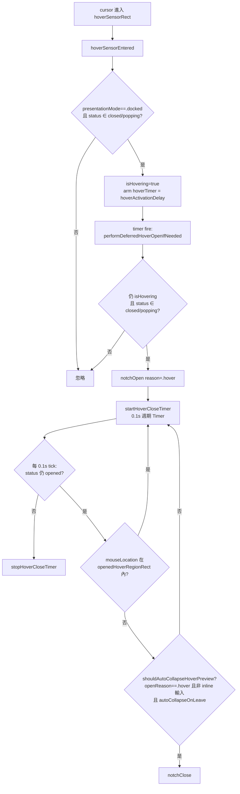
```mermaid
flowchart TD
    A[cursor 進入 hoverSensorRect] --> B[hoverSensorEntered]
    B --> C{presentationMode==.docked<br/>且 status ∈ closed/popping?}
    C -- 否 --> Z[忽略]
    C -- 是 --> D[isHovering=true<br/>arm hoverTimer = hoverActivationDelay]
    D --> E[timer fire:<br/>performDeferredHoverOpenIfNeeded]
    E --> F{仍 isHovering<br/>且 status ∈ closed/popping?}
    F -- 否 --> Z
    F -- 是 --> G[notchOpen reason=.hover]
    G --> H[startHoverCloseTimer<br/>0.1s 週期 Timer]
    H --> I{每 0.1s tick:<br/>status 仍 opened?}
    I -- 否 --> J[stopHoverCloseTimer]
    I -- 是 --> K{mouseLocation 在<br/>openedHoverRegionRect 內?}
    K -- 是 --> H
    K -- 否 --> L{shouldAutoCollapseHoverPreview?<br/>openReason==.hover 且非 inline 輸入<br/>且 autoCollapseOnLeave}
    L -- 是 --> M[notchClose]
    L -- 否 --> H
```

為什麼用 0.1s 輪詢而非 mouseMoved 監聽:面板由 hover 開啟後,energy-gated 的全域 `mouseMoved` 監聽是關閉的(省電),所以 close-on-leave 改用一個只在 hover-opened 期間存活、關閉即停的 bounded `Timer`。判斷「離開」用的是 `openedHoverRegionRect = 面板 rect ∪ hoverTriggerRect`,把 notch 條本身也算進「內部」,避免游標從 notch 移到面板途中被誤判離開。

---

**資料契約 / 規則:**

### closed 高度與寬度解析

`closedHeight` 依螢幕型態分流(散文比表格清楚):

- `usesPhysicalNotchClosedPresentation`(有實體 notch **且** fullscreen physical-notch compact 生效)→ 用 `deviceNotchRect.height`(貼合相機模組)。
- 有實體 notch 但非上述 → `ceil(deviceNotchRect.height)`,若為 0 退回 `defaultClosedHeight`。
- 外接/無 notch 螢幕 → `ceil(menuBarHeight)`(對齊真實 menu bar 高),若為 0 退回 `defaultClosedHeight`。

`closedWidth` 來自使用者設定的 module width,經 `AppSettingsStore.normalizedNotchModuleWidth` 正規化;拖曳分離手勢進行中會被 `narrowedClosedWidth` 收窄。

### 面板尺寸規則(`panelSize(for:)`)

| contentType | style | width | height |
| --- | --- | --- | --- |
| `chat` | docked | `min(screenW-64, 600)` | `maximumOpenedHeight` |
| `chat` | detached | `min(screenW-96, 500)` | `min(maxH, screenH-180)` |
| `instances`(hover) | docked | `min(screenW-64, 600)` | `min(maxH, max(closedHeight+24, measured))` |
| `instances`(click) | docked | `min(screenW*0.44, 520)` | 同上 |
| `instances` | detached | `min(screenW-112, 400)` | `min(maxH, max(closedHeight+24, min(measured,300)))` |

`maximumOpenedHeight = min(screenRect.height - 120, AppSettings.maxPanelHeight)`。`instances` 的 fallback 量測高:hover 時 150、click 時 170。

### 關鍵常數

| 常數 | 值 | 出處 / 用途 |
| --- | --- | --- |
| `ScreenNotchMetrics.fallbackClosedHeight` | 32 | 偵測不到 notch/menu bar 時的 closed 高 |
| `ScreenNotchMetrics.fallbackNotchWidth` | 180 | 左右輔助區缺一時的 notch 寬 |
| `ScreenNotchMetrics.fallbackSize` | 224×38 | `safeAreaTop<=0`(無 notch)時整體回傳 |
| `NotchViewModel.defaultClosedHeight` | = fallbackClosedHeight (32) | closed 高最終保底 |
| `clickedInstancesPanelWidthRatio` | 0.44 | click 開列表的寬度佔螢幕比 |
| `clickedInstancesPanelMaximumWidth` | 520 | click 列表寬上限 |
| `detachmentLongPressNarrowedWidthScale` | 0.82 | long-press 期間 closed 條收窄比例 |
| `detachmentLongPressMaximumShrink` | 56 | long-press 收窄的絕對上限(px) |
| `spacing` | 12 | |
| `openedScreenRect` 水平 padding | +52 | 對齊 `NotchView` 實際渲染外距,hit region 才不偏 |
| `isPointInNotch` / hoverTrigger inset | dx -10, dy -5 | 放寬命中區便於互動 |
| `fullscreenRevealZoneHeight` | 8 | fullscreen 隱藏時頂端邊緣揭示帶高度 |
| `fullscreenRevealZoneHorizontalInset` | 36 | 揭示帶左右各外擴 |
| `fullscreenHoverActivationDelay` | 0.18s | fullscreen reveal 下 hover delay 上限 |
| `fullscreenStateSettleDelay` | 0.18s(可注入) | physical-notch compact 關閉的延遲重檢 |
| `detachmentLongPressResetDuration` | 0.18s | 取消 detach 追蹤時的回彈動畫 |
| `detachmentTapMovementTolerance` | 8px | 判定「點擊」而非「拖曳」的位移容忍 |
| `detachmentLongPressNarrowAnimationDuration` | `defaultLongPressDuration × 20` | 刻意極慢的 linear 收窄,視覺預告即將 detach |
| hoverCloseTimer 週期 | 0.1s | close-on-leave 輪詢 |
| boot 收合延遲 | 1.0s | `performBootAnimation` |
| `animation` | easeOut 0.25 | 一般開合 |
| `openAnimationDuration` | clamp 0.15–0.8 | 由 `notchOpenAnimationDuration` 夾限 |
| `hoverActivationDelay` | clamp 0–1 | 由 `notchHoverActivationDelay` 夾限 |
| `closedPresentationOffsetY` | `-(closedHeight+12)` | 隱藏時把 closed 條頂出畫面外 |
| opened 畫布高 | 750pt | **UI 層** `IslandPresentationCoordinator` 硬編碼,非本層 |

### fullscreen 三旗標的判定(彼此互斥/相依)

- `isFullscreenEdgeRevealActive` = `hideInFullscreen && !hasPhysicalNotch && isFullscreenActive`(外接螢幕全螢幕:縮成頂端揭示帶)。
- `isFullscreenPhysicalNotchCompactActive` = `hideInFullscreen && hasPhysicalNotch && isFullscreenActive && !browserHidden`(內建 notch 全螢幕:貼合實體 notch)。
- `isFullscreenBrowserHiddenActive` = `fullscreenBrowserHiddenProvider(screenRect)`(全螢幕瀏覽器:完全隱藏)。

### ScreenNotchMetrics.detect 規則

`safeAreaTop` ceil 後 `>0` 才算有實體 notch,否則回傳 `fallbackSize` 且 `hasPhysicalNotch=false`。notch 寬只有在**左右輔助區寬皆 >0** 時才用 `screenFrame.width - left - right + 4` 計算(並以 180 為下限);任一為 0 就退回 `fallbackNotchWidth`。

### ScreenSelector 解析優先序

- automatic:`cursorFollowScreen`(若仍在可用清單)→ 游標當前所在螢幕 → `NSScreen.builtin` → `NSScreen.main`。
- specificScreen:`savedIdentifier.matches` 的螢幕 → 找不到則退回 builtin/main。
- `ScreenIdentifier.matches`:先比 `displayID`,失敗再比 `localizedName`(供重新插拔後 displayID 變動的螢幕回鎖)。

---

**棘手分支 / 地雷:**

- **grow-before-show / shrink-after-delay(見流程圖 2)**:本層改尺寸,錯的是 UI 層順序就會出現畫布閃跳;`panelHitRect` 讀即時高度而非 750,兩者必須一起想。
- **physical-notch compact 開關不對稱**:`applyPhysicalNotchFullscreenState` 開啟(true)是**同步立即**設旗標;關閉(false)是**延遲** `fullscreenStateSettleDelay` 後用 work item **重新偵測** fullscreen 狀態再決定,避免 Space 切換瞬間抖動誤關。這是刻意的 race 防護,改動時勿把關閉也改成同步。
- **detach 觸發區與 hover 開啟區重疊**:`detachmentTriggerScreenRect == closedScreenRect`,和 hover-open 的觸發區同一塊。`handleMouseDown` 的優先序是先進 detach 追蹤,再看 hover-trigger;`handleMouseUp` 靠 `isLongPressSatisfied` + `hasExceededTapMovementTolerance` 三態區分「純點擊(開/關)」「long-press」「拖曳分離」。改任何一段都要三個 handler 一起看。
- **long-press 期間的極慢收窄動畫**:`detachmentLongPressNarrowAnimationDuration = 長按時長 × 20` 是 linear,故意讓 closed 條在長按未達門檻時緩慢收窄,作為「再按住一下就會 detach」的視覺預告;取消時用 0.18s easeOut 回彈。
- **`notchOpen(.notification)` 早退**:當 `shouldSuppressAutomaticPresentation`(detached / 全螢幕瀏覽器隱藏 / edge-reveal 未開啟)時,`.notification` 來源的開啟直接 return,不會強行彈出。`performBootAnimation` 也有同一守衛。
- **`openedScreenRect` 的 +52**:hit region 寬度刻意比 `panelSize` 寬 52,對齊 `NotchView` 的外距;若改 NotchView padding 卻沒改這裡,close-on-leave 會在面板邊緣誤觸。
- **`updateOpenedMeasuredHeight` 下限鉗制**:量到的高度會 `max(closedHeight, ceil(height))`,保證面板不會比 closed 條還矮。
- **`updateScreenGeometry` 的 diff-guard + 順序**:只有 `geometry` 或 `hasPhysicalNotch` 真的變了才更新,並會清 `openedMeasuredHeight`、`syncClosedWidth`、`refreshFullscreenPresentationState`。螢幕遷移時旗標在此**同步**更新,`moveToScreen`(UI 層)的重新定位在其後才發生。
- **`cursorFollowScreen` 生命週期**:automatic 模式下由 `migrateToScreen` 設定,會跨 `refreshScreens()` 存活,直到使用者切模式(`selectScreen`/`selectAutomatic`)才清除。

---

**與其他子系統的邊界:**

被呼叫 / 提供給誰:
- `NotchView`、`NotchWindowController`、`NotchViewController`(UI 層)讀本層的 `status`/`openedSize`/`closedSize`/各 hit-test rect 來排版與縮放 window;`NotchActivityCoordinator.shared` 供 `NotchView` 顯示側向 activity。
- `IslandPresentationCoordinator` / `WindowManager` / `DetachedIslandWindowController`:透過 `onDetachmentRequested` / `onDetachmentUpdated` / `onDetachmentFinished` 三個 callback 接手 drag-to-detach,再呼叫 `beginDetachedPresentation` / `redockAfterDetached` 切換 docked↔detached。
- `NotchAutoOpenPolicy` 的三個純函式由 session 監看層(觀察 `SessionStore`/`SessionMonitor` 的觀察者)呼叫,決定新 pending session / 新 unread 是否自動開 notch 或彈 feed banner。

呼叫 / 依賴誰:
- 幾何輸入:`Ext+NSScreen.notchMetrics` → `ScreenNotchMetrics.detect`(用 `NSScreen.safeAreaInsets` / `auxiliaryTopLeft/RightArea`)產生 metrics,供上層(`WindowManager`)組出 `NotchGeometry` 再餵 `updateScreenGeometry`。
- 螢幕落點:`ScreenSelector.shared` 決定目標 `NSScreen`(automatic cursor-follow 由 `migrateToScreen` 驅動)。
- 環境與設定 provider(可注入,預設綁定真身):`FullscreenAppDetector.isFullscreenAppActive` / `isFullscreenBrowserActive`、`AppSettings`(`hideInFullscreen`/`autoHideWhenIdle`/`maxPanelHeight`/`notchModuleWidth`/`autoCollapseOnLeave` 等)、`AppSettingsStore`(module width 正規化)、`EventMonitors.shared`(全域滑鼠事件)、`IslandDetachmentGestureGate`(long-press 時長與拖曳門檻)。
- 內容邊界:`contentType = .chat(SessionState)` 把 session 子系統的 `SessionState` 帶入面板;idle 自動隱藏由外部呼叫 `updateIdleAutoHiddenState(hasVisibleSessionActivity:)` 餵入。

---

## §03 Core 政策與設定

**檔案:**
- `PingIsland/Core/EnergyGovernor.swift`
- `PingIsland/Core/Settings.swift`
- `PingIsland/Core/UserIdleAutoProtection.swift`
- `PingIsland/Core/FeatureFlags.swift`
- `PingIsland/Core/SoundPackCatalog.swift`
- `PingIsland/Core/SoundSelector.swift`
- (邊界確認用) `PingIsland/Services/Hooks/BridgeRuntimeConfigWriter.swift`、`PingIsland/App/AppDelegate.swift`、`PingIsland/Services/Runtime/RuntimeCoordinator.swift`

**責任:** 這一組檔案是 app 的「政策與持久化狀態」層:`EnergyGovernor` 決定背景服務與 UI 動畫在不同情境下該用多快的節奏跑;`AppSettingsStore`/`AppSettings`(定義在 `Settings.swift`)是唯一的 `UserDefaults` 讀寫入口與所有使用者可調選項的來源;`UserIdleAutoProtection` 把使用者閒置狀態轉譯成「暫時把 blocking 提問導回終端機」的旗標;`FeatureFlags` 是 native runtime 灰度發佈開關;`SoundPackCatalog`/`SoundSelector` 管理外部音效包探索與設定選單的展開狀態。

**關鍵型別與進入點:**

| 型別 | 角色 |
|---|---|
| `EnergyGovernor`(`@MainActor final class`, `ObservableObject`, `.shared`) | 依 session 狀態與系統睡眠/低耗電訊號解出 `EnergyMode`,對外發布 `mode` 與 `policy` 兩個 `@Published` |
| `EnergyPolicy` | 純資料 struct:輪詢間隔、動畫等級、事件監控等級、是否允許靜默更新/檔案監看重試,由 `policy(for:)` 依 `EnergyMode` 產生 |
| `EnergyGovernorInputs` | 決策輸入的快照(是否有 active/attention/visible session、系統是否睡眠、是否剛甦醒、是否低耗電模式) |
| `AppSettingsStore`(`@MainActor final class`, `ObservableObject`, `.shared`) | 唯一的 `UserDefaults` 包裝者,所有設定都是 `@Published var` + `didSet` 寫回 defaults |
| `AppSettings`(`enum`,`@MainActor`) | 對 `AppSettingsStore.shared` 的靜態轉發層,給非 SwiftUI 呼叫端(model/service)用,同時也是音效播放的唯一觸發點(`playSound(for:)`) |
| `AppSettingsDefaultKeys` | 對外(跨檔案)共用的少量 key 常數,例如 bridge/hook 相關與 surfaceMode |
| `UserIdleAutoProtection`(`@MainActor final class`, `.shared`) | 5 秒輪詢系統閒置秒數,決定是否啟用「idle 自動導回終端機」 |
| `SystemUserIdleTimeReader` | 透過 IOKit `IOHIDSystem` 讀取系統實際閒置秒數的 nonisolated 工具 |
| `FeatureFlags` / `RuntimeFeatureFlag` | 讀取環境變數優先、其次 `UserDefaults` 的 native runtime 灰度開關(`nativeClaudeRuntime`、`nativeCodexRuntime`) |
| `SoundPackCatalog`(`@MainActor final class`, `ObservableObject`, `.shared`) | 掃描 OpenPeon/CESP 相容音效包目錄,做路徑穿越防護與音檔 magic bytes 驗證後播放 |
| `SoundSelector`(`@MainActor class`, `ObservableObject`, `.shared`) | 純 UI 狀態:設定選單裡音效下拉選單展開時要多留多少高度 |

**核心流程:**

1. `EnergyGovernor` 的模式解析是純函式 `resolvedMode(for:)`,輸入變化(session 發布、系統睡眠/甦醒通知、低耗電模式變化)都會匯聚到 `updateInputs` 再重新解析一次模式,狀態機的優先順序是固定的(系統暫停 > 有 active/attention session > 剛甦醒的寬限期 > 有可見且近期活動的 session 且非低耗電 > 其餘一律安靜背景)。

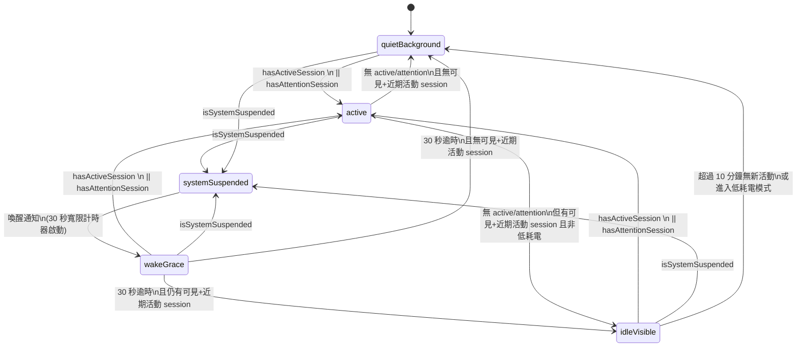
```mermaid
stateDiagram-v2
    [*] --> quietBackground
    quietBackground --> active: hasActiveSession \n || hasAttentionSession
    idleVisible --> active: hasActiveSession \n || hasAttentionSession
    wakeGrace --> active: hasActiveSession \n || hasAttentionSession
    active --> systemSuspended: isSystemSuspended
    idleVisible --> systemSuspended: isSystemSuspended
    quietBackground --> systemSuspended: isSystemSuspended
    wakeGrace --> systemSuspended: isSystemSuspended
    systemSuspended --> wakeGrace: 喚醒通知\n(30 秒寬限計時器啟動)
    wakeGrace --> idleVisible: 30 秒逾時\n且仍有可見+近期活動 session
    wakeGrace --> quietBackground: 30 秒逾時\n且無可見+近期活動 session
    active --> idleVisible: 無 active/attention\n但有可見+近期活動 session 且非低耗電
    active --> quietBackground: 無 active/attention\n且無可見+近期活動 session
    idleVisible --> quietBackground: 超過 10 分鐘無新活動\n或進入低耗電模式
```

2. `UserIdleAutoProtection` 每 5 秒輪詢一次系統閒置秒數,純函式 `shouldActivateAutoProtection` 決定是否要把 `idleAutoRoutePromptsToTerminalActive` 打開;這個旗標再與使用者手動開關 `routePromptsToTerminal` 一起餵給 `effectiveRoutePromptsToTerminal`,最終寫進 bridge 用的 JSON runtime config。

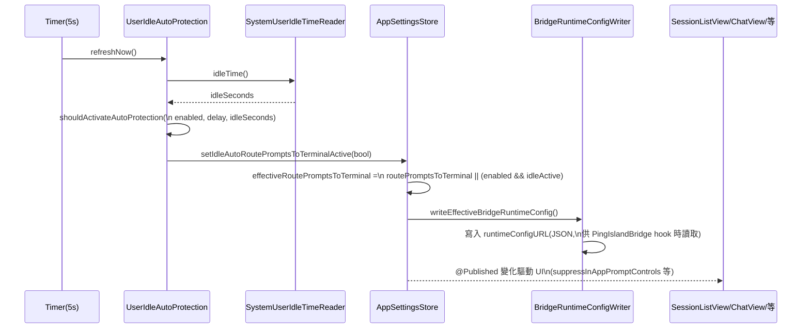
```mermaid
sequenceDiagram
    participant Timer as Timer(5s)
    participant Idle as UserIdleAutoProtection
    participant IOKit as SystemUserIdleTimeReader
    participant Settings as AppSettingsStore
    participant Writer as BridgeRuntimeConfigWriter
    participant UI as SessionListView/ChatView/等

    Timer->>Idle: refreshNow()
    Idle->>IOKit: idleTime()
    IOKit-->>Idle: idleSeconds
    Idle->>Idle: shouldActivateAutoProtection(\n enabled, delay, idleSeconds)
    Idle->>Settings: setIdleAutoRoutePromptsToTerminalActive(bool)
    Settings->>Settings: effectiveRoutePromptsToTerminal =\n routePromptsToTerminal || (enabled && idleActive)
    Settings->>Writer: writeEffectiveBridgeRuntimeConfig()
    Writer->>Writer: 寫入 runtimeConfigURL(JSON,\n供 PingIslandBridge hook 時讀取)
    Settings-->>UI: @Published 變化驅動 UI\n(suppressInAppPromptControls 等)
```

**資料契約 / 規則:**

`EnergyPolicy.policy(for:)` 各分級的數值(散文較適合逐一列表,mermaid 畫不出這種對照表):

| EnergyMode | codex 執行緒刷新 | session 維護間隔 | 用量刷新間隔 | 動畫等級 | 事件監控等級 | 允許靜默更新 | 允許檔案監看重試 |
|---|---|---|---|---|---|---|---|
| `.active` | 15s | 60s | 60s | `.full` | `.full` | 否 | 是 |
| `.idleVisible` | 60s | 5min | 5min | `.reduced` | `.interactionOnly` | 是 | 是 |
| `.quietBackground` | 5min | 10min | 15min | `.staticFrames` | `.interactionOnly` | 是 | 是 |
| `.systemSuspended` | nil(停止) | nil(停止) | nil(停止) | `.staticFrames` | `.disabled` | 否 | 否 |
| `.wakeGrace` | 30s | 60s | 5min | `.reduced` | `.interactionOnly` | 否 | 是 |

`EnergyGovernor` 初始 `mode` 是 `.quietBackground`(保守起點),真正的值要等 `init` 裡訂閱 `SessionStore.shared.sessionsPublisher` 後才會依實際 session 狀態重算;`idleVisibleAnimationGraceDuration` 固定 10 分鐘,是「近期活動」的判斷窗口,也是唯一對外公開的 nonisolated 常數。

`AppSettingsStore` 的欄位規模很大(~60+ published 屬性),完整列出並保留 code 原始命名以利之後 grep:

| 分類 | Key(UserDefaults) | 型別 / 預設值 | 備註 |
|---|---|---|---|
| 語言 | `appLanguage` | `AppLanguage`,預設 `.system` | `.system` 依 `Locale.preferredLanguages` 前綴判斷中文 |
| 音效(舊制) | `notificationSound` | `NotificationSound`,預設 `.blow` | 與 `taskCompletedSound` 雙向同步(改一個另一個跟著變) |
| 音效總開關 | `soundEnabled` | Bool,預設 `true` | |
| 音量 | `soundVolume` | Double,預設 `0.9` | didSet 內 clamp 到 [0,1] |
| 靜音到期時間 | `temporarilyMuteNotificationsUntil` | Date?,預設 nil | 過期即視為未靜音(`isNotificationMuteActive`) |
| 各階段音效(系統音) | `processingStartSound`(`.tink`)、`attentionRequiredSound`(`.glass`)、`taskCompletedSound`(舊 `notificationSound`)、`taskErrorSound`(`.basso`)、`resourceLimitSound`(`.morse`) | `NotificationSound` | 對應 `NotificationEvent` 五種事件 |
| 各階段音效開關 | `processingStartSoundEnabled`、`attentionRequiredSoundEnabled`、`taskCompletedSoundEnabled`、`taskErrorSoundEnabled`、`resourceLimitSoundEnabled` | Bool,全部預設 `true` | |
| 8-bit 內建音色 | `island8BitProcessingStartSound`(`.menuSelect`)、`island8BitAttentionRequiredSound`(`.approvalAlert`)、`island8BitTaskCompletedSound`(`.submitBlip`)、`island8BitTaskErrorSound`(`.hurt`)、`island8BitResourceLimitSound`(`.completeDing`) | `Island8BitSound` | |
| 音效主題 | `soundThemeMode` | `SoundThemeMode`,預設 `.island8Bit` | `.builtIn` / `.island8Bit` / `.soundPack` 三選一 |
| 8-bit 遷移旗標 | `island8BitStartSoundMigrated` | Bool(內部) | 首次切到 `.island8Bit` 時,若 `processingStartSoundEnabled` 曾被關掉會強制重開一次,只跑一次 |
| 音效包路徑 | `selectedSoundPackPath` | String,預設空字串 | 對應 `SoundPackCatalog` 掃到的 `SoundPack.rootURL.path` |
| 全螢幕行為 | `hideInFullscreen` | Bool,預設 `true` | |
| 閒置自動隱藏 | `autoHideWhenIdle` | Bool,預設 `false` | |
| 滑出自動收合 | `autoCollapseOnLeave` | Bool,預設 `true` | |
| 智慧抑制 | `smartSuppression` | Bool,預設 `true` | |
| 完成面板自動開啟 | `autoOpenCompletionPanel` | Bool,預設 `true` | |
| 壓縮通知面板自動開啟 | `autoOpenCompactedNotificationPanel` | Bool,預設 `true` | |
| 顯示 Agent 細節 | `showAgentDetail` | Bool,預設 `true` | |
| 子 Agent 顯示模式 | `subagentVisibilityMode`(主) / `codexSubagentVisibilityMode`(舊,同步寫入) | `SubagentVisibilityMode`,預設 `.visible` | 讀取時舊值 `firstLevelOnly`/`all` 都會被正規化成 `.visible`(見 `init?(persistedValue:)`) |
| 顯示用量 | `showUsage` | Bool,預設 `true` | |
| 用量顯示模式 | `usageValueMode` | `UsageValueMode`,預設 `.remaining` | |
| 內容字體大小 | `contentFontSize` | Double,預設 `13` | clamp [11,17] |
| 面板最大高度 | `maxPanelHeight` | Double,預設 `580` | clamp [480,700] |
| 刘海模組寬度 | `notchModuleWidth` | Double,預設 `266`(`defaultNotchModuleWidth`) | clamp [64,420](`minimumNotchModuleWidth`/`maximumNotchModuleWidth`) |
| 刘海寵物造型 | `notchPetStyle` | `NotchPetStyle`,預設 `.cat` | |
| 刘海顯示模式 | `notchDisplayMode` | `NotchDisplayMode`,預設 `.compact` | |
| 收合刘海尾端內容 | `closedNotchTrailingContentMode` | `ClosedNotchTrailingContentMode`,預設 `.sessionCount` | 另兩選項對應 `usageProviderID`(`"claude"`/`"codex"`) |
| 預覽用吉祥物 | `previewMascotKind` | `MascotKind`,預設 `.claude` | |
| 呈現模式 | `surfaceMode`(= `AppSettingsDefaultKeys.surfaceMode`) | `IslandSurfaceMode`,預設 `.notch` | `.notch` / `.floatingPet` |
| 懸浮寵物錨點 | `floatingPetAnchor` | `FloatingPetAnchor?`(JSON 編碼),預設 nil | |
| 懸浮寵物尺寸 | `floatingPetSizeMode` | `FloatingPetSizeMode`,預設 `.automatic` | |
| 首次導引旗標(四個獨立 Bool,皆預設 `false`) | `presentationModeOnboardingPending`、`notchDetachmentHintPending`、`floatingPetSettingsHintPending`、`hookInstallOnboardingPending` | Bool | 都走同一種 key/published/didSet 三段式模式 |
| Labs 解鎖 | `labsSettingsUnlocked` | Bool,預設 `false` | |
| 自動更新檢查 | `automaticUpdateChecksEnabled` | Bool,預設 `true` | 被 `EnergyPolicy.allowsSilentUpdates` 與此共同把關(見下方邊界) |
| 分析同意 | `analyticsEnabled` | Bool,預設 `false` | didSet 內連動 `analyticsConsentPromptCompleted = true` 並呼叫 `TelemetryService.shared.handleConsentChanged` |
| 分析詢問完成旗標 | `analyticsConsentPromptCompleted` | Bool,預設 `false` | |
| 吉祥物覆寫表 | `mascotOverrides` | `[String:String]`(JSON),預設 `[:]` | 存前會呼叫 `sanitizedMascotOverrides` 濾掉「與 client 預設值相同」的項目,避免膨脹 |
| 全域快捷鍵 | `openActiveSessionShortcut`/`openActiveSessionShortcutDisabled`、`openSessionListShortcut`/`openSessionListShortcutDisabled` | `GlobalShortcut?` + disabled Bool | 兩個動作互斥,設定其一若與另一個相同會把另一個清空;讀取時舊版預設快捷鍵會被 `legacyDefaultShortcuts` 攔截並升級成新預設 |
| 導回終端機(手動) | `routePromptsToTerminal` | Bool,預設 `false` | didSet 會呼叫 `writeEffectiveBridgeRuntimeConfig()` |
| 導回終端機(AskUserQuestion) | `terminalHandlesAskUserQuestion`(= `AppSettingsDefaultKeys`) | Bool,預設 `false` | |
| 通知動態牆模式 | `notificationFeedMode`(= `AppSettingsDefaultKeys`) | Bool,預設 `false` | |
| 刘海懸停啟動延遲 | `notchHoverActivationDelay`(= `AppSettingsDefaultKeys`) | Double,預設 `0.24` | |
| 刘海展開動畫時長 | `notchOpenAnimationDuration`(= `AppSettingsDefaultKeys`) | Double,預設 `0.42` | |
| 閒置自動導回終端機開關 | `autoRoutePromptsToTerminalWhenIdleEnabled` | Bool,預設 `true` | 關閉時會立刻呼叫 `setIdleAutoRoutePromptsToTerminalActive(false)` |
| 閒置延遲門檻 | `autoRoutePromptsIdleDelay` | `AutoRoutePromptsIdleDelay`(rawValue 為秒數),預設 `.thirtyMinutes` | 10/20/30/60 分鐘四選一 |
| Hook debug 記錄開關 | `hookDebugLoggingEnabled` | Bool,預設 `BridgeRuntimeConfigSnapshot.defaultDebugLoggingEnabled`(`true`) | |
| Hook debug 保留天數 | `hookDebugLogRetentionDays` | Int,預設 `7` | clamp [1,30](`BridgeRuntimeConfigSnapshot` 提供 clamp 函式) |
| Hook debug 目錄上限(MB) | `hookDebugLogMaxDirectoryMegabytes` | Int,預設 `256` | clamp [16,1024] |

上面「導回終端機」相關的最後五項,加上 `routePromptsToTerminal`,共同組成寫進磁碟的 `BridgeRuntimeConfigSnapshot`(`routePromptsToTerminal` 欄位實際寫入值是 `effectiveRoutePromptsToTerminal`,不是原始的 manual 開關)。

`FeatureFlags` 的鍵值對照(只有兩個 flag,判斷順序是環境變數優先於 `UserDefaults`):

| Flag | UserDefaults key | 環境變數 | 語意 |
|---|---|---|---|
| `.nativeClaudeRuntime` | `feature.nativeClaudeRuntime` | `PING_ISLAND_NATIVE_CLAUDE_RUNTIME` | 啟用原生 Claude runtime 路徑 |
| `.nativeCodexRuntime` | `feature.nativeCodexRuntime` | `PING_ISLAND_NATIVE_CODEX_RUNTIME` | 啟用原生 Codex runtime 路徑 |

環境變數的 truthy/falsy 字串集合各自寫死(`1/true/yes/on/enabled` 與 `0/false/no/off/disabled`),無法辨識的字串會落回 `UserDefaults`。

`SoundPackCatalog` 的資料契約是 OpenPeon manifest(`openpeon.json`):`cesp_version` 必須以 `"1."` 開頭才會被接受;掃描目錄固定三處(`~/.openpeon/packs`、`~/.claude/hooks/peon-ping/packs`、目前工作目錄下的 `.claude/hooks/peon-ping/packs`)加上使用者手動匯入的路徑(存在 `importedSoundPackPaths`)。

**棘手分支 / 地雷:**

- `EnergyGovernor` 的模式優先順序是隱含在 `resolvedMode(for:)` 的 if-chain 順序裡,不是顯式權重表:`isSystemSuspended` 永遠贏,其次是 active/attention,再來才輪到 `isWakeGraceActive`。改動這個函式時若調換順序,會讓「系統剛甦醒但同時有 active session」被誤判成 `.wakeGrace`。
- 甦醒寬限期(`wakeGraceTask`)用 `Task.sleep(30s)` 手動實作計時器,`setSystemSuspended(true)` 會主動取消這個 task 並清空 `isWakeGraceActive`——如果系統在 30 秒寬限期內又立刻睡眠,必須確保這條路徑不會讓 task 完成後把已經過期的 `isWakeGraceActive = false` 又寫回去(目前靠 `wakeGraceTask = nil` 加上 `guard !Task.isCancelled` 防呆)。
- `notificationSound` 與 `taskCompletedSound` 是雙向同步的兩個 `@Published` 屬性,各自的 `didSet` 都會寫對方一次;`isBootstrapping` guard 沒擋乾淨的話容易死循環,目前靠「值相等就不再觸發」的隱含保護(`if notificationSound != taskCompletedSound`)。
- `subagentVisibilityMode` 沒有用 `@Published` 而是手寫 `get/set` + `objectWillChange.send()`,同時要往兩個 key(`subagentVisibilityMode` 新、`codexSubagentVisibilityMode` 舊)雙寫,是這個檔案裡少數不遵守「四段式模式」的例外,改動時容易漏掉其中一個 key。
- `routePromptsToTerminal`、`autoRoutePromptsToTerminalWhenIdleEnabled`、`autoRoutePromptsIdleDelay`、`hookDebugLoggingEnabled`、`hookDebugLogRetentionDays`、`hookDebugLogMaxDirectoryMegabytes` 六個屬性的 `didSet` 都各自呼叫 `writeEffectiveBridgeRuntimeConfig()`,等於同一個磁碟寫入動作有六個觸發點;若新增第七個會影響 bridge 行為的設定,必須記得補這條線,否則 hook 端讀到的 JSON 會過期。
- `UserIdleAutoProtection.start()` 若 timer 已存在只會 `refreshNow()` 不會重建 timer,是刻意的冪等設計(避免 `applicationDidFinishLaunching` 被重複呼叫時建立多個 timer);但也代表改變 `pollingInterval` 只在建構時生效,執行期無法動態調整輪詢頻率。
- `SoundPackCatalog.resolvedSoundURL` 對音檔路徑做了路徑穿越(`../`)防護與副檔名/magic bytes 雙重驗證,任何要放寬允許副檔名(目前只有 mp3/wav/ogg)的改動都要同時補 `hasValidMagicBytes` 的對應簽章,否則會被自己的驗證擋掉。
- `Island8BitSound` 的遷移邏輯 `applyIsland8BitStartSoundMigrationIfNeeded` 只在「第一次切到 `.island8Bit` 且尚未跑過遷移」時執行一次,遷移旗標 `island8BitStartSoundMigrated` 一旦寫入就不會再檢查——如果之後想改遷移規則,舊使用者不會被追溯套用。

**與其他子系統的邊界:**

- 呼叫 `EnergyGovernor`:訂閱 `SessionStore.shared.sessionsPublisher` 決定 active/attention/visible/recent-activity 四個布林;訂閱 `NSWorkspace` 的睡眠/甦醒/鎖屏通知與 `NSProcessInfoPowerStateDidChange`。
- 被 `EnergyGovernor` 影響:`SessionMonitor`、`SessionStore`、`CodexAppServerMonitor`(輪詢間隔)、`NotchUserDriver`(靜默更新 gating)、`EventMonitors`(事件監控等級)、大量 UI 元件(`MascotView`、`ProcessingSpinner`、`StatusIcons`、`NotchHeaderView`、`ChatView`、`DetachedIslandPanelView`)讀 `EnergyGovernor.shared.$mode`/`$policy` 決定動畫等級。
- `AppSettingsStore` 被 `AppDelegate.applicationDidFinishLaunching` 在最早期(`_ = AppSettings.shared`)主動觸碰,確保 bridge runtime config 落地在任何 hook 觸發之前;寫入 `PingIsland/Services/Hooks/BridgeRuntimeConfigWriter.swift`(`BridgeRuntimeConfigSnapshot` schema 要跟 `IslandShared` 裡的 `BridgeRuntimeConfig` 保持同步)供 `PingIslandBridge` 讀取。
- `AppSettingsStore.analyticsEnabled` 的 `didSet` 呼叫 `TelemetryService.shared.handleConsentChanged`;多個屬性的 `didSet` 呼叫 `recordTelemetrySettingChange` 上報到 `TelemetryService`。
- `UserIdleAutoProtection` 由 `AppDelegate` 在啟動時 `start()`、在終止流程 `stop()`,中間只跟 `AppSettingsStore`(讀 `autoRoutePromptsToTerminalWhenIdleEnabled`/`autoRoutePromptsIdleDelay`,寫 `idleAutoRoutePromptsToTerminalActive`)與 IOKit 交談;`idleAutoRoutePromptsToTerminalActive` / `effectiveRoutePromptsToTerminal` 再被 `SessionListView`、`CodexSessionView`、`ChatView`、`IslandOpenedContentView`、`MascotView`、`IntegrationSettingsView` 讀取來決定是否抑制 app 內的核准/提問 UI。
- `FeatureFlags` 被 `RuntimeCoordinator`、`ClaudeRuntime`、`CodexRuntime`、`SessionListView` 讀取,用來決定是否走 `PingIsland/Services/Runtime/` 底下的原生 runtime 路徑(對照 `PingIsland/Core/FeatureFlags.swift` 與 AGENTS.md 的「Native runtime rollout scaffold」條目)。
- `SoundPackCatalog`/`SoundSelector` 只被 `AppSettings.playSound(for:)`(當 `soundThemeMode == .soundPack`)與設定視窗的音效選擇 UI 呼叫,不直接影響 `EnergyGovernor` 或 session 生命週期。

---

## §04 領域模型

**檔案:**
- `PingIsland/Models/ChatMessage.swift`
- `PingIsland/Models/ClientProfile.swift`
- `PingIsland/Models/MascotStatus.swift`
- `PingIsland/Models/SessionEvent.swift`
- `PingIsland/Models/SessionPhase.swift`
- `PingIsland/Models/SessionProvider.swift`
- `PingIsland/Models/SessionState.swift`
- `PingIsland/Models/TmuxTarget.swift`
- `PingIsland/Models/ToolResultData.swift`
- `PingIsland/Events/EventMonitor.swift`
- `PingIsland/Events/EventMonitors.swift`

**責任:** `PingIsland/Models/` 定義整個 app 的資料契約——一個追蹤中 session 的完整狀態(`SessionState`)、驅動狀態機的事件(`SessionEvent`)、狀態列舉(`SessionPhase`)、client/provider 註冊表(`SessionProvider` + `ClientProfile.swift`)、以及訊息與工具結果的結構化表示(`ChatMessage`、`ToolResultData`)。`PingIsland/Events/` 則是無關 session 語意的獨立基礎設施,只包了一層 AppKit `NSEvent` 全域/區域監控,供拖曳、hover 等 UI 手勢消費滑鼠座標與按鍵事件。

**關鍵型別與進入點:**
- `SessionState` → 單一 session 的完整狀態(唯一真相來源),所有欄位變更都應經 `SessionStore.process(_:)` 寫入
- `SessionEvent` → 狀態機的**唯一**輸入型別,列舉所有可能改變 `SessionState` 的動作(hook 事件、權限決策、檔案更新、subagent 生命週期、session 生命週期)
- `SessionPhase` → 顯式狀態機列舉(`idle` / `processing` / `waitingForInput` / `waitingForApproval(PermissionContext)` / `compacting` / `ended`),自帶 `canTransition(to:)` 驗證
- `SessionProvider` → 頂層 provider 列舉(`claude` / `codex` / `copilot` / `kimi` / `gemini`),決定 hook 協定家族
- `SessionClientInfo` → 一個 session 攜帶的 client/terminal/transport 中繼資料(profileID、bundle id、tmux/iTerm 識別碼等),`ClientProfileRegistry` 依此解析出具體 `SessionClientProfile`
- `ClientProfileRegistry` → 靜態註冊表,持有 `managedHookProfiles`(可安裝的 hook client,如 Claude/Codex/Gemini/Hermes/…)、`runtimeProfiles`(執行期 client 辨識規則)、`ideExtensionProfiles`(IDE 終端聚焦擴充)三份清單
- `SessionIntervention` → UI 呈現的「需要使用者處理」卡片(approval / question),`resolvedQuestions` 會即時從 `metadata["toolInputJSON"]` 反解析出結構
- `ChatMessage` / `MessageBlock` / `ToolUseBlock` → 從 JSONL 逐行解析出的原始對話訊息(供 `ConversationParser` 消費,再轉為 `SessionEvent.fileUpdated` / `.historyLoaded`)
- `ToolResultData` → 15 種工具(Read/Edit/Write/Bash/Grep/Glob/TodoWrite/Task/WebFetch/WebSearch/AskUserQuestion/BashOutput/KillShell/ExitPlanMode/MCP/Generic)的結構化結果,搭配 `ToolStatusDisplay` 產生執行中/已完成的顯示文字
- `MascotStatus` → 四態吉祥物動畫狀態(`idle`/`working`/`warning`/`dragging`),由 `SessionPhase` 或收合 notch 的彙總邏輯推導
- `TmuxTarget` → `session:window.pane` 字串的結構化包裝,雙向可逆解析
- `EventMonitor` / `EventMonitors` → AppKit 滑鼠事件(移動/按下/拖曳/放開)的全域+區域監控封裝,依 `EnergyGovernor` 的 `monitoringLevel` 決定是否追蹤 `mouseMoved`

**型別關係圖:**

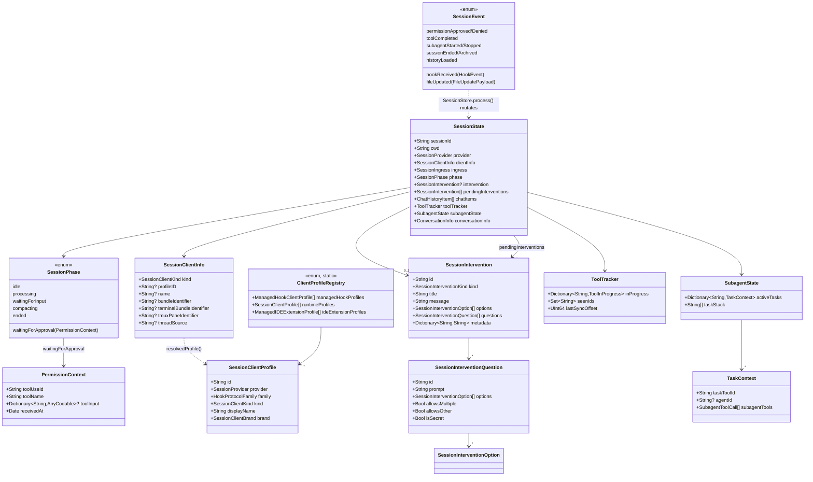
```mermaid
classDiagram
    class SessionState {
      +String sessionId
      +String cwd
      +SessionProvider provider
      +SessionClientInfo clientInfo
      +SessionIngress ingress
      +SessionPhase phase
      +SessionIntervention? intervention
      +SessionIntervention[] pendingInterventions
      +ChatHistoryItem[] chatItems
      +ToolTracker toolTracker
      +SubagentState subagentState
      +ConversationInfo conversationInfo
    }
    class SessionPhase {
      <<enum>>
      idle
      processing
      waitingForInput
      waitingForApproval(PermissionContext)
      compacting
      ended
    }
    class PermissionContext {
      +String toolUseId
      +String toolName
      +Dictionary~String,AnyCodable~? toolInput
      +Date receivedAt
    }
    class SessionClientInfo {
      +SessionClientKind kind
      +String? profileID
      +String? name
      +String? bundleIdentifier
      +String? terminalBundleIdentifier
      +String? tmuxPaneIdentifier
      +String? threadSource
    }
    class SessionClientProfile {
      +String id
      +SessionProvider provider
      +HookProtocolFamily family
      +SessionClientKind kind
      +String displayName
      +SessionClientBrand brand
    }
    class ClientProfileRegistry {
      <<enum, static>>
      +ManagedHookClientProfile[] managedHookProfiles
      +SessionClientProfile[] runtimeProfiles
      +ManagedIDEExtensionProfile[] ideExtensionProfiles
    }
    class SessionIntervention {
      +String id
      +SessionInterventionKind kind
      +String title
      +String message
      +SessionInterventionOption[] options
      +SessionInterventionQuestion[] questions
      +Dictionary~String,String~ metadata
    }
    class SessionInterventionQuestion {
      +String id
      +String prompt
      +SessionInterventionOption[] options
      +Bool allowsMultiple
      +Bool allowsOther
      +Bool isSecret
    }
    class ToolTracker {
      +Dictionary~String,ToolInProgress~ inProgress
      +Set~String~ seenIds
      +UInt64 lastSyncOffset
    }
    class SubagentState {
      +Dictionary~String,TaskContext~ activeTasks
      +String[] taskStack
    }
    class TaskContext {
      +String taskToolId
      +String? agentId
      +SubagentToolCall[] subagentTools
    }
    class SessionEvent {
      <<enum>>
      hookReceived(HookEvent)
      permissionApproved/Denied
      fileUpdated(FileUpdatePayload)
      toolCompleted
      subagentStarted/Stopped
      sessionEnded/Archived
      historyLoaded
    }

    SessionState --> SessionPhase
    SessionState --> SessionClientInfo
    SessionState --> "0..1" SessionIntervention
    SessionState --> "*" SessionIntervention : pendingInterventions
    SessionState --> ToolTracker
    SessionState --> SubagentState
    SessionPhase --> PermissionContext : waitingForApproval
    SessionIntervention --> "*" SessionInterventionQuestion
    SessionInterventionQuestion --> "*" SessionInterventionOption
    SubagentState --> "*" TaskContext
    SessionClientInfo ..> SessionClientProfile : resolvedProfile()
    ClientProfileRegistry --> "*" SessionClientProfile
    SessionEvent ..> SessionState : SessionStore.process() mutates
```

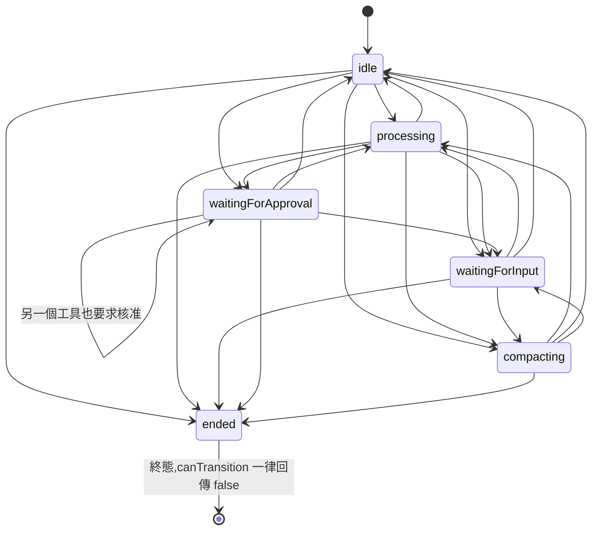
```mermaid
stateDiagram-v2
    [*] --> idle
    idle --> processing
    idle --> waitingForInput
    idle --> waitingForApproval
    idle --> compacting
    processing --> waitingForInput
    processing --> waitingForApproval
    processing --> compacting
    processing --> idle
    waitingForInput --> processing
    waitingForInput --> idle
    waitingForInput --> compacting
    waitingForApproval --> processing
    waitingForApproval --> idle
    waitingForApproval --> waitingForInput
    waitingForApproval --> waitingForApproval : 另一個工具也要求核准
    compacting --> processing
    compacting --> idle
    compacting --> waitingForInput
    idle --> ended
    processing --> ended
    waitingForInput --> ended
    waitingForApproval --> ended
    compacting --> ended
    ended --> [*] : 終態,canTransition 一律回傳 false
```

**資料契約 / 欄位表:**

### SessionState(節錄核心欄位;完整型別另有 40+ 個衍生 computed property)

| 欄位 | 型別 | 用途 |
|---|---|---|
| `sessionId` | `String` | 唯一識別碼,`Identifiable.id` |
| `cwd` / `projectName` | `String` | 工作目錄與顯示用專案名 |
| `provider` | `SessionProvider` | 頂層 provider(claude/codex/copilot/kimi/gemini) |
| `clientInfo` | `SessionClientInfo` | client/terminal/transport 中繼資料 |
| `ingress` | `SessionIngress` | 事件來源管道(hookBridge/remoteBridge/codexAppServer/nativeRuntime/desktopAppMonitor) |
| `phase` | `SessionPhase` | 目前狀態機階段 |
| `assistantTurnCompleted` | `Bool` | 權威的「agent 停手、輪到使用者」完成訊號:`Stop` hook 把 session 落在 `.waitingForInput` 且無 intervention 時同步設 true,回到 active 時清除。存在原因是 Claude 的 assistant 回覆是在 `Stop→waitingForInput` 之後約 100ms+ 才從 transcript 解析進 `chatItems`,所以完成偵測不能靠「最後一個 chat item 是不是 assistant」;`SessionCompletionStateEvaluator.isCompletedReadySession` 以此旗標避開該競態 |
| `intervention` | `SessionIntervention?` | 目前展示中的單一介入卡片 |
| `pendingInterventions` | `[SessionIntervention]` | 佇列中尚未展示的介入 |
| `codexParentThreadId` / `codexSubagentDepth` / `codexSubagentNickname` / `codexSubagentRole` | `String?` / `Int?` / `String?` / `String?` | Codex subagent 巢狀識別與顯示 |
| `linkedParentSessionId` / `linkedSubagentDisplayTitle` / `heuristicSubagentDisplayTitle` | `String?` | 非 Codex 的子 session 關聯與啟發式標題 |
| `pid` / `tty` / `isInTmux` | `Int?` / `String?` / `Bool` | 終端實例識別,供 tmux/terminal focus 使用 |
| `autoApprovePermissions` | `Bool` | session 級自動核准開關 |
| `chatItems` | `[ChatHistoryItem]` | 對話項目(型別定義在 `Services/Chat/ChatHistoryManager.swift`,非本次掃描範圍) |
| `toolTracker` | `ToolTracker` | 進行中工具字典 + 去重集合 + JSONL 同步位移 |
| `completedErrorToolIDs` | `Set<String>` | 以錯誤完成的工具 id,供事件專屬通知(如 `task.error`)使用 |
| `subagentState` | `SubagentState` | Task 工具與其巢狀子工具狀態 |
| `conversationInfo` | `ConversationInfo` | JSONL 解析出的摘要/最後訊息(型別定義在 `ConversationParser.swift`) |
| `needsClearReconciliation` | `Bool` | 標記下次檔案更新需與 parser 狀態重新對齊(`/clear` 後) |
| `lastActivity` / `lastSeenAt` / `lastNotifiableActivityAt` / `createdAt` | `Date` / `Date` / `Date?` / `Date` | 排序、已讀判斷、通知抑制與建立時間 |

### SessionPhase

| case | 攜帶資料 | 語意 |
|---|---|---|
| `idle` | — | 閒置,等待新活動 |
| `processing` | — | Claude/Codex 正在執行工具或產生回應 |
| `waitingForInput` | — | 已完成回應,等待使用者輸入 |
| `waitingForApproval` | `PermissionContext`(toolUseId/toolName/toolInput/receivedAt) | 有工具卡在權限核准 |
| `compacting` | — | context 正在壓縮(自動或手動) |
| `ended` | — | session 已結束(終態) |

### SessionProvider / SessionIngress / SessionClientKind

| 型別 | 值 | 說明 |
|---|---|---|
| `SessionProvider` | claude / codex / copilot / kimi / gemini | 決定 hook 協定家族與預設 `SessionClientInfo` |
| `SessionIngress` | hookBridge / remoteBridge / codexAppServer / nativeRuntime / desktopAppMonitor | 事件實際進來的管道,影響 `shouldSyncFile`、`isNativeRuntimeSession` 等判斷 |
| `SessionClientKind` | claudeCode / codexCLI / codexApp / qoder / custom / unknown | 粗粒度 client 分類,`SessionClientInfo.kind` 儲存 |

### SessionClientInfo(部分欄位;共 17 個 optional 中繼資料欄位)

| 欄位 | 型別 | 用途 |
|---|---|---|
| `kind` | `SessionClientKind` | 粗分類 |
| `profileID` | `String?` | 對應 `ClientProfileRegistry.runtimeProfiles` 的 id |
| `name` / `originator` | `String?` | 顯示名稱/來源標籤,用於 badge 推導 |
| `bundleIdentifier` / `terminalBundleIdentifier` | `String?` | app / 終端宿主的 bundle id |
| `launchURL` | `String?` | 深連結(如 `codex://threads/...`) |
| `origin` | `String?` | cli / desktop / gateway |
| `threadSource` | `String?` | hook 來源標記(如 `qwen-code-hooks`、`hermes-plugin`) |
| `transport` / `remoteHost` | `String?` | SSH/remote 傳輸資訊 |
| `sessionFilePath` | `String?` | 對應的 JSONL/rollout 檔案路徑 |
| `terminalProgram` / `terminalSessionIdentifier` / `iTermSessionIdentifier` | `String?` | 終端識別 |
| `tmuxSessionIdentifier` / `tmuxPaneIdentifier` | `String?` | tmux 定位 |
| `processName` | `String?` | 行程名稱 |

### ClientProfileRegistry.managedHookProfiles(可安裝的 hook client,17 筆)

| id | title | installationKind | brand | defaultEnabled | 設定檔路徑 |
|---|---|---|---|---|---|
| claude-hooks | Claude Code | jsonHooks | claude | true | `.claude/settings.json` |
| codex-hooks | Codex | jsonHooks | codex | true | `.codex/hooks.json` |
| gemini-hooks | Gemini CLI | jsonHooks | gemini | false | `.gemini/settings.json` |
| hermes-hooks | Hermes | pluginDirectory | hermes | false | `.hermes/plugins/ping_island` |
| pi-hooks | Pi Agent | pluginDirectory | pi | false | `.pi/agent/extensions/ping_island` |
| qwen-code-hooks | Qwen Code | jsonHooks | qwen | false | `.qwen/settings.json` |
| openclaw-hooks | OpenClaw | hookDirectory | neutral | false | `.openclaw/hooks/ping-island-openclaw`(+ 啟用檔 `.openclaw/openclaw.json`) |
| codebuddy-hooks | CodeBuddy | jsonHooks | codebuddy | false | `.codebuddy/settings.json` |
| codebuddy-cli-hooks | CodeBuddy CLI | jsonHooks | codebuddy | false | `.codebuddy/settings.json`(與上者共檔) |
| workbuddy-hooks | WorkBuddy | jsonHooks | codebuddy | false | `.workbuddy/settings.json` |
| cursor-hooks | Cursor | jsonHooks(`.direct` 樣板) | claude | false | `.cursor/hooks.json` |
| qoder-hooks | Qoder | jsonHooks | qoder | true | `.qoder/settings.json` |
| qoder-cli-hooks | Qoder CLI | jsonHooks | qoder | false | `.qoder/settings.json`(與上者共檔) |
| qoderwork-hooks | QoderWork | jsonHooks | qoder | true | `.qoderwork/settings.json` |
| copilot-hooks | GitHub Copilot | jsonHooks | copilot | false | `.github/hooks/island.json` |
| opencode-hooks | OpenCode | pluginFile | opencode | false | `.config/opencode/plugins/ping-island.js` |
| kimi-hooks | Kimi CLI | tomlHooks | kimi | false | `.kimi/config.toml` |

### ClientProfileRegistry.runtimeProfiles(執行期 client 辨識規則,21 筆;`brand` 是 `MascotKind` 選取的主要輸入之一)

| id | provider | kind | displayName | brand | assistantLabelMode |
|---|---|---|---|---|---|
| claude-code | claude | claudeCode | Claude Code | claude | providerDisplayName |
| qoder | claude | qoder | Qoder | qoder | badgeLabel |
| qoderwork | claude | qoder | QoderWork | qoder | badgeLabel |
| qoder-cli | claude | qoder | Qoder CLI | qoder | badgeLabel |
| codebuddy-cli | claude | claudeCode | CodeBuddy CLI | codebuddy | badgeLabel |
| codebuddy | claude | claudeCode | CodeBuddy | codebuddy | badgeLabel |
| workbuddy | claude | claudeCode | WorkBuddy | codebuddy | badgeLabel |
| trae | claude | claudeCode | Trae | claude | badgeLabel |
| cursor | claude | claudeCode | Cursor | claude | badgeLabel |
| jb-plugin | claude | qoder | Qoder(JetBrains 別名) | qoder | badgeLabel |
| hermes | claude | custom | Hermes | hermes | badgeLabel |
| pi | claude | custom | Pi Agent | pi | badgeLabel |
| qwen-code | claude | custom | Qwen Code | qwen | badgeLabel |
| openclaw | claude | custom | OpenClaw | neutral | badgeLabel |
| opencode | claude | custom | OpenCode | opencode | badgeLabel |
| gemini | gemini | custom | Gemini CLI | gemini | badgeLabel |
| kimi | kimi | custom | Kimi CLI | kimi | badgeLabel |
| codex-app | codex | codexApp | Codex App | codex | providerDisplayName |
| claude-desktop | claude | custom | Claude Desktop | claude | badgeLabel |
| codex-cli | codex | codexCLI | Codex | codex | providerDisplayName |
| copilot-cli | copilot | custom | GitHub Copilot | copilot | providerDisplayName |

> `SessionClientBrand` 的完整值域是 `claude / codebuddy / codex / gemini / hermes / pi / qwen / opencode / qoder / copilot / neutral / kimi`。UI 層的 `MascotKind`(定義於範圍外的 `PingIsland/UI/Components/MascotView.swift`)與此列舉幾乎一一對應,但多出 `openclaw`、`cursor` 兩個獨立 case——`openclaw` 在 `SessionClientBrand` 只落在中性的 `neutral`,`cursor` 則落在 `claude`;實際 `MascotKind` 判定是在 `MascotClient(provider:)`(範圍外)用 profileID 等更細線索另外挑選,並非單純由 `brand` 決定,見「棘手分支」。

### ClientProfileRegistry.ideExtensionProfiles(IDE 終端聚焦擴充,5 筆)

| id | title | uriScheme | localAppBundleIdentifiers |
|---|---|---|---|
| vscode-extension | VS Code | vscode | com.microsoft.VSCode(Insiders) |
| cursor-extension | Cursor | cursor | com.todesktop.230313mzl4w4u92 |
| codebuddy-extension | CodeBuddy | codebuddy | com.tencent.codebuddy / com.codebuddy.app |
| workbuddy-extension | WorkBuddy(不顯示在設定頁) | workbuddy | com.workbuddy.workbuddy |
| qoder-extension | Qoder | qoder | com.qoder.ide |

### SessionEvent(狀態機唯一輸入,節錄主要 case)

| case | 攜帶資料 | 觸發來源 |
|---|---|---|
| `hookReceived(HookEvent)` | `HookEvent`(定義於 `HookSocketServer.swift`,範圍外) | `HookSocketServer` |
| `runtimeSessionStarted` / `runtimeSessionStopped` | `SessionRuntimeHandle` / `sessionId` + `SessionRuntimeStopReason` | `Services/Runtime/` 原生 runtime |
| `permissionApproved` / `permissionDenied` / `permissionAutoApprovalChanged` / `permissionSocketFailed` | `sessionId` + `toolUseId`(+ reason/isEnabled) | 使用者在 UI 的核准/拒絕操作 |
| `interventionResolved` | `sessionId` + `nextPhase` + `submittedAnswers` | UI 內完成一次介入回覆 |
| `pruneTimedOutExternalContinuations` | `now: Date` | 定時清理逾時的外部續答狀態 |
| `fileUpdated(FileUpdatePayload)` | 見下表 | `ConversationParser` JSONL 增量/全量更新 |
| `toolCompleted` | `sessionId` + `toolUseId` + `ToolCompletionResult` | JSONL 解析出工具結果(權威完成訊號) |
| `interruptDetected` / `clearDetected` | `sessionId` | `JSONLInterruptWatcher` / JSONL `/clear` 偵測 |
| `subagentStarted` / `subagentToolExecuted` / `subagentToolCompleted` / `subagentStopped` / `agentFileUpdated` | 見型別定義 | Task 工具追蹤與 `AgentFileWatcher` |
| `desktopSessionDiscovered` / `desktopTurnCompleted` | `ClaudeDesktopSessionInfo` / `sessionId` | Claude Desktop 本機 agent 檔案監控 |
| `sessionEnded` / `sessionArchived` | `sessionId` | provider 端結束事件 / 使用者手動封存 |
| `loadHistory` / `historyLoaded` | `sessionId`+`cwd` / 訊息與工具結果集合 | 初次載入歷史紀錄 |

### FileUpdatePayload / ToolCompletionResult

| 欄位 | 型別 | 用途 |
|---|---|---|
| `sessionId` / `cwd` | `String` | 目標 session 與其工作目錄 |
| `messages` | `[ChatMessage]` | 新訊息或全量訊息(視 `isIncremental`) |
| `isIncremental` | `Bool` | true 時 `messages` 只含新增部分 |
| `completedToolIds` | `Set<String>` | 本次已完成的工具 id |
| `toolResults` / `structuredResults` | `[String: ConversationParser.ToolResult]` / `[String: ToolResultData]` | 原始與結構化工具結果 |
| `ToolCompletionResult.status` | `ToolStatus`(範圍外,定義於 `ChatHistoryManager.swift`) | success/error/interrupted |
| `ToolCompletionResult.result` / `.structuredResult` | `String?` / `ToolResultData?` | 顯示用文字與結構化結果 |

### ChatMessage / MessageBlock / ToolUseBlock

| 型別 | 欄位 | 用途 |
|---|---|---|
| `ChatMessage` | `id`、`role: ChatRole`、`timestamp`、`content: [MessageBlock]` | JSONL 解析出的單則訊息 |
| `ChatRole` | `user` / `assistant` / `system` | 訊息角色列舉 |
| `MessageBlock` | `.text(String)` / `.toolUse(ToolUseBlock)` / `.thinking(String)` / `.interrupted` | 訊息內容區塊(可混排) |
| `ToolUseBlock` | `id`、`name`、`input: [String:String]` | 一次工具呼叫的原始輸入,`preview` 取檔案路徑/指令首行/pattern 之一 |

### ToolResultData(16 種工具結果 case,節錄關鍵欄位)

| case | 關鍵欄位 |
|---|---|
| `read(ReadResult)` | filePath、content、numLines/startLine/totalLines |
| `edit(EditResult)` | filePath、oldString/newString、replaceAll、userModified、structuredPatch |
| `write(WriteResult)` | type(create/overwrite)、filePath、content、structuredPatch |
| `bash(BashResult)` | stdout/stderr、interrupted、isImage、returnCodeInterpretation、backgroundTaskId |
| `grep(GrepResult)` | mode(filesWithMatches/content/count)、filenames、numFiles、appliedLimit |
| `glob(GlobResult)` | filenames、durationMs、numFiles、truncated |
| `todoWrite(TodoWriteResult)` | oldTodos/newTodos: `[TodoItem]`(content/status/activeForm) |
| `task(TaskResult)` | agentId、status、content、totalDurationMs/totalTokens/totalToolUseCount |
| `webFetch(WebFetchResult)` | url、code/codeText、bytes、durationMs、result |
| `webSearch(WebSearchResult)` | query、durationSeconds、results: `[SearchResultItem]` |
| `askUserQuestion(AskUserQuestionResult)` | questions: `[QuestionItem]`、answers |
| `bashOutput(BashOutputResult)` | shellId、status、stdout/stderr、exitCode、command |
| `killShell(KillShellResult)` | shellId、message |
| `exitPlanMode(ExitPlanModeResult)` | filePath、plan、isAgent |
| `mcp(MCPResult)` | serverName、toolName、rawResult(`[String:Any]`,`@unchecked Sendable`) |
| `generic(GenericResult)` | rawContent、rawData(`@unchecked Sendable`,回退用) |

### SessionIntervention 家族

| 型別 | 欄位 | 用途 |
|---|---|---|
| `SessionIntervention` | id、kind(approval/question)、title、message、options、questions、supportsSessionScope、metadata | UI 卡片的完整資料;`resolvedQuestions` 會在 `questions` 為空時從 `metadata["toolInputJSON"]` 現場反解析 |
| `SessionInterventionQuestion` | id、header、prompt、detail、options、allowsMultiple、allowsOther、isSecret | 單一問題(AskUserQuestion 可含多題) |
| `SessionInterventionOption` | id、title、detail | 單一選項 |
| `SessionQuestionFormDraft` | answers: `[String:[String]]`、otherAnswers | 使用者尚未送出的作答草稿 |
| `SessionQuestionDraftCache` | `[String: SessionQuestionFormDraft]`(私有,以 `sessionId|interventionId` 為 key) | 跨畫面暫存草稿 |

### MascotStatus

| case | 對應顯示名 | 觸發條件 |
|---|---|---|
| `idle` | 空闲中 | `SessionPhase` 為 `.idle`/`.ended`,或收合 notch 彙總後判定為 `.ended`/無代表狀態 |
| `working` | 运行中 | `SessionPhase` 為 `.processing`/`.compacting`;收合 notch 彙總邏輯把 `.idle/.processing/.waitingForInput/.waitingForApproval/.compacting` 全部視為「還活著」而映射為 `working` |
| `warning` | 警告状态 | `SessionPhase` 為 `.waitingForApproval`/`.waitingForInput`;或收合 notch 彙總時有 `hasPendingPermission`/`hasHumanIntervention` |
| `dragging` | 拖曳中 | 僅由 UI 手勢邏輯直接指定,無自動推導路徑 |

### TmuxTarget

| 欄位 | 型別 | 用途 |
|---|---|---|
| `session` / `window` / `pane` | `String` | tmux 三段式定位 |
| `targetString` | 計算屬性 | 還原為 `session:window.pane` |
| `init?(from:)` | 失敗可失敗初始化 | 反向解析字串,格式不符回傳 nil |

### Events 基礎設施(附屬,非 session 領域模型)

| 型別 | 職責 |
|---|---|
| `EventMonitoring`(protocol) | `start()`/`stop()` 生命週期介面 |
| `EventMonitor` | 同時掛 `NSEvent.addGlobalMonitorForEvents` 與 `addLocalMonitorForEvents`,涵蓋 app 內外事件;`deinit` 自動 `stop()` |
| `MouseEventReplay` | 用 `eventSourceUserData` 標記(魔數 `0x50494E47`)辨識程式合成重放的滑鼠事件,並提供 AppKit↔Quartz 座標系互轉 |
| `EventMonitors`(單例,`@MainActor`) | 聚合 `mouseLocation`(`CurrentValueSubject`)、`mouseDown`/`mouseDragged`/`mouseUp`(`PassthroughSubject`);依 App 喚醒/螢幕變更/系統喚醒事件呼叫 `restartMonitoring()`;訂閱 `EnergyGovernor.$policy` 決定 `monitoringLevel` |

**棘手分支 / 地雷:**
- `SessionPhase.canTransition(to:)` 是唯一合法的轉移守門邏輯:`.ended` 是真正終態(不可轉出),但任何狀態都可以直接轉進 `.ended`;`.waitingForApproval → .waitingForApproval` 特別放行,因為可能有多個工具同時等候核准。若新增狀態轉移路徑,必須同步改這個 `switch`,否則 `transition(to:)` 會靜默回傳 nil 而不報錯。
- `HookEvent.determinePhase()`(`SessionEvent.swift`)決定 hook 事件如何映到 `SessionPhase`,優先序是:`PreCompact` > 已回答的 AskUserQuestion > AskUserQuestion 請求 > Qoder Work 非回應式工具事件 > `expectsResponse`(權限請求) > `idle_prompt` 通知 > 依 `status` 字串 fallback。任何 provider 若新增觸發權限/提問語意的事件,都要接進這條 if-chain 而非另開分支,否則會落入 `status` fallback 判成錯誤 phase。
- `isAskUserQuestionRequest` / `intervention` 對不同 client 有不同判定路徑:一般 Claude client 只看 `PreToolUse` + 問題工具名;Qwen Code 與 CodeBuddy CLI 額外接受 `PermissionRequest` 事件名;Qoder Work/WorkBuddy(`isExternalClientQuestionEvent`)則整條走「僅通知、不可在 App 內回覆」(`responseMode: external_only`)的旁支,`intervention` 建構出的卡片會標記 `supportsInlineResponse == false`。改動任一 client 的提問語意都要連動檢查這三個計算屬性。
- `SessionClientInfo` 的 `isXxxClient`(Qwen/Kimi/Hermes/Pi/Gemini/CodeBuddy CLI)與 `normalizedForClaudeRouting()`/`normalizedForCodexRouting()` 是純字串比對堆疊(profileID、threadSource、name、originator 多欄位 OR 判斷),沒有單一權威欄位;新增 client 時容易漏比對其中一個欄位而導致辨識失敗,建議照現有 client 的比對組合抄一份而非只挑一兩個欄位。
- `ClientProfileRegistry.matchRuntimeProfile` 用累加分數(kind +100、bundle id +90、精確別名 +60、關鍵字別名 +20)取最高分,沒有分數上限保護「同分」情境——目前用 `.max` 遇到同分會取陣列中先出現者,新增 profile 時若別名與既有 profile 重疊,行為取決於陣列順序而非顯式優先權。
- `SessionClientBrand` 與 UI 層 `MascotKind`(範圍外)之間**不是**純粹的 1:1 對應:`MascotKind` 多了 `openclaw`、`cursor` 兩個獨立 case,但 `SessionClientBrand` 把 openclaw 歸在 `neutral`、cursor 歸在 `claude`。實際吉祥物挑選是在 `MascotClient(provider:)`(`MascotView.swift`,範圍外)另外用 profileID 等線索判斷,不能只看 `SessionClientBrand`。
- `EventMonitors.setupMonitors(level:)` 只有在 `.full` 監控等級才掛 `mouseMoved` 全域監控;`.disabled` 完全不掛;其餘等級(如省電模式)只保留 down/dragged/up。任何依賴「持續拿到 hover 座標」的功能(例如 notch hover 展開)在省電狀態下會停止更新,需自行處理降級行為而非假設 `mouseLocation` 一定即時更新。
- `MCPResult` / `GenericResult` 用 `@unchecked Sendable` 包 `[String: Any]`,`Equatable` 也是手刻(只比對部分欄位或用 `NSDictionary.isEqual`),跨 actor 傳遞時要注意這不是編譯器保證的執行緒安全,只是開發者手動承諾。

**與其他子系統的邊界:**
- **寫入端(唯一入口):** `PingIsland/Services/State/SessionStore.swift` 的 `process(_ event: SessionEvent) async` 是所有 `SessionState` 變更的唯一函式,呼叫方涵蓋 `HookSocketServer`、`ConversationParser`、`Services/Runtime/SessionRuntime.swift`、`Services/Codex/`、UI 的核准/拒絕/回答操作。
- **讀取端:** `SessionStore` 之外約 24 個檔案(`Services/` 與 `UI/` 底下)讀取 `SessionState`,包括 `SessionMonitor`(→ `NotchViewModel`)、`SessionListView`、各種 hover/expanded 卡片視圖、通知與音效判斷邏輯。
- **`ChatMessage`/`ToolResultData` 的下游:** 由 `PingIsland/Services/Session/ConversationParser.swift` 解析 JSONL 產生,包成 `SessionEvent.fileUpdated`/`.historyLoaded` 送進 `SessionStore`,再由 `PingIsland/Services/Chat/ChatHistoryManager.swift`(範圍外)轉為 `SessionState.chatItems`(`ChatHistoryItem`/`ToolCallItem`/`ToolStatus` 等型別定義於該檔,非本次掃描範圍)。
- **`ClientProfileRegistry` 的下游:** 被 `PingIsland/Services/Hooks/HookInstaller.swift`(安裝/重裝 hook 設定)、`HookSocketServer`(events 正規化時解析 `SessionClientProfile`)、`SessionLauncher`(依 profile 決定啟動方式)、settings UI(顯示可安裝 client 清單)等 9 個檔案讀取。
- **`SessionProvider`/`SessionClientInfo` 與 Remote 子系統:** `Services/Remote/` 在遠端 bridge 轉發事件時會填充 `transport`/`remoteHost` 等欄位,`SessionState.isRemoteSession` 依此判斷。
- **`EventMonitors` 的下游:** `PingIsland/App/WindowManager.swift`、`PingIsland/Core/NotchViewModel.swift`、`PingIsland/UI/Views/SessionListView.swift`、`PingIsland/UI/Window/DetachedIslandWindowController.swift` 訂閱 `mouseLocation`/`mouseDown`/`mouseDragged`/`mouseUp`,用於拖曳偵測、hover 判斷與 detach/re-dock 手勢;能源門控則來自 `PingIsland/Core/EnergyGovernor.swift` 的 `$policy` publisher。
- **`MascotStatus` 的下游:** `PingIsland/UI/Components/MascotView.swift` 與相關設定畫面依 `SessionPhase`/收合彙總結果選擇動畫,`MascotStatus` 本身不知道 `MascotKind`(兩者是正交的「動畫狀態」vs「吉祥物角色」)。

---

## §05 SessionStore 狀態中樞

**檔案:**
- `PingIsland/Services/State/SessionStore.swift`（~4958 行，全 app 唯一的 session 真相來源）
- `PingIsland/Services/State/SessionAssociationStore.swift`（跨 relaunch 的關聯持久化，disk JSON）
- `PingIsland/Services/State/ToolEventProcessor.swift`（tool / subagent 事件處理，被 SessionStore 呼叫的 stateless helper）
- `PingIsland/Services/State/FileSyncScheduler.swift`（獨立 debounce actor；**目前全 repo 無任何引用**，見「棘手分支 / 地雷」）

延伸依賴（本 section 需引用但屬 `Models/`）：`SessionState.swift`（session 快照與可見性規則）、`SessionPhase.swift`（生命週期狀態機）、`SessionProvider.swift`（`SessionIngress` / `SessionClientKind`）。

**責任:** SessionStore 是把所有來源（hook、Codex app-server、native runtime、desktop monitor、遠端 bridge、JSONL 檔案解析）的事件正規化成 `[String: SessionState]` 字典、驅動 session 生命週期狀態轉移、並把排序後的快照透過 Combine publisher 廣播給 UI 層的單一 actor。它同時負責 session 的建立 / 更新 / 結束 / 封存，以及跨程序重啟與跨 ingress 的身分關聯與快取。

---

**關鍵型別與進入點:**

| 型別 / 方法 | 角色 |
| --- | --- |
| `actor SessionStore`（singleton `.shared`） | 全域 actor，持有 `private var sessions: [String: SessionState]` 及所有排程 / alias / 關聯快取狀態 |
| `func process(_ event: SessionEvent) async` | 唯一事件進入點。`switch` 分派到各 `processXxx`，結尾一律呼叫 `publishState()` |
| `private func processHookEvent(_:) async` | hook 事件主路徑（最複雜）：建 / 取 session、正規化 client info、算新 phase、處理 intervention、排 file sync |
| `func upsertCodexSession(...)` / `func syncCodexThreadSnapshot(...)` | Codex hook / app-server ingress 的 upsert 進入點 |
| `private func createSession(from:) -> SessionState` | 新 session 建立，會從持久化快取還原 cwd / projectName / clientInfo / sessionName |
| `private func markSessionEnded(_:inout)` | 把 session 轉為 `.ended`（**不刪除**），清 intervention / pendingInterventions / autoApprove |
| `private func processSessionEnd(sessionId:) async` | provider-originated 結束事件處理，呼叫 `markSessionEnded` 後保留在字典 |
| `private func archiveSession(sessionId:) async` | **唯一的事件端刪除路徑**（使用者主動封存）：移除 session 及其 linked child |
| `func pruneOrphanedSessions()` | 週期性掃：Claude session 閒置 >= 30 秒且 PID 已死 → 轉 `.ended`；無 PID 且看似閒置 → 降回 `.idle` |
| `func sweepDeadOrEndedSessions()` / `startLivenessSweep()` | 每 5 秒的背景 GC：移除 `.ended` 或 PID 確認已死的 session |
| `private func publishState()` | 排序、更新持久化關聯、去重後 `sessionsSubject.send(...)` |
| `nonisolated var sessionsPublisher: AnyPublisher<[SessionState], Never>` | UI / SessionMonitor 的訂閱點，`nonisolated` 免跨 actor |
| `SessionAssociationStore`（`enum`，全 `nonisolated static`） | disk 讀寫 `session-associations.json`（Application Support/PingIsland） |
| `ToolEventProcessor`（`enum`，全 `static`） | 以 `inout SessionState` 更新 tool / subagent 追蹤，不持有狀態 |

---

**核心流程:**

### 1. Session 生命週期狀態機（`SessionPhase` + 離開字典的終局）

`SessionPhase`（`Models/SessionPhase.swift`）有六個狀態；`.ended` 是狀態機終點（`canTransition(to:)` 對 `(.ended, _)` 一律回 `false`，任何狀態都可 `→ .ended`）。注意「phase 轉移」與「從 `sessions` 字典移除」是兩件事：phase 只描述 session 的運行狀態，移除才是真正消失。

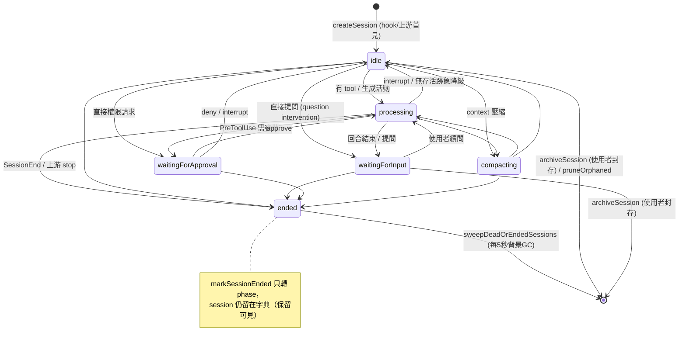
```mermaid
stateDiagram-v2
    [*] --> idle: createSession (hook/上游首見)

    idle --> processing: 有 tool / 生成活動
    idle --> waitingForInput: 直接提問 (question intervention)
    idle --> waitingForApproval: 直接權限請求
    idle --> compacting: context 壓縮

    processing --> waitingForApproval: PreToolUse 需審批
    processing --> waitingForInput: 回合結束 / 提問
    processing --> idle: interrupt / 無存活跡象降級
    processing --> compacting

    compacting --> processing
    compacting --> idle

    waitingForApproval --> processing: approve
    waitingForApproval --> idle: deny / interrupt
    waitingForInput --> processing: 使用者續問

    processing --> ended: SessionEnd / 上游 stop
    idle --> ended
    waitingForInput --> ended
    waitingForApproval --> ended
    compacting --> ended

    note right of ended
      markSessionEnded 只轉 phase，
      session 仍留在字典（保留可見）
    end note

    ended --> [*]: sweepDeadOrEndedSessions (每5秒背景GC)
    idle --> [*]: archiveSession (使用者封存) / pruneOrphaned
    waitingForInput --> [*]: archiveSession (使用者封存)
```

離開 `sessions` 字典（真正消失）的四條路徑，全部各自處理 alias 與 pending task 的清理：

| 路徑 | 觸發者 | 條件 | 語意 |
| --- | --- | --- | --- |
| `archiveSession` | 使用者主動封存（`.sessionArchived`） | 無條件；連同 `linkedParentSessionId == self` 的 child 一併移除 | 事件端唯一刪除路徑 |
| `sweepDeadOrEndedSessions` | 背景 liveness sweep（每 5s） | `phase == .ended` **或** PID 經 `kill(pid,0)` 確認 `ESRCH` | GC 已結束 / 已死程序 |
| `endOrphanedSessions` | 新 session start 時（`processHookEvent`） | 同 provider(僅 Claude) + 同 cwd + 同 `terminalDedupIdentity`、非 ended、非 needsManualAttention、無存活跡象、PID 非存活 | 清掉同終端重啟殘留的孤兒 |
| `migrateCodexSessionState` / codex placeholder prune | Codex 身分重綁 / 空 placeholder 過期 | 見下方 Codex 關聯 | 舊 id 併入新 id 或清空殼 |

### 2. Ingress → SessionStore → 訂閱者 資料流

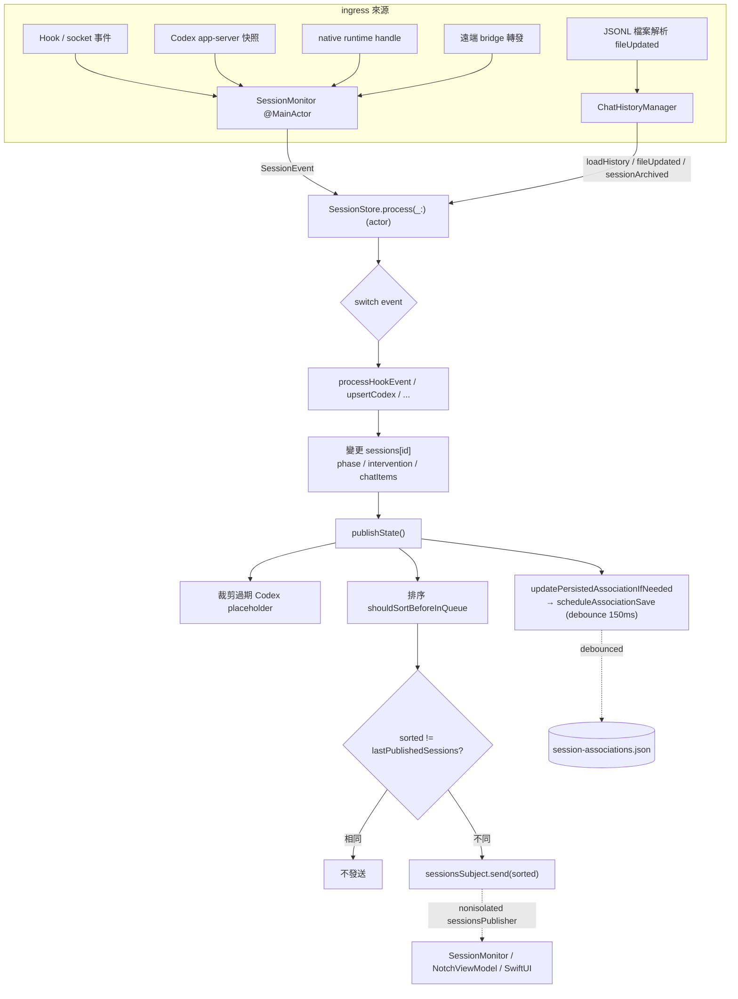
```mermaid
flowchart TD
    subgraph Ingress[ingress 來源]
      H[Hook / socket 事件] --> SM
      C[Codex app-server 快照] --> SM
      RT[native runtime handle] --> SM
      RB[遠端 bridge 轉發] --> SM
      JF[JSONL 檔案解析 fileUpdated] --> CHM[ChatHistoryManager]
    end

    SM[SessionMonitor @MainActor] -->|SessionEvent| PROC["SessionStore.process(_:) (actor)"]
    CHM -->|loadHistory / fileUpdated / sessionArchived| PROC

    PROC --> DISPATCH{switch event}
    DISPATCH --> HOOK[processHookEvent / upsertCodex / ...]
    HOOK --> MUT["變更 sessions[id]<br/>phase / intervention / chatItems"]
    MUT --> PUB["publishState()"]

    PUB --> P1[裁剪過期 Codex placeholder]
    PUB --> P2["排序 shouldSortBeforeInQueue"]
    PUB --> P3["updatePersistedAssociationIfNeeded<br/>→ scheduleAssociationSave (debounce 150ms)"]
    P2 --> DEDUP{"sorted != lastPublishedSessions?"}
    DEDUP -- 相同 --> SKIP[不發送]
    DEDUP -- 不同 --> SEND["sessionsSubject.send(sorted)"]

    SEND -.nonisolated sessionsPublisher.-> SUB[SessionMonitor / NotchViewModel / SwiftUI]
    P3 -.debounced.-> DISK[(session-associations.json)]
```

重點：`process()` 每次結尾都呼叫 `publishState()`，但 `publishState` 會用 `sortedSessions != lastPublishedSessions` 去重，只有內容真的變才 `send`。持久化關聯的寫盤是另一條 debounce（150ms）路徑，與 UI 廣播解耦。

---

**資料契約 / 規則:**

### 生命週期規則（end vs archive 的判斷）

- **provider-originated end 保留 `.ended`**：`processSessionEnd`（對應 `.sessionEnded` / `.runtimeSessionStopped`）與 `processHookEvent` 內 `event.status == "ended"` 分支都呼叫 `markSessionEnded(&session)`，它把 `phase = .ended`、`intervention = nil`、清 `pendingInterventions`、`autoApprovePermissions = false`，新結束時 bump `lastActivity`，然後 **把 session 寫回字典**。接著 `scheduleFinalSessionSync` 讓最後一批 transcript 訊息仍能落地。結束事件本身**不刪除** session。
- **結束的例外（保留提問）**：`shouldPreserveEndedStopForAnsweredQuestion`（line 498）= `status=="ended"` 且 `event=="Stop"` 且 `session.intervention?.awaitsExternalContinuation == true` 且 `clientInfo.prefersAnsweredQuestionFollowupAction`。命中時不轉 `.ended`，改成 `.waitingForInput`，讓等待外部續答的提問卡片留著。
- **只有使用者封存會刪除**：事件面唯一從字典移除 session 的是 `archiveSession`（`.sessionArchived`）。
- **背景 GC 是另一回事**：`sweepDeadOrEndedSessions`（liveness sweep，每 5s）會把 `.ended` 及 PID 已死的 session 一併移除。這與 AGENTS.md「ended 保留到使用者封存」的敘述在字面上有張力，見「棘手分支 / 地雷」。

### 完成偵測訊號（`assistantTurnCompleted`）

- `processHookEvent` 在套完 phase 後設/清 `session.assistantTurnCompleted`:phase 為 active（`processing`/`compacting`）時清為 false;否則若本事件是 `Stop`、`status != "ended"`、phase 落在 `.waitingForInput` 且無 intervention，就設 true。這是「agent 停手、輪到使用者」的權威完成訊號,同步發生在 `sessions[id] = session` 發布之前。
- **為何需要**:Claude 的 assistant 回覆文字只從 transcript JSONL 解析（`processFileUpdate`），而 `Stop→waitingForInput` 是同步的、比回覆進 `chatItems` 早約 100ms+;idle 期間又沒有其他 parse 觸發,回覆常要等到下一次使用者互動才回填。若完成偵測靠「最後一個 chat item 是 assistant」，完成當下永遠不成立（trailing 是 user prompt 或背景 observation 工具），完成音與完成卡都不會觸發。旗標讓 `SessionCompletionStateEvaluator.isCompletedReadySession = intervention==nil && (waitingForInput || codexIdle) && (assistantTurnCompleted || hasCompletedAssistantReply)` 在 `Stop` 發布當下就成立。
- Codex idle 完成走 `isCompletedCodexIdleSession`,不經此 hook 分支,旗標維持 false，沿用既有 `hasCompletedAssistantReply` 判斷,無回歸。

### 可見性規則（隱藏 vs 刪除是兩件事）

30 分鐘閒置自動隱藏是 **UI 層的可見性計算**，不改字典、不改 phase。定義在 `SessionState`（非 SessionStore）：

| 規則 | 位置 | 內容 |
| --- | --- | --- |
| 30 分鐘自動隱藏 | `SessionState.shouldAutoArchiveFromPrimaryUI` | `!needsManualAttention && (now - lastActivity >= autoArchiveDelay)`，`autoArchiveDelay = 30 * 60` |
| 需人工介入永不隱藏 | 同上首行 `if needsManualAttention { return false }` | `needsManualAttention`（= `phase.needsAttention \|\| intervention != nil`）的 session 一律豁免自動隱藏 |
| 隱藏原因區分 | `isHiddenFromPrimaryUIOnlyByIdle` | 只因 30 分鐘閒置而隱藏（排除 Codex 輔助 / 空 placeholder），供通知 feed 判斷未讀是否仍顯示 |
| 重新出現 | 任何更新 `lastActivity` 的 hook / 檔案 / app-server 事件 | 時間差重新 < 30 分鐘即自動回到列表 |
| 10 分鐘精簡呈現 | `shouldUseMinimalCompactPresentation` / `minimalCompactDelay = 10*60` | 更舊的背景 session 折成 header-only |

排序（`shouldSortBeforeInQueue` / `queuePhasePriority`）：active phase 最前 → `needsManualAttention` 次之（同為 attention 時較早的 `attentionRequestedAt` 在前）→ 依 `queuePhasePriority`（attention=0、processing/compacting=1、idle=2、ended=3）→ `queueSortActivityDate` 由新到舊 → `stableId`。

`pruneOrphanedSessions` 的「30」是 **30 秒**（`idleSeconds >= 30`），用於偵測 Claude 死程序，與 30 **分鐘** 的 UI 自動隱藏無關，兩者不要混淆。

### 關聯快取欄位（`PersistedSessionAssociation`，`session-associations.json`）

| 欄位 | 型別 | 用途 |
| --- | --- | --- |
| `provider` | `SessionProvider` | 組成 cache key `"provider:sessionId"` |
| `sessionId` | `String` | 同上 |
| `cwd` | `String` | relaunch 還原工作目錄；`createSession` 只在 `restoredCwdMatches` 時才進一步還原 projectName / sessionName |
| `projectName` | `String` | 顯示名還原 |
| `clientInfo` | `SessionClientInfo` | client 分支 / 品牌 / sessionFilePath 還原 |
| `sessionName` | `String?` | 使用者命名還原 |

快取管理：`ensurePersistedAssociationsLoaded`（`didLoadPersistedAssociations` 旗標，只從 disk load 一次）；`updatePersistedAssociationIfNeeded` 在 `publishState` 對每個 session 比對（`Equatable`）只在變動時標記 dirty；`scheduleAssociationSave` debounce 150ms、`.atomic` 寫盤；`removePersistedAssociation` 在 codex placeholder 裁剪與 codex 身分遷移時清除。

`SessionIngress` 五種：`hookBridge`、`remoteBridge`、`codexAppServer`、`nativeRuntime`、`desktopAppMonitor`。

---

**棘手分支 / 地雷:**

- **actor reentrancy（最大地雷）**：`processHookEvent` 有多個 `await`（client 富化、terminal 權限、Ghostty 富化）。兩個防護：(1) `isNewSession` 時**在 await 前**先把新 session 寫進字典，避免並發事件各建一份重複；(2) await 後重讀 `sessions[sessionId]`，若並發事件已 bump `lastActivity`（`latest.lastActivity > session.lastActivity`）就**採用最新快照並重套富化**，以免用舊副本覆蓋掉並發事件寫入的 phase / chatItems。改動這段務必保住這兩個 re-read 點。
- **`.ended` 保留 vs liveness sweep 移除的張力**：commit `84f7f8a`（"add session liveness sweep"）新增的 `sweepDeadOrEndedSessions` 每 5 秒會把 `phase == .ended` 的 session GC 掉。因此「end 事件保留 .ended」在實務上只保住到下一次 sweep（約 5 秒），並非字面上的「保留到使用者封存」。AGENTS.md 目前敘述描述的是**事件路由不變式**（end 事件不走刪除、只有 archive 走刪除），與背景 GC 是兩套機制。若要調整 ended 可見時長，改的是 sweep 而非事件路徑——這點需要與產品規則核對意圖。
- **Codex 跨 ingress 身分關聯（hook ↔ app-server）**：Codex 一個對話會在 hook 與 app-server 兩條 ingress 產生不同 sessionId。兩個重綁點：
  - `resolveOrAdoptCodexHookSession`：hook 事件若是 transient continuation placeholder（非 SessionStart、字典未知），在 `codexContinuationMergeWindow`（10 分鐘）內找到既有 thread → `aliasCodexSession(hook id → 既有 id)`（只加 alias，不搬狀態）。
  - `resolveOrAdoptCodexSession`：`codexAppServer` ingress 的新 thread id 若在 10 分鐘窗內對上既有（通常是 hook 建的）session → `migrateCodexSessionState`（把整份 state 從舊 id 搬到新 app-server id、取消舊 id 的 pending task、`removePersistedAssociation(舊 id)`）+ `aliasCodexSession`。
  - `resolveCodexSessionAlias` 用 `visited` set 防 alias 環。**所有** query / mutation 進入點（`session(for:)`、`markSessionSeen`、`processSessionEnd`、`archiveSession`…）都先過 alias 解析，繞過它就會操作到錯的 id。
- **`SessionStart` 不重綁**：`resolveOrAdoptCodexHookSession` 明確 `guard event.event != "SessionStart"`，因為裸 SessionStart 尚無穩定身分，貿然重綁會讓標題產生等輔助 session 汙染可見使用者 session。
- **nonisolated 讀側橋接**：`sessionsSubject` 是 `nonisolated(unsafe) let CurrentValueSubject`，`sessionsPublisher` 為 `nonisolated`，讓 UI 訂閱不必 hop 進 actor。寫入 (`send`) 只發生在 actor-isolated 的 `publishState` 內，故 unsafe 在實務上受 actor 序列化保護——但這是刻意的例外，新增對 subject 的直接存取要小心。
- **兩套 file-sync debounce 並存**：SessionStore 內部自帶 `pendingSyncs` + `scheduleFileSync` + `cancelPendingSync`（100ms debounce）。`FileSyncScheduler.swift`（獨立 actor、header 寫著「Extracted from SessionStore to reduce complexity」）**全 repo 無任何引用**，是未接線的孤兒 helper。動 file sync 時看 SessionStore 內建那套，不是 FileSyncScheduler。（僅陳述，未刪除。）
- **多套 pending 排程狀態**：`pendingSyncs` / `pendingCodexPlaceholderPrunes` / `pendingQoderConversationPolls` / `pendingOpenClawConversationPolls` / `pendingCodeBuddyCLIQuestionPolls` 各自一份 `[String: Task]`。session 離開字典的每條路徑（archive / sweep / endOrphaned / migrate）都必須逐一 `cancelPendingXxx`，漏掉會留下對已消失 session 的孤兒 task。
- **nonisolated static 純函式**：路徑正規化（`normalizedPath`、`shouldAdoptHookWorkspace`、`projectName`）、`cancelPendingHookResponse`、`interventionsMatch` 等都是 `nonisolated`，可在 actor 外呼叫；它們不得碰 `sessions`，也不得呼叫 main-actor 隔離的 `AppLocalization.string`（依 CLAUDE.md 只吐 key / 純資料）。

---

**與其他子系統的邊界:**

- **誰餵資料進來（上游）：**
  - `SessionMonitor`（`@MainActor` wrapper，15 處 `process(...)` 呼叫）：hook 事件、permission approve/deny/socket-fail、intervention resolved、interrupt/clear、Codex intervention 解析、liveness sweep 啟停、`pruneOrphanedSessions`、`markSessionSeen`/`markAllSessionsSeen`。
  - `ChatHistoryManager`：`loadHistory`、`fileUpdated`（JSONL 增量解析）、`sessionArchived`。
  - `HookSocketServer`：把原始 hook 封包正規化成 `HookEvent`（`SessionEnd`/`Stop`/`Notification` 等映射），經 SessionMonitor 進 `process(.hookReceived(...))`。
  - `CodexRolloutParser` / Codex app-server：透過 `upsertCodexSession` / `syncCodexThreadSnapshot`。
  - `ConversationParser`：`processFileUpdate` / `loadHistoryFromFile` 內被 await 呼叫，回填 chatItems、completed tools、subagent tools。
- **誰訂閱（下游）：**
  - `sessionsPublisher` → `SessionMonitor` → `NotchViewModel` / `NotchView` / `SessionListView` / hover preview / 通知 feed（可見性規則在 UI 端讀 `SessionState.shouldAutoArchiveFromPrimaryUI` 等）。
  - `EnergyGovernor`：讀 `sessions.contains { needsManualAttention }` 之類決定低功耗策略。
  - `diagnosticsSnapshot()` → 診斷 UI。
- **委派出去：** `ToolEventProcessor`（tool/subagent 追蹤，`inout SessionState`）、`SessionAssociationStore`（disk 讀寫）、`TelemetryService` / `AgentUsageStore`（`Task {}` fire-and-forget 記錄）、`HookSocketServer.respondToPermissionBySession`（bypassPermissions 直接回應 hook）。

---

## §06 Hook 接入層

**檔案:**

- `PingIsland/Services/Hooks/HookSocketServer.swift`（~2224 行）：Unix domain socket 伺服器、`BridgeEnvelope` 解碼、envelope→`HookEvent` 正規化、待回應 socket 保持與 bridge response 回寫。內含 `HookEvent`、`BridgeEnvelope`、`BridgeEnvelopeIntervention`、`BridgeDecision`/`BridgeResponse`、`CodexAuxiliaryHookFilter`、`PendingPermission`、`HermesHookDebugStore`、`AnyCodable` 等型別。
- `PingIsland/Services/Hooks/HookInstaller.swift`（~4046 行）：各家 hook client 的安裝 / 反安裝 / 偵測，bridge launcher 與 bridge binary 佈署，statusline script，App Store 沙箱授權，Qwen / CodeBuddy CLI 相容性原始碼修補。內含 JSON 註解剝除的 `parseJSONObject` 與 `TOMLHookConfigParser`。
- `PingIsland/Services/Hooks/BridgeRuntimeConfigWriter.swift`（71 行）：把 `BridgeRuntimeConfigSnapshot`（`routePromptsToTerminal` 與 debug log 設定）寫成 bridge 於 hook time 讀取的小型 runtime config JSON。
- `PingIsland/Services/Hooks/BridgeRuntimePaths.swift`（53 行）：socket 路徑、runtime config 路徑、launcher 環境變數的單一來源；依 `APP_STORE` build flag 切換 App Group 容器路徑或 legacy `/tmp/island.sock`。
- `PingIsland/Services/Hooks/RecentInterventionResponseStore.swift`（162 行）：快取近 30 秒的 `AskUserQuestion` 內嵌答覆，讓 hook 的重試（duplicate retry）能自動用同一答案回覆。
- `PingIsland/Services/Hooks/HookWalkthroughDemoRunner.swift`（393 行）：純示範用，`@MainActor` 直接合成 `HookEvent` 灌入 `SessionStore`（不經 socket），帶半透明背板窗，用來演示「通知→審批→完成」一輪流程。

（範圍相關但不在本目錄的正典來源：`PingIsland/Models/ClientProfile.swift` 定義 `ManagedHookClientProfile` 與 `ClientProfileRegistry.managedHookProfiles`，是各 client 設定檔路徑 / 事件 / matcher 的資料來源；`PingIsland/Services/Session/SessionMonitor.swift` 是 socket 與 `SessionStore` 之間的中介。）

**責任:** 接收外部 agent（Claude / Codex / Gemini / Hermes / Qwen / Kimi / Qoder / CodeBuddy / OpenCode / OpenClaw / Pi / Copilot / Cursor 等）透過 `PingIslandBridge` 送來的統一 bridge envelope，正規化成內部 `HookEvent` 交給 `SessionStore`；同時負責把各家 client 的 hook 設定寫進它們各自的設定檔，並把使用者對審批 / 提問的回覆沿原 socket 回寫給 bridge。

**關鍵型別與進入點:**

- `HookSocketServer.shared` → 單例 socket 伺服器。
- `HookSocketServer.start(onEvent:onPermissionFailure:)` → bind `AF_UNIX` socket（`BridgeRuntimePaths.socketPath`）、`chmod 0o777`、`listen(backlog:10)`、用 `DispatchSource` read source 接受連線；`onEvent` 存進 `eventHandler`。由 `SessionMonitor.startMonitoring` 呼叫，`onEvent` 綁到 `SessionMonitor.handleHookEvent`。
- `HookSocketServer.handleClient(_:)` → 單一連線的收字 → 解碼 → 過濾 → 正規化 → 派發或保留 socket。
- `BridgeEnvelope`（`private`，`Codable`）→ 外部線上協定；`var hookEvent: HookEvent` 是正規化核心。
- `HookEvent`（`Sendable`）→ 內部事件模型，`SessionEvent.hookReceived(HookEvent)` 的酬載。
- `HookSocketServer.respondToPermission` / `respondToPermissionBySession` / `respondToIntervention` / `cancelPendingPermission(s)` → 回寫決策；經 `sendHookResponse` → `writeBridgeResponse` 沿保留的 client socket 送出 `BridgeResponse`。
- `HookInstaller.install(_:)` / `installIfNeeded` / `uninstall` / `isInstalled` → 依 `profile.installationKind` 分派安裝動作。
- `HookInstaller.installBridgeLauncherIfNeeded()` → 佈署 launcher shell script + bridge binary + statusline script 到 island support 目錄。
- `BridgeRuntimeConfigWriter.write(_:)` ← `Settings.bridgeRuntimeConfigSnapshot`（含 idle 導回終端機的 `effectiveRoutePromptsToTerminal`）。
- `ClientProfileRegistry.managedHookProfiles: [ManagedHookClientProfile]` → 所有可管理 client 的清單。

**核心流程:**

envelope 接收 → 正規化 → 派發（含待回應 socket 保持）：

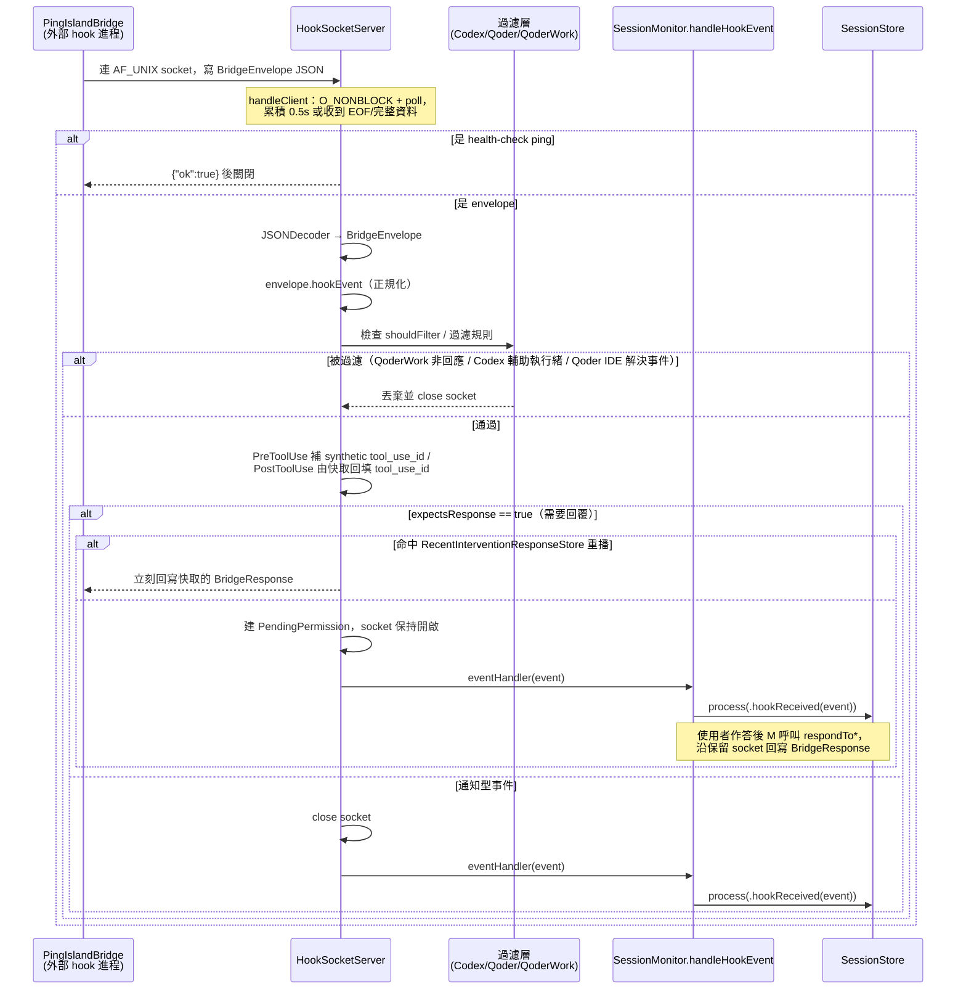
```mermaid
sequenceDiagram
    participant B as PingIslandBridge<br/>(外部 hook 進程)
    participant S as HookSocketServer
    participant F as 過濾層<br/>(Codex/Qoder/QoderWork)
    participant M as SessionMonitor.handleHookEvent
    participant St as SessionStore

    B->>S: 連 AF_UNIX socket，寫 BridgeEnvelope JSON
    Note over S: handleClient：O_NONBLOCK + poll，<br/>累積 0.5s 或收到 EOF/完整資料
    alt 是 health-check ping
        S-->>B: {"ok":true} 後關閉
    else 是 envelope
        S->>S: JSONDecoder → BridgeEnvelope
        S->>S: envelope.hookEvent（正規化）
        S->>F: 檢查 shouldFilter / 過濾規則
        alt 被過濾（QoderWork 非回應 / Codex 輔助執行緒 / Qoder IDE 解決事件）
            F-->>S: 丟棄並 close socket
        else 通過
            S->>S: PreToolUse 補 synthetic tool_use_id / <br/>PostToolUse 由快取回填 tool_use_id
            alt expectsResponse == true（需要回覆）
                alt 命中 RecentInterventionResponseStore 重播
                    S-->>B: 立刻回寫快取的 BridgeResponse
                else
                    S->>S: 建 PendingPermission，socket 保持開啟
                    S->>M: eventHandler(event)
                    M->>St: process(.hookReceived(event))
                    Note over M,St: 使用者作答後 M 呼叫 respondTo*，<br/>沿保留 socket 回寫 BridgeResponse
                end
            else 通知型事件
                S->>S: close socket
                S->>M: eventHandler(event)
                M->>St: process(.hookReceived(event))
            end
        end
    end
```

安裝流程（`HookInstaller.install(profile)` 依 `installationKind` 分派）：

```mermaid
flowchart TD
    A["install(profile)"] --> B{canManage(profile)?}
    B -- 否 --> Z[略過]
    B -- 是 --> C["installBridgeLauncherIfNeeded()<br/>佈署 launcher + bridge binary + statusline"]
    C --> D{installationKind}
    D -- jsonHooks --> E["updateHooks：讀既有 JSON →<br/>removingIslandManagedHooks 去舊 Island 條目 →<br/>寫入 bridgeCommand hook 條目 → writeJSONObject"]
    D -- pluginFile --> F["writeManagedPlugin + setManagedPluginEnabled(true)<br/>（OpenCode：JS 外掛 + opencode.json 啟用）"]
    D -- pluginDirectory --> G["writeManagedPluginDirectory<br/>（Hermes / Pi：整包外掛目錄檔案）"]
    D -- hookDirectory --> H["writeManagedHookDirectory + setInternalHookEnabled(true)<br/>（OpenClaw：hook 目錄 + openclaw.json 啟用條目）"]
    D -- tomlHooks --> I["updateTOMLHooks：TOMLHookConfigParser 解析 →<br/>rebuild 僅換掉 Island 段落（Kimi config.toml）"]
    E --> J{profile.id == qwen-code?}
    J -- 是 --> K["applyQwenAskUserQuestionCompatibilityPatchIfNeeded()<br/>（同理 CodeBuddy CLI）改寫 CLI 原始碼"]
    J -- 否 --> L[完成]
    F --> L
    G --> L
    H --> L
    I --> L
    K --> L
```

**資料契約 / 規則:**

`BridgeEnvelope`（外部協定，唯一入口格式）欄位：`id: UUID`、`provider: BridgeProvider`、`eventType: String`、`sessionKey: String`、`title?`、`preview?`、`cwd?`、`status?`、`terminalContext`（terminal / IDE bundle、tty、iTerm / tmux session、transport、remoteHost 等）、`intervention?`、`expectsResponse`、`metadata: [String:String]`、`sentAt: Date`。`expectsResponse` 是多型解碼：可以是 `Bool`，也可以是問題陣列或問題物件；若是後者會被轉成 `expectsResponse = true` 並把問題注入 `metadata["tool_input_json"]`。

`HookEvent`（內部模型）欄位：`sessionId`、`cwd`、`event`、`status`、`provider: SessionProvider`、`clientInfo: SessionClientInfo`、`pid?`、`tty?`、`tool?`、`toolInput?`、`toolUseId?`、`notificationType?`、`message?`、`ingress: SessionIngress`（預設 `.hookBridge`）、`bridgeIntervention?`、`bridgeExpectsResponse?`、`suppressInAppPrompt`、`codexBypassPermissions`。

各 client 安裝資料（設定檔路徑相對 home、`installationKind`、`--client-kind`、事件與 matcher、blocking 能力、`defaultEnabled`）。所有事件名採 Claude Code 慣例，除非另註：

| Profile ID | 顯示名 | 設定檔（相對 home） | installKind | `--client-kind` / source | 主要 hook 事件（特例） | matcher 語法 | blocking 能力 | 預設啟用 |
|---|---|---|---|---|---|---|---|---|
| `claude-hooks` | Claude Code | `.claude/settings.json` | jsonHooks | source `claude`（無 client-kind） | UserPromptSubmit, PreToolUse, PostToolUse, PermissionRequest(timeout 86400), Notification, Stop, SubagentStop, SessionStart, SessionEnd, PreCompact(auto/manual) | glob `*` | blocking（PermissionRequest + AskUserQuestion） | 是 |
| `codex-hooks` | Codex | `.codex/hooks.json` | jsonHooks | source `codex` | SessionStart, UserPromptSubmit, PreToolUse, PostToolUse, PermissionRequest(86400), Stop | glob `*` | blocking | 是 |
| `gemini-hooks` | Gemini CLI | `.gemini/settings.json` | jsonHooks | `gemini` | SessionStart, SessionEnd, BeforeAgent, AfterAgent, BeforeTool, AfterTool, Notification, **PreCompress** | **regex `.*`**（非 glob） | notify-only（Notification 僅觀測，非審批 callback） | 否 |
| `hermes-hooks` | Hermes | `.hermes/plugins/ping_island` | pluginDirectory | `hermes` | 由 plugin `ctx.register_hook()` 註冊（非 JSON 事件清單） | 不適用 | Claude 相容（source `claude`） | 否 |
| `pi-hooks` | Pi Agent | `.pi/agent/extensions/ping_island` | pluginDirectory | `pi` | 由產生的 TypeScript extension 轉發（`index.ts`） | 不適用 | Claude 相容 | 否 |
| `qwen-code-hooks` | Qwen Code | `.qwen/settings.json` | jsonHooks | `qwen-code` | UserPromptSubmit, PreToolUse, PostToolUse, PostToolUseFailure, Notification, SessionStart, SessionEnd, Stop, SubagentStart, SubagentStop, PreCompact, PermissionRequest(86400) | glob `*` | blocking（需 CLI 原始碼修補以支援 AskUserQuestion） | 否 |
| `openclaw-hooks` | OpenClaw | `.openclaw/hooks/ping-island-openclaw`（+ 啟用檔 `.openclaw/openclaw.json` 條目 `ping-island-openclaw`） | hookDirectory | `openclaw` | `command:new/reset/stop`, `message:received/sent`, `session:compact:before/after`, `session:patch`（templates 空） | 無 matcher（目錄探索） | 目錄探索型 | 否 |
| `codebuddy-hooks` | CodeBuddy（IDE） | `.codebuddy/settings.json` | jsonHooks | `codebuddy` | UserPromptSubmit, PreToolUse, PostToolUse, Notification, Stop, SubagentStop, SessionStart, SessionEnd, PreCompact | glob `*` | notify-only | 否 |
| `codebuddy-cli-hooks` | CodeBuddy CLI | `.codebuddy/settings.json`（與 IDE 共用檔） | jsonHooks | `codebuddy-cli` | 上者加 PreToolUse(86400) + PermissionRequest(86400)；SessionStart matcher `startup/resume/clear/compact`；SessionEnd matcher `clear/logout/prompt_input_exit/other` | glob `*` + 具名 | blocking（Claude 相容；需 CLI 原始碼修補） | 否 |
| `workbuddy-hooks` | WorkBuddy | `.workbuddy/settings.json` | jsonHooks | `workbuddy` | 同 CodeBuddy IDE | glob `*` | notify-only | 否 |
| `cursor-hooks` | Cursor | `.cursor/hooks.json` | jsonHooks | `cursor` | beforeSubmitPrompt, preToolUse, postToolUse, stop, subagentStop, sessionStart, sessionEnd, preCompact | `.direct`（扁平條目，無 matcher 包裹） | -- | 否 |
| `qoder-hooks` | Qoder（IDE） | `.qoder/settings.json` | jsonHooks | `qoder` | UserPromptSubmit, PreToolUse, PostToolUse, PostToolUseFailure, PermissionRequest（無 timeout）, Notification, Stop | glob `*` | notify-only（IDE 不建 Island 端 blocking 回覆） | 是 |
| `qoder-cli-hooks` | Qoder CLI | `.qoder/settings.json`（與 IDE 共用檔） | jsonHooks | `qoder-cli` | 加 PreToolUse(86400), PermissionRequest(86400), SubagentStop, SessionStart, SessionEnd, PreCompact | glob `*` | blocking（Claude 相容；`qodercli -v` > 0.2.5 才啟用/刷新） | 否 |
| `qoderwork-hooks` | QoderWork | `.qoderwork/settings.json` | jsonHooks | `qoderwork` | UserPromptSubmit, PreToolUse, PostToolUse, PostToolUseFailure, PermissionRequest, Notification, Stop | glob `*` | notify-only + answer-replay（見棘手分支） | 是 |
| `copilot-hooks` | GitHub Copilot | `.github/hooks/island.json` | jsonHooks | source `copilot`（無 client-kind） | sessionStart, sessionEnd, userPromptSubmitted, preToolUse, postToolUse, agentStop, subagentStop, errorOccurred | 期望扁平 command 條目，**事件名在 hook command 顯式綁定**（`makeCopilotHookEntries`） | notify-only | 否 |
| `opencode-hooks` | OpenCode | `.config/opencode/plugins/ping-island.js`（+ 啟用檔 `.config/opencode/opencode.json`） | pluginFile | `opencode` | 由 JS plugin 轉發 | 不適用 | plugin 型 | 否 |
| `kimi-hooks` | Kimi CLI | `.kimi/config.toml` | tomlHooks | `kimi` | UserPromptSubmit, PreToolUse, PostToolUse, Notification, Stop, SessionStart, SessionEnd | glob `*`（TOML `[[hooks]]` array-of-tables） | notify（保留所有非 Island TOML 內容） | 否 |

`eventType` → `HookEvent.status` 映射（`mapStatus`，`status?` 若有則先用；`Notification` + `notification_type == "idle_prompt"` 直接 `waiting_for_input`）：`SessionEnd→ended`；`SessionStart`/`SubagentStop→waiting_for_input`；`Stop→` Codex 時 `waiting_for_input`，否則 `idle`；`UserPromptSubmit`/`PostToolUse→processing`；`PreToolUse→running_tool`；`PreCompact→compacting`；`Notification→notification`；其餘 `processing`。

決策字串 → `BridgeDecision`（`bridgeDecision(for:)`）：`allow`/`approve→.approve`；`approveForSession`/`allow_for_session→.approveForSession`；`deny→.deny`；`cancel`/`ask→.cancel`；`answer→.answer(payload)`。`.answer` 的 payload 從 `updatedInput["answers"]` 抽取並轉成 `[String:String]`。

`BridgeRuntimeConfigSnapshot`（bridge 於 hook time 讀的 runtime config，schema 必須與 `IslandShared.BridgeRuntimeConfig` 同步）：`routePromptsToTerminal: Bool`、`debugLoggingEnabled`、`debugLogRetentionDays`（clamp 1–30）、`debugLogMaxDirectoryMegabytes`（clamp 16–1024）。寫到 `BridgeRuntimePaths.runtimeConfigURL`（App Store：App Group 容器 `b/c.json`；否則 `~/.ping-island/bridge-config.json`），`atomic` 寫入。

**棘手分支 / 地雷:**

envelope 正規化：

- **session id 解析** `resolvedSessionID`：優先 `metadata["session_id"]`→`thread_id`→`threadId`→`sessionKey` 冒號後段，全空才退回整個 `sessionKey`。
- **cwd 解析** `resolvedCWD`：候選是 envelope `cwd` / terminalContext `currentDirectory` / `metadata["cwd"]`；但若候選是「頂層 client 設定目錄」（`~/.claude`、`~/.codex`、`~/.qoder`… 之一且直接位於 home 下）或候選不存在，就改用從 session/rollout/transcript 檔路徑推回的工作區（`~/.<client>/projects/<slug>` 反推真實目錄）。這是為了避免把 agent 的設定目錄誤當成專案根。
- **工具名正規化** `normalizedToolName`：`ask_user_question` / `askuserquestion` 一律轉成 `AskUserQuestion`，其餘原樣。
- **client 身分推斷** `makeClientInfo`：以 `metadata` 的 client_kind/name/bundle_id 為主，特例 bundle `com.qoder.ide→qoder`、`com.qoder.work→qoderwork`；再交給 `ClientProfileRegistry.matchRuntimeProfile`。Codex 另走 `inferredCodexClientKind`（區分 CLI vs App，App 補 `com.openai.codex` bundle 與 launch URL）。
- **tool_use_id 相關**：`PreToolUse` 無 id 時補 `bridge-<envelopeUUID>` 合成 id 並快取；`PostToolUse` 無 id 時用快取回填，用來把前後兩個 hook 關聯成同一次工具呼叫。`SessionEnd` 清該 session 快取。
- **`codexBypassPermissions`**：僅當 `eventType == PermissionRequest` 且 `metadata["permission_mode"] == "bypassPermissions"` 為真。`suppressInAppPrompt` 來自 `metadata["suppress_in_app_prompt"] == "true"`。

各家 client 特例：

- **待回應 socket 保持**：`expectsResponse` 為真時 socket **不關閉**，登記成 `PendingPermission`（含 `clientSocket` fd），等使用者作答後由 `respondTo*`→`sendHookResponse`→`writeBridgeResponse` 沿原 fd 回寫再關閉。寫入失敗會呼叫 `permissionFailureHandler`。
- **答覆重播** `RecentInterventionResponseStore`：只對 `AskUserQuestion` 且屬 plain Claude Code（排除 qoder/qoderwork bundle）、或 QoderWork、或 CodeBuddy CLI 的 `permission_prompt` Notification 生效。cache key = sessionId + 工具 + 問題簽章（question/header/id sanitized）。重試 hook 若命中同簽章就自動用上次答案回覆，避免重複彈卡。
- **QoderWork / Qoder IDE 過濾**：`shouldFilterBeforeApprovalHandling` 丟棄 QoderWork 非回應事件；`shouldSkipQoderIDEEvent` 跳過 Qoder IDE/CLI 的問題「解決」事件。Qoder IDE、QoderWork、CodeBuddy IDE 為 notify-only，不得在 Island 端建 blocking 回覆；Qoder CLI / CodeBuddy CLI 才走 Claude 相容 blocking。
- **`CodexAuxiliaryHookFilter`**（僅 Codex）：丟棄兩類雜訊執行緒 —（1）標題生成 prompt（比對「you are a helpful assistant… short title / return only the title」等 marker），（2）`~/.codex/memories` 記憶維護執行緒（工作區在 `.codex/memories`，或標題為 memory/memories 且內文含 `memory.md`+`memory_summary.md`）。命中後把 sessionId 記入忽略清單（保留 10 分鐘），直到 `Stop`/`SessionEnd` 才移除。
- **CLI 原始碼修補**：`patchedQwenCLISourceIfNeeded` / `patchedCodeBuddyCLISourceIfNeeded` 會用 regex 改寫已安裝的 Qwen / CodeBuddy CLI JS 進入點，補上 AskUserQuestion / Notification / Permission hook 呼叫（帶 idempotent marker，已修補則跳過）。這是直接改使用者機器上第三方 CLI 檔案，屬高風險路徑。
- **JSON hook 保存策略**：`updateHooks` 先 `removingIslandManagedHooks` 只移除 Island 自己的條目（靠 hook command 內的 launcher 路徑 + `--client-kind` 值以 regex 辨識），再寫回自己的，保留其他非 Island hooks；共用檔的 client（Qoder IDE/CLI、CodeBuddy IDE/CLI）必須保住彼此與無關設定。Copilot 走扁平 `makeCopilotHookEntries`（事件名顯式綁定）。Kimi 走 `TOMLHookConfigParser` 只換 `[[hooks]]` 段落。
- **App Store 沙箱授權**：非 App Store build 直接寫 home；App Store build 需 `requestAppStoreHookDirectoryAuthorization` 讓使用者用 `NSOpenPanel` 選 home 目錄，存 security-scoped bookmark，之後 `restoreAppStoreHookDirectoryAuthorizationIfAvailable` + `startAccessingSecurityScopedResource` 才能寫各 client 設定檔。socket 路徑與 runtime config 路徑也因 `APP_STORE` flag 改走 App Group 容器。
- **idle 導回終端機**：`Settings.effectiveRoutePromptsToTerminal = routePromptsToTerminal || (autoRoutePromptsToTerminalWhenIdleEnabled && idleAutoRoutePromptsToTerminalActive)`。`UserIdleAutoProtection` 偵測到使用者離開時呼叫 `Settings.setIdleAutoRoutePromptsToTerminalActive(true)`，改變 snapshot，`BridgeRuntimeConfigWriter.write` 把新值寫進 runtime config JSON，`PingIslandBridge` 於 hook time 讀到後直接把審批 / 提問回到終端機而不彈 Island 卡片。

**與其他子系統的邊界:**

- **`Prototype/Sources/IslandBridge`（`PingIslandBridge`）**：外部 hook 進程，是 `BridgeEnvelope` 的唯一生產者；負責 terminal / tmux / SSH-remote / IDE terminal context 擷取後才連 socket。它讀 `BridgeRuntimePaths` 提供的 socket 路徑（env `ISLAND_SOCKET_PATH`）與 runtime config（env `PING_ISLAND_BRIDGE_CONFIG`）。改 envelope 形狀要同步 IslandBridge、`HookSocketServer`、`SessionEvent`、`SessionStore` 與相關 UI。
- **`SessionMonitor`**：`HookSocketServer.start` 的 `onEvent` = `SessionMonitor.handleHookEvent`，在 `handleIncomingHookEvent` 內呼 `SessionStore.shared.process(.hookReceived(effectiveEvent))`，並依結果呼 `HookSocketServer.respondToPermission/respondToIntervention/cancelPendingPermission(s)` 回寫或取消。`RemoteConnectorManager`（遠端 SSH 轉發）共用同一個 `handleHookEvent` handler，遠端事件走 `ingress == .remoteBridge` 分支回寫到遠端 bridge。
- **`SessionStore` / `SessionState`**：`HookEvent` 經 `SessionEvent.hookReceived` 進入 `SessionStore.process`，是唯一的 session 狀態變更入口。
- **`ClientProfile.swift`（`ManagedHookClientProfile` / `ClientProfileRegistry`）**：安裝端的設定資料正典；新增 Claude 相容 client 從這裡起手。同時 `makeClientInfo` 的執行期辨識靠 `ClientProfileRegistry.matchRuntimeProfile`。
- **`Settings.swift` + `UserIdleAutoProtection`**：組出 `BridgeRuntimeConfigSnapshot` 並透過 `BridgeRuntimeConfigWriter` 落地，是 idle 導回終端機與 debug log 政策的來源。
- **`HookWalkthroughDemoRunner`**：旁路，`@MainActor` 直接把合成 `HookEvent` 灌進 `SessionStore`，不經 socket、不觸發真實 hook，僅供 onboarding 演示。

---

## §07 Session 橋接與解析

**檔案:**

- `PingIsland/Services/Session/ConversationParser.swift`（~2277 行，`actor ConversationParser`）
- `PingIsland/Services/Session/SessionMonitor.swift`（~1302 行，`@MainActor class SessionMonitor: ObservableObject`）
- `PingIsland/Services/Session/JSONLInterruptWatcher.swift`（`JSONLInterruptWatcher` + `InterruptWatcherManager`）
- `PingIsland/Services/Session/AgentFileWatcher.swift`（`AgentFileWatcher` + `AgentFileWatcherManager` + `AgentFileWatcherBridge`）
- `PingIsland/Services/Session/ClaudeDesktopWatcher.swift`（`actor ClaudeDesktopWatcher`）
- `PingIsland/Services/Chat/ChatHistoryManager.swift`（`@MainActor class ChatHistoryManager: ObservableObject` + chat 顯示模型 `ChatHistoryItem` / `ToolCallItem` / `SubagentToolCall`）

延伸閱讀（不在指派範圍，但構成本子系統的邊界，供對照）：`PingIsland/Models/ChatMessage.swift`（parser 產出的中介型別）、`PingIsland/Utilities/SessionTextSanitizer.swift`（`sanitizedDisplayText` 與 `boundedDisplayText`）、`PingIsland/Services/State/SessionStore.swift`（呼叫 parser、把 `ChatMessage` 轉成 `ChatHistoryItem`）。

**責任:** `ConversationParser` 把各家 agent 落地在磁碟的 transcript（Claude JSONL、OpenClaw JSONL、CodeBuddy `index.json` sidecar，以及 Qoder/CodeBuddy CLI 的問題 fallback）解析成結構化的 `ChatMessage` / `ConversationInfo` / `ToolResultData`；`SessionMonitor` 與 `ChatHistoryManager` 則是把 actor 化的 `SessionStore` 狀態橋接成 `@Published` 屬性給 SwiftUI 觀察，並承接使用者動作（核准/拒絕/回答/送訊息）反向路由回各 ingress 通道。三個 watcher 負責用檔案系統事件觸發增量重解析與中斷偵測。

**注意（本子系統核心約束）:** parser 在解析階段只做 boilerplate 清洗（`sanitizedDisplayText`）與清單列預覽的短截（`truncateMessage`，50/80 字），完整的 message 文字原封不動存進 store；長 prompt / result 的 bounded 短截（`boundedDisplayText`）只在 SwiftUI 渲染邊界（`ChatView` / `CodexSessionView`）套用。full data 一律留在 store。

---

### 關鍵型別與進入點

| 型別 / 方法 | 角色 |
| --- | --- |
| `ConversationParser`（`actor`, `.shared`） | transcript 解析單例，內部持有 `cache`（依檔案 modDate）與 `incrementalState`（依 sessionId 的 byte-offset 增量狀態） |
| `ConversationParser.parse(sessionId:cwd:explicitFilePath:)` | 產出清單列用的輕量 `ConversationInfo`（summary / lastMessage / firstUserMessage），有 modDate cache |
| `ConversationParser.parseIncremental(...)` | 只讀「上次 offset 之後」的新行，回傳 `IncrementalParseResult`（newMessages + allMessages + tool 完成狀態 + `clearDetected`）——watcher 的主要進入點 |
| `ConversationParser.parseFullConversation(...)` | 回傳整段 `[ChatMessage]`（供 chat 檢視第一次載入，註解標明「use sparingly」） |
| `ConversationParser.parseSubagentTools(...)` / `parseSubagentToolsSync(...)` | 從 `agent-<id>.jsonl` 解析 Task 子代理的工具呼叫；後者是 `nonisolated static` 版，給 `AgentFileWatcher` 在自己的 queue 同步呼叫 |
| `ConversationParser.qoderFallbackIntervention` / `pendingCodeBuddyCLIQuestionIntervention` / `qoderFallbackSubagentPresentation` | hook-less 情況下從 transcript 反推「待回答的提問」`SessionIntervention` 或子代理標題 |
| `ConversationInfo` / `IncrementalParseResult` / `ToolResult`（struct） | parser 對外資料契約 |
| `SessionMonitor.instances` / `pendingInstances` / `claudeUsageSnapshot` / `codexUsageSnapshot`（`@Published`） | 給 SwiftUI 觀察的可見 session 陣列與用量快照 |
| `SessionMonitor.startMonitoring()` | 啟動所有 ingress：`HookSocketServer`、`CodexAppServerMonitor`、`ClaudeDesktopWatcher`、`runtimeCoordinator`、`RemoteConnectorManager`，並掛上 liveness sweep |
| `SessionMonitor.handleIncomingHookEvent(_:)` | hook 事件入口：先過 native-runtime 判定 → auto-approve / auto-answer → 丟給 `SessionStore.process(.hookReceived)` → 決定是否開/關 transcript watcher |
| `SessionMonitor.approvePermission / denyPermission / answerIntervention / sendSessionMessage` | 使用者動作的反向路由（依 `session.ingress` 分派到四條通道） |
| `ChatHistoryManager`（`.shared`） | 訂閱 `SessionStore.sessionsPublisher`，把 `session.chatItems` 過濾（去掉隸屬 Task 的子工具）後發佈成 `histories`；同時維護 `historyRevisions` 供 UI 判斷是否重建 |
| `InterruptWatcherManager` / `AgentFileWatcherManager`（`@MainActor .shared`） | 依 sessionId / `sessionId-taskToolId` 管理 watcher 生命週期 |
| `JSONLInterruptWatcherDelegate`（`SessionMonitor` 實作）| `didDetectInterrupt` → `.interruptDetected`；`didObserveFileChange` → `SessionStore.requestFileSync` |

---

### 核心流程

#### 1. Transcript 解析流程（`parseIncremental` 為主軸）

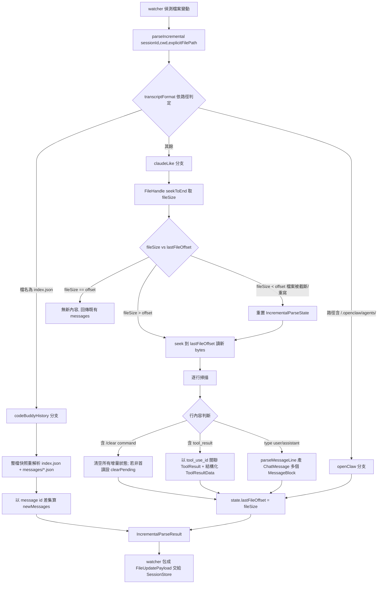
```mermaid
flowchart TD
    A[watcher 偵測檔案變動] --> B[parseIncremental sessionId,cwd,explicitFilePath]
    B --> C{transcriptFormat 依路徑判定}
    C -->|路徑含 /.openclaw/agents/| D[openClaw 分支]
    C -->|檔名為 index.json| E[codeBuddyHistory 分支]
    C -->|其餘| F[claudeLike 分支]

    E --> E1[整檔快照重解析 index.json + messages/*.json]
    E1 --> E2[以 message id 差集算 newMessages]

    F --> G[FileHandle seekToEnd 取 fileSize]
    G --> H{fileSize vs lastFileOffset}
    H -->|fileSize < offset 檔案被截斷/重寫| H1[重置 IncrementalParseState]
    H -->|fileSize == offset| H2[無新內容, 回傳既有 messages]
    H -->|fileSize > offset| I[seek 到 lastFileOffset 讀新 bytes]
    H1 --> I
    I --> J[逐行掃描]
    J --> K{行內容判斷}
    K -->|含 /clear command| K1[清空所有增量狀態; 若非首讀設 clearPending]
    K -->|含 tool_result| K2[以 tool_use_id 關聯 ToolResult + 結構化 ToolResultData]
    K -->|type user/assistant| K3[parseMessageLine 產 ChatMessage 多個 MessageBlock]
    K1 --> L[state.lastFileOffset = fileSize]
    K2 --> L
    K3 --> L
    D --> L
    E2 --> M[IncrementalParseResult]
    L --> M
    M --> N[watcher 包成 FileUpdatePayload 交給 SessionStore]
```

#### 2. Store → 橋接物件 → UI 的資料流（含反向動作路由）

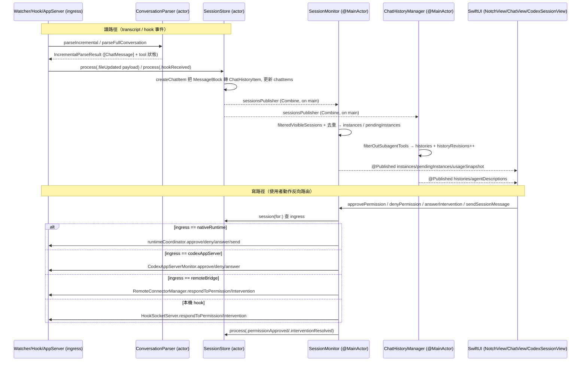
```mermaid
sequenceDiagram
    participant W as Watcher/Hook/AppServer (ingress)
    participant P as ConversationParser (actor)
    participant S as SessionStore (actor)
    participant M as SessionMonitor (@MainActor)
    participant H as ChatHistoryManager (@MainActor)
    participant U as SwiftUI (NotchView/ChatView/CodexSessionView)

    Note over W,S: 讀路徑（transcript / hook 事件）
    W->>P: parseIncremental / parseFullConversation
    P-->>W: IncrementalParseResult ([ChatMessage] + tool 狀態)
    W->>S: process(.fileUpdated payload) / process(.hookReceived)
    S->>S: createChatItem 把 MessageBlock 轉 ChatHistoryItem, 更新 chatItems
    S-->>M: sessionsPublisher (Combine, on main)
    S-->>H: sessionsPublisher (Combine, on main)
    M->>M: filteredVisibleSessions + 去重 → instances / pendingInstances
    H->>H: filterOutSubagentTools → histories + historyRevisions++
    M-->>U: @Published instances/pendingInstances/usageSnapshot
    H-->>U: @Published histories/agentDescriptions

    Note over U,W: 寫路徑（使用者動作反向路由）
    U->>M: approvePermission / denyPermission / answerIntervention / sendSessionMessage
    M->>S: session(for:) 查 ingress
    alt ingress == nativeRuntime
        M->>W: runtimeCoordinator.approve/deny/answer/send
    else ingress == codexAppServer
        M->>W: CodexAppServerMonitor.approve/deny/answer
    else ingress == remoteBridge
        M->>W: RemoteConnectorManager.respondToPermission/Intervention
    else 本機 hook
        M->>W: HookSocketServer.respondToPermission/Intervention
    end
    M->>S: process(.permissionApproved/.interventionResolved)
```

要點：`SessionMonitor` 與 `ChatHistoryManager` 是兩個各自訂閱同一個 `SessionStore.sessionsPublisher` 的橋接物件——前者負責「哪些 session 該顯示 / 需要注意」，後者負責「單一 session 的完整 chat 內容」。兩者都是 `@MainActor ObservableObject`，把 actor 化的 store 狀態轉成 SwiftUI 能觀察的 `@Published`。

---

### 資料契約 / 規則

#### `ChatMessage` 與相關中介型別（parser 產出，存進 store，未短截）

| 型別 | 欄位 | 說明 |
| --- | --- | --- |
| `ChatMessage` | `id: String`、`role: ChatRole`、`timestamp: Date`、`content: [MessageBlock]` | `Equatable` 只比 `id`；`textContent` 把所有 `.text` block 以換行接起。id 來源：Claude 用 `uuid`、OpenClaw/CodeBuddy 用該格式的 message id |
| `ChatRole` | `.user` / `.assistant` / `.system` | OpenClaw 未知 role 落到 `.system`；Claude/CodeBuddy 只接受 user/assistant |
| `MessageBlock` | `.text(String)` / `.toolUse(ToolUseBlock)` / `.thinking(String)` / `.interrupted` | `.interrupted` 是把 `[Request interrupted by user…]` 特別轉出的哨兵 block |
| `ToolUseBlock` | `id`、`name`、`input: [String:String]` | 非字串的 input value 會被序列化：Int/Bool 轉字串、可 JSON 化的物件轉 sorted-keys JSON 字串 |
| `ConversationInfo` | `summary`、`lastMessage`、`lastMessageRole`、`lastToolName`、`firstUserMessage`、`lastUserMessageDate` | 清單列輕量預覽；`lastMessage` / `firstUserMessage` 已被 `truncateMessage` 短截 |
| `ConversationParser.ToolResult` | `content`、`stdout`、`stderr`、`isError`、`isInterrupted` | `isInterrupted` 由 `isError` 且 content 含 "Interrupted by user" / "user doesn't want to proceed" 等字樣推得 |
| `IncrementalParseResult` | `newMessages`、`allMessages`、`completedToolIds`、`toolResults`、`structuredResults`、`clearDetected` | watcher 的回傳契約 |

`ChatHistoryManager` 端的顯示模型（由 `SessionStore` 把 `ChatMessage` 轉成）：`ChatHistoryItem`（`.user` / `.assistant` / `.toolCall` / `.thinking` / `.interrupted`）、`ToolCallItem`（帶 `status: ToolStatus`、`result`、`structuredResult`、`subagentTools`，並自帶 `inputPreview` / `statusDisplay` 計算屬性）、`SubagentToolCall`。

#### 解析規則

- **格式判定純看路徑**（`transcriptFormat(for:)`）：路徑含 `/.openclaw/agents/` → `.openClaw`；檔名是 `index.json` → `.codeBuddyHistory`；其餘一律 `.claudeLike`。不看檔案內容。
- **session 檔案路徑解析**（`sessionFilePath`）：有 `explicitFilePath` 就優先用（存在才用，否則試 OpenClaw 最新檔 fallback）；否則依 `cwd` 推出 project 目錄名（把 `/` 和 `.` 換成 `-`），依序試 `~/.qoder/...` → `~/.qoderwork/...` → `~/.claude/projects/...`，都沒有再試 OpenClaw 最新 session。
- **增量以 byte offset 為準**：`IncrementalParseState.lastFileOffset` 記住上次讀到哪；`fileSize < offset` 判定為檔案被截斷/重寫並整個重置狀態；`==` 表無新內容。`seenToolIds` / `toolIdToName` / `completedToolIds` / `toolResults` / `structuredResults` 都是跨增量累積、以 `tool_use_id` 為 key。
- **tool 結果關聯**：`tool_result` 行以 `tool_use_id` 對回先前的 `tool_use`；tool 名優先取行內 `toolName`，否則查 `toolIdToName`。結構化解析（`parseStructuredResult`）：`mcp__` 開頭拆出 server/tool 名走 `.mcp`；Read/Edit/Write/Bash/Grep/Glob/TodoWrite/Task/WebFetch/WebSearch/AskUserQuestion/BashOutput/KillShell/ExitPlanMode 各有專屬 parser；其餘 `.generic`。
- **文字清洗（parse 階段）**：所有 text/thinking block 過 `SessionTextSanitizer.sanitizedDisplayText`——用 regex 剝掉 `Conversation info (untrusted metadata)` / `Sender (untrusted metadata)` / `System: […] Node:` 樣板與 `<system-reminder>…</system-reminder>`，把換行/`\r` 收斂成單一空白、trim；清完為空回 `nil`（該 block 略過）。`isDisplayableText` 再濾掉 `<command-name>` / `<local-command` / `Caveat:` 開頭的行。
- **清單列短截（parse 階段）**：`truncateMessage` 只作用於 `ConversationInfo`（`firstUserMessage` 50 字、`lastMessage` 80 字），換行轉空白後超長補 `...`。這是清單預覽專用，與完整 chat 內容分開。

#### bounded display（render 階段）規則對照

| 函式 | 位置 | 行為 | 何時套用 |
| --- | --- | --- | --- |
| `SessionTextSanitizer.sanitizedDisplayText` | parser 內每個 text/thinking block | 剝樣板 + 收斂空白 + trim，**不限長度** | 解析時 |
| `ConversationParser.truncateMessage` | parser 內 `ConversationInfo` | 換行轉空白 + 50/80 字硬截 | 解析時，僅清單列預覽 |
| `SessionTextSanitizer.boundedDisplayText(_:maxCharacters:truncationNotice:)` | 只在 `ChatView.swift` / `CodexSessionView.swift`（`PingIsland/UI/`）呼叫 | 取前 `maxCharacters` 字 + 附上截斷提示（`SessionDetailDisplayStrings.truncationNoticeKey`） | **SwiftUI 渲染邊界** |

結論：store 內的 `ChatMessage` / `ChatHistoryItem` 保有完整文字（只做過 boilerplate 清洗），長內容的視覺短截延到 render 才發生，符合「完整資料留在 store、bounded 只在渲染邊界」的約束。

---

### 棘手分支 / 地雷

**ConversationParser**

- **CodeBuddy history 不走 byte-offset 增量**：`.codeBuddyHistory` 每次都整檔重讀 `index.json` 加上 `messages/<id>.json` 側車檔，用 message id 差集算 `newMessages`。時間戳是從 `requests[].startedAt` 加上 `index*0.001` 秒合成以維持排序，缺失時 fallback 到 `createdAt` / `updatedAt` / 檔案 mtime / `Date()`——時間戳不可信賴為精確值。
- **`/clear` 只在增量讀時通知 UI**：偵測到 `<command-name>/clear</command-name>` 一律清空增量狀態，但只有 `lastFileOffset > 0`（非首次全讀）才設 `clearPending`。`clearPending` 由 `checkAndConsumeClearDetected` 一次性消費，或透過 `IncrementalParseResult.clearDetected` 帶出。首讀時的歷史 `/clear` 不會誤觸發 UI 清空。
- **`[Request interrupted by user…]` 的雙重處理**：在 `parseContent`（清單列）會被排除不當成 lastMessage；在 `parseMessageLine`（完整訊息）會轉成 `.interrupted` block 而非 `.text`。兩處語意不同，改動要同步。
- **`parseSubagentTools` 有 async 與 nonisolated static sync 兩版**：`AgentFileWatcher` 在自己的 `DispatchQueue` 用 sync 版；兩版都是「先掃一輪 `tool_result` 收 `completedToolIds`，再掃 `tool_use`」的兩趟掃描。sync 版對非字串 input 的處理較簡（只認 String/Int/Bool，不做 JSON 序列化），與 async 版有細微落差。
- **hook-less 提問 fallback 的多格式脆弱點**：`pendingCodeBuddyCLIQuestionIntervention` 靠字串比對 `function_call` 型別 + 工具名正規化（去底線/連字號、小寫）比對 `codeBuddyQuestionToolNames`，並用 `completedCallIds` 判斷是否已回答；Qoder IDE 走的是純文字 `.txt`（`--- Request: … ---` 分段、找最後一個 `[Tool call] ask_user_question` 且其後無 `[Tool result]`）。這些都不是結構化解析，transcript 格式一變就會失準。
- **i18n 陷阱**：`codeBuddyQuestionToolNames`（`"askuserquestion"`、`"askfollowupquestion"`）是比對進來的英文工具名；而 `formatQuestionAnswerPayload` 產出的 `問題：` / `回答：` 是繁體輸出文案。前者是 matcher、後者是 value，勿混。
- **cache 只看 modDate**：`parse(...)` 的 `CachedInfo` 以 `modificationDate` 相等為命中。若外部工具改檔內容但保留 mtime（罕見）會讀到舊 cache。

**SessionMonitor**

- **四路 ingress 反向路由重複散落**：`approvePermission` / `denyPermission` / `answerIntervention` / `sendSessionMessage` 各自都要判 `session.ingress`（nativeRuntime / codexAppServer / remoteBridge / 本機 hook）再選對應通道。新增 ingress 要逐一補齊，否則某條動作路徑會靜默失效。
- **answer 編碼策略依 client 而異**（`answerEncodingStrategy`）：Qoder/CodeBuddy IDE 用 `lookupAliases`（同時塞 id/question/index 三種 key）、CodeBuddy CLI 額外加 `q_<index>`、Qwen 用 `questionIndex`、其餘（含 Qoder CLI）用 `questionText`。answer key 格式錯了對面 agent 收不到。
- **auto-approve / auto-answer 的前置條件很窄**：`shouldAutoApproveClaudePermission` 只在 Claude + `PermissionRequest` + `waiting_for_approval` + `session.autoApprovePermissions` + client 為 claudeCode 或 Qwen 時成立；`defaultQoderAutoAnswer` 只在 answers 數量剛好等於 `resolvedQuestions` 數量時才送。條件不滿足就落回一般 UI 流程。
- **`PostToolUse` 會取消待決 permission**：若工具已在終端機外部核准並完成，`handleIncomingHookEvent` 會 cancel Island 端待決 permission 並 `permissionApproved`，避免殘留幽靈提問。
- **transcript watch 開關的 provider/phase gating**（`shouldWatchTranscript`）：`remoteBridge` 一律不開本機 watcher；Claude 只在 `phase == .processing` 且非 OpenClaw gateway client 時開；Codex 僅 `hookBridge` ingress、且依事件名/phase 判定。改 phase 語意會連帶影響中斷偵測是否啟動。
- **Codex answer 三層 fallback**：`CodexAppServerMonitor.answer` → 失敗再試 `submitRequestUserInputOutput`（rollout `request_user_input`）→ 再失敗才放棄。`loadCodexThread` 亦有「app-server 空/錯 → `CodexRolloutParser` fallback」的雙路。
- **可見性去重**：`deduplicateSameProjectClaudeSessions` 以 `provider:cwd:terminal` 為 key 只留 `lastActivity` 最新的 Claude session（解決 resume/restart 時並發 hook 造成的重複）；`filteredVisibleSessions` 另處理 idle 隱藏（feed 模式下有未讀會回顯）、subagent 顯示模式、Codex/OpenCode placeholder 去重。
- **用量刷新在 XCTest 下停用**、且 Claude 走 `minRefreshInterval` cache-age 節流、Codex 讀檔；`refreshUsageState` 用 detached task，`AppSettings.showUsage` 關閉時直接取消。

**Watcher 群**

- `JSONLInterruptWatcher` 用 `DispatchSource` 監檔案 fd；檔案還沒出現時以指數退避重試（250ms→5s 上限）。`isInterruptLine` 是**在解析前**對原始 JSON 行做字串比對（`"is_error":true` + interrupt 字樣、`[Request interrupted by user]`、`"interrupted":true`），求快。偵測到中斷後 `didDetectInterrupt` → `.interruptDetected` 並立刻 `stopWatching`（一次性）。每次檔案變動另發 `didObserveFileChange` → `requestFileSync`。
- `ClaudeDesktopWatcher` 是獨立 actor，輪詢 `audit.jsonl`（750ms）。註冊時會先把 parser offset 推進到 EOF（`resetState` + 一次 `parseIncremental`），避免把歷史內容當新訊息重播；並掃 `type:"result"` 判定 AI turn 完成（`.desktopTurnCompleted`）。開機時略過閒置超過 4 小時的 session；metadata `isArchived` → `.sessionEnded`。
- `AgentFileWatcher` 監 `agent-<id>.jsonl`，每次變動用 sync 版 `parseSubagentTools` 重算，經 `AgentFileWatcherBridge` 發 `.agentFileUpdated`。以 `seenToolIds` 數量與內容變化判斷是否需回報，避免無謂 UI 更新。

---

### 與其他子系統的邊界

- **↔ `SessionStore`（actor，`Services/State`）**：本子系統的中樞邊界。讀路徑上 watcher 把 `IncrementalParseResult` 包成 `FileUpdatePayload` 交 `SessionStore.process(.fileUpdated)`；`SessionStore.createChatItem` 才把 `MessageBlock` 轉成 `ChatHistoryItem` 並寫進 `session.chatItems`（parser 不直接產 `ChatHistoryItem`）。`SessionStore` 也會回頭呼叫 `ConversationParser.parse` / `parseSubagentTools` / 各 fallback intervention 方法。`SessionMonitor` 與 `ChatHistoryManager` 則透過 `sessionsPublisher` 單向接收 store 狀態。
- **↔ UI（`PingIsland/UI/`）**：`SessionMonitor.instances` / `pendingInstances` / usage 快照供 `NotchView` 等；`ChatHistoryManager.histories` / `historyRevisions` 供 `ChatView`。長文字的 `boundedDisplayText` 短截**只**發生在 `ChatView` / `CodexSessionView`，不在本子系統。
- **↔ Codex 子系統（`Services/Codex`）**：`SessionMonitor` 的 Codex 相關動作（`loadCodexThread` / `continueCodexThread` / answer）委派給 `CodexAppServerMonitor`，並在 app-server 無資料時 fallback 到 `CodexRolloutParser`（再把快照 `syncCodexThreadSnapshot` 回 store）。`ConversationParser` 本身不解析 Codex rollout——那是 Codex 子系統的 `CodexRolloutParser` 職責，兩者互不重疊。
- **↔ Hook / Remote ingress（`Services/Hooks`、`Services/Remote`）**：`handleIncomingHookEvent` 是 hook 事件進入 store 前的閘門（native 判定、auto-approve/answer、watcher 開關）；反向動作依 ingress 分派給 `HookSocketServer` 或 `RemoteConnectorManager`。
- **↔ Native runtime（`Services/Runtime`）**：`ingress == .nativeRuntime` 的 session 全數委派給 `runtimeCoordinator`（`RuntimeCoordinating`），與 hook/app-server 流程隔離。
- **↔ `SessionTextSanitizer`（`Utilities`）**：parser 依賴其 `sanitizedDisplayText` 做 boilerplate 清洗；`boundedDisplayText` 則屬 UI 邊界，本子系統不呼叫。

---

## §08 Codex 接入

**檔案:**

- `PingIsland/Services/Codex/CodexAppServerMonitor.swift`（1653 行，`actor`，本子系統主體）
- `PingIsland/Services/Codex/CodexRolloutParser.swift`（767 行，`actor`，無 app-server 時的 rollout log 解析）
- `PingIsland/Services/Codex/CodexThreadSnapshot.swift`（89 行，兩條 ingress 共用的資料載體 `struct`）
- 接點（略讀，主體交 UI agent）：`PingIsland/UI/Views/CodexSessionView.swift`
- 邊界佐證（非本範圍，只查證接點）：`PingIsland/Services/Session/SessionMonitor.swift`、`PingIsland/Services/State/SessionStore.swift`、`PingIsland/Services/Usage/CodexUsage.swift`、`Prototype/Sources/IslandBridge/main.swift`

**責任:** 把 Codex（OpenAI Codex 桌面 app 與 Codex CLI）的 session 狀態、對話歷史、審批/提問請求標準化成 `CodexThreadSnapshot` / `upsertCodexSession` 呼叫，餵進 `SessionStore`。優先走本機 `codex app-server` 的 WebSocket JSON-RPC；app-server 不可用或該 thread 尚未在 app-server 中具現時，退回解析本機 rollout log 檔。

**關鍵型別與進入點:**

- `CodexAppServerMonitor`（`actor`，`static let shared`）→ app-server WebSocket 監控主體。
  - `start()` → 啟動流程：已連線則只確保刷新迴圈；否則先試連既有 server，再 spawn `codex app-server` process，重試連線。
  - `connectToServer()` / `receiveLoop()` / `handle(_:)` → WebSocket 收訊迴圈與訊息分派。
  - `handleNotification(method:params:)` → 處理 server push 通知（thread 生命週期、狀態變更）。
  - `handleServerRequest(id:method:params:)` → 處理 server 主動發起的審批/提問請求（`item/*/requestApproval`、`item/tool/requestUserInput`）。
  - `ingestThread(_:)` / `parseThreadSnapshot(_:)` → 把 app-server 的 thread dict 轉成 phase / snapshot 並上拋 `SessionStore`。
  - `approve/deny/answer/submitRequestUserInputOutput` → UI 端的審批回應，經 `sendResponse` 回填 JSON-RPC。
  - `readThread(threadId:includeTurns:)` → 被 `SessionStore` 拉取完整 thread（供 rollout fallback 判斷是否需要退回）。
  - `startThread/resumeThread/continueThread/archiveThread` → 主動操作 thread。
  - `diagnosticsSnapshot()` → 給 `DiagnosticsExporter` 匯出。
- `CodexRolloutParser`（`actor`，`static let shared`）→ rollout log 解析器。
  - `parseThread(threadId:fallbackCwd:clientInfo:)` → 對外進入點；解析檔案並以「檔路徑 + 修改時間」快取。
  - `parseRollout(...)` → 逐行 JSONL 解析主體。
  - `resolveRolloutURL(threadId:clientInfo:)` → 決定要讀哪個 rollout 檔。
- `CodexThreadSnapshot`（`struct: Equatable, Sendable`）→ 兩條 ingress 共用的輸出載體，含衍生欄位 `isSubagent`、`displayResultText`、`hasCompletedAssistantReply`。

**核心流程:**

兩路 ingress 在 `SessionStore` 匯流，再經 `SessionMonitor` 供 `CodexSessionView` 顯示與回應。

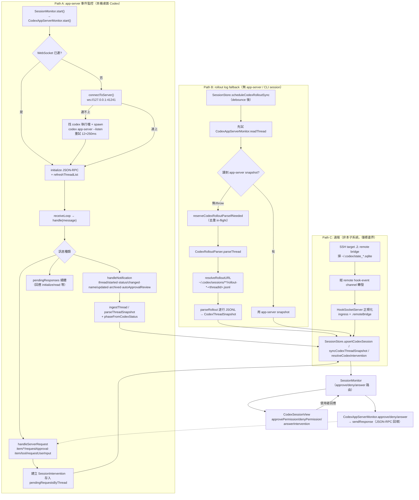
```mermaid
flowchart TD
    subgraph A["Path A: app-server 事件監控（本機桌面 Codex）"]
        A1["SessionMonitor.start()<br/>→ CodexAppServerMonitor.start()"]
        A2{"WebSocket 已連?"}
        A3["connectToServer()<br/>ws://127.0.0.1:41241"]
        A4["找 codex 執行檔 + spawn<br/>codex app-server --listen<br/>重試 12×250ms"]
        A5["initialize JSON-RPC<br/>+ refreshThreadList"]
        A6["receiveLoop → handle(message)"]
        A7{"訊息種類"}
        A8["handleNotification<br/>thread/started·status/changed·<br/>name/updated·archived·autoApprovalReview"]
        A9["handleServerRequest<br/>item/*/requestApproval·<br/>item/tool/requestUserInput"]
        A10["pendingResponses 續體<br/>（回應 initialize/read 等）"]
        A11["ingestThread / parseThreadSnapshot<br/>+ phaseFromCodexStatus"]
        A12["建立 SessionIntervention<br/>存入 pendingRequestsByThread"]
        A1 --> A2
        A2 -- 是 --> A5
        A2 -- 否 --> A3
        A3 -- 連不上 --> A4 --> A5
        A3 -- 連上 --> A5
        A5 --> A6 --> A7
        A7 --> A8 --> A11
        A7 --> A9 --> A12
        A7 --> A10
    end

    subgraph B["Path B: rollout log fallback（無 app-server / CLI session）"]
        B1["SessionStore.scheduleCodexRolloutSync<br/>（debounce 後）"]
        B2["先試 CodexAppServerMonitor.readThread"]
        B3{"讀到 app-server snapshot?"}
        B4["reserveCodexRolloutParseIfNeeded<br/>（去重 in-flight）"]
        B5["CodexRolloutParser.parseThread"]
        B6["resolveRolloutURL<br/>~/.codex/sessions/**/rollout-*-&lt;threadId&gt;.jsonl"]
        B7["parseRollout 逐行 JSONL<br/>→ CodexThreadSnapshot"]
        B1 --> B2 --> B3
        B3 -- 有 --> BX["用 app-server snapshot"]
        B3 -- 無/throw --> B4 --> B5 --> B6 --> B7
    end

    A11 --> S["SessionStore.upsertCodexSession /<br/>syncCodexThreadSnapshot /<br/>resolveCodexIntervention"]
    A12 --> S
    B7 --> S
    BX --> S
    S --> SM["SessionMonitor<br/>（approve/deny/answer 路由）"]
    SM --> UI["CodexSessionView<br/>approvePermission/denyPermission/<br/>answerIntervention"]
    UI -- 使用者回應 --> SM
    SM --> RESP["CodexAppServerMonitor.approve/deny/answer<br/>→ sendResponse（JSON-RPC 回填）"]
    RESP -.-> A9

    subgraph R["Path C: 遠端（非本子系統，僅標邊界）"]
        R1["SSH target 上 remote bridge<br/>掃 ~/.codex/state_*.sqlite"]
        R2["經 remote hook-event channel 轉發"]
        R3["HookSocketServer 正規化<br/>ingress = .remoteBridge"]
        R1 --> R2 --> R3 --> S
    end
```

**資料契約 / 規則:**

app-server 走本機 WebSocket JSON-RPC，port 固定 `41241`（`ws://127.0.0.1:41241`），單一訊息上限 32 MB。`start()` 若找不到既有 server，會用 `resolveCodexExecutable()` 找到的 codex 執行檔（優先 `/Applications/Codex.app/Contents/Resources/codex`，否則 PATH）spawn `codex app-server --listen ...`，然後最多重試連線 12 次、每次間隔 250ms。連上後送 `initialize`（clientInfo name = "Island"）並拉一次 thread list。

rollout fallback 讀的是本機 JSONL 檔。`resolveRolloutURL` 先用 `clientInfo.sessionFilePath`（若存在），否則走訪 `~/.codex/sessions/` 找檔名符合 `rollout-*` 前綴、`.jsonl` 副檔、且以 `-<threadId>.jsonl` 結尾的檔。`parseThread` 以「檔路徑 → (修改時間, snapshot)」做快取；修改時間未變就直接回傳快取，避免重複解析。

`parseRollout` 逐行 `split("\n")` → 每行 JSON decode → 依 top-level `type` 分派：

| top-level `type` | 進一步分支（`payload.type`） | 用途 |
| --- | --- | --- |
| `session_meta` | — | session 中繼資料 |
| `turn_context` | — | 取 `turn_id`、`cwd` |
| `event_msg` | `user_message` / `agent_message` / `task_started` / `task_complete` / `context_compacted` / `turn_aborted` | 對話訊息與 turn 生命週期，組 `historyItems` |
| `response_item` | `function_call` / `custom_tool_call` / `web_search_call` / `function_call_output` / `custom_tool_call_output` | 工具呼叫與其輸出 |

`CodexThreadSnapshot` 欄位（兩條 ingress 共用）：

| 欄位 | 型別 | 說明 |
| --- | --- | --- |
| `threadId` | `String` | Codex thread id，即 PingIsland 的 sessionId |
| `name` / `preview` | `String?` | 顯示名稱 / 預覽 |
| `cwd` | `String` | 工作目錄 |
| `parentThreadId` / `subagentDepth` / `subagentNickname` / `subagentRole` | `String?` / `Int?` / `String?` / `String?` | subagent 中繼資料；`isSubagent` 由前兩者衍生 |
| `clientInfo` | `SessionClientInfo?` | 來源客戶端（desktop app / CLI）辨識 |
| `intervention` | `SessionIntervention?` | 待處理的審批或提問 |
| `createdAt` / `updatedAt` | `Date` | 生命週期時間 |
| `phase` | `SessionPhase` | 由 `phaseFromCodexStatus` 映射 |
| `historyItems` | `[ChatHistoryItem]` | 對話歷史 |
| `conversationInfo` | `ConversationInfo` | 最後訊息 / 角色等彙總 |
| `latestTurnId` / `latestResponseText` / `latestResponsePhase` / `latestUserText` | `String?` | 最新 turn 與訊息 |
| `isTurnInterrupted` | `Bool` | 當前 turn 是否被中斷 |

審批/提問（app-server 的 server-request）映射規則：`item/commandExecution/requestApproval` → `SessionIntervention(kind: .approval, "Approve Command")`，`supportsSessionScope: true`，session phase 設為 `.waitingForApproval`；`item/fileChange/requestApproval`、`item/permissions/requestApproval` 同屬 approval 類；`item/tool/requestUserInput` → `kind: .question`（"Codex Needs Input"），`supportsSessionScope: false`，phase 設為 `.waitingForInput`。每個待處理請求都存進 `pendingRequestsByThread[threadId]`（含原始 JSON-RPC `requestId`），使用者回應時才能 `sendResponse` 回填正確 id。

Codex quota / rate-limit **不在本子系統**：本目錄三檔沒有任何 `quota`/`rate_limit`/`token_count` 讀取邏輯（已 grep 確認）。Codex 用量摘要由 `PingIsland/Services/Usage/CodexUsage.swift` 負責，屬 Usage 子系統。

**棘手分支 / 地雷:**

- **app-server vs rollout 的切換點在 `SessionStore.scheduleCodexRolloutSync`，不在本目錄。** 順序是：debounce 後先 `try CodexAppServerMonitor.readThread`，`catch` 到（app-server 不可用或 thread 尚未具現）才退回 `CodexRolloutParser.parseThread`。所以 rollout parser 是「app-server 拿不到」時的第二選擇，也是 Codex CLI（無桌面 app-server thread）session 的資料來源。
- **rollout 解析競態靠 `reserveCodexRolloutParseIfNeeded` + `codexRolloutParsesInFlight` 去重。** 同一 sessionId 已有解析在跑就跳過；`hasAppServerSnapshot` 為真時也不必再 parse。改動這段要連 `SessionStore` 一起看，本目錄無法獨立防競態。
- **auto-approve 短路（WebSocket 路徑專屬）：** `handleServerRequest` 收到 command/file/permissions 審批時，先呼叫 `isAutoApproveThread(threadId)`；若該 thread 的 approval policy 為 `"never"`，直接 `sendResponse(result: ["decision": "accept"])` 並 return，**不會**產生 intervention、也不會在 Island 上跳審批。判斷來源有二：(1) `threadApprovalModes` 記憶體快取（`ingestThread` 從 app-server thread dict 的 `approvalMode`/`approval_mode` 帶入）；(2) fallback 讀 `~/.codex/.codex-global-state.json` 的 `electron-persisted-atom-state.heartbeat-thread-permissions-by-id[threadId].approvalPolicy`。
- **CLI-only session（如 agentloop）不在 global-state 檔裡**，其審批策略改由 hook payload 的 `permission_mode=bypassPermissions`（對應 `HookEvent.codexBypassPermissions`）表達 —— 這條路徑不經本 actor，改在 hook ingress 端處理。混淆這兩條路徑會導致「該跳審批卻被靜默 accept」或反之。
- **process 生命週期：** `stop()` 會 terminate 掉自己 spawn 的 `codex app-server`、取消 receive/refresh task、並以 `CancellationError` resume 所有 `pendingResponses` 續體。若外部已有 app-server 在跑，`start()` 只連不 spawn，`stop()` 仍會嘗試 terminate（`process?` 為 nil 時無副作用）。
- **輔助 thread 過濾：** `ingestThread` 先過 `shouldIgnoreAuxiliaryThread`，符合就移除 diagnostics 並 return，不進 `SessionStore`。

**與其他子系統的邊界:**

- **SessionStore（狀態中樞）：** 上行只透過 `upsertCodexSession`（app-server 的 ingest / 各 approval handler / continueThread）、`syncCodexThreadSnapshot`（readThread / rollout fallback）、`updateCodexThreadName`、`resolveCodexIntervention`、`process(.sessionEnded)` 這幾個入口，不直接改 session 狀態。反向：`SessionStore.scheduleCodexRolloutSync` 是 rollout fallback 的觸發者，並持有 `readThread` 呼叫。
- **SessionMonitor（UI 橋接 / 生命週期）：** `SessionMonitor.start()/stop()` 啟停本 monitor（`CodexAppServerMonitor.shared.start/stop`）；使用者審批/提問經 `SessionMonitor` 路由到 `approve/deny/answer/submitRequestUserInputOutput`；`SessionMonitor.loadCodexRolloutFallback` 也會直接呼叫 `CodexRolloutParser.parseThread`（以 `ingress: .hookBridge` sync）。
- **CodexSessionView（UI，非本範圍）：** 只透過 `sessionMonitor.approvePermission / denyPermission / answerIntervention` 互動，不直接碰本 actor；審批 UI 的 phase（`.waitingForApproval` / `.waitingForInput`）與 intervention 由本子系統產生。
- **Remote（遠端轉發）：** 遠端 SSH target 的 Codex 活動由 **remote bridge**（`Prototype/Sources/IslandBridge/main.swift:1351`，掃 `~/.codex/state_*.sqlite`）在對端讀取、經既有 remote hook-event channel 轉發，到 Swift 端由 `HookSocketServer` 正規化成 `ingress = .remoteBridge` 的 envelope 進 `SessionStore`。**本目錄不讀 sqlite**、也不參與遠端路徑；rollout parser 讀的是本機 `~/.codex/sessions`，對遠端 thread 無效。
- **Usage（用量）：** Codex quota 由 `Services/Usage/CodexUsage.swift` 讀取，與本子系統分離。
- **Runtime scaffold：** `PingIsland/Services/Runtime/Codex/CodexRuntime.swift` 以 `monitor: CodexAppServerMonitor = .shared` 注入包裹本 monitor，屬 feature-flag 隔離的原生 runtime 實驗路徑。
- **Diagnostics：** `DiagnosticsExporter` 透過 `diagnosticsSnapshot()` 匯出 thread 診斷資料。

---

## §09 Usage 與 Remote

這份文件涵蓋兩個相關但獨立的子系統：`PingIsland/Services/Usage/`(用量/配額)與 `PingIsland/Services/Remote/`(遠端 SSH 轉發)。兩者都被 `SessionMonitor` 與 `SessionStore` 拉線；Usage 產生 UI 的即時配額條與歷史花費儀表板，Remote 把一台 SSH 目標機上的 agent hook 事件橋接回本機。

---

### Usage(用量/配額)

#### 檔案與責任

`Services/Usage/` 8 個檔實際上是**兩條互不相干的資料線**，共用一個資料夾：

| 檔案 | 資料線 | 責任 |
|------|--------|------|
| `ClaudeUsage.swift` | 即時配額 | `ClaudeUsageLoader` 讀 Claude Code status-line 快取檔 `/tmp/island-rate-limits.json`，解析 `five_hour` / `seven_day` 兩個 window 的 `used_percentage`(或 `utilization`)與 `resets_at`;`snapshot(fromPayload:)` 供 OAuth API 回應複用同一套解析 |
| `ClaudeUsageAPIClient.swift` | 即時配額 | `fetch()` 打 `GET https://api.anthropic.com/api/oauth/usage`,Bearer token 從 login keychain item `Claude Code-credentials`(JSON blob `claudeAiOauth.accessToken`)取出;帶 `anthropic-beta: oauth-2025-04-20`;節流 `minRefreshInterval = 180s`;任何失敗一律回 `nil` |
| `CodexUsage.swift` | 即時配額 | `CodexUsageLoader` 掃 `~/.codex/sessions/` 下 `rollout-*.jsonl`,取 Codex rollout log 尾端的 `token_count` + `rate_limits` 事件,解析 `primary` / `secondary` 兩個 window;含 process 級 `NSLock` 指紋快取 |
| `ClaudeTranscriptUsage.swift` | 歷史花費 | `ClaudeTranscriptUsageLoader.load(from:)` 掃單一 Claude 家族 transcript `.jsonl`(≤64MB),把逐行 usage 加總成 `AgentUsageTokenTotals` 與 per-model map,附 FNV-1a hash、fileSize、最新 timestamp |
| `AgentUsageModelPricing.swift` | 歷史花費 | per-model 官方牌價表(USD/百萬 token);`normalizedKey()` 把 raw model id 正規化成穩定 key(保留版本、去掉日期尾綴);`pricing()` / `displayName()` / `estimateUSD(perModel:)` |
| `AgentUsageAnalytics.swift` | 歷史花費 | 核心。所有 domain model + `AgentUsageStore` actor(record*、delta 記帳、儀表板/診斷 snapshot、debounce 存檔、保留期 prune) |
| `UsageSnapshotCacheStore.swift` | 即時配額 | 把 `ClaudeUsageSnapshot` / `CodexUsageSnapshot` 以 JSON 存到 `~/.ping-island/cache/{claude,codex}-usage.json` |
| `UsageSummaryPresenter.swift` | 即時配額 | 純函式,把 Claude/Codex snapshot 轉成 `[UsageSummaryProvider]`(給 UI 的配額條),算 value/reset 文案、severity、過期 window 過濾 |

#### 關鍵型別

- **即時配額**:`ClaudeUsageSnapshot`(fiveHour/sevenDay/cachedAt)、`CodexUsageSnapshot`(windows + tokenUsage + model + threadID)、`UsageSummaryProvider` / `UsageSummaryWindow`(id/label/valueText/resetText/severity/remainingPercentage)、`UsageSummarySeverity`。
- **歷史花費**:`AgentUsageTokenTotals`(input/cacheCreation/cacheRead/output)、`AgentUsageDailyBucket`(每日一桶:sessionIDsByAgent/toolCounts/tokenTotals/tokenTotalsByModel/activityCount)、`AgentUsageDocument`(buckets + seenToolEventIDs + tokenBaselines + codexTokenBaselines,schemaVersion 2)、`AgentUsageStore`(actor 單例)、`AgentUsageDashboardSnapshot`、`AgentUsageTokenPricing`。

#### 核心流程:即時配額 summary 的來源與匯總

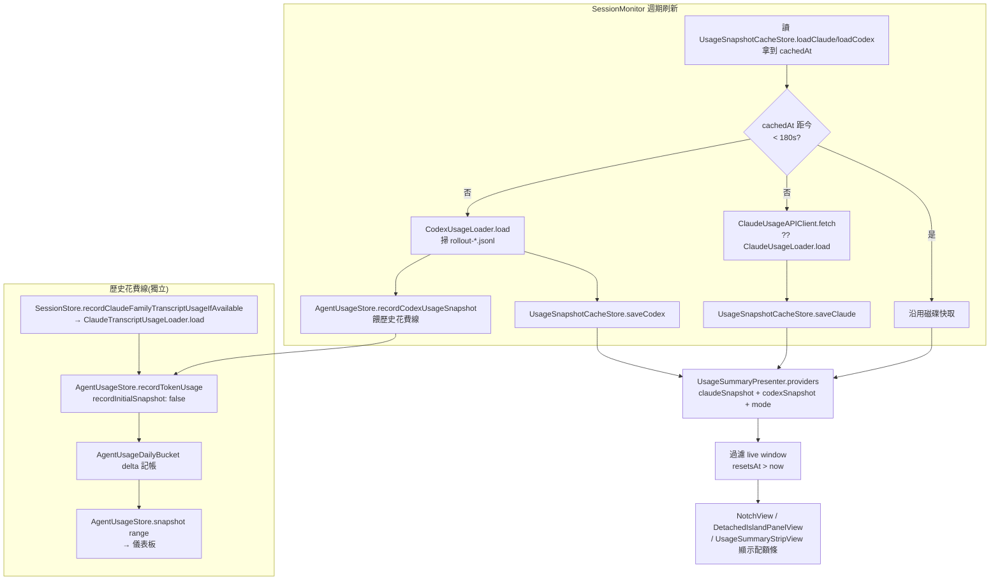
```mermaid
flowchart TD
    subgraph refresh["SessionMonitor 週期刷新"]
        A[讀 UsageSnapshotCacheStore.loadClaude/loadCodex<br/>拿到 cachedAt] --> B{cachedAt 距今<br/>< 180s?}
        B -- 是 --> C[沿用磁碟快取]
        B -- 否 --> D[ClaudeUsageAPIClient.fetch<br/>?? ClaudeUsageLoader.load]
        B -- 否 --> E[CodexUsageLoader.load<br/>掃 rollout-*.jsonl]
        D --> F[UsageSnapshotCacheStore.saveClaude]
        E --> G[UsageSnapshotCacheStore.saveCodex]
        E --> H[AgentUsageStore.recordCodexUsageSnapshot<br/>餵歷史花費線]
    end
    C --> P
    F --> P
    G --> P
    P[UsageSummaryPresenter.providers<br/>claudeSnapshot + codexSnapshot + mode] --> Q[過濾 live window<br/>resetsAt &gt; now]
    Q --> R[NotchView / DetachedIslandPanelView<br/>/ UsageSummaryStripView 顯示配額條]

    subgraph analytics["歷史花費線(獨立)"]
        T[SessionStore.recordClaudeFamilyTranscriptUsageIfAvailable<br/>→ ClaudeTranscriptUsageLoader.load] --> U[AgentUsageStore.recordTokenUsage<br/>recordInitialSnapshot: false]
        H --> U
        U --> V[AgentUsageDailyBucket delta 記帳]
        V --> W[AgentUsageStore.snapshot range<br/>→ 儀表板]
    end
```

Claude 的即時配額**沒有可讀檔案**(不像 Codex 有 rollout log),所以優先打 OAuth API,失敗才退回 status-line 快取檔 `/tmp/island-rate-limits.json`;兩者共用 `ClaudeUsageLoader.usageWindow`。Codex 則永遠從 rollout log 尾端解析。

#### 資料契約:即時配額來源欄位

| 來源 | 檔案/端點 | 取用欄位 | 產出 |
|------|-----------|----------|------|
| Claude status-line 快取 | `/tmp/island-rate-limits.json` | `five_hour` / `seven_day` → `used_percentage` \|\| `utilization`,`resets_at`(epoch 秒或 ISO8601) | `ClaudeUsageWindow` |
| Claude OAuth API | `GET /api/oauth/usage` | 同上(回應 body 直接餵 `snapshot(fromPayload:)`) | `ClaudeUsageSnapshot` |
| Codex rollout log | `~/.codex/sessions/rollout-*.jsonl` | `event_msg` → `payload.type == token_count`,`rate_limits.{primary,secondary}.{used_percent, window_minutes, resets_at}`,`plan_type` / `limit_id`,`info.total_token_usage`,最後一筆 `turn_context.payload.model` | `CodexUsageWindow` / `CodexUsageSnapshot` |

#### 配額計算(散文 + 規則)

- **remaining** = `max(0, 100 - usedPercentage)`。
- **severity**(`severity(forUsedPercentage:)`):remaining > 30 → `.healthy`;10 ≤ remaining ≤ 30 → `.warning`;< 10 → `.critical`。
- **valueText**:`.used` mode 顯示 `"N%"`;`.remaining` mode 顯示 `"N% left"`(或中文 `"N% 剩餘"`)。
- **resetText**:把 `resetsAt - now` 格式成 `"Xd Yh"` / `"Xh Ym"` / `"<1m"`,中文為 `"… 後重設"`。
- **Codex label**:由 `window_minutes` 推 `"5h"` / `"7d"` 等(`windowLabel(forMinutes:)`)。
- **7 日 window 判定**:`isSevenDayWindowLabel` 認 `"7d"` 開頭,`preferredBatteryWindow` 優先取它、否則取最後一個 window。

#### 資料契約:token 花費計算(歷史線)

`AgentUsageTokenTotals` 四欄語意與計價:

| 欄位 | 語意 | 計價倍率(相對 input 牌價) |
|------|------|-----------------------------|
| `input` | 新鮮輸入 | 1.0x |
| `cacheCreation` | cache 寫入 | 1.25x |
| `cacheRead` | cache 重讀(每輪重複讀同一段) | 0.1x |
| `output` | 輸出 | 用 output 牌價 |

- `resolvedTotal = input + cacheCreation + output`(**刻意排除 `cacheRead`**)。
- 成本 = `estimateUSD(for:)`:每欄 `tokens/1_000_000 * rate`,加總。
- **per-bucket 成本**(`bucketCost`):`tokenTotalsByModel` 各 model 用官方牌價,剩餘量(bucket 總量減去 per-model 加總)用 blended 牌價(`inputUSDPerMillion=2.375, outputUSDPerMillion=14.50`)。牌價查不到的 model 也退 blended。
- **Codex token 換算**(`CodexTokenUsage.totals`):`input = inputTokens - cachedInputTokens`、`cacheRead = cachedInputTokens`、`cacheCreation = 0`(OpenAI 無 cache 寫入加價)。

#### 棘手分支 / 地雷

- **`cacheRead` 排除**:folding cache_read 進 input 會把總量灌到數十億;`resolvedTotal` 與計價都排除它,只按 0.1x 計價(檔內註解與 fable5 系列 bug 都圍繞這點)。
- **schema v2 硬重置**:`AgentUsageDocument` decode 時若磁碟 version < 2,整份 buckets/baselines 直接清空(舊資料把 cache_read 算進 input,污染無法遷移)。無 schemaVersion bump 時靠各 struct 的 tolerant decode(缺欄位補 0 / 空 map)。
- **baseline delta 記帳三分支**(`recordTokenUsage`):(1) 有非空 baseline 且未 reset → 逐 model 算增量,baseline 缺的 model 全額計(半途出現的 subagent model);(2) 空 map/nil baseline 且 `recordInitialSnapshot == true` → 全額計;(3) `recordInitialSnapshot == false` → 只 seed baseline 不計數。三者**不可合併**。
- **reset 偵測**:`didTokenSourceReset` 只看 `currentFileSize < previousFileSize`(檔案被截斷/重寫)。
- **Codex model key 穩定性**:一條 Codex thread 綁一個 model,但某次掃描可能漏掉 `turn_context`(model == nil)。此時**復用 baseline 唯一的既有 key**,避免 key 在 nil↔model 間跳動導致重複計數;只有連 baseline 都沒有才退 `"unknown"`。
- **transcript 首見不灌歷史**:`recordClaudeFamilyTranscriptUsageIfAvailable` 用 `recordInitialSnapshot: false`,只計 app 開始監看後的增量,避免首次看到既有 session 就把累積量(多是 cache_read)一次灌進「今天」。
- **live window 過濾**:`UsageSummaryPresenter` 丟掉 `resetsAt <= now` 的 window(配額已重設,快取百分比是過期值);若某 provider 全部 window 過期,整個 provider 隱藏。
- **CodexUsageLoader 快取**:process 級 `nonisolated(unsafe)` + `NSLock`,指紋 = root 路徑 + 掃描上限 + 每檔上限 + 各候選檔(路徑|mtime|size)。只掃 mtime 最新的 24 個檔,每檔只讀尾端 ≤4MB。

#### 邊界

- `Usage/` 全是 `nonisolated` 純函式或 actor(`AgentUsageStore`)/獨立 loader,不直接呼叫 localization API(遵守 CLAUDE.md 的 localization 邊界);`AgentUsageModelPricing.displayName` 對 unknown 回 Simplified localization key 讓 UI 端 render。
- `AgentUsageStore` 存檔 debounce 500ms(`scheduleSave`),`flush()` 立即寫;保留 180 天(`pruneDocument`),`seenToolEventIDs` 超過 50k 清空。
- 磁碟位置:即時配額快取在 `~/.ping-island/cache/`;歷史文件在 `~/.ping-island/usage/agent-usage.json`。

---

### Remote(遠端 SSH 轉發)

#### 檔案與責任

| 檔案 | 責任 |
|------|------|
| `RemoteConnectorManager.swift` | `@MainActor` `ObservableObject` 單例,遠端子系統的全部邏輯。除了 manager 本身,同檔還私有承載:`RemoteAttachConnector`(attach SSH 長連線 + 換行分隔 JSON 收發)、`RemoteSSHCommandRunner`(SSH/SCP 執行、probe、遠端檔案讀寫)、`RemoteBridgeAssetResolver`(macOS 用本機 bridge / Linux 下載)、`RemotePendingRequestStore`、`RemoteEndpointCredentialStore`(keychain 密碼) |
| `RemoteModels.swift` | 純資料:`RemoteSSHLink`(解析 user@host:port)、`RemoteEndpoint`(持久化設定 + 預設 `~/.ping-island` 路徑)、`RemoteEndpointRuntimeState` / `…ConnectionPhase` / `…AuthMode`、`RemoteHostProbe`、`RemoteHookEventPayload` / `RemoteHookClientInfoPayload`、`RemoteDaemonHello`、`RemoteDecisionMessage`、`RemoteJSONValue` |

#### 關鍵型別

- `RemoteEndpoint`:持久化到 `UserDefaults["RemoteConnectorManager.endpoints.v1"]`,存 SSH target、偵測到的 username/hostname/homeDirectory/fingerprint、遠端安裝路徑三件、`agentVersion` / `lastConnectedAt` / `lastBootstrapAt`。
- `RemoteAttachConnector`:包一個常駐 `ssh … --mode remote-agent-attach` process,stdout 收 line-delimited JSON、stdin 送 decision。
- `RemoteInboundMessage`:`.hello(RemoteDaemonHello)` / `.hookEvent(RemoteHookEventMessage)` 兩種。
- `RemoteEndpointCredentialSource`:`none` / `userInput` / `memory` / `keychain`,決定失敗後是否清密碼、是否要求重輸。

#### 核心流程:connect / bootstrap / attach / 雙向轉發

```mermaid
sequenceDiagram
    participant U as UI (RemoteSettingsView)
    participant M as RemoteConnectorManager<br/>(本機 @MainActor)
    participant SSH as RemoteSSHCommandRunner<br/>(/usr/bin/ssh · scp)
    participant R as SSH 目標機<br/>(PingIslandBridge)

    U->>M: connect(endpointID, password, forceBootstrap)
    M->>M: resolvedCredential(userInput/memory/keychain/none)
    M->>SSH: probe (uname -s/-m; $USER/$HOSTNAME/$HOME; claude/tmux?)
    SSH->>R: ssh 執行 probe 指令
    R-->>SSH: os/arch/home/…
    SSH-->>M: RemoteHostProbe
    M->>M: applyProbe(展開 ~/ 路徑, 設 authMode)
    alt shouldBootstrapRemoteAgent (未 bootstrap 過 或 forceBootstrap)
        M->>SSH: bootstrapRemoteAgent
        Note over M,R: RemoteBridgeAssetResolver:<br/>macOS 用本機 bridge / Linux 下載 GitHub release
        SSH->>R: mkdir 目錄 + pkill 舊 agent
        SSH->>R: scp PingIslandBridge (若尚未安裝)
        SSH->>R: 寫 launcher script + chmod 755
        loop 每個 remoteManagedHookProfiles
            SSH->>R: 依 installationKind 改寫 remote hook<br/>(jsonHooks/hookDirectory/pluginDirectory/tomlHooks)
        end
    end
    M->>SSH: writeRemoteRuntimeConfig (bridge-config.json, base64 pipe)
    M->>SSH: ensureRemoteAgentRunning (nohup … --mode remote-agent-service)
    R->>R: 啟動 service,建 control/hook socket
    M->>SSH: cleanup 本機 + 遠端殘留 attach process
    M->>R: attach: ssh … --mode remote-agent-attach --control-socket …
    R-->>M: {"type":"hello", version, hostname}
    M->>M: 更新 endpoint.agentVersion, phase=.connected

    loop 執行期(雙向)
        R-->>M: {"type":"hook_event", payload}  (含 remote Codex app-server 活動)
        M->>M: handle() → HookEvent(ingress:.remoteBridge) → eventHandler
        Note over M: expectsResponse 時記 PendingRemoteRequest
        U->>M: 使用者 approve/deny/answer
        M->>R: sendDecision → RemoteDecisionMessage 寫入 ssh stdin
    end

    Note over M,R: AppSettings.bridgeRuntimeConfigDidChange<br/>→ syncRuntimeConfigToConnectedEndpoints<br/>→ 對每個已連端點重寫 bridge-config.json
```

#### bootstrap 如何改寫 remote hook / 安裝 managed plugin

`remoteManagedHookProfiles()` 從 `ClientProfileRegistry.managedHookProfiles` 篩出遠端支援的 profile id(`claude-hooks`、`codex-hooks`、`hermes-hooks`、`pi-hooks`、`qwen-code-hooks`、`openclaw-hooks`、`codebuddy-cli-hooks`、`qoder-hooks`、`qoder-cli-hooks`、`qoderwork-hooks`);若不含 `claude-hooks` 直接 throw。接著對每個 profile 依 `installationKind` 分支(對應 `HookInstaller` 的 helper),遠端寫檔一律走 `writeRemoteFileViaSSH`(`base64 -d` pipe + `mkdir -p`):

| installationKind | 遠端動作 | 例 |
|------------------|----------|-----|
| `.jsonHooks` | 讀既有 JSON → `HookInstaller.updatedConfigurationData(…, removingCommandPrefixes: ["/Users/"])` 移除本機 mac 指令 prefix 再寫回,command 指向遠端 launcher + hook socket | Claude / Codex / Qwen / Qoder / CodeBuddy CLI |
| `.hookDirectory` | 寫 `managedHookDirectoryFiles`;有 activation 時再 `updatedInternalHookConfigurationData` 改 enablement 檔 | OpenClaw(`~/.openclaw/hooks/` + `openclaw.json`) |
| `.pluginDirectory` | 寫 `managedPluginDirectoryFiles` 到 plugin 目錄 | **Hermes**(`~/.hermes/plugins/ping_island/`)、Pi |
| `.tomlHooks` | `TOMLHookConfigParser.parse` 既有內容 → `rebuild` 保留非 Island 段落,只換 `[[hooks]]` | Kimi(`~/.kimi/config.toml`) |
| `.pluginFile` | `continue` 跳過(遠端不 bootstrap 單檔 plugin,如 OpenCode) |

#### 轉發 remote Codex app-server 活動(~/.codex/state_*.sqlite)— 歸屬地雷

**Swift 端不讀 `state_*.sqlite`。** 全 repo Swift 檔沒有任何 `sqlite` / `state_*` 參照。讀 `~/.codex/state_*.sqlite` 並抽出近期 Codex app-server thread 活動的邏輯,發生在**編譯後的 remote-agent bridge**(`PingIslandBridge --mode remote-agent-service`,跑在 SSH 目標機上)。`RemoteConnectorManager` 只是**接收端**:這些活動被 bridge 包成一般的 `hook_event` 訊息,經 attach 通道傳回,`handle()` 再轉成 `HookEvent(ingress: .remoteBridge)`。`RemoteHookClientInfoPayload.threadSource` 欄位就是 bridge 用來標記事件來源(例如 codex app-server)的旗標。撰寫這段時不要說「Swift 解析 sqlite」。

#### 資料契約:RemoteEndpoint 持久化欄位

| 欄位 | 型別 | 預設 / 來源 |
|------|------|-------------|
| `id` | UUID | 建立時生成 |
| `displayName` / `sshTarget` / `sshPort` | String/Int | 使用者輸入,`RemoteSSHLink` 正規化 |
| `authMode` | enum | `.unknown` → probe 後依是否用密碼設為 `.passwordSession` / `.publicKey` |
| `detectedUsername/Hostname/HomeDirectory/hostFingerprint` | String? | probe 填入 |
| `remoteInstallRoot` | String | `~/.ping-island`(probe 後展開為絕對路徑) |
| `remoteHookSocketPath` | String | `~/.ping-island/run/agent-hook.sock` |
| `remoteControlSocketPath` | String | `~/.ping-island/run/agent-control.sock` |
| `agentVersion` | String? | 來自 `hello` 訊息 |
| `lastConnectedAt` / `lastBootstrapAt` | Date? | 成功連線 / bootstrap 後蓋章,是 `shouldBootstrap` / `shouldAutoReconnect` 的判據 |

其他契約:`RemoteHostProbe`(username/hostname/homeDirectory/operatingSystem/architecture/hasClaude/hasTmux/fingerprint);`RemoteHookEventPayload`(requestID/sessionID/cwd/event/status/provider/pid/tty/tool/toolInput/toolUseID/notificationType/message/`expectsResponse`/clientInfo);密碼存 keychain service `com.wudanwu.pingisland.remote-host-password`(account = endpoint UUID);endpoint 清單存 `UserDefaults["RemoteConnectorManager.endpoints.v1"]`。

#### 棘手分支 / 地雷

- **SSH 密碼注入**:無密碼時加 `BatchMode=yes`(純 key/agent);有密碼時寫一個 temp askpass script `printf '%s' "$PING_ISLAND_REMOTE_PASSWORD"`,設 `SSH_ASKPASS` + `SSH_ASKPASS_REQUIRE=force` + 假 `DISPLAY`,把密碼放環境變數。`StrictHostKeyChecking=accept-new`(acceptNewHostKey 時)。
- **reuse → bootstrap 重試**:connect 先走「復用既有安裝」路徑;若失敗**且這次不是初次 bootstrap**,才自動 bootstrap 重試一次(`guard !shouldBootstrap else { throw }`)。初次 bootstrap 失敗直接拋。
- **pkill self-match 迴避**:所有 `pkill -f` 的 pattern 用 `[P]ingIslandBridge` 這種字元類技巧,避免 pkill 命中自己。
- **`remoteFileExists` 三態**:exit 0 = true、1 = false、其他 = throw(避免把 SSH 連線錯誤誤判成「檔案不存在」)。
- **中斷 → `.degraded` 而非 `.disconnected`**:`handleDisconnect` 設 phase `.degraded`(顯示為「不穩定」),並依 authMode 決定是否 `requiresPassword`;使用者主動 `disconnect` 才是 `.disconnected`。
- **自動重連判據**(`shouldAutoReconnectOnLaunch`):必須有 `lastConnectedAt`;password 模式還要有可複用密碼(ephemeral 或 keychain)。
- **bootstrap 判據**(`shouldBootstrapRemoteAgent`):`forceBootstrap` 或「`lastBootstrapAt`、`lastConnectedAt`、`agentVersion` 三者皆 nil」。
- **runtime config 熱同步**:`bridgeRuntimeConfigDidChange` 通知(如 idle 保護把 prompt 導回終端機)會對每個已連端點重寫 `bridge-config.json` + 重寫 launcher。
- **SCP 失敗有手動指引**:copyFile 失敗時拋帶 `curl … releases/latest/download/PingIslandBridge-linux-musl-<arch>.zip` 的中文手動安裝提示。
- **檔案寫入雙軌**:小檔(config/script)走 `writeRemoteFileViaSSH`(base64 SSH pipe);二進位走 `copyFile`(SCP)。
- **`presentableConnectionError`** 專門辨識 permission denied / timeout / refused / host key / Hermes plugin 目錄不可寫等,轉成可讀中文。

#### 邊界

- Linux bridge 資產:`RemoteBridgeAssetResolver` 對 macOS 目標用本機打包的 bridge(`HookInstaller.remoteBridgeBinaryURL()`);Linux 目標依 arch(x86_64 / aarch64)從 `github.com/hua86430/ping-island/releases/download/v<version>/` 下載,先試新的 `-musl-` 命名再退 legacy,`ditto` 解壓,快取到 `~/.ping-island/remote-cache/<version>/`;其他 OS 拋 `unsupportedRemotePlatform`。
- 對外唯一入口是 `RemoteConnectorManager.shared`;`SessionMonitor` 在 `start()` 用 `onEvent` / `onPermissionFailure` callback 接線,決策回送走 `respondToPermission` / `respondToIntervention`。
- Manager 是 `@MainActor`;所有 SSH I/O 在 `Task` 內用 `async` runner,結果回 `MainActor.run` 更新 `@Published` 狀態。

---

## §10 Runtime / 更新 / 共用 / 工具

本節涵蓋五個雜項子系統：原生 runtime rollout scaffold、Sparkle 更新、共用服務（含全域快捷鍵）、診斷／遙測、以及散落的工具函式。彼此耦合度低，各自獨立成節。

### Native Runtime(feature-flag scaffold)

**檔案**

| 檔案 | 行數 | 角色 |
|---|---|---|
| `PingIsland/Services/Runtime/RuntimeCoordinator.swift` | 228 | 生命週期協調者，依 feature flag 決定要啟動哪些 runtime、把 runtime 事件轉譯回 `SessionStore` |
| `PingIsland/Services/Runtime/SessionRuntime.swift` | 116 | provider-agnostic 協定 `SessionRuntime`、請求/回應/事件型別 |
| `PingIsland/Services/Runtime/RuntimeSessionRegistry.swift` | 87 | `actor`，把 native session 的 `SessionRuntimeHandle` 持久化成 JSON |
| `PingIsland/Services/Runtime/RuntimeSupportPaths.swift` | 26 | 隔離的儲存路徑（`Application Support/PingIsland/native-runtime/runtime-sessions.json`），刻意與舊路徑分開 |
| `PingIsland/Services/Runtime/Claude/ClaudeRuntime.swift` | 336 | `actor ClaudeRuntime: SessionRuntime`，直接 spawn `claude` CLI 子行程 |
| `PingIsland/Services/Runtime/Codex/CodexRuntime.swift` | 144 | `actor CodexRuntime: SessionRuntime`，包一層在既有 `CodexAppServerMonitor` 之上 |

**責任與關鍵型別**

`PingIsland/Core/FeatureFlags.swift`（不在本次指派範圍，但是 gating 的源頭）定義 `enum RuntimeFeatureFlag { nativeClaudeRuntime, nativeCodexRuntime }`，每個 case 對應一組 `UserDefaults` key（`feature.nativeClaudeRuntime` / `feature.nativeCodexRuntime`）與環境變數 key（`PING_ISLAND_NATIVE_CLAUDE_RUNTIME` / `PING_ISLAND_NATIVE_CODEX_RUNTIME`）。`FeatureFlags.isEnabled(_:)` 先看環境變數（`1/true/yes/on/enabled` 為真、`0/false/no/off/disabled` 為假），沒有匹配才退回 `UserDefaults`。

`RuntimeCoordinator`（`actor`，`static let shared`）持有 `runtimes: [SessionProvider: any SessionRuntime]` 與 `registry: RuntimeSessionRegistry`。`SessionRuntime` 協定要求 `prepare/shutdown/isAvailable/startSession/resumeSession/terminateSession`，並提供 `sendUserInput/approve/deny/answer/continueSession` 的協定 extension 預設實作（丟出 `SessionRuntimeError.unsupportedOperation`），讓個別 runtime 只需覆寫真正支援的操作。

ClaudeRuntime 與 CodexRuntime 的實作策略完全不同：

| | ClaudeRuntime | CodexRuntime |
|---|---|---|
| 啟動方式 | `Process()` 直接 spawn `claude` CLI，`standardInput`/`standardOutput` 用 `Pipe` | 委派給既有單例 `CodexAppServerMonitor.shared`（`monitor.startThread/resumeThread/approve/deny/answer/continueThread`） |
| 進度來源 | 輪詢 transcript 檔（`JSONLInterruptWatcher.resolveFallbackFilePath`），與既有 hook-less fallback 解析共用邏輯 | 直接吃 app-server 的 thread 事件，不另外起行程 |
| 可執行檔解析 | `resolveClaudeExecutable` / `probeClaudeExecutableFromShell` 動態尋找 `claude` 執行檔路徑 | 不需要，因為底層 monitor 已處理 Codex app-server 連線 |

**Feature-flag gating 流程**

```mermaid
flowchart TD
    A["RuntimeCoordinator.start()"] --> B{"runtimes 是否已注入(測試用)?"}
    B -- "空" --> C["MainActor.run 建立<br/>ClaudeRuntime() / CodexRuntime()"]
    B -- "非空(DI)" --> D
    C --> D["for flag in RuntimeFeatureFlag.allCases"]
    D --> E{"FeatureFlags.isEnabled(flag)?<br/>環境變數優先, 否則 UserDefaults"}
    E -- "false" --> D
    E -- "true" --> F["provider(for: flag) 對應 SessionProvider"]
    F --> G["訂閱 runtime.events 到 handleRuntimeEvent"]
    G --> H["await runtime.prepare()"]
    H --> I["ClaudeRuntime: 準備 CLI 解析<br/>CodexRuntime: monitor.start()"]
```

`handleRuntimeEvent` 把 `.started` / `.stopped` 事件轉呼叫 `SessionStore.shared.process(.runtimeSessionStarted/.runtimeSessionStopped)`，`.availabilityChanged` 只記 log。`RuntimeCoordinator.isRuntimeEnabled(for:)` 目前對 `.copilot/.kimi/.gemini` 硬編碼回傳 `false` — 新 provider 若要接原生 runtime，這裡是要改的第一個 switch。

**地雷 / 邊界**
- 這條路徑刻意與舊有 hook/app-server 流程隔離（AGENTS.md 明文要求），但共用 `SessionState` 驅動的 UI；改動時只在 `Services/Runtime/` 與 `Core/FeatureFlags.swift` 內動手，不要滲透進舊流程。
- `RuntimeSessionRegistry` 與舊流程的 session 關聯快取（`SessionAssociationStore`）是兩個獨立的持久化檔案，不要混用。
- ClaudeRuntime 是唯一會真的多開一條 `claude` 子行程的路徑；跟舊路徑（使用者自己在終端機開的 `claude`）並存時要注意行程數與 hook 安裝衝突。

### App 更新(Sparkle)

**檔案**

| 檔案 | 行數 | 角色 |
|---|---|---|
| `PingIsland/Services/Update/NotchUserDriver.swift` | 790 | `UpdateManager`（`ObservableObject`，`@MainActor`），依編譯旗標 `#if APP_STORE` 切換成「無 Sparkle 的 stub」或「真的包 `SPUStandardUpdaterController`」兩份完全不同的實作 |
| `PingIsland/Services/Update/UpdateReleaseNotes.swift` | 422 | Release notes 的資料模型與 Markdown 解析器 |

**責任與關鍵型別**

`UpdateState`（`.idle/.checking/.upToDate/.found/.downloading/.extracting/.readyToInstall/.installing/.error`）與 `UpdateConfigurationStatus`（`.configured/.unconfigured/.appStoreManaged`）是共用列舉。`#if APP_STORE` 分支的 `UpdateManager` 所有方法都是 no-op 或直接回傳固定狀態（`isConfigured` 恆 `false`），因為 Mac App Store 版本不可以帶 Sparkle 框架，更新完全交給 App Store 機制。非 App Store 分支才是真正邏輯：

- `UpdateConfiguration(bundle:)`（私有 struct，`feedURL`/`publicKey` 讀自 Info.plist 的 `SUFeedURL`/`SUPublicEDKey`）決定 `configurationStatus`；缺一即 `.unconfigured`，`start()` 直接 return，不建立 `SPUStandardUpdaterController`。
- `updater.automaticallyChecksForUpdates = false`、`automaticallyDownloadsUpdates = true`：App 自己掌控「何時檢查」的時機（見下方流程圖），下載交給 Sparkle 自動跑。
- 三個 Combine 觀察者控制靜默更新排程：`sessionActivityObserver`(`SessionStore.shared.sessionsPublisher` → 是否有 active session)、`updatePreferenceObserver`(`AppSettings.shared.$automaticUpdateChecksEnabled`)、`energyPolicyObserver`(`EnergyGovernor.shared.$policy.allowsSilentUpdates`)。
- `UpdateManager` 同時是 `SPUUpdaterDelegate` 與（`@preconcurrency`）`SPUStandardUserDriverDelegate`，改用自訂的通知窗（`ReleaseNotesWindowController`）取代 Sparkle 內建的更新 UI（`standardUserDriverWillHandleShowingUpdate` 等回呼）。

**Sparkle 靜默更新流程**

```mermaid
flowchart TD
    S["UpdateManager.start()"] --> V{"UpdateConfiguration.status\n== .configured?"}
    V -- "no" --> X["維持 .unconfigured / .appStoreManaged\n不建立 updaterController"]
    V -- "yes" --> C["建 SPUStandardUpdaterController\nautomaticallyChecksForUpdates=false"]
    C --> O["掛上 3 個觀察者:\nsession activity / AppSettings / EnergyGovernor"]
    O --> R["refreshSilentUpdateSchedule(hasActiveSessions)"]
    R --> G{"有 active session?\n或使用者關閉自動檢查?\n或 EnergyGovernor 不允許靜默更新?"}
    G -- "任一為真" --> P["取消 inactiveCheckTimer"]
    G -- "全否" --> I["installPendingUpdateIfPossible(userInitiated:false)"]
    I --> T["排程 10 分鐘一次 Timer\n→ performUpdateCheck(.automatic)"]
    T --> CH{"updater.canCheckForUpdates?"}
    CH -- "no(已有更新待裝)" --> IP["installPendingUpdateIfPossible"]
    CH -- "yes" --> CK["state=.checking\nupdater.checkForUpdatesInBackground()"]
    IP --> D{"userInitiated\n或(自動檢查開啟 且 無 active session 且 EnergyGovernor 允許)?"}
    D -- "yes" --> DO["執行 pendingSilentInstall()\nstate=.installing"]
    D -- "no" --> W["等下一輪"]
```

`silentCheckInterval` 固定 `10 * 60` 秒。這條 gating 邏輯與 `EnergyGovernor` 的低耗能政策、`SessionStore` 的 active session 判斷（`hasActiveSessions(in:) = sessions.contains { $0.phase.isActive }`）緊密耦合 —— 改這段前務必連 `EnergyGovernor.allowsSilentUpdates` 一起看。

**UpdateReleaseNotes 解析規則**

| 型別 | 規則 |
|---|---|
| `UpdateReleaseNotes` | `currentVersion/targetVersion/markdown/sourceURL/publishedAt`；`.sections(locale:)`／`.localizedMarkdown(locale:)` 委派給 parser |
| `UpdateReleaseNotesParser.sections(from:locale:)` | 依 Markdown 標題（`#`/`##`）切段落，未命中標題前的內容歸入預設標題「更新內容」；空段落會被過濾掉 |
| `UpdateReleaseNotesSection.iconSymbolName` | 以標題關鍵字（`亮點/highlight`、`修復/fix`、`說明/note`、`關聯 pr/related pr`）對應 SF Symbol，皆未命中則用 `doc.text` |
| `UpdateReleaseNotesMarkdownParser.blocks(from:)` | 段落內再解析成 `paragraph/unorderedList/orderedList/quote/codeBlock/heading/divider` 六種 block，供 `ReleaseNotesWindowView` 渲染 |

**地雷 / 邊界**
- App Store 版與 Developer ID 版是同一份原始碼靠 `#if APP_STORE` 切兩套語意完全不同的行為；改 Sparkle 相關邏輯時两個分支都要檢查會不會編譯失敗或誤把 Sparkle API 洩漏進 App Store target。
- `updater.clearFeedURLFromUserDefaults()` 表示 feed URL 一律吃 Info.plist／`Config/App.xcconfig`，不要指望 `UserDefaults` 覆寫。
- 這裡不解析 `appcast.xml` 本身（Sparkle 框架處理），`UpdateReleaseNotes` 解析的是 appcast item 帶回來的 release notes markdown/HTML 內容。

### 共用服務(含 GlobalShortcut)

**檔案**

| 檔案 | 行數 | 角色 |
|---|---|---|
| `PingIsland/Services/Shared/GlobalShortcutManager.swift` | 148 | `@MainActor final class`，Carbon `RegisterEventHotKey` 包裝，把系統熱鍵轉成 `NotificationCenter` 事件 |
| `PingIsland/Utilities/GlobalShortcut.swift` | 239 | 熱鍵的資料模型（按鍵碼＋修飾鍵）與 `GlobalShortcutAction` 列舉、預設值 |
| `PingIsland/Services/Shared/ClientAppLocator.swift` | 60 | 依 bundle identifier 找已安裝 App 的路徑／圖示 |
| `PingIsland/Services/Shared/ProcessExecutor.swift` | 303 | 通用子行程執行器（`ProcessResult`/`ProcessExecutorError`），供 diagnostics、Sparkle 之外各處呼叫外部指令 |
| `PingIsland/Services/Shared/ProcessTreeBuilder.swift` | 344 | 建立 PID→`ProcessInfo` 的行程樹、判斷 tmux/SSH 祖系關係（`SSHCarrierMatch`） |
| `PingIsland/Services/Shared/TerminalAppRegistry.swift` | 248 | 已知終端機 App 的名稱／bundle id／IDE 判斷表 |

**GlobalShortcutManager 註冊流程**

`GlobalShortcut`（`Codable, Hashable`，`keyCode` + `modifierFlagsRawValue`）與 `GlobalShortcutAction`（`.openActiveSession`/`.openSessionList`，帶 `defaultShortcut`/`legacyDefaultShortcuts`/`carbonID`）定義在 Utilities 層；`GlobalShortcutManager`（Shared 層）只負責把它們註冊進 Carbon HotKey API 並廣播結果：

```mermaid
flowchart TD
    Init["GlobalShortcutManager.init()"] --> IH["installEventHandlerIfNeeded()\nInstallEventHandler(kEventClassKeyboard/kEventHotKeyPressed)"]
    Init --> Sub["訂閱 AppSettings.$openActiveSessionShortcut\n+ $openSessionListShortcut(CombineLatest)"]
    Sub -->|"任一改變"| RR["refreshRegistrations()"]
    RR --> UN["unregisterAllHotKeys()"]
    UN --> Loop["for action in GlobalShortcutAction.allCases"]
    Loop --> Look["AppSettings.shortcut(for: action)"]
    Look --> Dedup{"shortcut 已存在\n(Set 去重)?"}
    Dedup -- "是,跳過" --> Loop
    Dedup -- "否" --> Reg["register(shortcut, for: action)\nRegisterEventHotKey(keyCode, carbonModifierFlags,\nhotKeyID, GetApplicationEventTarget())"]
    Reg --> Loop
    HK["系統熱鍵按下"] --> Handler["handleHotKeyEvent(event)\nGetEventParameter → hotKeyID"]
    Handler --> Map["registeredActionsByHotKeyID 反查 action"]
    Map --> Post["NotificationCenter.post(\n.pingIslandOpenActiveSessionShortcut /\n.pingIslandOpenSessionListShortcut)"]
```

signature 用 `fourCharCode(from: "PISL")` 固定；`nextRegistrationID()` 是 100 起跳、`UInt32.max` 回捲的簡單計數器，不做碰撞檢查（同一份程序內夠用）。

**其餘 Shared 服務**

| 型別 | 用途 |
|---|---|
| `ClientAppLocator.applicationURL/isInstalled/icon(bundleIdentifiers:)` | 給定一組候選 bundle id，找第一個已安裝的 App，取路徑或 `NSImage` 圖示 |
| `ProcessExecutor.shared.runWithResult` / `ProcessResult` | 統一的「跑外部指令＋收 stdout/stderr/exit code」入口，`DiagnosticsExporter` 呼叫 `/usr/bin/ditto` 打包診斷壓縮檔即經由此處 |
| `ProcessTreeBuilder.buildTree()/isInTmux(pid:tree:)` | 掃 `ps` 建行程樹，判斷某 PID 是否有 tmux 或 SSH 在祖系鏈上（`SSHCarrierMatch`），供終端機聚焦邏輯判斷是否走 tmux/SSH 轉發 |
| `TerminalAppRegistry.isTerminal/isTerminalBundle/isIDEBundle/canonicalDisplayName` | 已知終端機／IDE 應用程式名單，供 focus 與診斷路徑判斷「這是不是終端機視窗」 |

**地雷 / 邊界**
- Carbon HIToolbox 是已棄用 API，但目前是 macOS 上「不需要 Accessibility 授權即可註冊系統級熱鍵」唯一可行方案，改動前先確認沒有更輕量的替代（例如 `NSEvent.addGlobalMonitorForEvents` 需要輔助使用權限，語意不同）。
- `ProcessTreeBuilder`／`ProcessExecutor` 是 tmux、終端機聚焦、診斷匯出共用的最底層工具，改動介面要掃過 `Services/Tmux`、`Services/Window`、`Services/Diagnostics` 全部呼叫點。

### Diagnostics / Analytics

**檔案**

| 檔案 | 行數 | 角色 |
|---|---|---|
| `PingIsland/Services/Diagnostics/DiagnosticsExporter.swift` | 924 | 把整個 App 的支援資訊打包成一份可以寄給開發者的診斷壓縮檔 |
| `PingIsland/Services/Diagnostics/FocusDiagnosticsStore.swift` | 41 | `actor`，把 focus 流程的除錯訊息 append 進 `~/.ping-island-debug/focus-debug.log` |
| `PingIsland/Services/Analytics/TelemetryService.swift` | 705 | `actor`，選擇性加入（opt-in）的低頻使用量遙測 |

**DiagnosticsExporter 匯出內容**

`exportArchive(to:) async throws -> DiagnosticsExportResult` 依序寫入一個暫存目錄再用 `/usr/bin/ditto -c -k --keepParent` 壓縮：

| 區塊 | 內容 |
|---|---|
| `metadata.json` | App 版本、系統資訊等中繼資料 |
| `state/`、`logs/focus-debug.log` | `SessionAssociationStore.diagnosticsFileURL`、`FocusDiagnosticsStore.diagnosticsFileURL` 的原樣拷貝 |
| `configs/*` | 各 client 的設定檔複本：`~/.claude/settings.json`、`~/.codebuddy/settings.json`、`~/.qwen/settings.json`、`~/.qoder(work)/settings.json`、`~/.codex/{hooks.json,config.toml,session_index.jsonl}`、`~/.hermes/plugins/ping_island/{plugin.yaml,__init__.py}` |
| `debug/<client>-hooks/` | 各 client（Claude-compatible、Gemini、Codex、CodeBuddy、CodeBuddy CLI、Qoder、Qoder CLI、Hermes）的 hook debug 目錄，Claude 的走 `copySanitizedClaudeHookDebugLogs`（逐行 JSON 過 `DiagnosticsLogRedactor`），其餘走 `copyRecentDirectoryContentsIfPresent` |
| `logs/unified.log`、`logs/sw_vers.txt`、`logs/crash-reports/` | macOS unified log 節錄、`sw_vers` 輸出、近期 crash report |

`DiagnosticsLogRedactor.sanitizedClaudeHookDebugLine` 是關鍵防線：對於敏感欄位（`sensitiveKeyFragments` 含 `api_key/authorization/content/cookie/message/password/prompt/secret/stdin/stdout/token` 等關鍵字片段）一律不原樣輸出，改成 `idHash`/`sessionKeyHash`（雜湊過的識別碼）、`textSummary`/`payloadSummary`（截斷摘要）、`environmentKeys`（只留 key 名不留值）；解析失敗的行也會被標成 `{"redacted": true, "parseError": "invalid-json", ...}` 而不是原樣吐出。**任何在這裡新增欄位都要先過這個 redactor，不能直接複製原始 hook payload。**

**FocusDiagnosticsStore**：單一 `actor`，`record(_:)` 用 `FileHandle` append 寫入，寫檔失敗會被吞掉（檔案內註解明講：避免診斷寫入失敗污染主要 focus 流程），是純粹的除錯輔助、不是可靠的事件紀錄系統。

**TelemetryService（Analytics）遙測規則**

`TelemetryConfiguration(infoDictionary:)` 從 Info.plist 讀 `PINGTelemetrySLSHost/SLSProject/SLSLogstore/SLSTopic/SLSSource/DailyEventLimit`（目的端是阿里雲 SLS，Simple Log Service），`isEnabled` 要求 `slsHost/project/logstore` 三者皆非空才視為已設定。`TelemetryService`（`actor`，`static let shared`）：

| 規則 | 值 / 行為 |
|---|---|
| 開關 | 必須同時滿足 `defaults.bool(TelemetryConsent.analyticsEnabledKey)`（使用者同意）與 `configuration.isEnabled`（有設定目的端），才會 `isTelemetryActive` |
| 事件種類 | `TelemetryEventName` 只有兩種：`dailyUsageSnapshot`、`settingChanged` —— 刻意做成低基數的每日聚合快照，不是逐行為事件追蹤 |
| 節流 | `configuration.dailyEventLimit`（預設 200）；`record(_:properties:minimumInterval:)` 另可傳 `minimumInterval` 做同類事件的最小間隔限流 |
| 佇列與送出 | 記憶體 `queue`，每 60 秒（`flushIntervalNs`）跑一次 `uploadPendingDailyUsageSnapshots()` + `flush()`；`flush()` 一次最多送 `maxBatchSize`(10) 筆，佇列上限 `maxQueueSize`(200) |
| 匿名識別 | `anonymousIDKey` 存在 `UserDefaults`；使用者關閉同意時 (`handleConsentChanged(enabled:false)`) 立刻清空佇列、已記錄的 session id 集合，並移除這個匿名 ID |
| 傳輸協定 | `TelemetrySink` 協定，預設實作 `SLSTelemetrySink`，`endpointURL` 組成 `https://<project>.<slsHost>/logstores/<logstore>/track` |

**地雷 / 邊界**
- Telemetry 與 Diagnostics 是兩條完全獨立的資料外流路徑，語意不同：Diagnostics 是使用者主動觸發、內容做過敏感欄位遮蔽的一次性支援匯出；Telemetry 是背景、opt-in、低基數的使用量統計。兩者都不應該互相復用對方的資料管線。
- 改 `DiagnosticsLogRedactor.sensitiveKeyFragments` 或新增 hook client 的 debug 目錄時，記得同步 AGENTS.md 裡列的 client 清單（Qoder/QoderWork/CodeBuddy/WorkBuddy 等 profile 差異）。

### Utilities

九個檔案多為無狀態的靜態工具，沒有跨檔案的流程可畫，改用表格列責任與邊界。

| 檔案 | 關鍵型別 / 函式 | 責任 | 邊界 |
|---|---|---|---|
| `ActiveWindowFrameResolver.swift` | `struct ActiveWindowFrameResolver`：`currentActiveWindowFrame`/`topWindowFrame` | 用 `CGWindowListCopyWindowInfo` 找目前作用中視窗的螢幕座標框 | 純讀取 CoreGraphics window list，不持有狀態 |
| `AppLocalization.swift` | `@MainActor enum AppLocalization`：`string(_:)`/`string(_:locale:)`/`format(_:_:)` | App 的本地化字串查找入口，另提供 `AppLocalizedRootView<Content>` 與 `Text` extension | **`@MainActor` 隔離**：nonisolated 的 sanitizer/parser/store/model helper 不可以直接呼叫，只能回傳 localization key 或原始資料，交給 UI 層再查字串（AGENTS.md 明文規則） |
| `FullscreenAppDetector.swift` | `struct FullscreenAppDetector`：`isFullscreenAppActive`/`isFullscreenBrowserActive`/`isLikelyFullscreenWindow` | 判斷前景 App 是否全螢幕（含瀏覽器全螢幕），供 notch 顯示邏輯避讓 | 用 bounds 容差（`tolerance: CGFloat = 2`）近似比對螢幕尺寸，非精確 API |
| `GlobalShortcut.swift` | `struct GlobalShortcut`（`keyCode`+`modifierFlagsRawValue`）、`enum GlobalShortcutAction` | 快捷鍵的資料模型與人類可讀顯示字串（`displayString`/`keyDisplay`），`defaultShortcut`/`legacyDefaultShortcuts` 供升級舊使用者設定 | 純資料模型；實際註冊邏輯在 `Services/Shared/GlobalShortcutManager.swift`（見上一節） |
| `MCPToolFormatter.swift` | `struct MCPToolFormatter`：`isMCPTool`/`formatToolName`/`formatArgs` | 把 `mcp__server__tool_name` 格式的工具識別碼轉成人類可讀的顯示名稱與參數摘要 | `toolAliases` 是靜態白名單表，新增 MCP server 別名要手動加 |
| `SessionAttentionSoundEvaluator.swift` | `enum SessionAttentionSoundEvaluator`：`shouldContributeToAttentionSoundEdge(_:)` | 判斷某 session 是否該貢獻到「需要注意」提示音的邊緣事件集合 | 檔案註解明講：`NotchView` 與 `DetachedIslandWindowController` 兩處 UI 共用同一份判斷，避免各自兜語意產生落差 |
| `SessionPhaseHelpers.swift` | `struct SessionPhaseHelpers`：`phaseColor(for:)`/`phaseDescription(for:)` | `SessionPhase` → UI 顏色／文字描述的對照表 | 純 UI 對照，不含業務邏輯 |
| `SessionTextSanitizer.swift` | `enum SessionTextSanitizer`：`sanitizedDisplayText`/`boundedDisplayText`；`enum SessionDetailDisplayStrings` | 兩層文字處理：① 用正則移除 client 注入的樣板噪音（`Conversation info (untrusted metadata)`、`<system-reminder>...</system-reminder>` 等）；② `boundedDisplayText(_:maxCharacters:truncationNotice:)` 依字元數截斷並附加截斷提示文字 | **規則**：`boundedDisplayText` 只在渲染邊界呼叫，`SessionStore`/snapshot 內要保留完整原文，只有丟進 SwiftUI `Text`/Markdown 前才截斷（AGENTS.md「Long Codex/subagent prompts...」規則的落地實作）；`maxCharacters <= 0` 直接回傳 `truncationNotice`，截斷點會先 `trimmingCharacters` 再接 `"\n\n" + truncationNotice` |
| `TerminalVisibilityDetector.swift` | `struct TerminalVisibilityDetector`：`isTerminalVisibleOnCurrentSpace`/`isTerminalFrontmost` | 判斷目前 Space 是否有終端機視窗可見、終端機是否為最前景 App | 依賴 `TerminalAppRegistry`（Shared 層）判斷「這是終端機」，兩者改動要一起看 |

**跨檔邊界重申**：`SessionTextSanitizer` 與 `AppLocalization` 是本節唯一有明確架構規則（而非單純工具函式）的兩個檔案 —— 前者定義「完整資料 vs 截斷顯示」的分界，後者定義「哪一層可以呼叫在地化 API」的分界，兩條規則都在 AGENTS.md 有明文對應段落。

---

## §11 Tmux 與終端機 focus

**檔案：**

- `PingIsland/Services/Window/SessionLauncher.swift`（focus 分派總入口，~1718 行）
- `PingIsland/Services/Window/TerminalSessionFocuser.swift`（各終端機的 scripted focus + IDE URI focus）
- `PingIsland/Services/Window/TerminalAutomationPermissionCoordinator.swift`（Apple Events 自動化權限預檢與把關）
- `PingIsland/Services/Window/IDEExtensionInstaller.swift`（VS Code 相容 extension 生成、安裝、`makeURI`）
- `PingIsland/Services/Window/WindowFinder.swift`（yabai 視窗查詢）
- `PingIsland/Services/Window/WindowFocuser.swift`（yabai 視窗聚焦）
- `PingIsland/Services/Window/YabaiController.swift`（yabai tmux 視窗高階控制）
- `PingIsland/Services/Tmux/TmuxController.swift`（tmux 操作高階入口）
- `PingIsland/Services/Tmux/TmuxTargetFinder.swift`（依 pid / cwd 找 tmux target）
- `PingIsland/Services/Tmux/TmuxPathFinder.swift`（找並快取 tmux 執行檔路徑）
- `PingIsland/Services/Tmux/ToolApprovalHandler.swift`（tmux `send-keys` 送核准/拒絕/訊息）
- `PingIsland/Services/Tmux/TmuxSessionMatcher.swift`（用 `capture-pane` 內容比對 jsonl 猜 sessionId，關聯用非 focus 主路徑）

**責任：** 使用者在 UI 點某個 session 時，把作業系統前景切到擁有該 session 的終端機分頁 / IDE 內嵌終端機 / tmux pane / IDE 聊天分頁。核心是 `SessionLauncher.activate` 這條「一連串優先序 fallback」的分派鏈：依 provider、宿主終端機類型、是否在 tmux、是否遠端、是否 IDE 代管，逐條嘗試直到某條回報成功。

**關鍵型別與進入點：**

- `SessionLauncher`（actor，`.shared`）→ `activate(_:) async -> Bool`：唯一主入口，內含硬編碼的分支優先序；`activateClientApplication(_:)` 是「優先跳 client app」的變體。大量私有 `activate*` helper 各自對應一條分支。
- `TerminalSessionFocuser`（actor）→ `focusSession(terminalPid:tty:candidateProcessIDs:...)`：拿到宿主終端機 pid 後做實際聚焦；`focusHostedSession(...)` 給 IDE 代管；`focusWithExtension(...)` 組 URL 丟給 IDE extension。
- `TerminalAutomationPermissionCoordinator`（actor）→ `ensurePermissionIfNeeded(...)`：AppleScript 動作前的權限把關；`prepareIfNeeded(...)` 於背景做一次性 preflight。
- `IDEExtensionInstaller`（struct，全 static）→ `makeURI(profile:path:queryItems:)`、`isInstalled(_:)`、`install/reinstall/uninstall/authorize`：把 focus 意圖轉成 `scheme://ping-island.session-focus/focus?...` URL，並負責 extension 檔案落地。
- `TmuxController`（actor）→ `findTmuxTarget(forClaudePid:/forWorkingDirectory:)`、`switchToPane(target:)`；核准動作代理到 `ToolApprovalHandler`。
- `TmuxTargetFinder` → `findTarget(...)` 用 `list-panes -a` 找 pane，`isSessionPaneActive(...)` 判斷 pane 是否正作用中。
- `TmuxPathFinder.getTmuxPath()`、`WindowFinder.isYabaiAvailable()/getAllWindows()`、`WindowFocuser.focusWindow(id:)/focusTmuxWindow(...)`、`YabaiController.focusWindow(forClaudePid:/forWorkingDirectory:)`。

---

**核心流程：**

### 圖一：`SessionLauncher.activate` 分派優先序（tmux vs 非 tmux 都在這條鏈上）

```mermaid
flowchart TD
    A[activate session] --> G0{suppressesActivationNavigation?}
    G0 -- 是 --> F[return false]
    G0 -- 否 --> B1{shouldPrioritizeAppNavigation?<br/>codexApp 且 prefersAppNavigation}
    B1 -- 是且成功 --> OK[return true]
    B1 -- 否/失敗 --> B2{isInTmux?}
    B2 -- 是 --> T[activateTmuxSession 見圖二]
    T -- 成功 --> OK
    B2 -- 否 / T 失敗 --> B3{isRemoteSession?}
    B3 -- 是 --> R[activateRemoteCarrierTerminal<br/>找 SSH carrier → activateTerminal]
    R -- 成功 --> OK
    B3 -- 否 / R 失敗 --> B4{Qoder family 且 hosted-in-IDE?}
    B4 -- 是 --> Q[activateIDEChatSession<br/>URI /session]
    Q -- 成功 --> OK
    B4 -- 否 / Q 失敗 --> B5[activateTrackedTerminalSession<br/>用 terminalSessionId / iTermSessionId；tmux 直接 skip]
    B5 -- 成功 --> OK
    B5 -- 失敗 --> B6{非 tmux 且有 tty?}
    B6 -- 是 --> TTY[activateTerminal forTTY]
    TTY -- 成功 --> OK
    B6 -- 否 / TTY 失敗 --> B7{有 pid?}
    B7 -- 是 --> PID[activateTerminal forProcess]
    PID -- 成功 --> OK
    B7 -- 否 / PID 失敗 --> B8{tty 與 pid 皆 nil?}
    B8 -- 是 --> Q2[activateIDEChatSession]
    Q2 -- 成功 --> OK
    B8 -- 否 / Q2 失敗 --> B9[activateHostedIDEFallback<br/>routeIDE + focusHostedSession]
    B9 -- 成功 --> OK
    B9 -- 失敗 --> B10{allowsAppFallback?}
    B10 -- 是 --> P[activatePreferredAppNavigation]
    P -- 成功 --> OK
    B10 -- 否 / P 失敗 --> B11[terminalBundleIdentifier app 啟用<br/>Terminal/iTerm 才算成功]
    B11 -- 成功 --> OK
    B11 -- 失敗 --> B12[bundle / codex app fallback]
    B12 -- 成功 --> OK
    B12 -- 失敗 --> F
```

`activateTerminal(forTTY:)` 與 `activateTerminal(forProcess:)` 都先用 `ProcessTreeBuilder` 把 tty/pid 解析成宿主終端機 pid（`resolvedTerminalApplicationPID` 會把 helper process remap 成真正的 app pid），再交給 `TerminalSessionFocuser.focusSession`。`focusSession` 失敗才落回 `activateTerminalFallbackApplication`。

### 圖二：`activateTmuxSession`（tmux 專用分支）

```mermaid
flowchart TD
    T[activateTmuxSession] --> Y{yabai 可用?}
    Y -- 是 --> YP[YabaiController.focusWindow<br/>forClaudePid → forWorkingDirectory]
    YP -- 成功 --> OK[return true]
    Y -- 否 / YP 失敗 --> TT[ProcessTreeBuilder.buildTree]
    TT --> FT{findTmuxTarget<br/>forClaudePid → forWorkingDirectory}
    FT -- 找到 --> SP[switchToPane<br/>select-window + select-pane]
    SP --> FC{findTmuxClientTerminal<br/>list-clients → terminal 祖先}
    FC -- 找到 --> AA[activateApplication 宿主 terminalPid]
    AA --> OK
    FC -- 找不到 --> OK2[return true<br/>pane 已切換即算成功]
    FT -- 都沒找到 --> FF[return false → 回圖一續走下一分支]
```

### 圖三：`TerminalSessionFocuser.focusSession` 依 bundle 分派聚焦手法

```mermaid
flowchart TD
    S[focusSession terminalPid,tty,clientInfo] --> IDE{bundle 有 IDE extension profile<br/>且 IDEExtensionInstaller.isInstalled?}
    IDE -- 是 --> route[先 route/activate IDE 視窗<br/>+ waitForIDEWindowActivation]
    route --> fx[focusWithExtension → makeURI /focus → NSWorkspace.open]
    fx -- open 成功 --> OK[return true]
    IDE -- 否 / fx 失敗 --> SW{switch bundleIdentifier}
    SW -- com.apple.Terminal --> term[需 tty + Automation 權限<br/>AppleScript 遍歷 tab 比對 tty]
    SW -- com.googlecode.iterm2 --> iterm[selector: sessionId/tty/titleHint<br/>+ 權限 → restore window + select + 一次 retry]
    SW -- com.mitchellh.ghostty / com.cmuxterm.app --> gh[+ 權限 → activate + focus terminal<br/>依 id / working dir / name]
    SW -- default --> none[return false 無 scripted focuser]
    term --> R1{成功?}
    iterm --> R1
    gh --> R1
    R1 -- 是 --> OK
    R1 -- 否 --> FAIL[return false → 呼叫端做 app fallback]
    none --> FAIL
```

### 圖四：IDE URI launch（VS Code / Cursor / CodeBuddy / Qoder 類）

```mermaid
sequenceDiagram
    participant SL as SessionLauncher / TerminalSessionFocuser
    participant IE as IDEExtensionInstaller
    participant WS as NSWorkspace
    participant IDE as VS Code 相容 IDE
    participant EXT as extension.js (onUri handler)
    participant TERM as 整合終端機

    SL->>SL: route/activate IDE 視窗 + waitForIDEWindowActivation（輪詢視窗就緒）
    SL->>IE: makeURI(profile, "/focus", queryItems)
    IE-->>SL: scheme://ping-island.session-focus/focus?pid&sessionId&tty&cwd&processName&...
    SL->>WS: NSWorkspace.shared.open(url)
    WS->>IDE: 依 profile.uriScheme 喚起 IDE 並觸發 extension (activationEvents: onUri)
    IDE->>EXT: handleUri(uri)
    alt path == /session（Qoder chat）
        EXT->>IDE: executeCommand aicoding.chat.history sessionId
    else path == /focus
        EXT->>EXT: focusTerminalByHint：buildProcessTree + scoreTerminalMatch<br/>比對 terminals（最多 30 次，靠 terminal 事件/500ms 重試）
        EXT->>TERM: terminal.show(false)
        EXT->>IDE: executeCommand workbench.action.terminal.focus
    end
```

---

**資料契約 / 規則：**

### 各終端機 / IDE 的 focus 方式與 degrade

| 終端機 / IDE | bundle id | focus 機制 | 定位鍵（優先序） | 需 Automation 權限 | 失敗 degrade |
| --- | --- | --- | --- | --- | --- |
| Terminal.app | `com.apple.Terminal` | `NSAppleScript` 遍歷 windows/tabs 比對 `tty of theTab` | tty（必需；無 tty 直接 skip AppleScript） | 是 | 落回 `activateTerminalFallbackApplication`；Terminal 走 process activation 且**視為成功** |
| iTerm2 | `com.googlecode.iterm2` | 兩段 AppleScript：先 restore/select window，等視窗就緒再 select tab/session，失敗再 retry 一次 | `iTermSessionIdentifier`／`terminalSessionIdentifier`（取冒號後段）> tty > `titleHint`（=remoteHostHint，須唯一 name 命中） | 是 | 同上，process activation **視為成功** |
| Ghostty | `com.mitchellh.ghostty` | AppleScript `activate` +（依序）`focus terminal whose id`／working directory exact/prefix／name 命中；最後純 `activate` | `terminalSessionIdentifier`（須為 UUID）> workspacePath > 專案名 > titleHint | 是 | fallback 先試 `activateAllWindows` 的 bundle activation；process activation 為 best-effort，**回 false** 讓上層續走 |
| cmux | `com.cmuxterm.app` | 與 Ghostty 共用（cmux 基於 Ghostty） | 同 Ghostty | 是 | 同 Ghostty |
| tmux | 宿主終端機 bundle | `select-window` + `select-pane` 切 pane，再 `activateApplication` 宿主終端機；yabai 可用時優先用 yabai focus window | pane_pid 為 Claude pid 祖先 > `pane_current_path == cwd` | 否（tmux CLI 直接跑；宿主 app 啟用另計） | pane 切換成功即回 true，即使找不到宿主終端機視窗 |
| VS Code / Cursor / CodeBuddy / Qoder 類 IDE 內嵌終端機 | 各自 bundle（由 `ClientProfileRegistry.ideExtensionProfile` 判定） | 安裝 VS Code 相容 extension，`makeURI(/focus)` 帶 hint → `NSWorkspace.open` → `extension.js` 在 IDE 內用程序樹打分比對後 `terminal.show` + `workbench.action.terminal.focus` | pid / tty / cwd / processName / sessionId（extension 內加權比對） | 否（走 URI，非 AppleScript） | extension 未安裝或比對失敗 → 落回 `switch` 的原生 AppleScript 或 app 啟用 |
| Qoder chat session | Qoder family（`sessionFocusStrategy == .qoderChatHistory`） | URI `/session` → `aicoding.chat.history` command | sessionId | 否 | command 失敗，extension 落回 `/focus` 終端機比對 |

### IDE extension URI 的 query 契約（`focusWithExtension` 組裝）

| 參數 | 來源 | 備註 |
| --- | --- | --- |
| `pid`（可多個） | `candidateProcessIDs`（>0） | extension 端 `scoreTerminalMatch` 命中程序樹 pid 加最高分 |
| `sessionId` | session id / `clientInfo` | Qoder `/session` 只需這個 |
| `tty` | 解析後 tty | 已去掉 `/dev/` 前綴 |
| `cwd` | `workspacePath` | exact 或 prefix 命中加分 |
| `processName` | `clientInfo.processName` | 命令內含名稱時加分 |
| `terminalSessionId` / `iTermSessionId` | `clientInfo` | 傳遞供 extension 端使用 |

URL 形態：`makeURI` 用 `\(profile.uriScheme)://ping-island.session-focus` 當基底，`path` 為 `/focus`、`/session` 或 `/setup`（authorize 用）。

### extension 安裝落地規則（`IDEExtensionInstaller`）

- 安裝目標根目錄：讀 IDE app 內 `Contents/Resources/app/product.json` 的 `dataFolderName`，展成 `~/<dataFolder>/extensions/`；再加上 profile 的 `extensionRootURLs`。
- 產物目錄名帶版本號：`ping-island.session-focus-<CFBundleShortVersionString>`；內含 `package.json`、`extension.js`、`README.md`、`icon.png`、`.vsixmanifest`。
- `isInstalled` = 任一候選根目錄下存在含 `package.json` 的產物目錄。
- 安裝時先清掉同前綴的 stale 目錄，並把條目寫進 IDE 的 `extensions.json`（`extensionRegistryURLs`）。
- `extension.js` 依 `profile.sessionFocusStrategy` 決定是否注入 `/session` chat 路由；只有 Qoder family 有，其餘為空。

---

**棘手分支 / 地雷：**

- **分派是硬編碼優先序**：`activate` 的十餘個 `if` 依序短路，要判斷「為何走某條」必須照圖一的順序讀，不能只看單一 helper。
- **`suppressesActivationNavigation` 直接短路**：某些 client（無可導航目標）會在最前面 return false，`activateClientApplication` 亦然。
- **Codex 反跳保護**：`isTerminalHostedCodexSession`（在真終端機 / IDE 裡跑 codex CLI）與 `isTerminalHostedQoderCLISession` 會讓 `allowsAppFallback` 為 false，避免最後幾條 fallback 亂啟用 Codex.app 或 IDE app。而 `codexApp`（`prefersAppNavigation`）反而在**最前面**優先走 app 導航（deep link launch URL 比 workspace routing 精準）。
- **tmux 與 tracked terminal 互斥**：`activateTrackedTerminalSession` 對 tmux session 直接 skip（tracked identifier 對 tmux pane 無意義）；tmux 分支獨立在圖一較前的位置。
- **helper process remap**：終端機常以非 `NSRunningApplication` 的 helper 現身，`resolvedTerminalApplicationPID` 與 `activateApplication(processIdentifier:)` 會用 bundle id / 命令推斷把 helper pid 換成真正的 app pid（`TerminalAppRegistry.normalizedHostBundleIdentifier`）。
- **Ghostty 兩個地雷**：`terminalSessionIdentifier` 必須通過 `UUID(uuidString:)` 才採用，否則忽略；AppleScript 一定要先 `activate`，因為 `focus <terminal>` 只選 app 內的 surface，不會把視窗提到前面（點了像沒反應）。cmux 完全複用這套。
- **iTerm sessionIdentifier 正規化**：取冒號分隔的最後一段當 session id；並有「唯一 title 命中」的 titleHint 分支給遠端 session 用。
- **Automation 權限雙重確認**：Terminal/iTerm/Ghostty/cmux 需權限，`ensurePermissionIfNeeded` 先 `AEDeterminePermissionToAutomateTarget`，再跑一段 `count of windows` 的 AppleScript probe 實測；`prepareIfNeeded` 於背景 `Task.detached` 對每個 bundle 只 preflight 一次（失敗會把 bundle 從 `attemptedBundleIdentifiers` 移除以便重試）。
- **App Store build 限制**：`restoreMiniaturizedWindows`、`focusExistingIDEWorkspaceWindow`、AX 視窗就緒判斷都被 `#if !APP_STORE` 包住，App Store 版沒有 Accessibility 那條路。
- **`waitForIDEWindowActivation` 輪詢**：送 URI 前輪詢 IDE 視窗是否就緒（`isActive` / CGWindow 在螢幕上 / AX 有可用視窗），避免 extension 還沒 ready 就收到 URI。
- **IDE workspace routing 三選一**：`prefersWorkspaceURLRouting`（直接開 launch URL）、`prefersWorkspaceWindowRouting`（AX 比對既有 workspace 視窗標題／`open -b <bundle> <path>`）、或 recent-window activation；`ideWorkspaceWindowMatchScore` 用 document/title 與 workspace 路徑打分。
- **`TmuxSessionMatcher` 不在 focus 主路徑**：它用 `capture-pane` 抓可見文字比對 jsonl session 檔（≥2 段 snippet 命中）猜 sessionId，是 hook-less 關聯用途，不是點擊聚焦鏈的一環。

---

**與其他子系統的邊界：**

- **UI → SessionLauncher**：`SessionListView`、`NotchView`、完成通知等點擊行為呼叫 `SessionLauncher.activate(_:)`，回傳的 `Bool` 供上層決定是否再做其他 fallback；本子系統只讀 `SessionState` 快照，不寫回。
- **SessionStore / SessionState / SessionClientInfo**：所有分派輸入來自 `SessionState`（`provider`、`pid`、`tty`、`cwd`、`isInTmux`、`isRemoteSession`）與 `clientInfo`（`terminalBundleIdentifier`、`terminalSessionIdentifier`、`iTermSessionIdentifier`、`launchURL`、`profileID`、`kind`、`prefersAppNavigation`、`isHostedInIDE`、`ideHostProfile`…）。`SessionStore` 是這些狀態的權威來源。
- **ProcessTreeBuilder（外部強依賴）**：提供 `buildTree`、`findTerminalPid(forTTY:/forProcess:)`、`candidateProcessIDs(forTTY:)`、`findInteractiveSSHCarrier`、`isDescendant`、`getWorkingDirectory`，是把 session 的 pid/tty/cwd 轉成宿主終端機 pid 的地形圖來源。
- **TerminalAppRegistry**：判斷 bundle/命令是否為終端機或 IDE、helper→host bundle 正規化、由命令推 bundle。
- **ClientProfileRegistry / ManagedIDEExtensionProfile**：決定某 bundle 對應哪個 IDE extension profile，及其 `uriScheme`、`sessionFocusStrategy`、`localAppBundleIdentifiers`、`prefersWorkspaceWindowRouting`/`prefersWorkspaceURLRouting`、`extensionRootURLs`、`extensionRegistryURLs`。
- **IDEExtensionInstaller ↔ Settings Integration UI**：`install`/`reinstall`/`uninstall`/`authorize` 由設定頁的 Integration 面板觸發；`makeURI`/`isInstalled` 則由 focus 路徑（`SessionLauncher.activateIDEChatSession`、`TerminalSessionFocuser`）呼叫。
- **FocusDiagnosticsStore**：全鏈路 `record(...)` 診斷字串（不影響 focus 結果），是排查「點了沒反應」時的主要依據。
- **ProcessExecutor**：所有 tmux / yabai / `open -b` 外部命令的執行代理。

---

## §12 UI 元件與視窗控制器

**檔案:**

`PingIsland/UI/Components/` 全部 13 檔:
- `MascotView.swift`(~2443 行,吉祥物 Canvas 動畫系統)
- `GlobalShortcutHintView.swift`(`ShortcutVisualLabel` 快捷鍵鍵帽視覺)
- `SessionQuestionForm.swift`(~651 行,approval/question 介入表單)
- `StatusIcons.swift`(pixel-art 狀態圖示:`WaitingForInputIcon` 等)
- `MarkdownRenderer.swift`(輕量 Markdown → SwiftUI 區塊/清單/標題渲染)
- `ScreenPickerRow.swift`、`SoundPickerRow.swift`(設定選單的螢幕/音效選擇列 + inline 展開子列)
- `NotchShape.swift`(`Shape`,以 quadratic curve 畫瀏海形狀)
- `ProcessingSpinner.swift`(符號循環動畫)、`IslandTextField.swift`、`ActionButton.swift`、`PixelNumberView.swift`、`TerminalColors.swift`(色票常數)

`PingIsland/UI/Window/` 全部 8 檔:
- `DetachedIslandWindowController.swift`(~2049 行,脫離式浮動膠囊/寵物視窗)
- `NotchWindowController.swift`(~348 行,docked 瀏海視窗定位與 frame 縮放)
- `NotchViewController.swift`(pass-through hosting + `panelHitRect`)
- `NotchWindow.swift`(`NotchPanel` 子類 + click-through re-post)
- `NotchHoverSensorWindow.swift`(closed 狀態的 hover 觸發感測 panel)
- `SettingsWindowController.swift`(~770 行,設定視窗 + 首次啟動的 surface-mode 歡迎視窗)
- `ReleaseNotesWindowController.swift`、`SettingsWindowDefaults.swift`(小工具)

**責任:** 把 SwiftUI 內容裝進 AppKit 的透明無邊框 panel,負責 docked 瀏海視窗的 per-status frame 縮放與滑鼠穿透(click-through),以及 detached 浮動寵物的定位、拖曳、redock 偵測與 ignoresMouseEvents 動態切換;`Components/` 提供跨 docked/detached 共用的可重用視圖,其中 `MascotView` 是以 `Canvas` + `TimelineView` 手繪的各 client 吉祥物動畫系統。

**關鍵型別與進入點:**

| 型別 | 角色 |
|---|---|
| `NotchWindowController` | docked 瀏海的 `NSWindowController`;`init` 建 `NotchPanel`、訂閱 `viewModel.$status` 切 frame/滑鼠事件;`updateWindowPresentation` 是 frame grow/shrink 的單一 chokepoint |
| `NotchPanel`(在 `NotchWindow.swift`) | `NSPanel` 子類,`.borderless + .nonactivatingPanel`、`level = .mainMenu + 3`、`ignoresMouseEvents = true`;`sendEvent` 覆寫做 panel 外 click-through re-post |
| `NotchViewController` / `PassThroughHostingView` | 把 `NotchView` 裝入 AppKit;`hitTest` 只接受 `panelHitRect()` 內的點擊,其餘回 `nil` 穿透;`panelHitRect` 讀「即時 window 高度」而非硬編碼 750 |
| `NotchHoverSensorWindow` | 近透明 `.activeAlways` tracking-area panel,覆在 closed-notch 觸發矩形上,背景 accessory 也能觸發 hover enter/exit |
| `DetachedIslandWindow` | detached 的 `NSWindow` 子類;`sendEvent` 覆寫把 left/right mouse down/dragged/up 轉給 `petMouse*Handler`,handler 回 `true` 就吞掉事件不呼叫 `super` |
| `DetachedIslandWindowController` | detached 浮動寵物的 `NSWindowController`;持有 anchor 數學靜態函式、drag/redock 狀態機、bubble/completion-notification 佇列與 quiet-background 透明度 |
| `DetachedIslandViewController` / `TransparentHostingView` | 裝 `DetachedIslandPanelView`;暴露 `onPetTap`/`onPetDrag{Started,Changed,Ended}` 回呼,`didSet` 觸發 `refreshRootViewIfLoaded()` |
| `MascotView`(+ `MascotClient`/`MascotKind`/`MascotRenderMode`) | 各 client 吉祥物視圖;依 `status` 選 scene、依 `energyGovernor.policy.animationLevel` 決定刷新率與是否凍結時間 |
| `SettingsWindowController` / `PresentationModeWelcomeWindowController` | 設定視窗與首次啟動 surface-mode 選擇視窗 |

---

**核心流程 1 — docked notch window frame grow/shrink 時序**

單一 chokepoint 是 `NotchWindowController.updateWindowPresentation(window:viewModel:)`,由 `viewModel.$status`(main queue)驅動。原則:**開之前先長大,關之後延遲縮小**。

```mermaid
flowchart TD
    A["viewModel.$status 變更 (main queue)"] --> B["hoverSensor.update(rect:)\nopened 時傳 nil, 其餘傳 hoverSensorRect"]
    B --> C{shouldHideWindowPresentation?}
    C -->|是| D["ignoresMouseEvents=true\norderOut, return"]
    C -->|否| E["targetFrame = targetWindowFrame(status, dockedScreenFrame, closedHeight)"]
    E --> F{status?}
    F -->|opened / popping| G["若 frame≠target:\nsetFrame(target) 立即長到 750pt\n(在 orderFront 之前,同 runloop)"]
    F -->|closed| H["若 frame≠target:\nasyncAfter(closedFrameShrinkDelay=0.30s)"]
    H --> I{"延遲後仍 status==.closed\n且 frame≠strip?"}
    I -->|是| J["setFrame(closed strip)\nreassertNoShadow"]
    I -->|否 (期間又開啟)| K[取消縮小]
    G --> L["!isVisible → orderFront"]
    J --> L
    L --> M{status?}
    M -->|opened| N["ignoresMouseEvents=false\n非 notification/hover 才 NSApp.activate + makeKey"]
    M -->|closed / popping| O["ignoresMouseEvents=true"]
    N --> P["reassertNoShadow (下個 runloop 關 macOS 26 內容陰影)"]
    O --> P
```

要點:`.opened`/`.popping` 在 `orderFront` 之前於同一 runloop 就把 frame 長到全尺寸,避免展開的 SwiftUI 內容被裁切;`.closed` 則延遲 `closedFrameShrinkDelay`(0.30s,必須大於 `NotchViewModel` 收合動畫 `.easeOut(0.25)`)後才縮成 idle strip,且延遲回呼會再檢查一次 `status == .closed`——期間若重新開啟就放棄縮小。`moveToScreen` 換螢幕時共用 `targetWindowFrame` 保持 per-status 高度。

**核心流程 2 — detached drag-to-detach / redock**

detached 有**兩套獨立拖曳路徑**:
- cursor 拖曳(docked→detached 交接):`updateDragPosition(cursorLocation:cursorWindowOffset:)`,視窗跟游標並保留固定 offset,走 `windowOrigin(for:cursorWindowOffset:windowSize:)`。
- floating 寵物拖曳(已 detached 後):`beginFloatingDrag`/`updateFloatingDrag`/`endFloatingDrag`,基於 mouse-down 起點的 translation。

floating 寵物拖曳與 redock 判定的時序:

```mermaid
sequenceDiagram
    participant W as DetachedIslandWindow.sendEvent
    participant C as DetachedIslandWindowController
    participant VM as NotchViewModel
    W->>C: handlePetMouseDown(event)
    Note over C: isPointInsidePet? 記 petMouseDownScreenPoint\nisPetDragActive=false; 回 true 吞事件
    W->>C: handlePetMouseDragged(event)
    C->>C: translation = floatingDragTranslation(down→current)
    alt 尚未拖曳 且 hypot(translation) ≥ 3pt
        C->>C: isPetDragActive=true; beginFloatingDrag()
        Note over C: cancelInteractionActivation()\nfloatingDragStartOrigin = window.frame.origin
    end
    C->>C: updateFloatingDrag(translation)
    Note over C: origin = start + translation\nsetFrameOrigin; isPetInNotchZone = isPetAnchorInNotchZone()
    W->>C: handlePetMouseUp(event)
    alt isPetDragActive
        C->>C: endFloatingDrag()
        alt isPetInNotchZone
            C->>VM: onRedockRequested?()  ← 交回上層 redock
        else
            C->>C: onPetAnchorChanged(currentPetAnchor)  ← 持久化錨點
        end
    else 未拖曳(純點擊)
        C->>C: onPetTap() → activateInteraction()
    end
```

`isPetAnchorInNotchZone()` 是 redock 的偵測:取 `currentPetAnchor`(寵物視覺錨點的螢幕座標),若命中 notch 目標矩形就算「拖回瀏海」。控制器本身**不執行 redock**,只 fire `onRedockRequested`,實際重新 docking 由上層(`IslandPresentationCoordinator`/`WindowManager`)完成。

**核心流程 3 — mascot 狀態 → 動畫對應**

```mermaid
flowchart LR
    S["MascotStatus(session:)"] --> Sw{判定}
    Sw -->|needsManualAttention| W[warning]
    Sw -->|phase.isActive| K[working]
    Sw -->|其餘| I[idle]
    D["isDragging 旗標"] --> G[dragging]
    I --> IS["idleScene: canvas(.idle) + FloatingZOverlay(Z 粒子)"]
    K --> KS["workingScene: canvas(.working)"]
    W --> WS["warningScene: AlertHalo(kind.alertColor) + canvas(.warning)"]
    G --> GS["draggingScene: DragMotionOverlay + canvas(.dragging) 傾斜/擠壓"]
    subgraph overlay [疊加]
      IP["idleAutoRoutePromptsToTerminalActive → IdleProtectionMascotOverlay"]
    end
```

`canvasFrame` 內用 `Canvas { drawMascot(...) }` 依 `kind` 分派到 13 個 `drawXxx`(`drawClaude`/`drawCodex`/`drawGemini`/`drawHermes`/`drawPi`/`drawQwen`/`drawOpenCode`/`drawOpenClaw`/`drawCursor`/`drawQoder`/`drawCodeBuddy`/`drawCopilot`/`drawKimi`)加共用 helper(`drawKeyboard`/`drawAlertGlyph`/`drawShadow`)。`.dragging` 模式額外套 `scaleEffect(x:1.06,y:0.94)`、`rotationEffect(sin(t*4.8)*7.5°)`、`offset(y: -size*0.10 + sin(t*6.4)*2.8)` 與頂部膠囊陰影。

---

**資料契約 / 規則:**

_docked notch frame 常數(`NotchWindowController`)_

| 常數 | 值 | 意義 |
|---|---|---|
| `windowHeight` | 750 | opened/popping 的全畫布高度 |
| `panelWindowWidth` | 700 | closed 與 opened 皆用此寬(視窗置中於螢幕,不再橫跨全寬) |
| `closedFrameSlack` | 24 | closed strip 在 pill 下方多留的高度(mascot bob/陰影) |
| `closedFrameShrinkDelay` | 0.30s | 縮小延遲,必須 > `NotchViewModel` 收合 `.easeOut(0.25)` |
| `NotchPanel.level` | `.mainMenu + 3` | 蓋在選單列之上 |

frame 公式:`dockedWindowFrame` = `x: screenFrame.midX - panelWindowWidth/2, y: screenFrame.maxY - windowHeight`;`closedWindowFrame` 高度 = `closedHeight + closedFrameSlack`,同樣頂端置中。`targetWindowFrame(status:)`:`.closed` → closed strip,`.opened`/`.popping` → docked full。

`panelHitRect`(`NotchViewController`,window 座標,原點左下,panel 貼齊視窗頂):
- `.opened`:`panelWidth = openedSize.width + 52`(corner radius padding),`x = (windowWidth - panelWidth)/2`,`y = windowHeight - panelHeight`。
- `.closed`/`.popping`:`x = (windowWidth - closedSize.width)/2 - 10`,`y = windowHeight - closedSize.height - 5`,寬 `+20`、高 `+10`(擴大易點區)。`windowWidth`/`windowHeight` 取即時 `view.window?.frame`,與 frame 縮放同步。

_detached anchor 數學(`DetachedIslandWindowController` 靜態函式)_

寵物錨點以 `layout.petAnchorInWindow`(window-local,左上原點、y 向下)標記寵物在容器內的視覺定位;因 AppKit window frame 是左下原點,轉換都帶 y 翻轉:

| 函式 | 公式 | 用途 |
|---|---|---|
| `petAnchorScreenPoint(for:layout:)` | `x = frame.minX + petAnchorInWindow.x`;`y = frame.maxY - petAnchorInWindow.y` | window frame → 寵物螢幕錨點 |
| `windowOrigin(preservingPetAnchorAt:layout:)` | `x = screen.x - petAnchorInWindow.x`;`y = screen.y - (containerSize.height - petAnchorInWindow.y)` | 反解:容器尺寸改變(bubble 展開)時保持寵物在同一螢幕點,bubble 往旁邊/下方長 |
| `petInteractionFrame(for:layout:)` | `(petFrame.minX, containerSize.height - petFrame.maxY, petFrame.w, petFrame.h)` | 寵物 hitTest 矩形(左上 petFrame 翻成左下 window 座標) |
| `floatingPetAnchor(from:in:)` → `FloatingPetAnchor{xRatio,yRatio}` | 錨點對 `visibleFrame` 的比例 | 持久化(跨螢幕尺寸) |
| `petAnchor(from storedAnchor:in:)` | 由比例還原並 `clampedPetAnchor` | 讀回持久化錨點 |
| `floatingDragTranslation(from:to:)` | `(current.x-start.x, current.y-start.y)` | 拖曳位移 |

_detached 其他常數與 redock 目標矩形_

| 項目 | 值 |
|---|---|
| `quietBackgroundWindowAlpha` | 0.38 |
| `DetachedIslandWindow.level` | `.statusBar`(蓋在全螢幕 app 之上,跨 space) |
| floating 拖曳啟動閾值 | `hypot(translation) ≥ 3pt` |
| `activateInteraction` 延遲 | 0.12s(之後 `ignoresMouseEvents=false`) |
| `bubbleHoverGraceDelay` | 3s |
| `framesMatch` 容差 | 0.5pt |
| notch zone(視窗隱藏時) | `CGRect(midX-80, maxY-60, 160, 60)` |
| notch zone(視窗可見時) | `closedScreenRect.insetBy(dx:-30, dy:-30)` |

_mascot kind 對應_

`MascotClient`(14 個,含 `trae`)與 `MascotKind`(13 個,**無 `trae`**)是分開的 enum。`trae` 無專屬繪製,經 `MascotClient.defaultMascotKind` 退回其他 kind。`MascotKind` 由 `SessionProvider`/`clientInfo` 建構(`MascotKind(client:)`/`(provider:)`/`(clientInfo:provider:)`)。`MascotStatus`(定義在 `PingIsland/Models/MascotStatus.swift`)有 `idle/working/warning/dragging`;`MascotStatus(session:)` 規則:`needsManualAttention → .warning`,`phase.isActive → .working`,否則 `.idle`。私有 `MascotRenderMode` 同樣是 idle/working/warning/dragging。

_mascot 刷新率(`adaptiveInterval(for:)` × `energyGovernor.policy.animationLevel`)_

| mode | baseInterval | full | reduced(×1.6) | staticFrames |
|---|---|---|---|---|
| idle | 1/12 | 1/12 | ×1.6 | 時間凍結為 0 |
| working | 1/24 | 1/24 | ×1.6 | 0 |
| warning | 1/24 | 1/24 | ×1.6 | 0 |
| dragging | 1/30 | 1/30 | ×1.6 | 0 |

`effectiveAnimationTime`:傳入 `animationTime` 則用之;否則 `!mascotAnimationsEnabled → 0`;否則 `animationLevel == .staticFrames → 0`(凍結單格),其餘回 `nil`(交給 `TimelineView` 走即時時間)。`FloatingZOverlay`(idle Z 粒子)自帶 `updateInterval = 0.08`(12.5fps),`reduced` 時 ×2.5。

---

**棘手分支 / 地雷:**

- **ignoresMouseEvents 動態控制(docked)**:`NotchPanel` 常態 `ignoresMouseEvents = true` 讓點擊穿透到選單列/背後 app。`updateWindowPresentation` 只在 `.opened` 設 `false`(讓 panel 內按鈕可點),`.closed`/`.popping`/隱藏都回 `true`。`NotchPanel.sendEvent` 另外處理「panel 內容外」的點擊:若 `contentView.hitTest == nil`,就暫時 `ignoresMouseEvents=true` 並用 `repostMouseEvent` 以 `CGEvent.post(tap:.cghidEventTap)` 重送,讓事件落到背後視窗。
- **ignoresMouseEvents 動態控制(detached)**:視窗 `init` 就 `ignoresMouseEvents = true`,避免浮動寵物長期擋住背後 app 的點擊。`activateInteraction()` 在寵物被「點擊」後排一個 0.12s 的 `DispatchWorkItem` 把它設 `false`(讓展開的 bubble 內容可互動);`suppressInteraction()`(在 `present`、`beginFloatingDrag` 前的 `cancelInteractionActivation`、隱藏時)取消該 work item 並立刻回 `true`。這條 0.12s 延遲是刻意的競態防護,更動 drag/tap 流程時務必連帶檢查它。
- **事件遞送的邊界(重要,跨子系統)**:detached `sendEvent` 覆寫只在「視窗確實收到滑鼠事件」時才會把事件轉給 `petMouse*Handler`;但視窗常態是 `ignoresMouseEvents=true`。寵物 mouse-down 的「初始遞送/攔截」由 app-wide 事件監看(`NotchViewModel` 持有的 `EventMonitors.shared`、`PingIsland/Events/EventMonitor.swift` 的 global/local `NSEvent` 監看,以及 `MouseEventReplay` 的 mark/isReplayed 去重)協調,屬於本子系統範圍之外。已驗證的本地事實只到 `sendEvent` 契約(handler 回 `true` 吞事件、`false` 走 `super`)與 `MouseEventReplay.mark`(標記 `0x50494E47` 防重送迴圈)、`appKitScreenLocation`(Quartz↔AppKit y 翻轉);完整初始遞送路徑未在此檔追到,不臆測。
- **drag 閾值與兩套拖曳混淆**:floating 寵物拖曳要位移 `≥ 3pt` 才 `beginFloatingDrag`,小於閾值的 mouse-up 視為純點擊走 `onPetTap`。切勿把 cursor 交接拖曳(`updateDragPosition`,兩個 `windowOrigin` overload 之一)與 floating 拖曳(translation-based)混為一談。
- **redock 只發訊號不執行**:`endFloatingDrag` 命中 notch zone 時 `onRedockRequested?()` 交回上層;否則 `onPetAnchorChanged(currentPetAnchor)` 持久化。改 redock 行為要同時看上層協調者。
- **anchor y 翻轉**:所有 window↔screen、window↔petFrame 轉換都因左上/左下原點不同而帶 y 翻轉,少一項就會讓寵物在 bubble 展開或換螢幕時跳位。
- **frame 縮小的取消條件**:`.closed` 縮小是延遲 async 且會二次檢查 `status == .closed` 與 `frame != strip`;若在延遲內重新開啟就不縮。`panelHitRect` 讀即時 window 高度,frame 縮放與 hit-testing 必須同步改。
- **無 deinit 清理**:`NotchWindowController` 靠 `teardown()`(而非 `close()`)同時關 `hoverSensor` 與主視窗;直接丟掉 controller 會每次重建洩漏一個 sensor panel(且 macOS 26 會疊出殘留陰影)。
- **macOS 26 內容陰影**:每次 `setFrame`(含延遲縮小與 `moveToScreen`)後都要 `reassertNoShadow`(下個 runloop `hasShadow=false + invalidateShadow`),否則透明瀏海周圍會出現內容形狀的殘影。
- **mascot 靜態格凍結**:`animationLevel == .staticFrames` 時是把 time 餵 0 讓 `Canvas` 畫單一靜格,不是停用 `TimelineView`;能源政策改動要一起看 `MascotView` 與 `FloatingZOverlay`/`AlertHalo`/`DragMotionOverlay` 各自的 interval。

---

**與其他子系統的邊界:**

- **↔ `NotchViewModel`(`PingIsland/Core/`)**:`NotchWindowController` 訂閱 `viewModel.$status`、讀 `closedHeight`/`hoverSensorRect`/`shouldHideWindowPresentation`/`openReason` 驅動 frame 與滑鼠事件;`NotchViewController.panelHitRect` 讀 `vm.openedSize`/`closedSize`/即時 window 高度。detached 的 redock 目標矩形取 `viewModel.closedScreenRect`/`screenRect`。全域滑鼠事件監看由 `NotchViewModel` 持有(`EventMonitors.shared`)。
- **↔ `IslandPresentationCoordinator` / `WindowManager`(`PingIsland/App/`)**:detached 由上層以 `present(atPetAnchor:)`(保留錨點)或 `present(at origin:)` 顯示;`onRedockRequested`/`onPetAnchorChanged` 回呼由上層接,實際 docked↔detached 切換與錨點持久化在上層完成。改 drag-to-detach/redock 要連上層一起追。
- **↔ `ClientProfile` / `SessionProvider`(`PingIsland/Models/`)**:`MascotClient`/`MascotKind` 由 `clientInfo`+`provider` 決定;`SessionState.mascotClient`/`defaultMascotKind` 是 UI 取吉祥物種類的入口。新增 client 的吉祥物要同步 `ClientProfile`、`MascotKind`、對應 `drawXxx` 與 `MascotSettingsView`。
- **↔ `PingIsland/Events/`(`EventMonitor.swift`/`EventMonitors.swift`)**:`MouseEventReplay`(mark/isReplayed/座標翻轉)是 docked click-through re-post 與 detached 螢幕座標換算的共用工具;detached 的 outside-click 關閉用 `EventMonitor`(`outsideClickMonitor`)。
- **↔ `EnergyGovernor`(`PingIsland/Core/`)**:`MascotView`、`FloatingZOverlay`、`ProcessingSpinner` 都 `@ObservedObject` 綁 `EnergyGovernor.shared`,以 `policy.animationLevel` 決定刷新率/凍結;detached 以 `energyModePublisher` 驅動 quiet-background 透明度(`quietBackgroundWindowAlpha`)。
- **↔ `SessionMonitor` / `SessionCompletionNotification`**:detached 持有 `sessionMonitor.$instances`,維護 completion-notification 佇列與 bubble 內容路由(`IslandExpandedRouteResolver`),與 docked 共用展開內容解析。
- **↔ `Settings` / `SettingsCategory`**:`SettingsWindowController.present(category:)`、`PresentationModeWelcomeWindowController.present(onComplete:)` 是設定與首次 surface-mode 選擇入口;`ScreenPickerRow`/`SoundPickerRow` 綁 `ScreenSelector`/`AppSettings`。`SessionQuestionForm` 消費 `InterventionRequest`/`InterventionOption`(`Models/`)產生 approval/question 答案。

---

## §13 UI:Notch 與 Detached 呈現

**檔案:**
- `PingIsland/UI/Views/NotchView.swift`(docked notch 外殼、開合、header row、closed 內容、completion popup 佇列與音效/自動開啟編排)
- `PingIsland/UI/Views/NotchHeaderView.swift`(closed notch 的像素動畫寵物 `NotchPetIcon`、`NotchIndicatorTone`/`NotchPetPalette` 配色、各 mascot frame 資料、狀態指示圖示)
- `PingIsland/UI/Views/IslandExpandedRoute.swift`(純函式 routing 決策器 `IslandExpandedRouteResolver` 與 session 排序 helper)
- `PingIsland/UI/Views/IslandOpenedContentView.swift`(docked 與 detached 共用的展開內容分派器)
- `PingIsland/UI/Views/DetachedIslandPanelView.swift`(浮動寵物膠囊:layout 數學、互動狀態機、氣泡呈現;透過 `IslandOpenedContentView` 復用展開內容)
- `PingIsland/UI/Views/SessionCompletionNotificationView.swift`(完成通知的資料模型、觸發政策 `SessionCompletionNotificationPolicy`、去重 registry、以及 panel/bubble 兩型的呈現 view)

**責任:** 把 `SessionState` 的即時狀態呈現為兩種表面(docked notch、detached 浮動寵物)的收合/展開 UI,並在兩表面之間共用同一套 expanded content routing;同時在 `NotchView` 內編排完成/結束/壓縮的一次性 ambient 彈窗(偵測、佇列、自動消失)。

**關鍵型別與進入點:**

| 型別 / View | 角色 |
| --- | --- |
| `NotchView`(struct View) | docked notch 根 view。用一串 `*AwareBody` 分層 view modifier(lifecycle/settings/contentType/visibility/shortcut)掛 `onChange`/`onReceive`。收合殼、header row、closed 內容、開合動畫的宿主,並持有整個 completion popup 佇列狀態。 |
| `IslandOpenedContentView`(struct View) | 唯一的展開內容分派器。呼叫 `IslandExpandedRouteResolver.resolve(...)` 得到 `IslandExpandedRoute` 後 `switch` 出對應 leaf view。docked 與 detached 都經它,`surface`/`trigger`/`style` 三參數決定差異。 |
| `IslandExpandedRouteResolver`(enum,`nonisolated`) | 純函式路由決策:輸入 `surface`(docked/floating)+ `trigger`(click/hover/notification/pinnedList)+ `contentType` + sessions + 選用的 completion 通知,輸出 `IslandExpandedRoute`(sessionList/hoverDashboard/attentionNotification/completionNotification/chat)。也提供 `orderedSessions`/`activePreviewSessions`/`highestPriorityAttentionSession`。 |
| `SessionCompletionNotificationView`(struct View) | 完成通知的 leaf view,`presentationStyle` 分 `.panel`(docked,可捲動、量測高度)與 `.bubble`(detached,`lineLimit` 9)。 |
| `SessionCompletionNotificationPolicy`(enum) | 純決策:某 session 在某 phase 轉換下是否該排 completed/ended/compacted 通知;含 60 秒 recency window 與 blocking-session 判斷。 |
| `SessionCompletionNotificationRegistry`(class,singleton) | 僅對 Codex 做去重,key 為 `sessionId:lastActivityMs`,避免同一次 idle 重複彈。 |
| `DetachedIslandPanelView`(struct View) | 浮動寵物膠囊根 view。寵物(`petButton`)恆定錨定,氣泡(`bubbleView`)向側邊展開;氣泡內容即 `IslandOpenedContentView(surface:.floating)`。 |
| `DetachedIslandContentModel`(enum) | detached 的 layout 數學靜態方法:`route(...)`、`bubbleContentSize(...)`、`layout(...)`、`preferredBubblePlacement(...)`。 |
| `DetachedIslandInteractionModel`(ObservableObject) | 氣泡狀態機:`bubbleState` = hidden/hoverPreview/pinned;`togglePrimaryBubble`(點)/`togglePinned`/`presentHoverPreview`(hover)/`setPetDragging`。 |
| `DetachedIslandBubbleViewState`(ObservableObject) | detached 呈現層量測狀態:`activeCompletionNotification`、量測到的 attention/completion 氣泡高度、可見性。 |
| `NotchPetIcon` / `NotchIndicatorTone` / `NotchPetPalette`(NotchHeaderView) | closed notch 的像素藝術寵物動畫與依 tone 決定的配色;`NotchHeaderView.swift` 幾乎全是各 mascot 的 frame 陣列與指示圖示(`PermissionIndicatorIcon`、`ReadyForInputIndicatorIcon`、`BellIndicatorIcon`)。注意:opened 狀態的 header row 實作在 `NotchView.openedHeaderContent`/`headerRow`,不在本檔。 |

**核心流程:**

### 展開內容 routing 決策(hover / click / notification / pinnedList)

`IslandExpandedRouteResolver.resolve` 是單一決策點,docked(`IslandOpenedContentView` 由 `NotchView` 以 `surface:.docked` 呼叫)與 detached(`DetachedIslandContentModel.route` 以 `surface:.floating` 呼叫)共用同一函式,語意必須對齊。

```mermaid
flowchart TD
    Start([resolve: surface + trigger + contentType + sessions + completion?]) --> N{trigger == .notification?}
    N -->|是| NA{有 attention session?}
    NA -->|是| RA[.attentionNotification]
    NA -->|否| NC{有 activeCompletion?}
    NC -->|是| RC[.completionNotification]
    NC -->|否 落穿| Chat
    N -->|否 click/hover/pinnedList| Chat{contentType 是 .chat?}
    Chat -->|是| RChat[.chat session]
    Chat -->|否| SW{surface × trigger}
    SW -->|docked,notification| DN{attention?→attentionNotification<br/>completion?→completionNotification<br/>皆無→sessionList}
    SW -->|docked/floating,hover| HV{attention?→attentionNotification<br/>否→hoverDashboard}
    SW -->|floating,notification| FN{attention?→attentionNotification<br/>completion?→completionNotification<br/>皆無→hoverDashboard}
    SW -->|任意,click| CL{attention?→attentionNotification<br/>否→sessionList}
    SW -->|任意,pinnedList| PL[.sessionList]
```

關鍵語意:`.notification` trigger 的 attention/completion 判斷在 chat 檢查「之前」,所以通知情境下 attention/completion 內容會蓋過 chat;其餘 trigger(click/hover/pinnedList)則 chat 內容先於一切。第一段 `.notification` 區塊只在「有 attention 或有 completion」時提前 return,否則落穿到 chat 檢查與第二段 `switch`,第二段才補上各表面的 fallback(docked→`sessionList`,floating→`hoverDashboard`)。

`IslandOpenedContentView.routeContent` 依 route 分派 leaf view,並疊加 `settings.notificationFeedMode` 的覆寫:feed 模式下 `.sessionList` 與 `.hoverDashboard` 都改渲染 `NotificationFeedView`(hover/click 都只出未讀 feed,不出完整預覽清單)。`.chat` 再依 `provider` 分 `ChatView`(claude/kimi)或 `CodexSessionView`。

### 完成通知彈窗:偵測 → 佇列 → 呈現 → 自動消失

所有偵測都跑在 `NotchView` 訂閱的 `sessionMonitor.$instances`(`contentTypeAwareBody` 內 `onReceive`)。`NotchView` 是編排者,`SessionCompletionNotificationView` 只是被動 leaf,`SessionCompletionNotificationPolicy` 是純決策。

```mermaid
sequenceDiagram
    participant SM as SessionMonitor.$instances
    participant NV as NotchView.handleCompletionNotificationChange
    participant POL as SessionCompletionNotificationPolicy
    participant Q as completionNotificationQueue
    participant P as maybePresentNextCompletionNotification
    participant VM as NotchViewModel
    participant Timer as DispatchWorkItem(5s)

    SM->>NV: 新 instances
    NV->>NV: synchronizeCompletionNotifications(刷新 active/queued 的 session 快照)
    alt 提醒被暫時靜音
        NV->>Q: clearCompletionNotifications 後 return
    end
    alt 已 opened 但非因通知 (activeCompletion==nil)
        NV->>Q: 清空佇列, return(不堆疊在既有展開 UI 上)
    end
    loop 每個 session
        NV->>POL: completionNotificationCandidate(kind 序: compacted>completed>ended)
        POL-->>NV: 命中則產生通知(跳過 consumed / 有 blocking session)
    end
    NV->>Q: enqueue(依 session stableId 去重)
    NV->>P: maybePresentNextCompletionNotification()
    P->>P: 檢查所有 guard(見規則表)
    P->>Q: dequeueNextPresentable(跳過 consumed/過期/被阻擋)
    P->>VM: notchOpen(reason: .notification)(若尚未開)
    P->>Timer: scheduleCompletionNotificationDismissal(5s)
    Timer->>NV: dismissActiveCompletionNotification(closePanel:true, advanceQueue:true)
    NV->>VM: notchClose()(若 opened 且 openReason==.notification 且無 pending/intervention)
    NV->>P: 0.35s 後再 maybePresentNext(推進佇列)
```

hover / tap 對此時序的介入:游標移入彈窗 → `handleCompletionNotificationHover(true)` 取消 5 秒計時並記 `shouldDismissOnHoverExit`;移出 → 若已武裝則立即 dismiss。點擊彈窗 → `onTapGesture` → docked 走 `clearCompletionNotifications(keepPanelOpen:true)`,detached 走傳入的 `onDismissCompletionNotification` callback。closed notch 的完成勾勾徽章是「另一條」獨立路徑(`handleCompletedReadyChange`),顯示 30 秒後由 `handleProcessingChange` 重新評估,和 5 秒 ambient 彈窗互不相干。

**資料契約 / 規則:**

Routing 優先序(依 trigger)—— 由上而下,先命中先回傳:

| trigger | 優先序 |
| --- | --- |
| `.notification` | attention → completion → chat → (docked:`sessionList` / floating:`hoverDashboard`) |
| `.click` | chat → attention → `sessionList` |
| `.hover` | chat → attention → `hoverDashboard` |
| `.pinnedList` | chat → `sessionList`(此分支不檢查 attention) |

`triggerForCurrentPresentation`(NotchView)由 `viewModel.openReason` 對映:`.hover`→hover、`.notification`→notification、`.click/.boot/.unknown`→click。detached 的 trigger 由 `DetachedIslandBubbleContentMode` + 是否有 `activeCompletionNotification` 決定:hoverPreview 無完成通知→`.hover`,有→`.notification`;pinnedList→`.pinnedList`。

Completion 通知觸發政策(`SessionCompletionNotificationPolicy`):

| kind | 觸發條件(全部需 `isEnabled` 且 `wasTrackedOrRecentlyCreated`) | 對應設定 |
| --- | --- | --- |
| `.completed` | `isCompletedReadySession`(intervention==nil、phase==waitingForInput 或 Codex idle、有已完成的 assistant 回覆)。Codex 需 phase==idle 且 previousPhase∈{processing,waitingForInput,waitingForApproval};非 Codex 需 previousPhase != waitingForInput | `autoOpenCompletionPanel` |
| `.ended` | phase==.ended 且 previousPhase != .ended。若 previousPhase==waitingForInput,僅 `qoder-cli` / kimi client 允許 | `autoOpenCompletionPanel` |
| `.compacted` | previousPhase==.compacting 且現 phase != .compacting | `autoOpenCompactedNotificationPanel` |

`wasTrackedOrRecentlyCreated`:`lastActivity` 需在 60 秒 recency window 內;若無 previousPhase(首見),額外要求 `createdAt` 也在 60 秒內。`hasBlockingActiveSession`:同組 sessions 中若有他人正 processing/waitingForApproval/compacting(或未完成的 waitingForInput),則抑制此通知並標記 consumed。

`maybePresentNextCompletionNotification` 的 guard(全部要通過才呈現):未靜音、`activeCompletionNotification==nil`、佇列非空、`!shouldSuppressAutomaticPresentation`、無 pending permission、無 human intervention、`contentType` 為 `.instances`(非 chat);且若 `status==.opened && openReason != .notification` 則跳過。

時序參數:

| 參數 | 值 | 位置 |
| --- | --- | --- |
| 完成彈窗自動消失 | 5 秒 | `scheduleCompletionNotificationDismissal` / `scheduleFeedBannerDismissal` |
| dismiss 後推進佇列延遲 | 0.35 秒 | `dismissActiveCompletionNotification` |
| 通知 recency window | 60 秒 | `SessionCompletionNotificationPolicy.notificationRecencyWindow` |
| closed notch 勾勾徽章顯示 | 30 秒 | `hasCompletedReadyState` + `handleCompletedReadyChange` |
| bounce 動畫 | 0.15 秒 | `handleCompletedReadyChange` |
| 開/合動畫 | clamp(`notchOpenAnimationDuration`, 0.15, 0.8) | `openAnimation` / `closeAnimation` |
| 拖曳分離提示 | 啟動 1.8 秒 / 重試 0.75 秒 / 自動隱藏 6 秒 | `startupDetachmentHintDelay` / `detachmentHintRetryDelay` / `presentDetachmentHintIfNeeded` |

各狀態顯示規則(NotchView closed 殼):`.closed` 縮成頂部窄條、`showClosedActivity`(processing/pending permission/intervention/completed-ready)時展開 leading 寵物與 center 訊息;窄於 `minimumClosedNotchFullContentWidth`(96)改走 `closedIconOnlyContent` 僅圖示;實體 notch 全螢幕時 `shouldHideClosedContent` 收回原生 notch。右側指示器優先序:attention 鈴鐺 > 7d usage 剩餘 > session 數(feed 模式隱藏);未讀 feed 徽章獨立於上述,恆可見。

**棘手分支 / 地雷:**

- hover/click/notification 語意必須跨表面對齊:docked 與 detached 走同一個 `IslandExpandedRouteResolver.resolve`,不可為某一表面私設內容優先序。AGENTS.md 明列此規則。`.notification` 情境下 attention/completion 蓋過 chat,其餘 trigger chat 先行——改動任一分支要同時驗兩表面。
- 完成彈窗是「一次性 ambient」:若 notch 已因其他原因展開(`status==.opened && activeCompletion==nil`),新完成通知直接丟棄且清空佇列,不排隊等後續蓋在現有 UI 上。
- 佇列的多重取消路徑易互相打架:靜音(`temporarilyMuteNotificationsUntil`)、關閉 `autoOpenCompletionPanel`/`autoOpenCompactedNotificationPanel`、手動 attention 到來(`handleManualAttentionChange` 會 `clearCompletionNotifications`)、hover 進出、tap、session 消失,都會取消 5 秒計時或清佇列。改動需重跑 approve/deny/answer 與完成落地順序。
- `synchronizeCompletionNotifications` 在 `$instances` 的 willSet 內執行時,`sessionMonitor.instances` 仍是「舊」陣列;`dismissActiveCompletionNotification` 因此帶 `freshInstances` 參數,`armFeedBannerDismissalIfNeeded` 也要用傳入的新陣列而非讀 monitor 屬性(見 code 內註解與過往修正)。
- Codex 去重靠 `SessionCompletionNotificationRegistry`(key `sessionId:lastActivityMs`),且 `markConsumed`/`isConsumed` 只對 `.completed` kind 生效;ended/compacted 不進 registry,靠 phase 轉換一次性判斷。
- feed banner 自動消失與 completion 彈窗共用相似 5 秒計時但走不同 work item(`feedBannerDismissWorkItem` vs `completionNotificationDismissWorkItem`),手動 attention 切換內容時要主動取消 stale 的 feed banner 計時,否則會把新內容關掉。
- detached 氣泡高度是「量測回授」:`attentionNotification`/`completionNotification` 走 `OpenedPanelContentHeightPreferenceKey` 量測後回寫 `bubbleViewState`,首次無量測值時用 fallback(completion 180、min 120);route 切換時要清掉另一 route 的量測值,否則氣泡尺寸殘留。

**與其他子系統的邊界:**

- `NotchViewModel`(`PingIsland/Core/NotchViewModel.swift`):`NotchView` 與 `DetachedIslandPanelView` 共同的狀態源。讀 `status`/`openReason`/`contentType`/`openedSize`/`detachedSize`/`screenRect`/`shouldSuppressAutomaticPresentation`/各 fullscreen/idle 旗標;呼叫 `notchOpen(reason:)`/`notchClose()`/`presentNotificationAttention()`/`presentNotificationChat(for:)`/`exitChat()`/`updateOpenedMeasuredHeight(_:)`。開合尺寸與可見性請一併看 `NotchWindowController`(AGENTS.md:frame 縮放單一 chokepoint)。
- `SessionMonitor`(`PingIsland/Services/Session/SessionMonitor.swift`):透過 `$instances`/`$pendingInstances` 驅動所有偵測;`instances` 供 route 與 live session lookup;`refreshUsageState()`、`startMonitoring()`。
- `SessionCompletionNotificationView` 與其模型/政策:`NotchView` 只負責偵測、佇列、計時;view 是 leaf,`SessionCompletionNotificationPolicy`/`SessionCompletionStateEvaluator`/`SessionCompletionPreviewBuilder` 是可單測的純邏輯——邏輯層改動優先加 `Prototype/Tests` 覆蓋。
- `DetachedIslandWindowController`(`PingIsland/UI/Window/`,不在本範圍):擁有並注入 `DetachedIslandInteractionModel` 與 `DetachedIslandBubbleViewState`,把 `activeCompletionNotification` 餵進 detached 表面,並把 `petButton` 的拖曳 callback(`onPetDragChanged` 等)轉成視窗位移與重新 docking。docked↔detached 轉場與拖曳分離請連同 `IslandPresentationCoordinator`/`WindowManager` 一起追。
- `SessionState`(`PingIsland/Models/`):所有顯示與決策的輸入(`phase`/`intervention`/`chatItems`/`needsPromptNotification`/`clientInfo`/`provider`/`lastActivity` 等);排序經 `shouldSortBeforeInQueue`。
- 下游 leaf views(其他人負責):`SessionListView`、`NotificationFeedView`、`SessionHoverDashboardView`、`SessionAttentionNotificationView`、`ChatView`、`CodexSessionView`、`UsageSummaryStripView`、`MascotView`——本子系統只負責選出並嵌入它們。

---

## §14 UI:Session 列表 / Chat / 設定

> 範圍：`PingIsland/UI/Views/` 內除了 notch/detached/completion 那組（`NotchView`、`NotchHeaderView`、`DetachedIslandPanelView`、`IslandOpenedContentView`、`IslandExpandedRoute`、`SessionCompletionNotificationView`，由 notch agent 負責）以外的全部，含整個 `Settings/` 子樹。`ReleaseNotesWindowView.swift` 屬於 Update 子系統，此處僅列邊界不深入。

**檔案：**

- Session 列表與互動
  - `PingIsland/UI/Views/SessionListView.swift`（1740 行）：主列表、`InstanceRow`、click/hover 手勢、inline approve/deny 按鈕、原生 runtime 啟動列
  - `PingIsland/UI/Views/SessionHoverPreviewView.swift`（1508 行）：hover 展開預覽的整組卡片與 line builder
  - `PingIsland/UI/Views/SessionConversationPreviewBuilder.swift`（93 行）：從 `SessionState` 萃取預覽文字的純資料 helper（`Foundation`，非 View）
  - `PingIsland/UI/Views/SessionManualAttentionTracker.swift`（223 行）：追蹤「需人工關注」的 session（approval/question/terminal-routed），含延遲通知 gating（非 View）
  - `PingIsland/UI/Views/NotificationFeedView.swift`（241 行）：通知動態列表（feed）
- Chat / Codex 呈現
  - `PingIsland/UI/Views/ChatView.swift`（1706 行）：Claude 家族 in-app 對話面板、transcript、工具呼叫、approval/question bar
  - `PingIsland/UI/Views/CodexSessionView.swift`（622 行）：Codex session 展開視圖 + `CodexThreadInspectorView`（載入 thread、送 follow-up）
  - `PingIsland/UI/Views/ToolResultViews.swift`（1123 行）：各工具結果（Read/Edit/Bash/Grep/Task/WebFetch…）的專屬 render struct + diff/code preview 元件
- 用量 / mascot
  - `PingIsland/UI/Views/UsageSummaryStripView.swift`（542 行）：quota「電池」條與 hover popover（input-driven）
  - `PingIsland/UI/Views/MascotSettingsView.swift`（343 行）：per-client mascot 覆寫與預覽
- 設定視窗骨架
  - `PingIsland/UI/Views/SettingsWindowView.swift`（12 行，薄殼，內嵌 `SettingsRootView`）
  - `PingIsland/UI/Views/Settings/SettingsCategory.swift`、`SettingsRootView.swift`、`SettingsSidebarView.swift`、`SettingsDetailRouter.swift`、`SettingsPanelViewModel.swift`
  - `PingIsland/UI/Views/Settings/Components/SettingsComponents.swift`、`SettingsGlassSurface.swift`
- 設定分類（`Settings/Categories/`）
  - `GeneralSettingsView`、`DisplaySettingsView`、`SoundSettingsView`、`ShortcutsSettingsView`、`IntegrationSettingsView`、`AnalyticsSettingsView`（`AgentUsageAnalyticsContent`）、`RemoteSettingsView`、`LabsSettingsView`、`AboutSettingsView`
  - 統計圖表：`AgentUsageCharts.swift`、`AgentUsagePerModelViews.swift`、`AgentUsageRows.swift`

**責任：** 把 `SessionMonitor` 發布的 session 快照渲染成三種面向使用者的表面——列表列、hover 預覽卡、in-app chat/codex 面板——並把使用者互動（點擊 focus、archive、approve/deny、回答問題、送訊息）轉譯成 `SessionMonitor` 呼叫；同時承載整個設定視窗（側欄分類 + detail router + 各分類設定頁），把 UI 控件雙向綁到 `AppSettings.shared`。

**關鍵型別與進入點：**

| View / 型別 | 角色 |
| --- | --- |
| `SessionListView` | 列表根視圖，持有 `@ObservedObject sessionMonitor` 與 `viewModel: NotchViewModel`；管 `expandedSessionStableID` / `selectedSessionStableID`；把每個 `PrimarySessionGroup` 渲染成 `InstanceRow` 並注入所有 callback |
| `PrimarySessionGroup` | 由 `groups(from:)` 把 `sessionMonitor.instances` 分組成主 session + child（subagent）session |
| `InstanceRow` | 單列；持有 hover/click 手勢，透過 `perform(SessionListRowClickAction)` 派工到 `onActivate/onChat/onToggleExpanded` |
| `SessionListRowClickAction` / `SessionListRowClickBehavior` | 純邏輯 enum（`nonisolated`）決定點擊語意：primary tap 在 minimal-compact 下 `.toggleExpanded` 否則 `.activate`；double tap 在 `needsInAppResponse` 下 `.chat` 否則 `.activate` |
| `InlineApprovalButtons` | 列內 approve/deny/allow-for-session/chat 按鈕群（漸進顯示） |
| `SessionHoverPreviewView` + `HoverConversationCard` / `HoverApprovalCard` / `HoverQuestionInterventionCard` | hover 展開預覽；approval/question 卡直接呼叫 `sessionMonitor` |
| `HoverPreviewLineBuilder` / `HoverConversationSnapshotBuilder` | 把 session 內容組成 hover 預覽行的純 builder |
| `ChatView` | Claude 家族對話面板；從 `ChatHistoryManager.shared` 讀快取 transcript，管 autoscroll / new-message count |
| `MessageItemView` / `ToolCallView` / `ThinkingView` / `ChatApprovalBar` / `ChatInteractivePromptBar` | chat 內的訊息、工具呼叫、thinking、審批/提問列 |
| `CodexSessionView` + `CodexThreadInspectorView` | Codex 展開視圖與 thread 檢視器（`loadCodexThread` / `sendSessionMessage`） |
| `ToolResultContent`（分派）+ `*ResultContent` 群 | 依工具名稱路由到對應的結果渲染 struct |
| `NotificationFeedView` | 通知 feed；`markAllSessionsSeen` / `markSessionSeen` + 點擊 activate |
| `UsageSummaryStripView` | 展示型元件，吃外部傳入的 `providers: [UsageSummaryProvider]` 畫 quota 電池與 popover，自身不抓資料 |
| `SettingsWindowView` | 薄殼，內容即 `SettingsRootView` |
| `SettingsRootView` | `NavigationSplitView`：sidebar + `SettingsDetailRouter`；持有 `@StateObject SettingsPanelViewModel`、`selectedCategory`、labs 解鎖與分類刷新排程 |
| `SettingsCategory` | 分類 enum（`general/display/analytics/mascot/sound/integration/remote/labs/shortcuts/about`），提供 `title/subtitle/icon/tint` 與 `visibleCategories(labsUnlocked:)` |
| `SettingsDetailRouter` | 依 `currentCategory` switch 出對應設定頁；載入中顯示 `SettingsCategoryLoadingView` |
| `SettingsPanelViewModel` | 設定頁共享 `ObservableObject`：hook/IDE 擴充安裝狀態、accessibility 授權、log 匯出、bridge 健康、closed-notch usage 可用性、QoderCLI hook 通知 gate |

**核心流程：**

Session 列表互動（點擊 / hover / archive / approve）：

```mermaid
flowchart TD
    monitor["SessionMonitor.instances (@Published)"] --> group["PrimarySessionGroup.groups(from:)"]
    group --> list["SessionListView.listContent (LazyVStack)"]
    list --> row["InstanceRow (每個 group.session)"]

    row -->|onHover true| sel["selectSession → selectedSessionStableID"]
    row -->|single tap| act["onActivate"]
    row -->|double tap| dbl["doubleTapAction(needsInAppResponse)"]
    dbl -->|需 in-app 回應| chat["onChat → viewModel.showChat(for:)"]
    dbl -->|否則| act

    act --> launcher["SessionLauncher.shared.activate(session)"]
    launcher --> term["focus 終端機 / tmux / IDE terminal"]

    row -->|onOpenClient| clientapp["SessionLauncher.activateClientApplication(session)"]
    row -->|onArchive| arch["sessionMonitor.archiveSession(sessionId:)"]
    row -->|InlineApprovalButtons: approve| ap["sessionMonitor.approvePermission(sessionId:[forSession:])"]
    row -->|deny| dn["sessionMonitor.denyPermission(sessionId:reason:nil)"]
    row -->|原生 runtime 列| native["sessionMonitor.startNativeSession / terminateNativeSession"]

    row -.hover.-> hover["SessionHoverPreviewView"]
    hover -->|approval / question 卡| ap
    hover -->|answer| ans["sessionMonitor.answerIntervention(sessionId:answers:)"]
```

設定視窗結構（side bar → router → 分類頁）：

```mermaid
flowchart TD
    win["SettingsWindowView (薄殼)"] --> root["SettingsRootView (NavigationSplitView)"]
    root --> sidebar["SettingsSidebarView (List selection)"]
    root --> detail["SettingsDetailRouter"]
    root --> vm["@StateObject SettingsPanelViewModel"]

    sidebar -->|visibleCategories(labsUnlocked:)| cats["SettingsCategory cases"]
    sidebar -->|TapGesture onTap| pick["selectSidebarCategory(category)"]
    pick --> refresh["scheduleCategoryRefresh → viewModel.refresh(for:)"]
    pick -.點 general 連續 6 次.-> labs["settings.labsSettingsUnlocked = true → 跳 .labs"]

    detail -->|switch currentCategory| pages["General / Display / Sound / Shortcuts / Integration / Analytics / Remote / Labs / About / Mascot"]
    pages --> settings["AppSettings.shared (雙向綁定)"]
    pages -.integration / about.-> vm
    vm --> installers["HookInstaller / IDEExtensionInstaller / UpdateManager / accessibility"]

    root -.首次且未同意.-> consent["Analytics consent alert → analyticsEnabled / analyticsConsentPromptCompleted"]
```

**資料契約 / 規則：**

設定分類與其讀寫的 `AppSettings` key（由各 Categories 檔實際引用的 `settings.<key>` 統計，Analytics/Remote/Labs 不直接碰 `AppSettings`，各自透過專屬 manager）：

| 分類 (`SettingsCategory`) | View | 對應 `AppSettings` key |
| --- | --- | --- |
| `general` | `GeneralSettingsView` | `appLanguage`、`autoCollapseOnLeave`、`autoHideWhenIdle`、`autoOpenCompactedNotificationPanel`、`autoOpenCompletionPanel`、`hideInFullscreen`、`smartSuppression` |
| `display` | `DisplaySettingsView` | `surfaceMode`、`notchDisplayMode`、`closedNotchTrailingContentMode`、`floatingPetSizeMode`、`previewMascotKind`、`subagentVisibilityMode`、`usageValueMode`、`showAgentDetail`、`showUsage`、`contentFontSize`、`maxPanelHeight`、`notchModuleWidth`、`notchHoverActivationDelay`、`notchOpenAnimationDuration` |
| `sound` | `SoundSettingsContent` | `soundEnabled`、`soundVolume`、`soundThemeMode`、`selectedSoundPackPath`；各事件開關 + 音效：`taskCompleted*`、`taskError*`、`attentionRequired*`、`processingStart*`、`resourceLimit*`（含對應 `island8Bit*` 內建音效枚舉） |
| `shortcuts` | `ShortcutsSettingsView` | `settings.shortcut(...)` / `settings.setShortcut(...)`（`GlobalShortcut` 持久化） |
| `integration` | `IntegrationSettingsView` | `routePromptsToTerminal`、`terminalHandlesAskUserQuestion`、`autoRoutePromptsToTerminalWhenIdleEnabled`、`autoRoutePromptsIdleDelay`、`idleAutoRoutePromptsToTerminalActive`、`notificationFeedMode`、`hookDebugLoggingEnabled`、`hookDebugLogRetentionDays`、`hookDebugLogMaxDirectoryMegabytes`；hook/IDE 安裝走 `SettingsPanelViewModel` |
| `analytics` | `AgentUsageAnalyticsContent` | 自帶 `@StateObject AgentUsageAnalyticsViewModel`（不直接綁 `AppSettings`） |
| `remote` | `RemoteSettingsView` | `@ObservedObject RemoteConnectorManager.shared`（主機管理、SSH、密碼 prompt） |
| `mascot` | `MascotSettingsView` | `settings.mascotKind(for:)`、`mascotOverride(for:)`、`setMascotOverride(_:for:)`、`hasCustomMascot(for:)`、`resetMascotOverrides()`、`customizedMascotClientCount` |
| `labs` | `LabsSettingsView` | 目前空殼（`LabsEmptyStateView`），由 `labsSettingsUnlocked` 才可見 |
| `about` | `AboutSettingsView` | `analyticsEnabled`、`automaticUpdateChecksEnabled`；`@ObservedObject UpdateManager.shared` |

i18n 用法：介面上有兩種呼叫，key 一律是「簡體中文字面值」（作為 lookup identifier，符合 `check-simplified-chinese.swift` 的 KEYS 保持簡體規則），在 UI 邊界解析成當前語系字串。

- `Text(appLocalized: "…")`：`Text` 的便利 initializer，較新的視圖偏好它（例：`DisplaySettingsView` 21 次、`IntegrationSettingsView` 35 次、`MascotSettingsView` 14 次、`SidebarItemView` 用 `Text(appLocalized: category.title)`）。
- `AppLocalization.string("…")`：回傳 `String`，用在需要 `String` 值處——role label、alert 標題/按鈕、accessibility label、`@Published` 預設文案（例：`SessionListView` 30 次、`SettingsRootView` 的 analytics consent alert）。
- `SettingsCategory.title/subtitle` 直接回傳簡體字面值，本身是 localization KEY，在 sidebar 由 `Text(appLocalized:)` 解析（不是原樣顯示）。
- 純資料層（`SessionConversationPreviewBuilder`、`SessionManualAttentionTracker`、`UsageSummaryStripView`、`ToolResultViews`）不呼叫 localization API——`appLocalized:`/`AppLocalization.string` 計數為 0，符合「localization 只留在 UI/actor 邊界」的專案規則。

**棘手分支 / 地雷：**

- **Bounded display 只在 render 邊界套用**：`CodexSessionView`（5 處）與 `ChatView` 的工具結果都用 `SessionTextSanitizer.boundedDisplayText(...)` / `CodexSessionView.DisplayLimits` 對 inline `Text` 做長度上限；`NotificationFeedView` 用 `sanitizedDisplayText`。完整 transcript 留在 `SessionStore`/snapshot，切勿把未截斷文字直接丟進展開視圖。
- **ChatView 的 transcript 來源是 `ChatHistoryManager.shared` 快取，不是 `SessionMonitor.instances`**：以 `sessionId` 取 `history(for:)` + `revision(for:)`，靠 revision 差異判斷是否重繪，並維護 autoscroll 暫停（`isAutoscrollPaused`）與 `newMessageCount`，避免使用者往上捲時被強制拉到底。
- **Labs 隱藏解鎖**：在 sidebar 連點 `general` 6 次（`consecutiveGeneralTapCount >= 6`）才設 `labsSettingsUnlocked = true`。因為 `List(selection:)` 的 binding 會在 handler 之後把選取寫回 `.general`，跳到 `.labs` 必須 `DispatchQueue.main.async` 延後一個 runloop 才「黏得住」。
- **SettingsDetailRouter 背景是刻意的「不透明底 + within-window vibrancy」**：程式碼註解明說先前整面 `.behindWindow` 模糊會每幀重採整個桌面、拖別的視窗時全系統掉 FPS，改成 `Color(white:0.11)` + `SettingsGlassSurface(.withinWindow)`。改設定頁背景時勿倒退回 behind-window。
- **分類刷新的 loading 佔位只給重分類**：`shouldShowLoading` 只對 `.display/.sound/.integration` 回 true（延遲 80ms 顯示 `SettingsCategoryLoadingView`），其餘分類直接 `Task.yield()`；`categoryRefreshTask` 在切換/視窗隱藏時 cancel。
- **`SessionManualAttentionTracker` 的延遲通知**：`autoApproveApprovalNotificationDelay = 1.25s`——會被自動核准的 approval 先壓住 1.25 秒再決定要不要冒通知，避免「一閃就自動通過」的假通知。此 tracker 是 struct（值語意），attention 排序以 `attentionRequestedAt ?? lastUserMessageDate ?? lastActivity`。
- **點擊語意雙寫**：`InstanceRow` 的 single tap 硬接 `onActivate`，double tap 才走 `SessionListRowClickBehavior.doubleTapAction`；`primaryTapAction`（minimal-compact 時 `.toggleExpanded`）是給其他 compact presentation 用的，改點擊行為時兩處要一起看，別只改 enum。
- **Codex thread inspector 的送出路徑**：`CodexThreadInspectorView` 透過 `sessionMonitor.loadCodexThread` 拉快照、`sessionMonitor.sendSessionMessage` 送 follow-up，approve/answer 後多半接 `viewModel.exitChat()` 收回面板。

**與其他子系統的邊界：**

- **`SessionMonitor`（UI ↔ session bridge 的唯一互動出口）**：所有動作型呼叫都經它——`instances`（列表資料源）、`approvePermission` / `denyPermission` / `answerIntervention` / `questionDraft` / `updateQuestionDraft` / `clearQuestionDraft`、`archiveSession`、`markSessionSeen` / `markAllSessionsSeen`、`startNativeSession` / `terminateNativeSession`、`loadCodexThread` / `sendSessionMessage`。此組 View 不直接改 `SessionStore` 狀態。
- **`SessionLauncher.shared`（focus/launch）**：`activate(session)` 做終端機/tmux/IDE terminal focus；`activateClientApplication(session)` 開對應 client app。由 `SessionListView`、`SessionHoverPreviewView`、`ChatView.focusTerminal()`、`CodexSessionView`、`NotificationFeedView` 共同呼叫。
- **`AppSettings.shared`（設定雙向綁定）**：各 Categories 頁與多數 row（`InstanceRow`、hover 卡、mascot 卡）以 `@ObservedObject settings` 讀寫；mascot 覆寫、音效、顯示、整合旗標都落在此。
- **`ChatHistoryManager.shared`（chat transcript 快取）**：`ChatView` 專屬資料源（非 `SessionStore`），revision-based 讀取。
- **`ClientProfile` / `MascotClient` / `MascotKind`（client 品牌與 mascot）**：`MascotSettingsView` 以 `MascotClient.allCases` 列出可覆寫的 client，`settings.mascotKind(for:)` 決定各 client 顯示的 `MascotKind`；hover/list 的 provider glyph 也依此。
- **設定頁專屬 manager（透過 `SettingsPanelViewModel` 或直接 `@ObservedObject`）**：`HookInstaller` / `IDEExtensionInstaller`（integration）、`UpdateManager.shared`（about）、`RemoteConnectorManager.shared`（remote）、`SoundPackCatalog.shared`（sound）、`ScreenSelector.shared`（display 螢幕選擇）、`AgentUsageAnalyticsViewModel`（analytics）。
- **`NotchViewModel`（面板呈現狀態）**：`SessionListView` / `ChatView` / `CodexSessionView` / `NotificationFeedView` 用它做 `showChat(for:)` / `exitChat()` / `notchClose()` / `setInlineTextInputActive(_:)` 等面板層控制——屬 notch 子系統邊界。

---

## §15 Prototype / IslandBridge(hook entrypoint)

> 位置：`Prototype/`，是與 Xcode app 並存的 SwiftPM 套件（`Package.swift` 名為 `Island`，`swift-tools-version 6.1`、`macOS 14`、Swift 6 language mode）。三個 target：`PingIslandBridge`(executable，唯一 hook 進入點)、`IslandShared`(library，共用型別與 mapper)、`IslandApp`(executable，socket 端 prototype app)。生產 app 的對應實作在 `PingIsland/`，但 envelope 契約與 mapper 語意以此處為參考基準。

### 檔案

**IslandShared（共用型別，被 Bridge 與 App 同時依賴）**
- `Sources/IslandShared/Models.swift`（399 行）：全部 domain 型別。
- `Sources/IslandShared/HookPayloadMapper.swift`（2052 行）：hook payload → `BridgeEnvelope` 的組裝與所有 context 捕捉 / 狀態推斷。整個子系統的核心。
- `Sources/IslandShared/BridgeCodec.swift`（46 行）：envelope / response 的 JSON 編解碼。
- `Sources/IslandShared/BridgeRuntimeConfig.swift`（55 行）：bridge 執行期設定（route-to-terminal、debug log 政策），從 `~/.ping-island/bridge-config.json` 載入。
- `Sources/IslandShared/BridgeDebugLogPolicy.swift`（179 行）：debug JSONL 的啟用與保留 / 大小上限政策。

**IslandBridge（hook 進入點）**
- `Sources/IslandBridge/main.swift`（1676 行）：`IslandBridgeMain` 主結構、`SocketClient`、`BridgeDebugLogger`、遠端相關的 `RemoteAgentService` / `RemoteAgentAttach` / `RemoteCodexStatePoller` / `RemoteSQLite*` / `RemoteBridgeMessageBuilder`。單一檔案內是多個 `private enum`/`struct` 命名空間。

**IslandApp（socket 端 prototype app）**
- `Sources/IslandApp/IslandApp.swift`(`@main`)、`Core/SocketServer.swift`(AF_UNIX 接收端)、`Core/SessionStore.swift`(`ingest`)、`Core/ApprovalCoordinator.swift`(`waitForDecision`/`resolve`)、`Core/AppModel.swift`(`ObservableObject`)、`Core/LifecycleCoordinator.swift`、`Core/Providers.swift`(`AgentProviderAdapter` + Claude/Codex adapter)、`Core/CodexAppServerMonitor.swift`(WebSocket)、`Core/HookInstaller.swift`(798 行)、`Core/IDEExtensionInstaller.swift`(691 行)、`Core/TerminalLocator.swift`、`UI/NotchRootView.swift` / `NotchPanelController.swift` / `SettingsView.swift`。

### 責任

`PingIslandBridge` 是 Claude / Codex / 相容 CLI 的統一 hook 執行檔：由各 agent 的 hook 觸發，讀取 stdin 上的 hook payload 與環境變數，捕捉 terminal / tmux / SSH-remote / IDE 情境，經 `IslandShared` 組成 `BridgeEnvelope`，再透過 AF_UNIX socket 送進 Ping Island app；若是 blocking hook 則把 app 回傳的決策寫回 stdout。`IslandShared` 提供 Bridge 與 App 共用的資料契約與 mapper；`IslandApp` 是 socket 接收端的 prototype。

### 關鍵型別與進入點

| 型別 / 函式 | 角色 |
|---|---|
| `IslandBridgeMain.main() async` | 執行檔進入點。`parseMode` 決定四種模式，`parseSource` 取 `AgentProvider`。 |
| `BridgeRuntimeMode`（`.hook` / `.remoteAgentService` / `.remoteAgentAttach` / `.healthCheck`） | 執行模式；由 CLI 參數 `--mode` 解析。 |
| `HookPayloadMapper.makeEnvelope(source:arguments:environment:stdinData:runtimeConfig:)` | 唯一的 envelope 組裝入口，串起所有 `detect*` 與 `makeTerminalContext`。 |
| `HookPayloadMapper.shouldDeliverEnvelope(_:)` | 送出前的過濾閘（丟掉 Qoder IDE 非動作事件等）。 |
| `HookPayloadMapper.stdoutPayload(for:response:eventType:metadata:)` | 把 app 決策轉成各 provider 期望的 hook 回應 JSON，寫回 stdout。 |
| `SocketClient.send(envelope:socketPath:)` | AF_UNIX 連線、`BridgeCodec` 編碼、寫入、`shutdown(write)`、讀回 `BridgeResponse`。 |
| `SocketClient.sendHealthCheck(socketPath:)` | 送 `{"type":"ping-island-health-check"}` 探活。 |
| `BridgeDebugLogger.logIfNeeded` / `logDeliveryIfNeeded` | 依 `client_kind` 分目錄寫每日 JSONL，含送達結果。 |
| `RemoteAgentService.run()` | SSH 目標端常駐：起 hook socket + control socket + Codex 狀態輪詢，把事件經 control socket 轉發回本機 daemon。 |
| `RemoteAgentAttach.run(controlSocketPath:)` | 本機端把 control socket ↔ stdio 對接，供 SSH forwarding 通道使用。 |
| `RemoteBridgeMessageBuilder` | 把 `BridgeEnvelope` / `RemoteCodexThread` 轉成換行分隔的 `RemoteHookEventMessage` payload。 |
| `SocketServer`(app 端, actor) | 綁定 `ISLAND_SOCKET_PATH`、accept、decode envelope、`SessionStore.ingest`、必要時 `ApprovalCoordinator.waitForDecision`，回寫 `BridgeResponse`。 |

### 核心流程

hook 模式：從 hook 觸發到送進 app socket 的端到端流程。

```mermaid
sequenceDiagram
    autonumber
    participant CLI as Agent CLI (Claude/Codex/…)
    participant Bridge as PingIslandBridge main()
    participant Env as 環境 + stdin
    participant Mapper as HookPayloadMapper (IslandShared)
    participant Sock as SocketClient
    participant App as IslandApp SocketServer

    CLI->>Bridge: 執行 bridge，帶 --mode hook --source <provider>，payload 走 stdin
    Bridge->>Bridge: parseMode / parseSource
    Bridge->>Env: readStandardInputPayload()（非阻塞排空）
    Bridge->>Env: 若 TTY 空 → detectTTY(getppid())（ttyname 失敗改用 ps）
    Bridge->>Bridge: BridgeRuntimeConfig.load(environment)
    Bridge->>Mapper: makeEnvelope(source, arguments, env, stdinData, runtimeConfig)
    Mapper->>Mapper: normalizedPayload → makeTerminalContext（terminal/tmux/ssh/IDE）
    Mapper->>Mapper: detectEventType / detectSessionKey / detectStatus / detectIntervention
    Mapper-->>Bridge: BridgeEnvelope
    Bridge->>Bridge: BridgeDebugLogger.logIfNeeded（依政策）
    alt shouldDeliverEnvelope == false
        Bridge->>Bridge: 記 skipped，直接返回（不連線）
    else 送出
        Bridge->>Sock: sendEnvelopeIfPossible(envelope, ISLAND_SOCKET_PATH)
        Sock->>App: connect + 寫入 BridgeCodec.encodeEnvelope(envelope)
        App->>App: decode → shouldFilterBeforeApprovalHandling? → SessionStore.ingest
        alt expectsResponse && intervention
            App->>App: ApprovalCoordinator.waitForDecision(requestID)
        end
        App-->>Sock: BridgeResponse（含 decision 或空）
        Sock-->>Bridge: BridgeResponse
        opt response.decision != nil
            Bridge->>CLI: stdoutPayload(...) 寫回 stdout（blocking hook 回應）
        end
    end
```

SSH-remote 模式（次要路徑）：`RemoteAgentService` 在 SSH 目標端起 hook socket 與 control socket，遠端 bridge 把 envelope 轉成換行分隔 JSON（`RemoteHookEventMessage`）經 control socket 送回本機 `RemoteAgentAttach`（stdio 對接 SSH 通道）；本機決策以 `RemoteDecisionEnvelope` 回傳解 pending。並以 `pollCodexState` 每輪讀 `~/.codex/state_*.sqlite`（透過 dlsym 動態載入 `libsqlite3`）補送近 15 分鐘的 Codex thread 更新（event `RemoteCodexThreadUpdated`）。

### 資料契約 / 規則

**`BridgeEnvelope` 欄位（`Models.swift`，AF_UNIX 上傳輸的主契約，JSON 編碼）**

| 欄位 | 型別 | 說明 |
|---|---|---|
| `id` | `UUID` | request 識別，用來對應 `BridgeResponse.requestID`。 |
| `provider` | `AgentProvider` | `claude` / `codex` / `copilot` / `kimi` / `gemini`。 |
| `eventType` | `String` | hook 事件名（如 `PreToolUse` / `Stop` / `Notification`），由 `detectEventType` 從參數或 payload 推。 |
| `sessionKey` | `String` | 由 `detectSessionKey` 依 payload / 環境 / provider 決定。 |
| `title` / `preview` | `String?` | `detectTitle` / `detectPreview` 從 payload 取。 |
| `cwd` | `String?` | `detectCWD`（payload.cwd/workspace/PWD，或由 session file 路徑回推 workspace）。 |
| `status` | `SessionStatus?` | `SessionStatusKind`（idle/active/thinking/runningTool/waitingForApproval/waitingForInput/compacting/completed/interrupted/notification/error）+ detail。 |
| `terminalContext` | `TerminalContext` | 見下表。 |
| `intervention` | `InterventionRequest?` | approval / question；含 options 與 rawContext。 |
| `expectsResponse` | `Bool` | 是否為 blocking hook（app 需回決策）。 |
| `metadata` | `[String:String]` | 扁平化 payload + 參數 + terminal 衍生鍵（`tool_name`、`tool_input_json`、`client_kind`、`terminal_bundle_id`、`remote_host`、`suppress_in_app_prompt` 等）。 |
| `sentAt` | `Date` | 送出時間戳。 |

回應契約：`BridgeResponse { requestID, decision: InterventionDecision?, reason?, updatedInput: [String:JSONValue]?, errorMessage? }`。`InterventionDecision` = `approve` / `approveForSession` / `deny` / `cancel` / `answer([String:String])`。`JSONValue` 為遞迴 enum，`BridgeAnswerPayload.extractAnswers` 從 `updatedInput["answers"]` 抽答案字串。

**`TerminalContext` 欄位與捕捉來源（`makeTerminalContext`）**

| 欄位 | 來源規則 |
|---|---|
| `terminalProgram` | `TERM_PROGRAM` 直取。 |
| `terminalBundleID` | `__CFBundleIdentifier` → payload `terminalBundleID` → `inferredTerminalBundleID(TERM_PROGRAM)`（依序）。 |
| `ideName` / `ideBundleID` | `detectIDEContext`（見棘手分支）。 |
| `iTermSessionID` | `ITERM_SESSION_ID`。 |
| `terminalSessionID` | `TERM_SESSION_ID`。 |
| `tty` | `TTY`（hook 模式在 main() 內先補 `detectTTY`）。 |
| `currentDirectory` | `detectCWD` 結果。 |
| `transport` / `remoteHost` | `detectRemoteContext`（見棘手分支）。 |
| `tmuxSession` / `tmuxPane` | `TMUX` / `TMUX_PANE` 直取。 |

**`inferredTerminalBundleID` 映射**：`iterm2/iterm/iterm.app→com.googlecode.iterm2`、`apple_terminal/terminal→com.apple.Terminal`、`ghostty→com.mitchellh.ghostty`、`cmux`、`alacritty`、`kitty`、`hyper`、`warp`、`wezterm`；未知則回退到 IDE bundle。

**`BridgeRuntimeConfig`**：`routePromptsToTerminal`(Bool) + `debugLogPolicy`。從 `PING_ISLAND_BRIDGE_CONFIG` 指定路徑或預設 `~/.ping-island/bridge-config.json` 載入。`routePromptsToTerminal=true` 時 `makeEnvelope` 會：丟掉 `intervention`、把 `expectsResponse` 設 false、寫入 `metadata["suppress_in_app_prompt"]="true"`——這是「使用者閒置時把 blocking 提示留在 terminal」機制在 bridge 端的落點。

**送達規則**：socket 路徑取 `ISLAND_SOCKET_PATH`，預設 `/tmp/island.sock`。健康檢查請求為字面字串 `{"type":"ping-island-health-check"}`，回 `{"ok":true}`。

### 棘手分支 / 地雷

- **TTY 偵測雙路**（`detectTTY`）：先試 `ttyname(STDIN_FILENO)`/`ttyname(STDOUT_FILENO)`；失敗（hook 常沒有 controlling tty）改跑 `/bin/ps -p <ppid> -o tty=`，並過濾 `??` / `-`，補上 `/dev/` 前綴。
- **非阻塞 stdin 排空**（`drainAvailableStandardInput`）：hook payload 可能分段送達，須處理 `EAGAIN`/`EWOULDBLOCK`(視為讀完或需等待)與 `EINTR`(重試)，避免漏讀或卡死。
- **連線失敗吞掉條件**（`sendEnvelopeIfPossible`）：只有 `expectsResponse == false`（純狀態 hook）時吞掉 `connectionFailed`，讓 Island app 沒開時不阻塞呼叫端 CLI；blocking hook 仍會拋錯。
- **IDE 偵測有優先順序**（`detectIDEContext`）：檢查 `TERM_PROGRAM` + `__CFBundleIdentifier` + 一批 hint 環境變數（`VSCODE_*`、`CURSOR_*`、`WINDSURF_*`、`TRAE_*`、`CODEBUDDY_*`、`ZED_CHANNEL`），順序為 Qoder → Cursor → Windsurf → Trae → WorkBuddy → CodeBuddy → Zed → VS Code。順序重要，因為這些 VS Code fork 都會帶 `VSCODE_` 變數，VS Code 判斷放最後才不會誤蓋 fork。
- **remote host 偵測分兩支**（`detectRemoteContext`）：先看 VS Code remote authority（`VSCODE_CLI_REMOTE_AUTHORITY`/`VSCODE_REMOTE_AUTHORITY`/`REMOTE_CONTAINERS_IPC`）含 `ssh-remote+` → transport `ssh-remote`、host 取 `ssh-remote+` 之後段；否則看 `SSH_CONNECTION`/`SSH_CLIENT` → transport `ssh`、host 優先 `HOSTNAME`→`HOST`→`ProcessInfo.hostName`（刻意回報目標主機自身名稱而非 client IP），再退而解析 `SSH_CONNECTION` 第 3 欄或 `SSH_TTY`。
- **Qoder / QoderWork 過濾**：`shouldDeliverEnvelope` 丟掉 Qoder IDE 非轉發事件；`BridgeEnvelope.shouldFilterBeforeApprovalHandling`（= `isQoderWorkNonResponsiveToolEvent`）讓 app 端在 approval 處理前就丟掉 QoderWork 的非回應型 PreTool/PostTool/PermissionRequest。
- **RemoteSQLite 動態載入**：不直接連結 `libsqlite3`，改用 `dlsym`/`unsafeBitCast` 載入函式符號（`RemoteSQLiteSymbols.loadUncached`）；`newestStateDatabase` 挑最新的 `state_*.sqlite`，欄位以 `tableColumns` 動態偵測；已送更新以 `deliveredCodexThreadUpdates[thread.id]` 去重，只補送 `updatedAt` 較新者。
- **control socket 佇列與 fail-open**：`enqueue`/`flushQueuedMessages` 佇列上限 128（超過丟最舊）；control client 斷線時 `failOpenPendingRequests` 關閉所有 pending client socket，避免遠端等待方永久卡住。

### 與其他子系統的邊界

- **envelope 契約 → app 端 HookSocketServer**：bridge 送出的 `BridgeEnvelope`(JSON over AF_UNIX stream，`ISLAND_SOCKET_PATH`) 是與 app 端接收層的主契約。prototype 的接收端是 `IslandApp/Core/SocketServer.swift`；生產 app 對應 `PingIsland/Services/Hooks/HookSocketServer.swift`（會把 envelope 正規化並存到 `SessionState`）。改 envelope 欄位或 hook 事件語意時，`HookPayloadMapper`、`Models.swift`、app 端 socket server 三處要一起改。
- **blocking hook 回應契約**：app 回 `BridgeResponse`，bridge 以 `HookPayloadMapper.stdoutPayload` 轉成各 provider 的 hook 回應格式寫回 stdout。app 端決策來源是 `ApprovalCoordinator.waitForDecision`（prototype）／生產 app 的 approval 流程。
- **remote forwarding 契約**：control socket 上是換行分隔 JSON——上行 `RemoteHookEventMessage`(type `hook_event`) 與 `RemoteDaemonHello`(type `hello`，帶 version + hostname)，下行 `RemoteDecisionEnvelope`(type/requestID/decision/reason/updatedInput)。本機端接點為 `PingIsland/Services/Remote/`。
- **runtime config 寫入方**：`BridgeRuntimeConfig`(`~/.ping-island/bridge-config.json`) 由生產 app 的 `PingIsland/Services/Hooks/BridgeRuntimeConfigWriter.swift` 寫、bridge 讀，是「使用者閒置自動保護」route-to-terminal 開關的傳遞管道。
- **hook 安裝方**：`IslandApp/Core/HookInstaller.swift` 負責把 bridge 執行檔與各 client（Claude/Codex/Copilot/CodeBuddy/Qoder/Cursor…）的 hook 設定寫進各自設定檔；`IDEExtensionInstaller.swift` 裝 VS Code 相容的 terminal-focus extension。生產對應 `PingIsland/Services/Hooks/HookInstaller.swift` 與 `Services/Window/IDEExtensionInstaller.swift`。

### 測試涵蓋

`Tests/IslandTests/`（target `IslandTests`，依賴 `IslandShared` + `IslandApp`，全數採 Swift Testing `import Testing` / `@Test`）。約 122 個 test case，分佈：

| 測試檔 | @Test 數 | 涵蓋範圍 |
|---|---|---|
| `HookPayloadMapperTests.swift` | 88 | 主力 unit slice：envelope 組裝、event/status/session-key 推斷、terminal/tmux/ssh/IDE context 捕捉、`shouldDeliverEnvelope`、`stdoutPayload`、各 client_kind 分支。 |
| `IslandBridgeE2ETests.swift` | 8 | process/socket e2e：實際起 socket、跑 bridge 執行檔、驗證 envelope 送達與 blocking 回應。 |
| `SessionStoreTests.swift` | 8 | app 端 `ingest` / session 生命週期。 |
| `HookInstallerTests.swift` | 6 | hook 設定寫入 / JSON 註解與尾逗號清理 / Island-managed hook 保留。 |
| `BridgeDebugLogPolicyTests.swift` | 5 | debug JSONL 政策（啟用、保留、大小上限）。 |
| `ApprovalCoordinatorTests.swift` | 2 | `waitForDecision` / `resolve`。 |
| `SocketServerTests.swift` | 2 | app 端 socket 接收 / 健康檢查。 |
| `IDEExtensionInstallerTests.swift` | 2 | IDE extension 安裝。 |
| `IDEExtensionAuthorizationTests.swift` | 1 | IDE extension 授權。 |
| `TestSupport.swift` | 0 | 共用 fixture / helper（非測試）。 |

CLAUDE.md 指出這裡是「最快做 logic-level 單測」的地方；bridge-focused e2e 可用 `swift test --package-path Prototype --filter IslandBridgeE2ETests`。

---

## 附錄 A:已知不一致與孤兒碼（掃描期觀察）

以下是產這份文件時，各子系統分析過程中發現的落差與死碼。**都是觀察，非本次改動，也不是「必改項」**；列出來供維護時判斷，勿當成待辦清單直接動手。每條都給了 `file:符號` 讓你自己去 code 核對。

- **`.ended` 保留規則 vs 5 秒 GC 的字面張力** — `PingIsland/Services/State/SessionStore.swift`。AGENTS.md 寫「provider end 事件保留 `.ended`，只有使用者封存才刪」，但 `sweepDeadOrEndedSessions`（`SessionMonitor` 每 5s 觸發）會 GC 掉 `.ended` session，實際上 ended 只保住約 5 秒。文件描述的是「事件路由不變式」（end 不走刪除路徑、只有 archive 走），與背景 sweep 是兩套機制。若行為與產品意圖不符，先確認要保留多久再改。

- **`FileSyncScheduler.swift` 是孤兒** — `PingIsland/Services/State/FileSyncScheduler.swift`。header 註解寫「Extracted from SessionStore」，但全 repo 無任何引用；`SessionStore` 實際用自己內建的 `pendingSyncs` / `scheduleFileSync`。屬未接線的死碼。

- **`WindowManager.setupNotchWindow` 回傳值 vestigial** — `PingIsland/App/WindowManager.swift`。回傳型別 `NotchWindowController?`，兩條路徑都回 `nil`、呼叫端也丟棄。另 `AppLaunchConfiguration.init` 的 `isDebuggerAttached` 參數有接但沒用（`PingIsland/App/AppLaunchConfiguration.swift`）。

- **`parseSubagentTools` async 與 sync 兩版行為落差** — `PingIsland/Services/Session/ConversationParser.swift`。有 async 版與 `nonisolated static` sync 版；sync 版對非字串 tool input 只認 String/Int/Bool、不做 JSON 序列化。若子代理工具 input 出現巢狀物件，兩版顯示會不一致。

- **`makeClientInfo` 硬編碼字串未在地化** — `PingIsland/Models/ClientProfile.swift`。`defaultTitle` 為英文硬編碼（`"Approval Needed"` / `"Question"`），`reinstallDescriptionFormat` 等描述字串為簡體硬編碼。若之後做繁中化需一併處理（注意 repo 的 `scripts/check-simplified-chinese.swift` 對簡體 matcher 有 whitelist 機制）。

- **`state_*.sqlite` 讀取不在 Swift 端** — 遠端 Codex thread 轉發讀 `~/.codex/state_*.sqlite` 的邏輯住在編譯後的 remote-agent bridge（`Prototype/Sources/IslandBridge/main.swift` 的 `--mode remote-agent-service`），**不在** `RemoteConnectorManager`。Swift 端只接收 bridge 轉成的 hook 事件。改遠端 Codex 行為時別找錯地方。

## 附錄 B:檔案覆蓋矩陣

全 177 個 production source 檔逐檔對應章節。分母不含 `Prototype/Tests/`(測試非架構,見 §15 測試涵蓋概述)。此表由 `scripts/check-arch-coverage.sh` 驗證:doc 未提及的 source 檔會讓 script 失敗。

每節檔數:§01 8、§02 8、§03 6、§04 11、§05 4、§06 6、§07 6、§08 3、§09 10、§10 25、§11 12、§12 21、§13 6、§14 31、§15 20(合計 177)。

| # | 檔案 | 章節 |
|---|------|------|
| 1 | `PingIsland/App/AppDelegate.swift` | §01 App 與呈現編排 |
| 2 | `PingIsland/App/AppLaunchConfiguration.swift` | §01 App 與呈現編排 |
| 3 | `PingIsland/App/IslandPresentationCoordinator.swift` | §01 App 與呈現編排 |
| 4 | `PingIsland/App/NotchScreenMigrationDecider.swift` | §01 App 與呈現編排 |
| 5 | `PingIsland/App/PingIslandApp.swift` | §01 App 與呈現編排 |
| 6 | `PingIsland/App/ScreenObserver.swift` | §01 App 與呈現編排 |
| 7 | `PingIsland/App/WindowManager.swift` | §01 App 與呈現編排 |
| 8 | `PingIsland/Core/EnergyGovernor.swift` | §03 Core 政策與設定 |
| 9 | `PingIsland/Core/Ext+NSScreen.swift` | §02 Notch 幾何與狀態 |
| 10 | `PingIsland/Core/FeatureFlags.swift` | §03 Core 政策與設定 |
| 11 | `PingIsland/Core/IslandPresentation.swift` | §01 App 與呈現編排 |
| 12 | `PingIsland/Core/NotchActivityCoordinator.swift` | §02 Notch 幾何與狀態 |
| 13 | `PingIsland/Core/NotchAutoOpenPolicy.swift` | §02 Notch 幾何與狀態 |
| 14 | `PingIsland/Core/NotchGeometry.swift` | §02 Notch 幾何與狀態 |
| 15 | `PingIsland/Core/NotchHoverSensorFrame.swift` | §02 Notch 幾何與狀態 |
| 16 | `PingIsland/Core/NotchViewModel.swift` | §02 Notch 幾何與狀態 |
| 17 | `PingIsland/Core/ScreenNotchMetrics.swift` | §02 Notch 幾何與狀態 |
| 18 | `PingIsland/Core/ScreenSelector.swift` | §02 Notch 幾何與狀態 |
| 19 | `PingIsland/Core/Settings.swift` | §03 Core 政策與設定 |
| 20 | `PingIsland/Core/SoundPackCatalog.swift` | §03 Core 政策與設定 |
| 21 | `PingIsland/Core/SoundSelector.swift` | §03 Core 政策與設定 |
| 22 | `PingIsland/Core/UserIdleAutoProtection.swift` | §03 Core 政策與設定 |
| 23 | `PingIsland/Events/EventMonitor.swift` | §04 領域模型 |
| 24 | `PingIsland/Events/EventMonitors.swift` | §04 領域模型 |
| 25 | `PingIsland/Models/ChatMessage.swift` | §04 領域模型 |
| 26 | `PingIsland/Models/ClientProfile.swift` | §04 領域模型 |
| 27 | `PingIsland/Models/MascotStatus.swift` | §04 領域模型 |
| 28 | `PingIsland/Models/SessionEvent.swift` | §04 領域模型 |
| 29 | `PingIsland/Models/SessionPhase.swift` | §04 領域模型 |
| 30 | `PingIsland/Models/SessionProvider.swift` | §04 領域模型 |
| 31 | `PingIsland/Models/SessionState.swift` | §04 領域模型 |
| 32 | `PingIsland/Models/TmuxTarget.swift` | §04 領域模型 |
| 33 | `PingIsland/Models/ToolResultData.swift` | §04 領域模型 |
| 34 | `PingIsland/Services/Analytics/TelemetryService.swift` | §10 Runtime / 更新 / 共用 / 工具 |
| 35 | `PingIsland/Services/Chat/ChatHistoryManager.swift` | §07 Session 橋接與解析 |
| 36 | `PingIsland/Services/Codex/CodexAppServerMonitor.swift` | §08 Codex 接入 |
| 37 | `PingIsland/Services/Codex/CodexRolloutParser.swift` | §08 Codex 接入 |
| 38 | `PingIsland/Services/Codex/CodexThreadSnapshot.swift` | §08 Codex 接入 |
| 39 | `PingIsland/Services/Diagnostics/DiagnosticsExporter.swift` | §10 Runtime / 更新 / 共用 / 工具 |
| 40 | `PingIsland/Services/Diagnostics/FocusDiagnosticsStore.swift` | §10 Runtime / 更新 / 共用 / 工具 |
| 41 | `PingIsland/Services/Hooks/BridgeRuntimeConfigWriter.swift` | §06 Hook 接入層 |
| 42 | `PingIsland/Services/Hooks/BridgeRuntimePaths.swift` | §06 Hook 接入層 |
| 43 | `PingIsland/Services/Hooks/HookInstaller.swift` | §06 Hook 接入層 |
| 44 | `PingIsland/Services/Hooks/HookSocketServer.swift` | §06 Hook 接入層 |
| 45 | `PingIsland/Services/Hooks/HookWalkthroughDemoRunner.swift` | §06 Hook 接入層 |
| 46 | `PingIsland/Services/Hooks/RecentInterventionResponseStore.swift` | §06 Hook 接入層 |
| 47 | `PingIsland/Services/Remote/RemoteConnectorManager.swift` | §09 Usage 與 Remote |
| 48 | `PingIsland/Services/Remote/RemoteModels.swift` | §09 Usage 與 Remote |
| 49 | `PingIsland/Services/Runtime/Claude/ClaudeRuntime.swift` | §10 Runtime / 更新 / 共用 / 工具 |
| 50 | `PingIsland/Services/Runtime/Codex/CodexRuntime.swift` | §10 Runtime / 更新 / 共用 / 工具 |
| 51 | `PingIsland/Services/Runtime/RuntimeCoordinator.swift` | §10 Runtime / 更新 / 共用 / 工具 |
| 52 | `PingIsland/Services/Runtime/RuntimeSessionRegistry.swift` | §10 Runtime / 更新 / 共用 / 工具 |
| 53 | `PingIsland/Services/Runtime/RuntimeSupportPaths.swift` | §10 Runtime / 更新 / 共用 / 工具 |
| 54 | `PingIsland/Services/Runtime/SessionRuntime.swift` | §10 Runtime / 更新 / 共用 / 工具 |
| 55 | `PingIsland/Services/Session/AgentFileWatcher.swift` | §07 Session 橋接與解析 |
| 56 | `PingIsland/Services/Session/ClaudeDesktopWatcher.swift` | §07 Session 橋接與解析 |
| 57 | `PingIsland/Services/Session/ConversationParser.swift` | §07 Session 橋接與解析 |
| 58 | `PingIsland/Services/Session/JSONLInterruptWatcher.swift` | §07 Session 橋接與解析 |
| 59 | `PingIsland/Services/Session/SessionMonitor.swift` | §07 Session 橋接與解析 |
| 60 | `PingIsland/Services/Shared/ClientAppLocator.swift` | §10 Runtime / 更新 / 共用 / 工具 |
| 61 | `PingIsland/Services/Shared/GlobalShortcutManager.swift` | §10 Runtime / 更新 / 共用 / 工具 |
| 62 | `PingIsland/Services/Shared/ProcessExecutor.swift` | §10 Runtime / 更新 / 共用 / 工具 |
| 63 | `PingIsland/Services/Shared/ProcessTreeBuilder.swift` | §10 Runtime / 更新 / 共用 / 工具 |
| 64 | `PingIsland/Services/Shared/TerminalAppRegistry.swift` | §10 Runtime / 更新 / 共用 / 工具 |
| 65 | `PingIsland/Services/State/FileSyncScheduler.swift` | §05 SessionStore 狀態中樞 |
| 66 | `PingIsland/Services/State/SessionAssociationStore.swift` | §05 SessionStore 狀態中樞 |
| 67 | `PingIsland/Services/State/SessionStore.swift` | §05 SessionStore 狀態中樞 |
| 68 | `PingIsland/Services/State/ToolEventProcessor.swift` | §05 SessionStore 狀態中樞 |
| 69 | `PingIsland/Services/Tmux/TmuxController.swift` | §11 Tmux 與終端機 focus |
| 70 | `PingIsland/Services/Tmux/TmuxPathFinder.swift` | §11 Tmux 與終端機 focus |
| 71 | `PingIsland/Services/Tmux/TmuxSessionMatcher.swift` | §11 Tmux 與終端機 focus |
| 72 | `PingIsland/Services/Tmux/TmuxTargetFinder.swift` | §11 Tmux 與終端機 focus |
| 73 | `PingIsland/Services/Tmux/ToolApprovalHandler.swift` | §11 Tmux 與終端機 focus |
| 74 | `PingIsland/Services/Update/NotchUserDriver.swift` | §10 Runtime / 更新 / 共用 / 工具 |
| 75 | `PingIsland/Services/Update/UpdateReleaseNotes.swift` | §10 Runtime / 更新 / 共用 / 工具 |
| 76 | `PingIsland/Services/Usage/AgentUsageAnalytics.swift` | §09 Usage 與 Remote |
| 77 | `PingIsland/Services/Usage/AgentUsageModelPricing.swift` | §09 Usage 與 Remote |
| 78 | `PingIsland/Services/Usage/ClaudeTranscriptUsage.swift` | §09 Usage 與 Remote |
| 79 | `PingIsland/Services/Usage/ClaudeUsage.swift` | §09 Usage 與 Remote |
| 80 | `PingIsland/Services/Usage/ClaudeUsageAPIClient.swift` | §09 Usage 與 Remote |
| 81 | `PingIsland/Services/Usage/CodexUsage.swift` | §09 Usage 與 Remote |
| 82 | `PingIsland/Services/Usage/UsageSnapshotCacheStore.swift` | §09 Usage 與 Remote |
| 83 | `PingIsland/Services/Usage/UsageSummaryPresenter.swift` | §09 Usage 與 Remote |
| 84 | `PingIsland/Services/Window/IDEExtensionInstaller.swift` | §11 Tmux 與終端機 focus |
| 85 | `PingIsland/Services/Window/SessionLauncher.swift` | §11 Tmux 與終端機 focus |
| 86 | `PingIsland/Services/Window/TerminalAutomationPermissionCoordinator.swift` | §11 Tmux 與終端機 focus |
| 87 | `PingIsland/Services/Window/TerminalSessionFocuser.swift` | §11 Tmux 與終端機 focus |
| 88 | `PingIsland/Services/Window/WindowFinder.swift` | §11 Tmux 與終端機 focus |
| 89 | `PingIsland/Services/Window/WindowFocuser.swift` | §11 Tmux 與終端機 focus |
| 90 | `PingIsland/Services/Window/YabaiController.swift` | §11 Tmux 與終端機 focus |
| 91 | `PingIsland/UI/Components/ActionButton.swift` | §12 UI 元件與視窗控制器 |
| 92 | `PingIsland/UI/Components/GlobalShortcutHintView.swift` | §12 UI 元件與視窗控制器 |
| 93 | `PingIsland/UI/Components/IslandTextField.swift` | §12 UI 元件與視窗控制器 |
| 94 | `PingIsland/UI/Components/MarkdownRenderer.swift` | §12 UI 元件與視窗控制器 |
| 95 | `PingIsland/UI/Components/MascotView.swift` | §12 UI 元件與視窗控制器 |
| 96 | `PingIsland/UI/Components/NotchShape.swift` | §12 UI 元件與視窗控制器 |
| 97 | `PingIsland/UI/Components/PixelNumberView.swift` | §12 UI 元件與視窗控制器 |
| 98 | `PingIsland/UI/Components/ProcessingSpinner.swift` | §12 UI 元件與視窗控制器 |
| 99 | `PingIsland/UI/Components/ScreenPickerRow.swift` | §12 UI 元件與視窗控制器 |
| 100 | `PingIsland/UI/Components/SessionQuestionForm.swift` | §12 UI 元件與視窗控制器 |
| 101 | `PingIsland/UI/Components/SoundPickerRow.swift` | §12 UI 元件與視窗控制器 |
| 102 | `PingIsland/UI/Components/StatusIcons.swift` | §12 UI 元件與視窗控制器 |
| 103 | `PingIsland/UI/Components/TerminalColors.swift` | §12 UI 元件與視窗控制器 |
| 104 | `PingIsland/UI/Views/ChatView.swift` | §14 UI:Session 列表 / Chat / 設定 |
| 105 | `PingIsland/UI/Views/CodexSessionView.swift` | §14 UI:Session 列表 / Chat / 設定 |
| 106 | `PingIsland/UI/Views/DetachedIslandPanelView.swift` | §13 UI:Notch 與 Detached 呈現 |
| 107 | `PingIsland/UI/Views/IslandExpandedRoute.swift` | §13 UI:Notch 與 Detached 呈現 |
| 108 | `PingIsland/UI/Views/IslandOpenedContentView.swift` | §13 UI:Notch 與 Detached 呈現 |
| 109 | `PingIsland/UI/Views/MascotSettingsView.swift` | §14 UI:Session 列表 / Chat / 設定 |
| 110 | `PingIsland/UI/Views/NotchHeaderView.swift` | §13 UI:Notch 與 Detached 呈現 |
| 111 | `PingIsland/UI/Views/NotchView.swift` | §13 UI:Notch 與 Detached 呈現 |
| 112 | `PingIsland/UI/Views/NotificationFeedView.swift` | §14 UI:Session 列表 / Chat / 設定 |
| 113 | `PingIsland/UI/Views/ReleaseNotesWindowView.swift` | §14 UI:Session 列表 / Chat / 設定 |
| 114 | `PingIsland/UI/Views/SessionCompletionNotificationView.swift` | §13 UI:Notch 與 Detached 呈現 |
| 115 | `PingIsland/UI/Views/SessionConversationPreviewBuilder.swift` | §14 UI:Session 列表 / Chat / 設定 |
| 116 | `PingIsland/UI/Views/SessionHoverPreviewView.swift` | §14 UI:Session 列表 / Chat / 設定 |
| 117 | `PingIsland/UI/Views/SessionListView.swift` | §14 UI:Session 列表 / Chat / 設定 |
| 118 | `PingIsland/UI/Views/SessionManualAttentionTracker.swift` | §14 UI:Session 列表 / Chat / 設定 |
| 119 | `PingIsland/UI/Views/Settings/Categories/AboutSettingsView.swift` | §14 UI:Session 列表 / Chat / 設定 |
| 120 | `PingIsland/UI/Views/Settings/Categories/AgentUsageCharts.swift` | §14 UI:Session 列表 / Chat / 設定 |
| 121 | `PingIsland/UI/Views/Settings/Categories/AgentUsagePerModelViews.swift` | §14 UI:Session 列表 / Chat / 設定 |
| 122 | `PingIsland/UI/Views/Settings/Categories/AgentUsageRows.swift` | §14 UI:Session 列表 / Chat / 設定 |
| 123 | `PingIsland/UI/Views/Settings/Categories/AnalyticsSettingsView.swift` | §14 UI:Session 列表 / Chat / 設定 |
| 124 | `PingIsland/UI/Views/Settings/Categories/DisplaySettingsView.swift` | §14 UI:Session 列表 / Chat / 設定 |
| 125 | `PingIsland/UI/Views/Settings/Categories/GeneralSettingsView.swift` | §14 UI:Session 列表 / Chat / 設定 |
| 126 | `PingIsland/UI/Views/Settings/Categories/IntegrationSettingsView.swift` | §14 UI:Session 列表 / Chat / 設定 |
| 127 | `PingIsland/UI/Views/Settings/Categories/LabsSettingsView.swift` | §14 UI:Session 列表 / Chat / 設定 |
| 128 | `PingIsland/UI/Views/Settings/Categories/RemoteSettingsView.swift` | §14 UI:Session 列表 / Chat / 設定 |
| 129 | `PingIsland/UI/Views/Settings/Categories/ShortcutsSettingsView.swift` | §14 UI:Session 列表 / Chat / 設定 |
| 130 | `PingIsland/UI/Views/Settings/Categories/SoundSettingsView.swift` | §14 UI:Session 列表 / Chat / 設定 |
| 131 | `PingIsland/UI/Views/Settings/Components/SettingsComponents.swift` | §14 UI:Session 列表 / Chat / 設定 |
| 132 | `PingIsland/UI/Views/Settings/Components/SettingsGlassSurface.swift` | §14 UI:Session 列表 / Chat / 設定 |
| 133 | `PingIsland/UI/Views/Settings/SettingsCategory.swift` | §14 UI:Session 列表 / Chat / 設定 |
| 134 | `PingIsland/UI/Views/Settings/SettingsDetailRouter.swift` | §14 UI:Session 列表 / Chat / 設定 |
| 135 | `PingIsland/UI/Views/Settings/SettingsPanelViewModel.swift` | §14 UI:Session 列表 / Chat / 設定 |
| 136 | `PingIsland/UI/Views/Settings/SettingsRootView.swift` | §14 UI:Session 列表 / Chat / 設定 |
| 137 | `PingIsland/UI/Views/Settings/SettingsSidebarView.swift` | §14 UI:Session 列表 / Chat / 設定 |
| 138 | `PingIsland/UI/Views/SettingsWindowView.swift` | §14 UI:Session 列表 / Chat / 設定 |
| 139 | `PingIsland/UI/Views/ToolResultViews.swift` | §14 UI:Session 列表 / Chat / 設定 |
| 140 | `PingIsland/UI/Views/UsageSummaryStripView.swift` | §14 UI:Session 列表 / Chat / 設定 |
| 141 | `PingIsland/UI/Window/DetachedIslandWindowController.swift` | §12 UI 元件與視窗控制器 |
| 142 | `PingIsland/UI/Window/NotchHoverSensorWindow.swift` | §12 UI 元件與視窗控制器 |
| 143 | `PingIsland/UI/Window/NotchViewController.swift` | §12 UI 元件與視窗控制器 |
| 144 | `PingIsland/UI/Window/NotchWindow.swift` | §12 UI 元件與視窗控制器 |
| 145 | `PingIsland/UI/Window/NotchWindowController.swift` | §12 UI 元件與視窗控制器 |
| 146 | `PingIsland/UI/Window/ReleaseNotesWindowController.swift` | §12 UI 元件與視窗控制器 |
| 147 | `PingIsland/UI/Window/SettingsWindowController.swift` | §12 UI 元件與視窗控制器 |
| 148 | `PingIsland/UI/Window/SettingsWindowDefaults.swift` | §12 UI 元件與視窗控制器 |
| 149 | `PingIsland/Utilities/ActiveWindowFrameResolver.swift` | §10 Runtime / 更新 / 共用 / 工具 |
| 150 | `PingIsland/Utilities/AppLocalization.swift` | §10 Runtime / 更新 / 共用 / 工具 |
| 151 | `PingIsland/Utilities/FullscreenAppDetector.swift` | §10 Runtime / 更新 / 共用 / 工具 |
| 152 | `PingIsland/Utilities/GlobalShortcut.swift` | §10 Runtime / 更新 / 共用 / 工具 |
| 153 | `PingIsland/Utilities/MCPToolFormatter.swift` | §10 Runtime / 更新 / 共用 / 工具 |
| 154 | `PingIsland/Utilities/SessionAttentionSoundEvaluator.swift` | §10 Runtime / 更新 / 共用 / 工具 |
| 155 | `PingIsland/Utilities/SessionPhaseHelpers.swift` | §10 Runtime / 更新 / 共用 / 工具 |
| 156 | `PingIsland/Utilities/SessionTextSanitizer.swift` | §10 Runtime / 更新 / 共用 / 工具 |
| 157 | `PingIsland/Utilities/TerminalVisibilityDetector.swift` | §10 Runtime / 更新 / 共用 / 工具 |
| 158 | `Prototype/Sources/IslandApp/Core/AppModel.swift` | §15 Prototype / IslandBridge |
| 159 | `Prototype/Sources/IslandApp/Core/ApprovalCoordinator.swift` | §15 Prototype / IslandBridge |
| 160 | `Prototype/Sources/IslandApp/Core/CodexAppServerMonitor.swift` | §15 Prototype / IslandBridge |
| 161 | `Prototype/Sources/IslandApp/Core/HookInstaller.swift` | §15 Prototype / IslandBridge |
| 162 | `Prototype/Sources/IslandApp/Core/IDEExtensionInstaller.swift` | §15 Prototype / IslandBridge |
| 163 | `Prototype/Sources/IslandApp/Core/LifecycleCoordinator.swift` | §15 Prototype / IslandBridge |
| 164 | `Prototype/Sources/IslandApp/Core/Providers.swift` | §15 Prototype / IslandBridge |
| 165 | `Prototype/Sources/IslandApp/Core/SessionStore.swift` | §15 Prototype / IslandBridge |
| 166 | `Prototype/Sources/IslandApp/Core/SocketServer.swift` | §15 Prototype / IslandBridge |
| 167 | `Prototype/Sources/IslandApp/Core/TerminalLocator.swift` | §15 Prototype / IslandBridge |
| 168 | `Prototype/Sources/IslandApp/IslandApp.swift` | §15 Prototype / IslandBridge |
| 169 | `Prototype/Sources/IslandApp/UI/NotchPanelController.swift` | §15 Prototype / IslandBridge |
| 170 | `Prototype/Sources/IslandApp/UI/NotchRootView.swift` | §15 Prototype / IslandBridge |
| 171 | `Prototype/Sources/IslandApp/UI/SettingsView.swift` | §15 Prototype / IslandBridge |
| 172 | `Prototype/Sources/IslandBridge/main.swift` | §15 Prototype / IslandBridge |
| 173 | `Prototype/Sources/IslandShared/BridgeCodec.swift` | §15 Prototype / IslandBridge |
| 174 | `Prototype/Sources/IslandShared/BridgeDebugLogPolicy.swift` | §15 Prototype / IslandBridge |
| 175 | `Prototype/Sources/IslandShared/BridgeRuntimeConfig.swift` | §15 Prototype / IslandBridge |
| 176 | `Prototype/Sources/IslandShared/HookPayloadMapper.swift` | §15 Prototype / IslandBridge |
| 177 | `Prototype/Sources/IslandShared/Models.swift` | §15 Prototype / IslandBridge |
| 178 | `PingIsland/App/StatusBarController.swift` | §01 App 與呈現編排 |
| 179 | `PingIsland/App/MenuBarIconStyle.swift` | §01 App 與呈現編排 |
