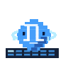

<h1 align="center">
  &nbsp;
  Ping Island
</h1>
<p align="center">
  <b>macOS 選單欄裡的靈動島風格 AI 編碼會話監視器</b><br>
  <a href="#lets-try-it">演示</a> •
  <a href="#installation">安裝</a> •
  <a href="#features">功能</a> •
  <a href="#supported-clients">支援的客戶端</a> •
  <a href="#build-from-source">構建</a> •
  <a href="docs/privacy-policy.md">隱私政策</a><br>
  <a href="README.md">English</a> | 繁體中文
</p>

<p align="center">
  <a href="https://github.com/hua86430/ping-island/releases">
    
  </a>
  <a href="https://github.com/hua86430/ping-island/releases">
    
  </a>
  
  
  
  
</p>

<p align="center">
  
</p>
<p align="center">
  <sub>在選單欄裡檢視活躍編碼會話、回答追問，並一鍵跳回正確的終端或 IDE 視窗。</sub>
</p>

<p align="center">
  &nbsp;
  &nbsp;
  &nbsp;
  &nbsp;
  &nbsp;
  &nbsp;
  &nbsp;
  &nbsp;
  &nbsp;
  &nbsp;
  &nbsp;
  &nbsp;
  
</p>
<p align="center">
  <sub>Claude Code · Codex · Gemini CLI · Hermes Agent · Pi Agent · Qwen Code · Kimi CLI · OpenClaw · OpenCode · Cursor · Qoder · CodeBuddy · GitHub Copilot</sub>
</p>

<a id="lets-try-it"></a>
## Let’s try it!

把當前寵物從瀏海里拖出來，讓它在你切換視窗時也能繼續顯示會話狀態。

<p align="center">
  
</p>

在瀏海屏 Mac 上，當 Agent 需要你處理時，Ping Island 會從瀏海處展開，帶上會話上下文和可操作按鈕。

<p align="center">
  
</p>

<a id="installation"></a>
## 安裝

### 使用 Homebrew Cask 安裝

```bash
brew install --cask ping-island
```

### 下載發行版

1. 開啟 [Releases](https://github.com/hua86430/ping-island/releases)
2. 下載最新的 DMG 或 zip 包
3. 將 `Ping Island.app` 拖到 Applications
4. 啟動應用，並開啟你希望 Ping Island 監控的客戶端

> 首次啟動時，macOS 可能會要求你確認應用，或授予輔助功能 / Apple Events 許可權以支援聚焦能力。

<a id="build-from-source"></a>
### 從原始碼構建

需要 macOS 14+，以及能同時構建 Xcode 工程和 Swift 6.1 `Prototype` 測試包的 Xcode 工具鏈。

```bash
git clone https://github.com/hua86430/ping-island.git
cd ping-island

# Debug 構建
xcodebuild -project PingIsland.xcodeproj -scheme PingIsland -configuration Debug build

# Release 構建
xcodebuild -project PingIsland.xcodeproj -scheme PingIsland -configuration Release build
```

如果你想產出本地分發用的未簽名安裝包：

```bash
./scripts/package-unsigned.sh
```

預設會使用倉庫裡的 `docs/images/ping-island-dmg-installer-background.png` 作為 DMG 安裝背景；如果你想在本地預覽別的背景圖，可以臨時設定 `PING_ISLAND_DMG_BACKGROUND_SOURCE`。

如果你想通過 GitHub Actions 產出帶 `Developer ID` 簽名並完成 notarization 的釋出包，請先按 [docs/sparkle-release.md](docs/sparkle-release.md) 配好倉庫 secrets，再執行 `.github/workflows/release-packages.yml`。官方 Homebrew Cask 釋出說明見 [docs/homebrew-cask-release.md](docs/homebrew-cask-release.md)。

完整的 Sparkle / notarization 釋出流程見 [docs/sparkle-release.md](docs/sparkle-release.md)。

## Ping Island 是什麼？

Ping Island 是一個 macOS 選單欄應用。當你的編碼 Agent 需要你處理審批、輸入或檢視結果時，它會展開成一個緊湊的會話介面。它能接 Claude 風格 hooks、Codex hooks、Gemini CLI hooks、Hermes Agent plugin hooks、Pi Agent extension hooks、Qwen Code hooks、Kimi CLI hooks、OpenClaw internal hooks + session transcripts、Codex app-server、OpenCode 外掛，以及相容 IDE 的整合層，所以你不用一直盯著終端標籤頁，也能看到會話狀態。

如果你瞭解過 [Vibe Island](https://vibeisland.app/)，可以把 Ping Island 理解成同一產品方向下的獨立開源替代方案：它同樣是一個原生 macOS 瀏海區 / 選單欄介面，用來監控和控制 AI 編碼會話。

專案當前的主執行鏈路很直接：

```text
Hook / app-server 事件
  -> 監控與服務層
    -> SessionStore
      -> SessionMonitor + NotchViewModel
        -> 瀏海 UI、會話列表、hover 預覽、完成提醒
```

<a id="features"></a>
## 功能特性

Ping Island 關注的，是那些真正會打斷編碼節奏的時刻，並把它們用原生 macOS 瀏海介面接住。

- **先感知，再展開** - 平時保持緊湊，只有在會話需要審批、輸入、檢視結果或人工介入時才展開。
- **原地處理** - 直接在瀏海介面裡批准工具呼叫、拒絕請求、回答追問。
- **一鍵跳回現場** - 快速回到對應的 iTerm2、Ghostty、Terminal.app、tmux pane 或 IDE 視窗。
- **SSH 終端支援** - 可以通過 SSH 自動引導遠端 PingIslandBridge，把遠端 Claude 相容 hooks 重寫到橋接入口，並把遠端終端裡的事件統一回流到你本機的 Island 介面。
- **多 Agent 統一收口** - 在一個選單欄入口裡持續跟蹤 Claude Code、Codex、Gemini CLI、Hermes Agent、Pi Agent、Qwen Code、Kimi CLI、OpenClaw、OpenCode、Cursor、Qoder、CodeBuddy、WorkBuddy、GitHub Copilot 等相容會話。
- **OpenClaw Gateway 支援** - 先通過 OpenClaw internal hooks 快速拿到會話事件，再從本地 session transcript 回填完整對話，讓 Island 不只顯示單條入站訊息。
- **Codex hooks + app-server** - 同時支援 Codex CLI hooks、即時 app-server 執行緒同步，以及 rollout 解析兜底。
- **自訂音效** - 可按事件選擇 macOS 系統音，也支援匯入本地 sound pack。
- **自訂 Agent 形象** - 可按客戶端覆蓋專屬吉祥物，並同步到 notch、會話列表和 hover 預覽。
- **可拖出的懸浮寵物** - 把當前寵物從瀏海拖出來；停留或點擊它就會以訊息氣泡展開會話預覽，寵物本身固定在附近。
- **用量與成本分析** - 追蹤 Claude 5h / 7d OAuth 用量視窗、Codex rollout 額度，以及設定 -> 統計裡的每模型用量與成本明細。
- **通知中心模式** - 可選的通知中心式列表：只顯示有未讀活動的會話，點一下跳到終端機並清除，收合的島上顯示未讀數。
- **英文與正體中文介面** - 完整在地化為英文與正體中文（zh-Hant），並有 CI 檢查擋住 zh-Hant 字串混入簡體中文。
- **Hermes 專屬寵物** - Hermes Agent 預設使用一隻帶翼盔和信使挎包的金色“翼盔信使狐”，和 Claude / Qwen 體系做明顯區分。
- **Pi 專屬寵物** - Pi Agent 預設使用“終端雲團”形象，讓 extension hook 會話在 Island UI 裡更容易辨認。
- **Qwen 專屬寵物** - Qwen Code 預設使用一隻帶薄荷圍巾的卡皮巴拉，強調穩定、耐心、適合連續追問的氣質。
- **Kimi 專屬寵物** - Kimi CLI 保留原先實現的“藍色鍵盤球”形象，讓 Kimi hook 會話在 README 和應用 UI 裡都能保持獨立識別。

<a id="supported-clients"></a>
## 支援的客戶端

| 客戶端 | 接入方式 | 跳轉 / 聚焦路徑 | Island 能力 |
| --- | --- | --- | --- |
| Claude Code | 通過 `PingIslandBridge` 接入 Claude 相容 hooks | Terminal.app、iTerm2、Ghostty、tmux、IDE 內終端 | 工具審批、AskUserQuestion 回覆、壓縮提醒、完成彈窗、自動批准 |
| Codex App + Codex CLI | Codex CLI hooks、即時 `codex app-server`、rollout 解析兜底 | Codex 應用、終端、tmux、IDE 內終端 | 審批 / 輸入請求、執行緒同步、用量快照、遠端 app-server 轉發 |
| Gemini CLI | `~/.gemini/settings.json` 中的 Gemini CLI hooks | 相容終端宿主 | 會話生命週期、工具活動、通知、壓縮前事件 |
| Hermes Agent | `~/.hermes/plugins/ping_island/` 官方 plugin hooks | Hermes CLI 終端宿主 | 使用者輸入、工具活動、模型回覆、會話結束通知 |
| Pi Agent | `~/.pi/agent/extensions/ping_island/` 下的官方 extension | Pi Agent 終端宿主 | Extension 事件轉發、客戶端識別、終端雲團寵物 |
| Qwen Code | `~/.qwen/settings.json` 中的官方 hooks | 相容終端宿主、遠端 SSH 會話 | 許可權追問、通知彈窗、Stop / SessionEnd 處理、遠端 hooks 轉發 |
| Kimi CLI | `~/.kimi/config.toml` 中的官方 `[[hooks]]` | 相容終端宿主 | 工具活動、通知、回合完成、會話結束處理 |
| OpenClaw | 託管 internal hooks + 本地 transcript 回填 | OpenClaw 終端宿主 | 快速 hook 狀態、完整對話回填、訊息 / 會話狀態 |
| OpenCode | `~/.config/opencode/plugins/` 下的託管外掛檔案 | OpenCode 應用、終端宿主 | 外掛事件轉發到同一套 Island UI |
| Cursor | Claude 相容 hooks + 可選 VS Code 相容聚焦擴充套件 | Cursor 專案視窗、活躍終端 | IDE 路由、終端精準聚焦、Claude 家族會話跟蹤 |
| Qoder / Qoder CLI / QoderWork | `~/.qoder/settings.json` 與 `~/.qoderwork/settings.json` 中的獨立託管 hook profiles | Qoder 視窗、終端、支援的 IDE 擴充套件路徑 | 區分 IDE / CLI 語義、支援審批路徑、QoderWork notify-only 處理 |
| CodeBuddy / WorkBuddy | 託管 hook profiles + 可選 VS Code 相容聚焦擴充套件 | 應用視窗、終端、支援的 IDE 擴充套件路徑 | Claude 家族會話跟蹤、按客戶端跳回、追問狀態展示 |
| GitHub Copilot | Copilot hook 協議 | 相容終端宿主 | Copilot CLI / Agent hooks 事件狀態 |

## 測試

整倉庫的最快完整迴歸入口是：

```bash
./scripts/test.sh
```

它會覆蓋：

```bash
swift test --package-path Prototype
xcodebuild -project PingIsland.xcodeproj -scheme PingIsland -configuration Debug CODE_SIGNING_ALLOWED=NO test -only-testing:PingIslandTests
xcodebuild -project PingIsland.xcodeproj -scheme PingIsland -configuration Debug CODE_SIGN_IDENTITY=- test
```

常用分片：

```bash
swift test --package-path Prototype --filter IslandBridgeE2ETests
xcodebuild -project PingIsland.xcodeproj -scheme PingIsland -configuration Debug CODE_SIGNING_ALLOWED=NO test -only-testing:PingIslandTests
xcodebuild -project PingIsland.xcodeproj -scheme PingIsland -configuration Debug CODE_SIGN_IDENTITY=- test -only-testing:PingIslandUITests
```

如果 `PingIslandUITests-Runner` 在 macOS 上一直停在 suspended，優先在 Xcode 裡用有效本地簽名身份跑 UI 測試，並結合 `amfid` / `AppleSystemPolicy` 日誌判斷是不是程式碼簽名或系統策略問題。

## 設定面板

Ping Island 提供多分類設定面板：

- **General** - 登入啟動與基礎行為
- **Display** - 呈現模式（停靠瀏海或獨立懸浮寵物）、顯示器選擇、位置，以及收合狀態的用量顯示
- **Mascot** - 寵物預覽、客戶端覆蓋、動作狀態
- **Sound** - 事件聲音、聲音包模式、聲音包匯入
- **Shortcuts** - 可自訂的全域快捷鍵，用於開啟 Island 與常用動作
- **Integration** - 各客戶端的 hook 安裝狀態、IDE 聚焦擴充功能安裝、輔助使用權限
- **Analytics** - Claude / Codex 用量與每模型用量、成本明細
- **Remote** - SSH 遠端主機管理與 bridge 狀態
- **Labs** - 實驗性功能開關
- **About** - 版本資訊、更新檢查、版本說明、診斷匯出

## 自訂音效

Ping Island 在 `設定 -> Sound` 裡提供三種聲音模式：

- **系統音** - 為每個事件單獨選擇一個 macOS 系統音。
- **內建 8-bit** - 使用 Island 自帶的復古音效集，並包含固定的客戶端啟動音。
- **主題包** - 從本地匯入相容 OpenPeon / CESP 的音效包。

### 快速配置

1. 開啟 `設定 -> Sound`。
2. 開啟 `啟用提示音`。
3. 選擇你需要的模式：
   - 如果只是想給不同事件換系統提示音，選 `系統音`。
   - 如果想使用自己的音訊檔案，選 `主題包`。
4. 用每一行右側的試聽按鈕確認效果，並只保留你需要的事件開關。

### 匯入本地主題包

1. 將 `聲音模式` 切到 `主題包`。
2. 點選 `匯入本地主題包`。
3. 選擇一個包含 `openpeon.json` 的目錄。
4. 在 `主題包` 下拉框裡選中剛匯入的包。

Ping Island 也會自動發現放在 `~/.openpeon/packs` 和 `~/.claude/hooks/peon-ping/packs` 下面的主題包。

### 最小目錄結構

```text
my-pack/
  openpeon.json
  session-start.wav
  attention.ogg
  complete.mp3
  error.wav
  limit.wav
```

```json
{
  "cesp_version": "1.0",
  "name": "my-pack",
  "display_name": "My Pack",
  "categories": {
    "task.acknowledge": {
      "sounds": [{ "file": "session-start.wav", "label": "Session Start" }]
    },
    "input.required": {
      "sounds": [{ "file": "attention.ogg", "label": "Attention" }]
    },
    "task.complete": {
      "sounds": [{ "file": "complete.mp3", "label": "Complete" }]
    },
    "task.error": {
      "sounds": [{ "file": "error.wav", "label": "Error" }]
    },
    "resource.limit": {
      "sounds": [{ "file": "limit.wav", "label": "Limit" }]
    }
  }
}
```

### 事件對映

- `開始處理` 會依次檢查 `task.acknowledge`、`session.start`。
- `需要介入` 會檢查 `input.required`。
- `完成` 會檢查 `task.complete`。
- `任務失敗` 會檢查 `task.error`。
- `資源受限` 會檢查 `resource.limit`。

主題包裡的音訊檔案支援 `.wav`、`.mp3`、`.ogg`。如果當前主題包沒有提供某個事件對應的分類，Ping Island 會回退到該事件當前選中的 macOS 系統音。

## 工作原理

```text
Claude / Codex / Gemini CLI / Hermes Agent / Pi Agent / Qwen Code / Kimi CLI / OpenCode / Cursor / Qoder / CodeBuddy / WorkBuddy / Copilot / ...
  -> hook 或 app-server 事件
    -> Ping Island 監控與歸一化層
      -> SessionStore
        -> SessionMonitor / NotchViewModel
          -> 瀏海、列表、hover 預覽、完成提示
```

幾個實現細節：

- Claude 家族工具主要通過託管 hook 檔案和內嵌的 `PingIslandBridge` 啟動器接入。
- Codex 會話既可以來自 hooks，也可以來自 `codex app-server` websocket 即時同步。
- Gemini CLI hooks 會安裝到 `~/.gemini/settings.json`，其中工具 matcher 要使用 Gemini 的正則語法。
- Pi Agent 通過生成到 `~/.pi/agent/extensions/ping_island/` 下的 TypeScript extension 接入，並通過 Claude 相容橋接層轉發帶有 Pi 客戶端後設資料的事件。
- Qwen Code hooks 會安裝到 `~/.qwen/settings.json`，橋接層沿用官方事件名，並把 `Stop` / `SessionEnd` / `Notification` 的訊息內容轉成 Island 可直接展示的提示與彈窗文案。
- Kimi CLI hooks 會安裝到 `~/.kimi/config.toml`，安裝器會保留無關 TOML 配置，並把 Kimi 的 `Stop` 對映為回合完成、`SessionEnd` 對映為會話結束。
- OpenCode 使用生成到 `~/.config/opencode/plugins/` 下的外掛檔案接入。
- 遠端 SSH 主機可以自動引導 `PingIslandBridge`，重寫遠端 Claude 相容 hooks 指向橋接入口，並把遠端事件迴流到本機 Ping Island。
- 聚焦路由覆蓋 iTerm2、Ghostty、Terminal.app、tmux 和 VS Code 相容 IDE 擴充套件。

## 系統要求

- macOS 14.0 或更高
- 在帶瀏海的 MacBook 上體驗最好，但也支援外接顯示器
- 安裝你希望 Ping Island 監控的 CLI 或桌面客戶端

## 致謝

Ping Island 延續了 [claude-island](https://github.com/farouqaldori/claude-island) 這類瀏海式 Agent 監視器的思路，並把它擴充套件到了多客戶端 hooks、Codex app-server 同步和 IDE 路由能力上。

## 許可證

Apache 2.0，詳見 [LICENSE.md](LICENSE.md)。
