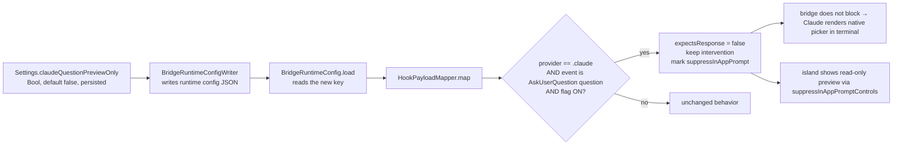

# Non-blocking preview for Claude AskUserQuestion

Date: 2026-07-01
Status: approved (design), pending implementation plan

## Problem

When Claude Code emits an `AskUserQuestion`, PingIsland intercepts it as a
blocking intervention: the mapper sets `expectsResponse = true`, the bridge
holds the hook open until PingIsland returns a decision, and the island shows
answerable buttons. Claude Code's terminal is blocked and never renders its own
native question picker until the island answers. If the user does not answer in
the island, the question and its options never appear in the terminal at all.

The user wants the island to be able to act as a non-blocking preview instead:
show that Claude has a question (with its options, read-only), while the terminal
keeps its native question flow and is where the answer is given.

## Goal

An opt-in setting. When ON, a Claude `AskUserQuestion` is non-blocking: Claude
Code renders its native picker in the terminal, and the island shows a read-only
preview of the question. When OFF (default), behavior is exactly as today
(island answers, terminal blocks). Approvals and other providers are unaffected
either way.

## Approach

A new runtime-config flag flows from Settings to the mapper, exactly like the
existing `routePromptsToTerminal` flag.

### Data flow

### Behavior contract

| Condition | expectsResponse | intervention | island |
| --- | --- | --- | --- |
| flag ON, Claude AskUserQuestion (question) | `false` | kept | read-only preview (no answer controls) |
| flag ON, Claude approval / permission | unchanged | unchanged | unchanged (answerable) |
| flag ON, non-Claude provider | unchanged | unchanged | unchanged |
| flag OFF (default) | unchanged | unchanged | unchanged (answerable) |

Key difference from the existing `routePromptsToTerminal`: that flag drops the
intervention entirely (no island preview) and applies to all prompts. This flag
keeps a display-only intervention and is scoped to Claude `AskUserQuestion`
questions only.

## Components

- **`BridgeRuntimeConfig` (`Prototype/Sources/IslandShared/BridgeRuntimeConfig.swift`)**: add `claudeQuestionPreviewOnly: Bool` (default false); load it from JSON key `claudeQuestionPreviewOnly`; include it in the serialized object. Schema stays in sync with the writer.
- **`BridgeRuntimeConfigWriter` + `BridgeRuntimeConfigSnapshot` (`PingIsland/Services/Hooks/BridgeRuntimeConfigWriter.swift`)**: add the field; write the key. The snapshot is built from settings at the same call site that already supplies `routePromptsToTerminal`.
- **`HookPayloadMapper` (`Prototype/Sources/IslandShared/HookPayloadMapper.swift`)**: the gate. After `detectIntervention`, if the flag is on, the provider is `.claude`, and the detected intervention is a question (AskUserQuestion, not an approval), keep the intervention, force `expectsResponse = false`, and mark the envelope so the resulting `HookEvent.suppressInAppPrompt` is true. All other paths keep the current `routePromptsToTerminal`-gated logic untouched.
- **`Settings` (`PingIsland/Core/Settings.swift`)**: `@Published var claudeQuestionPreviewOnly: Bool` (persisted, default false); on change, trigger the same runtime-config rewrite that `routePromptsToTerminal` uses.
- **`SettingsWindowView` (`PingIsland/UI/Views/SettingsWindowView.swift`)**: a toggle near the existing prompt-routing / integration settings. Label (localized): "Claude 問題留在終端（島只顯示預覽）" / "Keep Claude questions in the terminal (Island shows a preview only)".
- **Island UI**: no new UI. Reuse `SessionState.shouldSuppressInAppPromptControls` (`SessionState.swift:979`): an intervention with `suppressInAppPromptControls == true` renders as a notification-only surface (question + options visible, no answer buttons). The preview clears when the next hook event resolves or supersedes the intervention.

## Feasibility gate (verify first in the plan)

The whole feature rests on: when the PreToolUse hook returns without a blocking
decision (expectsResponse false), Claude Code renders its native
`AskUserQuestion` picker in the terminal. Evidence is strong (this is the
standard PreToolUse contract, and `routePromptsToTerminal` already relies on the
terminal handling prompts when `expectsResponse` is false), but it is Claude
Code runtime behavior. The plan's first step verifies it live before building
the setting UI.

## Known unknown to confirm during planning

The exact field/metadata the mapper must set so the resulting `HookEvent` has
`suppressInAppPrompt == true`. `SessionStore.swift:648` consumes
`event.suppressInAppPrompt`; the plan traces how that field is produced from the
`BridgeEnvelope` and sets it on the preview path. This is wiring an existing
signal, not inventing one.

## Testing

- **Mapper unit tests** (`Prototype/Tests`, fastest): with the flag on, a Claude `AskUserQuestion` envelope maps to `expectsResponse == false`, a preserved question intervention, and `suppressInAppPrompt == true`; with the flag off, it stays blocking (`expectsResponse == true`); a Claude approval/permission envelope stays blocking regardless of the flag; a non-Claude question is unaffected.
- **Runtime config round-trip** (`Prototype/Tests`): `BridgeRuntimeConfig.load` reads the new key; the writer serializes it; default is false.
- **Settings persistence** (`PingIslandTests`): the new setting persists and its change triggers a runtime-config rewrite.
- **Manual (jack-loop)**: enable the toggle; run `claude` in a terminal and trigger an `AskUserQuestion`; confirm the terminal renders the native picker, the island shows a read-only preview (question + options, no submit), answering in the terminal proceeds, and the island preview clears. Then toggle off and confirm the old island-answer behavior returns.

## Success criteria

- Flag ON: Claude `AskUserQuestion` renders natively in the terminal and is answerable there; the island shows a non-blocking read-only preview; the terminal is never blocked waiting on the island.
- Flag OFF (default): current behavior unchanged.
- Approvals and non-Claude providers unchanged in both states.
- The toggle is in the Settings window and takes effect on change.

## Out of scope

- Changing approval / permission prompt handling.
- Any non-Claude provider's question handling.
- The `routePromptsToTerminal` idle-protection behavior (left as is).
- Making preview-only the default (it is opt-in).
