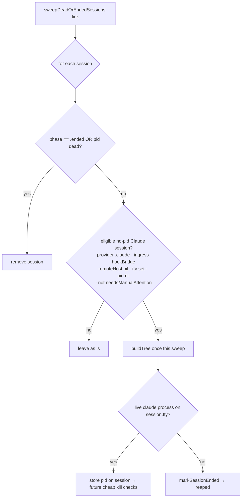

# tty-based liveness for Ctrl-C'd Claude sessions

Date: 2026-07-01
Status: approved (design), pending implementation plan

## Problem

When a user Ctrl-C's `claude` in a terminal, Claude Code exits without a clean
`Stop` / `SessionEnd` hook, so the app gets no end event. The session then
lingers in the notch forever.

Root cause (from investigation): a local Claude Code hook session has
`session.pid == nil` — the bridge never populates `metadata["pid"]` for local
ingress (`HookSocketServer.swift:655` is `Int(metadata["pid"] ?? "")` with no
fallback). Both liveness paths are written to skip when `pid` is nil:

- `pruneOrphanedSessions` (`SessionStore.swift:2576+`): no pid → only flips an active phase to `.idle`, never `.ended`.
- `sweepDeadOrEndedSessions` (`SessionStore.swift:2642+`): no pid → `pidIsDead` is false → the session is neither reaped nor ended.

So a Ctrl-C'd session is stuck at `.idle`, never reaches `.ended`, and never
gets removed. The 30-minute primary-list auto-hide only hides it from the
primary list (does not remove it) and is blocked entirely if the session was
mid-approval/question (`needsManualAttention`).

## Goal

A Ctrl-C'd local Claude session is detected as dead and removed from the notch,
using the terminal it ran on rather than the missing pid. Alive sessions and
remote/tmux sessions we cannot verify are never falsely removed.

## Approach

Use the session's tty. `ProcessTreeBuilder.buildTree()` already lists every
process with its controlling tty (`ps -eo pid,ppid,tty,args`). In the periodic
liveness sweep, for a local Claude session with a tty but no pid, check whether
a live `claude` process is still attached to that tty:

- **Present** → the session is alive. Store its pid on the session so later
  sweeps use the cheap `kill(pid, 0)` check and other pid consumers benefit.
- **Absent** → the `claude` on that terminal exited (Ctrl-C). Mark the session
  `.ended`; the existing reap step removes it (matching today's dead-pid
  behavior: end → reap → gone).

### Flow

## Eligibility (who this applies to)

A session is evaluated by the tty path only when ALL hold:

| Field | Required value | Why |
| --- | --- | --- |
| `provider` | `.claude` | This bug is the Claude local-hook pid gap; other providers have their own pid/rollout handling |
| `ingress` | `.hookBridge` | Native-runtime / app-server paths are out of scope |
| `clientInfo.remoteHost` | nil / empty | A remote SSH session's tty is on the remote host; local `ps` cannot see it, so absence must NOT be read as death |
| `tty` | non-empty | The whole check keys on the tty |
| `pid` | nil | Sessions that already have a real pid use the existing `kill` check |
| `needsManualAttention` | false | A session paused on an approval/question is preserved (existing rule) |
| `phase` | not `.ended` | Already ending / reaped |

Everything outside this set keeps its current behavior unchanged.

## Agent-on-tty check

Reuse `ProcessTreeBuilder.candidateProcessIDs(forTTY:tree:)` (already exists) to
get the processes on the tty, then treat the session as alive if any of those
processes' commands identify the Claude CLI (command contains `claude`,
case-insensitive). A new small helper (e.g. `ProcessTreeBuilder.liveClaudePID(onTTY:tree:) -> Int?`)
encapsulates this and returns the matching pid (for storing) or nil.

## Edge cases

- **tmux**: `claude` runs on the pane's pts. If `session.tty` is that pane tty, the check works. If `session.tty` is the outer client tty, no `claude` is found there; to avoid a false kill, a session whose `clientInfo.tmuxPaneIdentifier` is set but whose tty does not resolve is left alone (fall through to the existing time-based auto-hide) rather than marked ended.
- **Remote**: excluded by the `remoteHost` eligibility gate.
- **Transient ps miss**: `buildTree` is a single `ps` snapshot; process presence (not a race-prone signal) is what is checked, so a live idle `claude` still appears. No extra debounce needed.
- **pid stored then process dies**: once a pid is stored, the session falls into the existing `kill(pid, 0)` dead-pid path on the next sweep — same as any other pid'd session.

## Components

- `PingIsland/Services/Shared/ProcessTreeBuilder.swift`: add `liveClaudePID(onTTY:tree:) -> Int?`.
- `PingIsland/Services/State/SessionStore.swift`: in the periodic liveness sweep (`sweepDeadOrEndedSessions`), add the eligibility-gated tty check that stores a resolved pid or marks the session `.ended`. Extract the per-session decision as a pure function (session + tree → keep / store(pid) / end) so it is unit-testable without spawning processes.

## Testing

- **Pure decision unit tests** (`PingIslandTests`): feed a synthetic process tree + a session and assert the outcome — eligible session with a `claude` on its tty → store that pid; eligible session with no `claude` on its tty → end; remote session (remoteHost set) with no local match → keep (not ended); non-Claude / has-pid / needsManualAttention session → unchanged.
- **`liveClaudePID(onTTY:tree:)` unit tests**: given a synthetic tree, returns the claude pid on the tty, or nil.
- **Manual (jack-loop)**: start `claude` in a terminal (row appears), Ctrl-C it, wait one sweep interval, confirm the row disappears from the notch. Start two in one folder/different terminals, Ctrl-C one, confirm only that one disappears and the live one stays. Confirm a remote SSH session is not removed.

## Success criteria

- A Ctrl-C'd local Claude session disappears from the notch within one sweep interval.
- A live (even idle) local Claude session is never removed; its pid gets populated.
- Remote and tmux-unresolvable sessions are never falsely removed.
- No behavior change for non-Claude providers, sessions with a real pid, or sessions needing manual attention.

## Out of scope

- Populating pid in the bridge itself (this fixes it app-side via tty).
- Codex / app-server / native-runtime session liveness.
- Changing the 30-minute primary-list auto-hide.
