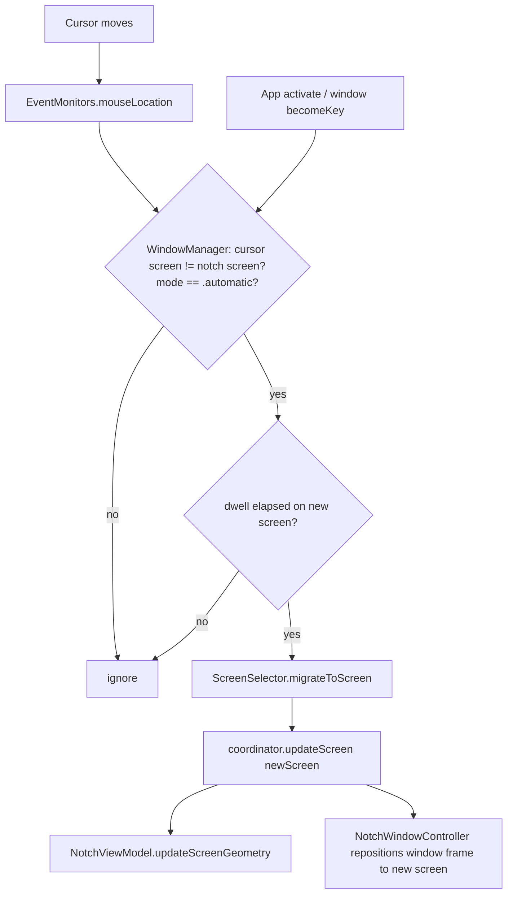

# Instant cursor-follow for the docked notch

Date: 2026-07-01
Status: approved (design), pending implementation plan

## Problem

In automatic screen mode the docked notch is meant to sit on whichever screen
the user is working on. Today it lags:

1. Migration only triggers on focus-change events (`NSWorkspace.didActivateApplicationNotification` + `NSWindow.didBecomeKeyNotification`) and is debounced 1 second (`WindowManager.handleFocusChange`, `WindowManager.swift:73-94`). Moving the cursor to another screen without activating a window does not move the notch.
2. Crossing to a different screen rebuilds everything. `WindowManager.setupNotchWindow` calls `presentationCoordinator?.invalidate()` and constructs a brand-new `IslandPresentationCoordinator(screen:)` (`WindowManager.swift:38-47`), because `NotchWindowController.fullWindowFrame` is a `let` captured from the init screen (`NotchWindowController.swift:14,25-35,167`) and cannot move. That rebuild is slow and visibly flickers.

Net effect: the notch appears on the new screen late, and with a flicker.

## Goal

In automatic mode, the docked notch follows the cursor to another screen
promptly (within one short dwell interval) and without rebuilding the window.
Specific-screen mode and the detached island are unchanged.

## Approach

Two independent changes, both required.

### 1. Reposition the window instead of rebuilding it

`NotchWindowController` gains the ability to move its window to a different
screen: recompute the window frame for a new screen rather than holding an
immutable `fullWindowFrame`. `IslandPresentationCoordinator.updateScreen`
already recomputes geometry and re-applies the surface mode; it is extended so
a cross-screen call repositions the existing window (via the controller) rather
than requiring `WindowManager` to rebuild the coordinator.

`WindowManager` migration then always routes through the cheap
`coordinator.updateScreen(newScreen)` path; the `invalidate()` + new-coordinator
branch is reserved for genuine lifecycle events (screen removed, first launch),
not for routine cursor migration.

### 2. Trigger migration on cursor screen-crossing

`WindowManager` subscribes to `EventMonitors.shared.mouseLocation`. When the
screen containing the cursor differs from the notch's current screen (and mode
is `.automatic`), it migrates. A short dwell/throttle prevents thrash when the
cursor merely grazes a screen edge.

The existing focus-change trigger stays as a low-power backstop (see energy
note below), routed through the same cheap reposition path with a reduced
debounce.

### Data flow

## Behavior rules

- **Only in `.automatic` mode.** Specific-screen mode never migrates on cursor movement.
- **Dwell / throttle.** The cursor must rest on the new screen for a short interval before migration (default 100 ms). This suppresses migration when the cursor only passes through a screen. Value is a single tunable constant.
- **Dwell fires without further events.** The dwell check must not depend on another `mouseMoved` arriving after the interval. When the cursor stops on the new screen, `mouseLocation` stops emitting, so a `beginDwell` result schedules a one-shot main-queue timer (`dwell + small padding`) that re-evaluates using the current cursor position. Without this, a stationary cursor migrates only when the next stray event happens to arrive after the dwell, which reads as laggy / non-instant. The timer is cancelled/replaced when the pending screen changes, the cursor returns to the notch's screen, or a migration fires.
- **Cheap path only.** Cursor and focus migrations both go through `updateScreen` (reposition). A full coordinator rebuild happens only for lifecycle changes (screen disconnect, first launch, surface-mode switch), not routine follow.
- **Energy.** The `.mouseMoved` global monitor only runs at `EnergyGovernor` monitoring level `.full` (`EventMonitors.setupMonitors`, `EventMonitors.swift:106-114`). When the machine is quiet/low-power and mouse-move is off, cursor-follow degrades to the existing focus-change trigger. No new always-on high-frequency monitor is added; the change reuses the existing `mouseLocation` subject.
- **Notch-vs-non-notch transitions.** Moving between a physical-notch screen and an external screen recomputes `closedHeight` (physical notch height vs detected menu bar height, per the 2026-07-01 menu-bar-alignment change) and `deviceNotchRect` through the normal geometry update.
- **Detached island unaffected.** This spec only covers the docked notch.

## Files to change

| File | Change |
| --- | --- |
| `PingIsland/UI/Window/NotchWindowController.swift` | Make the window frame recomputable per screen; add a reposition entry point (move window to a new screen's docked frame). |
| `PingIsland/App/IslandPresentationCoordinator.swift` | Extend `updateScreen` so a cross-screen call repositions the existing window through the controller instead of relying on a rebuild. |
| `PingIsland/App/WindowManager.swift` | Subscribe to `mouseLocation`; migrate on cursor screen-cross with dwell/throttle; route both cursor and focus migrations through the cheap reposition path; reserve rebuild for lifecycle events. |
| `PingIsland/Core/ScreenSelector.swift` | Reused as-is (`migrateToScreen`, `screenContaining`, `screenID`); adjust only if the migration decision needs a shared helper. |
| `PingIslandTests/` | New tests for the migration-decision logic (screen-cross + dwell) and the window reposition. |

## Testing

- **Migration decision (unit).** Given a cursor point, current notch screen, mode, and elapsed dwell, decide migrate / ignore. Extract this as a pure function so it is testable without a live window. Cases: same screen → ignore; different screen before dwell → ignore; different screen after dwell → migrate; specific-screen mode → never migrate.
- **Window reposition (unit).** `NotchWindowController` computes the correct docked frame for a given screen (top-centered/edge per current layout) and updates its stored frame when moved. Assert the frame matches the new screen's expected rect.
- **Manual (jack-loop).** On a multi-monitor setup in automatic mode: move the cursor to another screen and confirm the notch appears there within ~one dwell interval with no rebuild flicker; confirm specific-screen mode does not migrate; confirm a physical-notch ↔ external transition keeps the bar aligned.

## Success criteria

- Moving the cursor to another screen (automatic mode, full monitoring) moves the docked notch there within one dwell interval, with no window rebuild or flicker.
- Specific-screen mode never migrates on cursor movement.
- Low-power / quiet monitoring still migrates on focus change (graceful degradation).
- No new always-on high-frequency event monitor beyond the existing `mouseLocation` subject.

## Out of scope

- Multi-window "badge on every screen" (the rejected approach A).
- Changing specific-screen mode behavior.
- Detached island / floating pet screen following.
- The lingering-exited-session notch bug (separate investigation).
