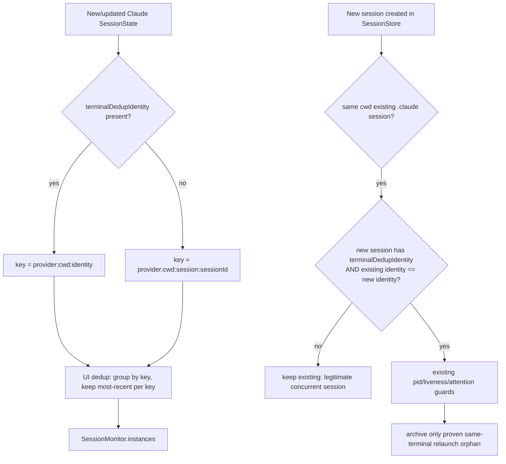

# Terminal-scoped session dedup design

Date: 2026-07-01
Status: approved (design), pending implementation plan

## Problem

Two concurrent Claude sessions in the same working directory but different
terminals collapse into a single notch row. Only the most-recently-active one
is visible; the other loses its row, its completion notification, and its
click-to-focus target.

Root cause is two code paths that key session identity on `provider:cwd`
without any terminal discriminator:

1. `deduplicateSameProjectClaudeSessions` (`PingIsland/Services/Session/SessionMonitor.swift:859`)
   is a UI-layer filter. It keeps only the most-recently-active `.claude`
   session per `provider:cwd` and hides the rest from `SessionMonitor.instances`.
   No liveness or terminal guard. This is the primary cause of the collapsed row.
2. `endOrphanedSessions` (`PingIsland/Services/State/SessionStore.swift:2524`)
   removes same-`cwd` `.claude` sessions from the store when a new session in
   that cwd appears. It guards with pid liveness + execution evidence, but the
   pid guard is unreliable: hook-session pid is `getppid()` of the ephemeral
   hook-runner process, not the long-lived Claude CLI, so the "process still
   alive" check frequently fails and the store-level session is removed too.

Fixing only the UI filter is insufficient. If `endOrphanedSessions` removes the
store session, there is nothing left for the UI to show, so both paths must be
scoped to the terminal.

## Goal

Two Claude sessions in the same cwd but different terminals each keep their own
notch row, completion notification, and focus target. A relaunch in the *same*
terminal (Ctrl-C then re-run `claude`) still collapses to one row, preserving
the transient-duplicate cleanup that both functions exist for.

## Approach

Introduce a single terminal-identity discriminator on `SessionState`, reused by
both dedup paths so they agree.

### End-to-end dedup flow



## Data contract: `terminalDedupIdentity`

New nonisolated computed property on `SessionState`
(`PingIsland/Models/SessionState.swift`). Returns a single normalized scalar
string identifying the terminal surface a session runs in, or `nil` when no
terminal identity is available. Draws from the same fields already collected in
`hookSurfaceIdentityTokens`.

Priority order (first non-empty wins), each value trimmed and lowercased, with a
type prefix to prevent cross-field value collisions:

| Priority | Source field | Emitted token | Rationale |
| --- | --- | --- | --- |
| 1 | `clientInfo.tmuxPaneIdentifier` | `pane:<value>` | Stable per tmux pane; strongest terminal identity when in tmux |
| 2 | `clientInfo.iTermSessionIdentifier` | `iterm:<value>` | Stable per iTerm2 session |
| 3 | `clientInfo.terminalSessionIdentifier` | `term:<value>` | Ghostty / generic terminal session id |
| 4 | `tty` | `tty:<host?>:<value>` or `tty:<value>` | Fallback. When `clientInfo.remoteHost` is present, prefix host so two remote machines reusing the same pts number do not collide |
| — | none present | `nil` | No terminal identity; callers fall back to `sessionId` |

Normalization rule: trim whitespace, treat empty-after-trim as absent,
lowercase. Same rule already used by `hookSurfaceIdentityTokens`.

The `tty` field is already populated on `SessionState` from `event.tty`
(`SessionStore.swift:434-435`, stripped of the `/dev/` prefix). The terminal
identifier fields are already populated on `clientInfo` from the bridge
`terminalContext`.

## Change 1: UI dedup key

File: `PingIsland/Services/Session/SessionMonitor.swift`, function
`deduplicateSameProjectClaudeSessions` (around line 869).

Current key: `"\(session.provider.rawValue):\(cwd)"`.

New key: append the terminal discriminator, falling back to `sessionId` when
absent so unidentifiable sessions never collapse into each other.

```swift
let terminal = session.terminalDedupIdentity ?? "session:\(session.sessionId)"
let key = "\(session.provider.rawValue):\(cwd):\(terminal)"
```

Behavior:
- Same cwd, same terminal identity → one row (relaunch collapse preserved).
- Same cwd, different terminal identity → separate rows.
- No terminal identity → keyed by sessionId → each session distinct, never hidden.

No other logic in the function changes: it still keeps the most-recently-active
session per key.

## Change 2: store-level orphan removal guard

File: `PingIsland/Services/State/SessionStore.swift`, function
`endOrphanedSessions` (around line 2538, immediately after the existing
`guard existing.cwd == cwd else { continue }`).

Add a guard so only a proven same-terminal relaunch orphan is eligible for
removal:

```swift
guard existing.cwd == cwd else { continue }
// Only clean up a relaunch orphan from the SAME terminal surface. Two Claude
// instances in the same cwd but different terminals are legitimate concurrent
// sessions and must not remove each other.
guard let identity = session.terminalDedupIdentity,
      existing.terminalDedupIdentity == identity else { continue }
```

When the new session has no terminal identity (`nil`), the guard fails and the
loop skips: we never remove a store session we cannot prove is a same-terminal
relaunch. This is stricter and more reliable than the current pid check.

The existing guards (`phase != .ended`, `!needsManualAttention`,
`sessionHasLiveExecutionEvidence`, pid liveness) are all preserved unchanged as
additional safety. The pid guard is intentionally left in place; removing it is
out of scope for this change.

## Edge cases

| Scenario | terminalDedupIdentity | Result |
| --- | --- | --- |
| Two Ghostty tabs, same cwd | distinct `term:` / `tty:` values | Two rows |
| Two tmux panes, same cwd | distinct `pane:` values | Two rows |
| Same tab, Ctrl-C then re-run claude | same `tty:` / `term:` value | One row (relaunch collapse) |
| Transient concurrent hook events on startup (same terminal) | same value | One row (existing intent preserved) |
| Claude Desktop app-server, no tty/terminal id | `nil` | Keyed by sessionId → each distinct, no false hiding |
| Two remote sessions, different hosts, same pts number | `tty:hostA:...` vs `tty:hostB:...` | Two rows |

## Testing

Neither `deduplicateSameProjectClaudeSessions` nor `endOrphanedSessions` has
existing test coverage. Add tests via `@testable import PingIsland` in the
`PingIslandTests` target (final target choice confirmed during planning; the
functions are currently `private` and will need to be relaxed to `internal`, or
the pure keying/predicate logic extracted into an `internal` seam the tests call
directly).

Unit tests for `terminalDedupIdentity`:
- Priority order: pane beats iterm beats term beats tty.
- Trim + lowercase normalization; empty-after-trim treated as absent.
- Remote host prefix applied only in the tty-fallback branch.
- All fields absent returns `nil`.

Behavior tests:
- UI dedup: same terminal collapses to one; different terminals stay separate;
  no-identity sessions stay separate (keyed by sessionId).
- Orphan removal: same-terminal relaunch orphan is archived; different-terminal
  concurrent session is preserved; no-identity new session removes nothing.

Manual verification (jack-loop): build the app, open two Ghostty tabs in the
same folder, run `claude` in each, confirm two rows; then Ctrl-C and re-run in
one tab and confirm it stays a single row for that tab.

## File change list

| File | Change |
| --- | --- |
| `PingIsland/Models/SessionState.swift` | Add `terminalDedupIdentity` computed property; relax access if needed for tests |
| `PingIsland/Services/Session/SessionMonitor.swift` | Update dedup key in `deduplicateSameProjectClaudeSessions` |
| `PingIsland/Services/State/SessionStore.swift` | Add same-terminal guard in `endOrphanedSessions` |
| `PingIslandTests/` | New tests for identity + both dedup behaviors |
| `AGENTS.md` | Note terminal-identity scoping in the primary-list / session-lifecycle rules |

## Success criteria

- Two Claude sessions in the same cwd but different terminals render as two
  notch rows, each with its own completion notification and focus target.
- A same-terminal relaunch still collapses to a single row.
- App-server / no-terminal-identity sessions are never hidden by dedup.
- New unit tests pass; app builds via the main Xcode scheme.

## Out of scope

- Removing or reworking the existing pid liveness guard in `endOrphanedSessions`.
- Any change to Codex/OpenCode/Qoder dedup paths.
- The separate AskUserQuestion preview/notify-only feature (its own spec).
