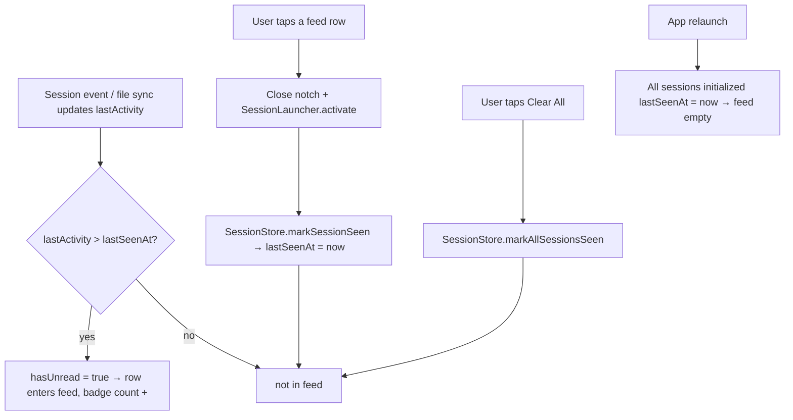

# Notification feed mode (iPhone-style unread feed for the opened Island)

Date: 2026-07-02
Status: approved (design), pending implementation plan

## Problem

The opened Island's session list shows every visible session, always. The user
wants an opt-in mode where the list behaves like iPhone's notification center:
only sessions with something NEW show up, tapping one jumps to its terminal and
clears it from the feed, and a top-right "Clear All" empties the feed at once.

## Decisions (user-confirmed)

| Question | Decision |
| --- | --- |
| What counts as a notification | Any new activity since last seen ("unread"): `lastActivity > lastSeenAt` |
| 30-minute idle auto-hide in feed mode | Does NOT apply to unread items; they stay until cleared |
| Read state across app relaunch | Not persisted; on launch all existing sessions start as seen (feed starts empty) |
| Collapsed island badge | Yes — show unread count on the collapsed island |
| Clear All semantics | Mark ALL as seen (sessions stay alive; they reappear on new activity) |
| Tap-one semantics | Focus terminal + mark THAT session seen (row leaves the feed) |

Design correction accepted by the user: "clear" means mark-as-seen, not
archive. iPhone model: clearing a notification never uninstalls the app; the
session stays tracked and produces a new feed entry on its next activity.
Archive remains available in the normal list (toggle off).

## Approach

A single persisted toggle `notificationFeedMode` (default OFF). When OFF,
everything behaves exactly as today. When ON, the opened Island's `.sessionList`
route renders a notification feed instead of the full session list, and the
collapsed island shows an unread-count badge.

### Components

1. **Setting** (`PingIsland/Core/Settings.swift`)
   `@Published var notificationFeedMode: Bool`, default `false`, modeled on
   `terminalHandlesAskUserQuestion` (persist to `AppSettingsDefaultKeys` key +
   telemetry; NO bridge-config write, NO hook reinstall — pure UI mode).
   Settings UI: one `SettingsToggleLine` in `SettingsWindowView` with
   Simplified-literal key + zh-Hant/en values.

2. **Unread model** (`PingIsland/Models/SessionState.swift` + `SessionStore`)
   - New stored field `var lastSeenAt: Date?` next to `lastActivity`
     (SessionState.swift:108 area). Must be added to the memberwise init and
     threaded through every SessionState reconstruction site in `SessionStore`
     (session upsert/rebind paths) or it silently resets.
   - New derived `var hasUnread: Bool { lastActivity > (lastSeenAt ?? .distantPast) }`
     following the existing derived-not-stored pattern
     (`needsAttention`, `shouldAutoArchiveFromPrimaryUI`).
   - In-memory only (no persistence). On app launch, sessions restored or
     discovered during startup are initialized with `lastSeenAt = now` so the
     feed starts empty; only post-launch activity produces unread entries.
   - New actor method `SessionStore.markSessionSeen(sessionId:)` sets
     `lastSeenAt = Date()` and publishes; `markAllSessionsSeen()` for Clear All.
     All mutation flows through the actor, matching the store's contract.

3. **Feed rendering** (`PingIsland/UI/Views/IslandOpenedContentView.swift`)
   The `.sessionList` case (line ~42, the single chokepoint shared by docked
   and detached surfaces) reads `AppSettings.shared.notificationFeedMode`:
   - OFF → `SessionListView` (unchanged).
   - ON → new `NotificationFeedView`:
     - Rows: only sessions with `hasUnread == true`, sorted by `lastActivity`
       descending (newest first). Row visuals reuse the existing list row
       style (client mascot/name, folder, latest preview line, timestamp).
     - Unread rows are exempt from the 30-minute `shouldAutoArchiveFromPrimaryUI`
       hide: the feed queries sessions from the store's full set (or a
       feed-specific filter) rather than only `filteredVisibleSessions`, so an
       unread item older than 30 minutes still shows. (A session that ENDS and
       gets removed from the store still leaves the feed — feed cannot show
       what the store no longer tracks.)
     - Header: title + top-right "Clear All" button → `markAllSessionsSeen()`.
     - Row tap → close notch, `SessionLauncher.activate(session)` (existing
       focus path incl. the 0.24.11 Ghostty raise), then `markSessionSeen`.
       Marking seen removes the row from the feed reactively.
     - Empty state: "沒有新通知" placeholder when nothing is unread.
   - The attention/hover routes (`.attentionNotification`, `.hoverDashboard`,
     `.completionNotification`, `.chat`) are NOT changed by this feature.

4. **Collapsed-island unread badge** (`NotchView` closed-state header area)
   When `notificationFeedMode` is ON and unread count > 0, the collapsed island
   shows the unread count (small numeric badge, placed with the existing
   closed-notch badge/attention affordances). Toggle OFF → no badge, exactly
   today's visuals.

### Data flow

## Scope

- In scope: the toggle, the unread model, `NotificationFeedView` on the
  `.sessionList` route (docked + detached), Clear All, tap-to-focus-and-clear,
  collapsed-island unread count.
- Out of scope: persistence of read state across relaunch; per-event
  notification granularity (unread is per-session); changes to attention
  cards, completion popups, hover dashboard, chat; any change when the toggle
  is off.

## Edge cases

- Session needing manual attention (pending question/approval) that the user
  "clears": marking seen hides it from the FEED, but the attention routes and
  closed-island attention badge still work as today — the feed is additive,
  not a replacement for attention surfacing.
- A session's new activity after being seen: `lastActivity` advances past
  `lastSeenAt` → it reappears as unread (iPhone behavior).
- Ended sessions: an unread ended session stays in the feed until cleared or
  until the user archives/it is pruned from the store; if the store removes
  it, it leaves the feed.

## Testing

- **Unit (`PingIslandTests`)**:
  - `hasUnread` truth table: no `lastSeenAt` + fresh activity → true;
    `lastSeenAt >= lastActivity` → false; activity after seen → true.
  - `markSessionSeen` / `markAllSessionsSeen` update `lastSeenAt` and clear
    `hasUnread`.
  - Launch initialization: sessions created during startup restore path get
    `lastSeenAt` set (feed starts empty).
  - Feed filter/sort: only unread, newest first; unread item with
    `lastActivity` older than 30 minutes still included (auto-hide exemption).
  - Toggle off → `.sessionList` renders `SessionListView` (behavior parity).
- **Manual**: toggle on; drive activity in one session → row appears + badge
  count; tap row → terminal focused, row gone, badge decremented; Clear All →
  feed empty, badge gone; new activity on a cleared session → reappears;
  relaunch → feed empty.

## Success criteria

- Toggle OFF: pixel-identical behavior to today.
- Toggle ON: feed lists only unread sessions (newest first), unaffected by the
  30-minute idle hide; tapping a row focuses that terminal and removes the row;
  Clear All empties the feed; collapsed island shows the unread count; a
  cleared session reappears on new activity; relaunch starts with an empty feed.
