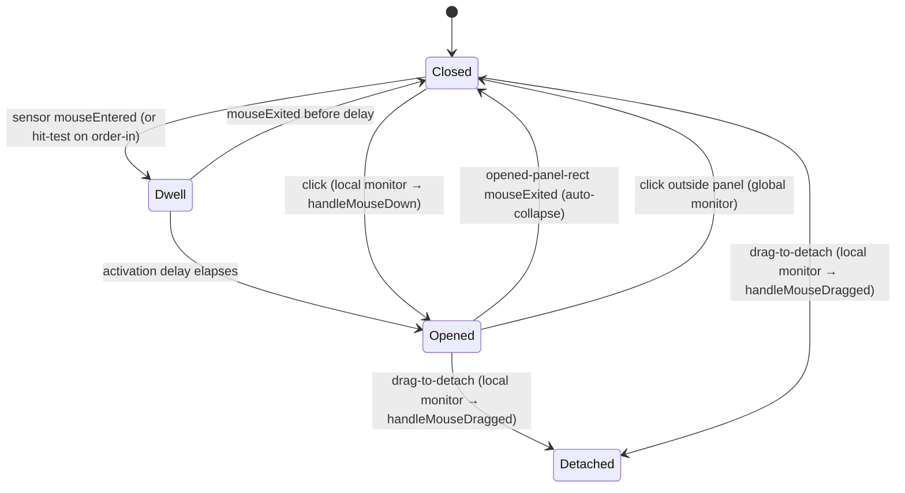

# Notch hover sensor: energy-independent hover open/close for the docked notch

Date: 2026-07-03
Status: approved (design), pending load-bearing spike + implementation plan
Branch: `notch-hover-tracking-area`

Revision note (2026-07-03): revised after a Fable 5 design review. The sensor is
now hover-only; the earlier "sensor forwards click/drag" component was removed
because `EventMonitor` already installs a local monitor that observes clicks on
our own windows (see Finding 1 below). The opened-state close rect was corrected
from the full window bounds to the actual panel rect.

## Problem

The docked notch opens on hover and closes when the cursor leaves. Both are
driven by `NotchViewModel.handleMouseMove`, fed by the global
`EventMonitors.shared.mouseLocation` (`.mouseMoved`). That monitor only runs at
`EnergyGovernor` level `.full` (`EventMonitors.swift:107`, `if level == .full`),
and `.full` is only reached when a session is active or needs attention
(`EnergyGovernor.resolvedMode`, `EnergyGovernor.swift:157`).

So when the app is idle (no active/attention session), the mouse-moved monitor
is off and hover-open silently stops working: the user must click the notch. A
feed unread badge does not raise the mode to `.active`, so "there is a
notification but hover does nothing" is the common report.

Click-open and drag-to-detach are NOT affected: they run off the `.leftMouseDown`
/ `.leftMouseDragged` monitors, enabled at every non-disabled level. Only the
`.mouseMoved`-driven hover is energy-gated.

A naive fix (a tracking area on the notch window) fails: the closed notch sets
`ignoresMouseEvents = true` for menu-bar click-through (`NotchWindowController.swift:63-64`),
and an `ignoresMouseEvents` window is transparent to the mouse, so tracking
areas on it never fire.

## Goal

Docked-notch hover open and close work at all `EnergyGovernor` levels (including
idle), while:

- the closed notch keeps passing clicks through to the menu bar items beside it,
- hover-open never steals keyboard focus from the terminal (already fixed in
  `458e0a5`; must not regress),
- the feel is unchanged: same hover activation delay before opening, same
  auto-close-on-leave semantics.

## Approach

Add a dedicated always-mouse-active hover-sensor window covering only the
closed-notch trigger rect. It is a HOVER SENSOR ONLY: an `NSTrackingArea`
(`.mouseEnteredAndExited`, `.activeAlways`) drives open/close. It does NOT
handle clicks or drags.

Why a separate window: the notch window must stay `ignoresMouseEvents = true`
when closed for menu-bar click-through, so a tracking area on it never fires. A
small dedicated window over just the trigger rect can be mouse-active without
blocking menu-bar items, which sit left/right of the notch, not under it.

Why hover-only (corrected from the first draft): `EventMonitor.start()`
installs BOTH a global AND a local `NSEvent` monitor calling the same handler
(`EventMonitor.swift:104-115`). A `mouseDown`/`mouseDragged`/`mouseUp` delivered
to the sensor window (our app) flows through the LOCAL monitor into
`EventMonitors.mouseDown` → `NotchViewModel.handleMouseDown`, so the existing
click-open and drag-to-detach paths keep working with no forwarding. Adding a
sensor-view override would double-deliver each event (view + local monitor) and
break the detachment gesture (begin/cancel/begin). So the sensor must NOT
override mouse-button events.

The energy-gated global `.mouseMoved` monitor stays for `WindowManager`
cursor-follow only; it no longer drives hover.

### Interaction routing (closed vs opened)

```mermaid
flowchart TD
    subgraph Closed["status == .closed / .popping"]
        SENS[NotchHoverSensorWindow over trigger rect<br/>ignoresMouseEvents = false, hover-only]
        SENS -->|tracking area mouseEntered → dwell| OPENH[notchOpen(.hover)]
        SENS -->|tracking area mouseExited| CANCEL[cancel pending hover-open + clear isHovering]
        CLICK[mouseDown / drag on the notch] -->|delivered to sensor → LOCAL monitor| HMD[existing handleMouseDown / handleMouseDragged<br/>click-open · begin detachment]
        MB[Click on menu bar beside notch] -->|not under sensor| PASS[passes through main window<br/>ignoresMouseEvents = true]
    end
    subgraph Opened["status == .opened"]
        TA[Tracking area sized to the actual opened panel rect<br/>on the opened window]
        TA -->|mouseExited panel rect| CLOSE[notchClose per auto-collapse rules]
        OUT[Click outside panel → another app] -->|global mouseDown monitor| CLOSE2[handleMouseDown → isPointOutsidePanel → close]
    end
    OPENH --> Opened
    HMD --> Opened
```

### Open/close state flow



## Load-bearing assumptions (spike BEFORE writing the plan)

These cannot be derived from the code; verify with a ~30-minute standalone spike
(a tiny app: a transparent nonactivating panel with an `.activeAlways` tracking
area and a local mouse-down monitor, while a terminal is frontmost):

1. An `.activeAlways` `NSTrackingArea` on a NON-key, background-app,
   nonactivating panel fires `mouseEntered`/`mouseExited` while another app is
   frontmost. (The whole approach rests on this.)
2. A fully transparent borderless window is not dropped from hit-testing: with
   `ignoresMouseEvents = false` and content alpha ≈ 0.001, it receives tracking
   and mouse-down. Confirm whether a near-zero-alpha backing is required.
3. The local `NSEvent` monitor fires for a `mouseDown` delivered to the
   nonactivating sensor panel while the app is inactive (so click-open keeps
   working through the existing handler).

If any fails, fall back to a low-frequency `NSEvent.mouseLocation` poll (see
Rejected alternatives) rather than the sensor.

## Components

| Component | Responsibility |
| --- | --- |
| `NotchHoverSensorWindow` (new, `PingIsland/UI/Window/`) | Borderless, near-transparent, nonactivating panel at the notch window level. Frame = current hover-trigger rect. `ignoresMouseEvents = false`. `collectionBehavior` matches `NotchPanel` (`.canJoinAllSpaces`, `.fullScreenAuxiliary`, `.stationary`). Present only while closed/popping; ordered out while opened, detached, or when the notch is hidden. Hover-only: no mouse-button handling. |
| Sensor content view (new) | Installs `NSTrackingArea(.mouseEnteredAndExited, .activeAlways)`, rebuilt in `updateTrackingAreas` on resize. `mouseEntered` → start hover dwell; `mouseExited` → cancel dwell + clear `isHovering`. On order-in / reposition, hit-test `NSEvent.mouseLocation` against the rect and manually start the dwell if the cursor is already inside (AppKit does not emit `mouseEntered` for a cursor already inside a freshly installed area). Does NOT override `mouseDown/Dragged/Up`. |
| Opened-panel close tracking area (in `NotchWindowController`) | On the opened window, a tracking area whose rect equals the ACTUAL opened panel rect (derived from `openedSize`, not the full 750pt window), rebuilt when the panel size changes. `mouseExited` → `viewModel.notchClose()` subject to the existing `shouldAutoCollapseHoverPreview` rules. Energy-independent (opened window is `ignoresMouseEvents = false`). |
| `NotchViewModel` | Hover open/close no longer driven from `handleMouseMove`. Expose a hover-open entry (`beginHoverDwellOpen` / reuse `performDeferredHoverOpenIfNeeded`) and own `isHovering` set/clear from the sensor + opened tracking area, keeping the current readers working (see below). `notchOpen`, `notchClose`, detachment tracking, and `handleMouseDown/Dragged` are reused unchanged. |
| Sensor + close-area lifecycle owner | `NotchWindowController.updateWindowPresentation` — the existing chokepoint already sinks `$status`, `$openReason`, `$isFullscreenEdgeRevealActive`, and geometry updates. Fold sensor order-in/out + reframe and the opened close-area rebuild into it. No new coordinator. |

### `isHovering` ownership (Finding 6)

`handleMouseMove` currently both sets and clears the published `isHovering`
(`NotchViewModel.swift:547-549`), which UI reads and `performDeferredHoverOpenIfNeeded`
guards on (`:828`). Moving hover off `handleMouseMove` means the sensor's
`mouseEntered`/`mouseExited` and the opened close-area must own the full set/clear,
including the union semantics "hovering if cursor is in the trigger rect OR (when
opened) in the panel rect", and align with the `beginDetachedPresentation` reset
(`:848`). The plan must enumerate every `isHovering` reader/writer and give the
new owner.

### Hover-trigger geometry (data contract)

The sensor frame equals the same rect `isPointInHoverTrigger` tests, so hover and
the sensor agree exactly:

| Condition | Rect |
| --- | --- |
| Normal (closed presentation shown) | `closedScreenRect.insetBy(dx: -10, dy: -5)` (`isPointInClosedNotch`) |
| Fullscreen reveal (`shouldHideClosedPresentation`) | `fullscreenRevealTriggerRect` |
| Notch hidden (idle-auto-hidden / quiet-background / fullscreen-browser-hidden) | none — sensor ordered out |

`closedScreenRect` is top-center of the current screen, so it never overlaps
menu-bar items on the built-in display. Extract rect selection as a pure function
`NotchHoverSensorFrame.rect(for geometry:, state:) -> CGRect?` (nil = hidden) for
unit testing without a live window.

## Behavior rules

- Hover-open keeps the existing activation delay (`hoverActivationDelay`, ~0.24s
  normal / ~0.18s fullscreen): `mouseEntered` starts a dwell timer, `mouseExited`
  before it elapses cancels.
- Hover-open uses reason `.hover`, so the focus-theft guard from `458e0a5` (no
  activate/makeKey for `.hover`) still applies.
- Auto-close-on-leave keeps the current `shouldAutoCollapseHoverPreview` rules
  (settings popover, inline text input, `autoCollapseOnLeave`).
- Closed-state click-open and drag-to-detach are unchanged; they ride the local
  monitor into the existing handlers.

## Edge cases

- Cursor already inside on order-in / migration / launch: hit-test and start the
  dwell manually (see sensor content view).
- Screen migration (cursor-follow / focus): sensor repositions to the new
  screen's trigger rect in the `moveToScreen` path.
- Fullscreen edge-reveal: sensor frame switches to `fullscreenRevealTriggerRect`.
- Idle-auto-hidden / quiet-background / fullscreen-browser-hidden notch: sensor
  ordered out.
- Click-through becomes click-consume inside the sensor rect (Finding 5): today
  a closed-notch click is observed (via global monitor) AND passes through; with
  a mouse-active sensor the click is consumed by our app. On the built-in notch
  this is a no-op (nothing under the notch). On an external screen the top-center
  trigger rect (with the `-10` inset) or the wider `fullscreenRevealTriggerRect`
  could overlap a centered status item or a long app menu, making it unclickable.
  Verify on an external screen with a crowded menu bar; if it bites, narrow the
  consuming rect to `closedScreenRect` (drop the inset) while keeping the hover
  rect wider.
- Two windows (sensor + main): sensor is tiny and near-transparent, nonactivating,
  no content, never key. Order it out on open to avoid overlap with the panel.

## Rejected alternatives (Finding 8)

- Energy-input tweak: add unread/attention signals to `EnergyGovernorInputs` so
  `resolvedMode` reaches a `.mouseMoved`-enabled level. A few lines, no new
  window, but does NOT meet the goal at true idle (hover still dead when there is
  no visible/recent activity). Rejected because the goal is hover at all levels.
- Single-window resize: shrink the main window to the trigger rect and make it
  mouse-active when closed. Rejected: it entangles the SwiftUI open/close
  animation anchoring and menu-bar click-through more than the sensor does.
- Low-frequency `NSEvent.mouseLocation` poll (~120ms): simplest, reuses the
  existing hover state machine, no new window, preserves click-through. Kept as
  the FALLBACK if the spike invalidates the tracking-area assumptions; not chosen
  now because it is an always-on timer and coarser (~120ms) than event-driven.

## Energy

The sensor tracking area fires only on enter/exit, not per mouse move, so it is
cheap and needs no gating (`.activeAlways`). This does not reintroduce an
always-on high-frequency monitor. The global `.mouseMoved` monitor stays
energy-gated and is now used only for `WindowManager` cursor-follow (making
cursor-follow work while idle is out of scope).

## Testing

- Unit (`PingIslandTests`): `NotchHoverSensorFrame.rect(for:state:)` truth table
  — normal → inset closed rect; fullscreen → reveal rect; hidden states → nil;
  offset external-screen geometry → rect on that screen.
- Spike (before the plan): the three load-bearing assumptions above.
- Runtime (local Debug build, jack-loop): with NO active session (mode
  `interactionOnly`) — hover opens the notch, leaving closes it; a menu-bar item
  beside the notch still clicks; drag-to-detach from the closed notch still works;
  migrate the notch to another screen and confirm hover works there (including
  cursor-already-there); confirm hover-open does not steal keyboard focus.

## Out of scope

- Making cursor-follow work while idle (still energy-gated).
- Click-outside-to-close and detach-from-opened (stay on the global-monitor path).
- Removing the global `.mouseMoved` monitor (still needed by cursor-follow).

## Success criteria

- Hover opens and closes the docked notch with no active session (idle), at the
  same feel as today.
- Menu-bar click-through beside the notch, closed-notch click-open, and
  drag-to-detach all still work.
- Hover-open never steals keyboard focus from the terminal.
- Sensor tracks the notch across screen migration and fullscreen reveal.
- New unit tests plus full `PingIslandTests` pass; app builds.
