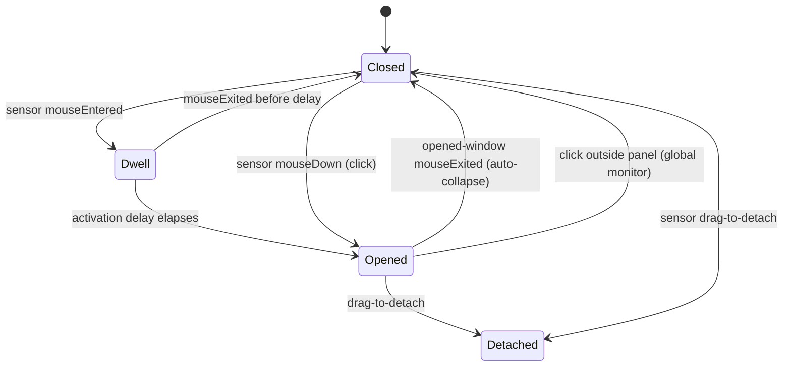

# Notch hover sensor: energy-independent hover open/close for the docked notch

Date: 2026-07-03
Status: approved (design), pending implementation plan
Branch: `notch-hover-tracking-area`

## Problem

The docked notch opens on hover and closes when the cursor leaves. Both are
driven by `NotchViewModel.handleMouseMove`, which is fed by the global
`EventMonitors.shared.mouseLocation` (a `.mouseMoved` monitor). That monitor
only runs at `EnergyGovernor` monitoring level `.full` (`EventMonitors.swift:107`,
`if level == .full`), and `.full` is only reached when a session is active or
needs attention (`EnergyGovernor.resolvedMode`, `EnergyGovernor.swift:157`).

So when the app is idle (no active/attention session), the mouse-moved monitor
is off and hover-open silently stops working: the user must click the notch to
open it. A feed unread badge does not raise the mode to `.active`, so "there is
a notification but hover does nothing" is the common report.

Click-open and drag-to-detach are NOT affected: they run off the global
`.leftMouseDown` / `.leftMouseDragged` monitors, which are enabled at every
non-disabled level. Only the `.mouseMoved`-driven hover is energy-gated.

A naive fix (a tracking area on the notch window) fails: the closed notch sets
`ignoresMouseEvents = true` so clicks pass through to the menu bar
(`NotchWindowController.swift:63-64`), and an `ignoresMouseEvents` window is
transparent to the mouse, so tracking areas on it never fire.

## Goal

Docked-notch hover open and close work at all `EnergyGovernor` levels
(including idle), while:

- the closed notch keeps passing clicks through to the menu bar items beside it,
- hover-open never steals keyboard focus from the terminal (already fixed in
  `458e0a5`; this design must not regress it),
- the feel is unchanged: same hover activation delay before opening, same
  auto-close-on-leave semantics.

## Approach

Add a dedicated always-mouse-active hover-sensor window that becomes the
closed-notch interaction surface, and drive close-on-leave from a tracking area
on the opened window. The energy-gated global `.mouseMoved` monitor stays for
`WindowManager` cursor-follow only; it no longer drives hover.

Why a separate window rather than a tracking area on the notch window: the
notch window must stay `ignoresMouseEvents = true` when closed for menu-bar
click-through. A small dedicated window covering only the notch-bar trigger
rect can be mouse-active (`ignoresMouseEvents = false`) without blocking the
menu-bar items, which sit to the left and right of the notch, not under it.

Because a mouse-active sensor over the trigger rect intercepts clicks there
(the global mouse-down monitor does not observe our own app's windows), the
sensor must also own closed-state click-open and drag-to-detach, forwarding
those events into the existing `NotchViewModel` handlers.

### Interaction routing (closed vs opened)

```mermaid
flowchart TD
    subgraph Closed["status == .closed / .popping"]
        SENS[NotchHoverSensorWindow over trigger rect<br/>ignoresMouseEvents = false]
        SENS -->|mouseEntered → dwell| OPENH[notchOpen(.hover)]
        SENS -->|mouseExited| CANCEL[cancel pending hover-open]
        SENS -->|mouseDown in trigger| OPENC[notchOpen(.click)]
        SENS -->|mouseDown + drag| DETACH[begin docked detachment]
        MB[Click on menu bar beside notch] -->|not under sensor| PASS[passes through main window<br/>ignoresMouseEvents = true]
    end
    subgraph Opened["status == .opened"]
        TA[Tracking area on opened window<br/>ignoresMouseEvents = false]
        TA -->|mouseExited opened panel| CLOSE[notchClose per auto-collapse rules]
        OUT[Click outside panel → another app] -->|global mouseDown monitor| CLOSE2[handleMouseDown → isPointOutsidePanel → close]
    end
    OPENH --> Opened
    OPENC --> Opened
```

### Open/close state flow



## Components

| Component | Responsibility |
| --- | --- |
| `NotchHoverSensorWindow` (new, `PingIsland/UI/Window/`) | Borderless, clear, nonactivating panel at the notch window level. Frame = current hover-trigger rect. `ignoresMouseEvents = false`. Present only while closed/popping; ordered out while opened, detached, or when the notch is hidden. |
| Sensor content view (new) | Installs `NSTrackingArea(.mouseEnteredAndExited, .activeAlways)`. Overrides `mouseEntered/mouseExited` → hover dwell open / cancel. Overrides `mouseDown/mouseDragged/mouseUp` → forward to `NotchViewModel` closed-state click-open and detachment handlers. |
| Opened-window tracking area (in `NotchWindowController`) | On the opened window's content view; `mouseExited` → `viewModel.notchClose()` subject to the existing auto-collapse rules. Energy-independent because the opened window is `ignoresMouseEvents = false`. |
| `NotchViewModel` | Hover open/close no longer driven from `handleMouseMove`. Expose the closed-state interaction entry points (hover-open-after-dwell, click-open, begin-detachment) so the sensor can call them. Reuse existing `notchOpen`, `notchClose`, detachment tracking. |
| Sensor positioning (owner: `NotchWindowController` or a small coordinator) | Recompute the sensor frame from geometry and reposition it on: screen migration (`moveToScreen`), screen-parameter change, fullscreen-reveal state change, idle/quiet hidden-state change, and status change (closed↔opened). |

### Hover-trigger geometry (data contract)

The sensor frame equals the same rect `NotchViewModel.isPointInHoverTrigger`
tests against, so hover and the sensor agree exactly:

| Condition | Rect |
| --- | --- |
| Normal (closed presentation shown) | `closedScreenRect.insetBy(dx: -10, dy: -5)` (`isPointInClosedNotch`) |
| Fullscreen reveal (`shouldHideClosedPresentation`) | `fullscreenRevealTriggerRect` (wider/taller top-center zone) |
| Notch hidden (idle-auto-hidden / quiet-background / fullscreen-browser-hidden) | none — sensor ordered out |

`closedScreenRect` is top-center of the current screen (`screenRect.midX` centered,
pinned to `screenRect.maxY`), so it never overlaps menu-bar items.

Extract the rect selection as a pure function
`NotchHoverSensorFrame.rect(for geometry:, state:) -> CGRect?` (nil = hidden) so
it is unit-testable without a live window.

## Behavior rules

- Hover-open keeps the existing activation delay (`hoverActivationDelay`, ~0.24s
  normal / ~0.18s fullscreen): `mouseEntered` starts a dwell timer, `mouseExited`
  before it elapses cancels. This matches today's feel and avoids opening on a
  cursor merely crossing the notch.
- Hover-open uses reason `.hover`, so the focus-theft guard added in `458e0a5`
  (do not activate/makeKey for `.hover`) still applies.
- Auto-close-on-leave keeps the current `shouldAutoCollapseHoverPreview` rules
  (respects settings popover, inline text input, `autoCollapseOnLeave`).
- Menu-bar click-through beside the notch is preserved: the sensor covers only
  the trigger rect; the main window stays `ignoresMouseEvents = true` when closed.
- Closed-state click-open and drag-to-detach behave exactly as today; only the
  event source changes (sensor view instead of global monitor).

## Energy

The sensor's tracking area fires only on enter/exit, not on every mouse move,
so it is cheap and needs no energy gating (`.activeAlways`). This does not
reintroduce an always-on high-frequency monitor. The global `.mouseMoved`
monitor stays energy-gated and is now used only for `WindowManager`
cursor-follow (unchanged; making cursor-follow work while idle is out of scope).

## Edge cases

- Screen migration (cursor-follow / focus migration): the sensor repositions to
  the new screen's trigger rect in the same path that calls
  `NotchWindowController.moveToScreen`.
- Fullscreen edge-reveal: sensor frame switches to `fullscreenRevealTriggerRect`.
- Idle-auto-hidden / quiet-background / fullscreen-browser-hidden notch: sensor
  ordered out (nothing to hover).
- Detachment: while detached or opened the sensor is ordered out; the detached
  panel and opened-window paths take over.
- Two windows (sensor + main): the sensor is tiny and clear; it must never draw
  or capture keyboard focus (nonactivating, clear background, no content).

## Testing

- Unit (`PingIslandTests`): `NotchHoverSensorFrame.rect(for:state:)` truth table
  — normal geometry → inset closed rect; fullscreen → reveal rect; hidden states
  → nil; offset external-screen geometry → rect on that screen.
- Runtime (local Debug build, jack-loop): with NO active session (mode
  `interactionOnly`, mouse-moved monitor off) — hover over the notch opens it,
  moving away closes it; click a menu-bar item beside the notch still works;
  drag-to-detach from the closed notch still works; migrate the notch to another
  screen and confirm hover works there; confirm hover-open does not steal
  keyboard focus from the terminal.

## Out of scope

- Making cursor-follow migration work while idle (still energy-gated).
- Any change to click-outside-to-close or detach-from-opened (stay on the
  existing global-monitor path).
- Removing the global `.mouseMoved` monitor (still needed by cursor-follow).

## Success criteria

- Hover opens and closes the docked notch with no active session (idle), at the
  same feel as today.
- Menu-bar click-through beside the notch, closed-notch click-open, and
  drag-to-detach all still work.
- Hover-open never steals keyboard focus from the terminal.
- Sensor tracks the notch across screen migration and fullscreen reveal.
- New unit tests plus full `PingIslandTests` pass; app builds.
