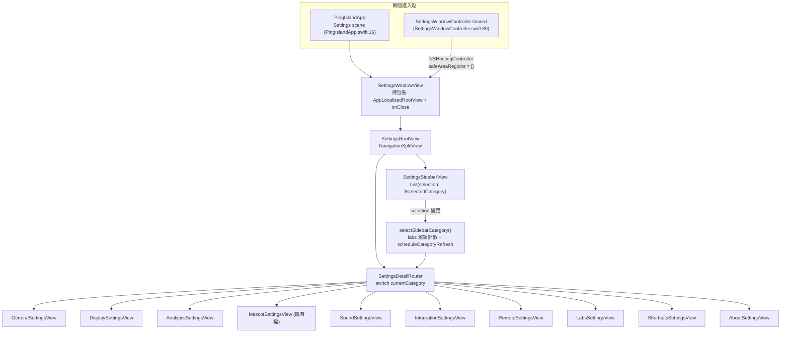
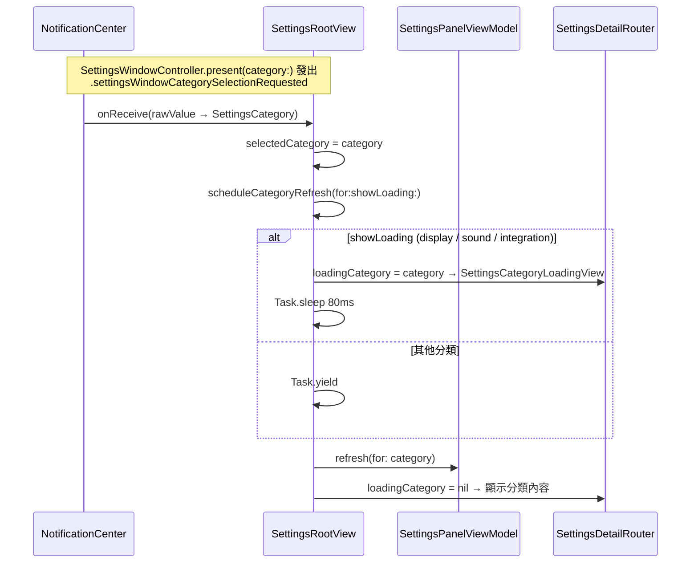
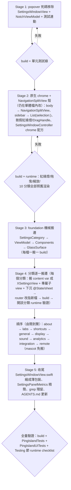

# Settings NavigationSplitView 重寫：原生 System-Settings 外觀 + 單體檔全面拆分

日期：2026-07-03
分支：`settings-navigation-split`（自 main 分出，已存在）
狀態：設計定稿，待寫 plan

## Problem

`PingIsland/UI/Views/SettingsWindowView.swift` 是 6922 行的單體檔（god-view）：

- `SettingsPanelContentView`（line 2250）一個 struct 同時持有 10 個分類的內容、
  sidebar、detail、視窗控制、refresh 排程、hook 安裝流程、remote 主機管理、
  labs 解鎖彩蛋等所有狀態與行為。全檔約 80 個 top-level 型別。
- 視窗外觀是手刻的：`SettingsWindowController.swift:95` 用
  `styleMask: [.borderless, .resizable]` 的無邊框視窗，配上
  `sidebarWindowControls`（line 2630）自畫的假紅綠燈（`WindowControlButton`，
  line 3937，只有關閉/最小化兩顆）、`SettingsWindowDragHandle`（line 2222）
  手刻拖曳區、根部 `clipShape(RoundedRectangle(cornerRadius: 18))` 手刻圓角。
  不是原生 macOS 視窗行為（沒有原生紅綠燈、沒有 zoom、沒有原生陰影）。
- 存在整組死碼：`.popover` 呈現模式（`SettingsPanelPresentation`、
  `NotchSettingsPopoverView`、popover 專用 metrics、
  `NotchViewModel.isSettingsPopoverPresented`）從未被任何 live caller 使用
  （驗證見「Removed dead code」節）。

## Goal

1. Settings 視窗改為原生 macOS System-Settings 外觀：SwiftUI
   `NavigationSplitView`（非 NSSplitViewController）+ 原生 titled 視窗
   （真紅綠燈浮在 sidebar 上、透明 titlebar、原生拖曳/縮放/最小化/zoom）。
2. 把 6922 行單體檔做完整 clean-code 拆分：一檔一責、小型聚焦 view、
   分類內容各自成檔。
3. 移除 `.popover` 死碼全鏈路。
4. 行為零變更：所有現有設定功能、binding、localization key、
   category refresh、hook 安裝流程、labs 解鎖彩蛋、跨視窗分類跳轉通知
   全部原樣保留。這是結構重構 + 原生視窗外殼，不是行為改動。

## Approach

拆分採「先殼後肉」＋「一次搬一個分類」：

1. 先刪 popover 死碼（獨立可驗證）。
2. 在單體檔內先把 shell 換成 `NavigationSplitView` + 原生視窗 chrome
   （這份 chrome 配方本 session 稍早已實測可行後回退，此處原樣重新引入），
   拿到使用者可見的即時驗證點。
3. 再機械式搬遷：先搬 foundation（enum、view model、共用元件），
   然後每次只搬一個分類的內容成獨立檔，每步 Debug build + 該分類 runtime 驗證。

搬遷原則（規則，不入圖）：

- 搬遷 = 剪貼 + 改存取層級，不重寫 view body。分類內容、binding、
  localization key（`Text(appLocalized:)` 的字串）逐字保留。
- 只被單一分類使用的 private 型別跟著該分類檔走；跨分類共用的進
  `Settings/Components/`。歸屬由 callsite grep 決定，plan 逐一釘死。
- 分類專屬的 `@State`（如 integration 的 hook sheet 狀態、remote 的
  host sheet 狀態）下沉到該分類 view；跨分類的（selection、refresh、
  labs 解鎖計數、analytics consent prompt）留在 root。
- 非 private 的既有型別（`SettingsWindowView`、`SettingsCategory`、
  `SettingsPanelViewModel`、`QoderCLIHookRefreshNoticeGate`、
  `ClosedNotchUsageAvailability`、`AccessibilityPermissionStatus`、
  `IslandSurfaceModeSelector`、`IslandSurfaceModeCard`、
  `HookInstallOptionsMode`、`HookInstallOptionsRequest`）可能有檔外
  caller（例如 first-run onboarding 用到 `IslandSurfaceModeSelector`）；
  搬檔不改存取層級即安全（同 target），plan 執行時先 grep 確認再動。

## Architecture

### 端到端流程

### 分類跳轉與 refresh 序列（現有行為，原樣保留）

### SettingsCategory（現況，保留不動）

實際 enum 有 10 個 case（任務描述的 9 個之外還有 gated 的 `labs`）。
`rawValue` 同時是 accessibility identifier 與跨視窗跳轉通知的 payload，
不可改名。

| case | title | 備註 |
|---|---|---|
| `general` | 通用 | 連點 6 次解鎖 labs（`selectSidebarCategory`, line 2762） |
| `display` | 显示 | refresh 顯示 loading |
| `analytics` | 统计 | 內容 = `AgentUsageAnalyticsContent` |
| `mascot` | 宠物 | 內容 = 既有 `MascotSettingsView.swift`（343 行，已獨立） |
| `sound` | 声音 | 內容 = `SoundSettingsContent`；refresh 顯示 loading |
| `integration` | 集成 | hook 安裝流程；sidebar 有 notice dot；refresh 顯示 loading |
| `remote` | 远程 | SSH 主機管理 sheet |
| `labs` | 实验室 | `visibleCategories(labsUnlocked:)` gated，未解鎖不出現在 sidebar |
| `shortcuts` | 快捷键 | |
| `about` | 关于 | |

### 檔案拆分地圖

新目錄 `PingIsland/UI/Views/Settings/`（Xcode 用
PBXFileSystemSynchronizedRootGroup，新檔自動入 target，無 pbxproj 手改）。
「來源行號」以現在 main 上的 `SettingsWindowView.swift` 為準，
執行時以符號名為錨、行號僅供定位。

| 新檔 | 內容（自單體檔搬出） | 來源行號 |
|---|---|---|
| `Settings/SettingsCategory.swift` | `SettingsCategory` enum + `visibleCategories` | 8–87 |
| `Settings/SettingsPanelViewModel.swift` | `QoderCLIHookRefreshNoticeGate`、`ClosedNotchUsageAvailability`、`AccessibilityPermissionStatus`、`SettingsPanelViewModel`（含 `refresh(for:)`、`installHooks`/`reinstallHooks`/`uninstallHooks` 全套） | 89–658 |
| `Settings/SettingsRootView.swift` | 取代 `SettingsPanelContentView` 的殼：`NavigationSplitView`、selection/`currentCategory`、`selectSidebarCategory`（含 labs 解鎖計數）、`scheduleCategoryRefresh`/`shouldShowLoading`、visibility 與 category-selection 的 `onReceive`、analytics consent prompt、共用 `@StateObject viewModel` | 2250–2827（殼的部分） |
| `Settings/SettingsSidebarView.swift` | 原生 `List(selection:)` sidebar + `SidebarItemView`（含 integration notice dot、`settings.sidebar.<raw>` identifier） | 2519–2656、3858–3936 |
| `Settings/SettingsDetailRouter.swift` | `detail` 的 switch → 分類 view、`SettingsCategoryLoadingView`、`settings.detail.<raw>` identifier、`.id(currentCategory)` | 2151–2194、2657–2760 |
| `Settings/Components/SettingsComponents.swift` | 跨分類共用列/卡片：`SettingsSectionCard`、`SettingsLineDivider`、`SettingsToggleLine`、`SettingsInfoLine`、`SettingsActionLine`、`SettingsValueLine`、`SettingsSliderLine`、`SettingsCodeCapsule`、`SettingsStatusLine`、`SettingsClientIcon`、line 5589 的 `private extension View` | 3955–4033、5418–5465、5556–5855、6661–6704 |
| `Settings/Components/SettingsGlassSurface.swift` | `SettingsGlassSurface`（NSVisualEffectView wrapper；detail 卡片仍用，sidebar 改用原生 vibrancy 後不再需要） | 2202–2221 |
| `Settings/Categories/GeneralSettingsView.swift` | `generalContent` + 其專用 helper（`replayNotchDetachmentHint`、`replayFirstRunOnboardingDemo` 等，歸屬由 callsite 定） | 2828–2911 |
| `Settings/Categories/DisplaySettingsView.swift` | `displayContent` + `resetSettingsPanelSize` + display 專用子 view（`IslandSurfaceModeSelector/Card/PreviewScene`、`NotchDisplayPreviewMock`、`NotchDisplayModeSelector/Card`、`DisplayPreviewMascotPicker`、`FloatingPetPlacementInfoCard`、`FloatingPetSizeModePicker`、`ClosedNotchTrailingContentPicker` 等 picker） | 2912–3117、6095–6660 |
| `Settings/Categories/ShortcutsSettingsView.swift` | `shortcutsContent` + `ShortcutSettingsLine`、`ShortcutRecorderControl`、`ShortcutIconButtonStyle` | 3118–3158、5856–6064 |
| `Settings/Categories/AnalyticsSettingsView.swift`（+ `AgentUsageCharts.swift`、`AgentUsageRows.swift`） | `AgentUsageAnalyticsViewModel` + `AgentUsageAnalyticsContent` + 約 20 個 AgentUsage* 子 view/Shape/`AgentUsageFormat`；1300 行的 cluster 依「viewmodel+content / chart(sparkline、bar、heatmap) / row(line、pill、ranking)」切三檔 | 868–2150 |
| `Settings/Categories/SoundSettingsView.swift` | `SoundSettingsContent` + `SoundPackSourceInfoLine`、`SoundPackImportActionLine`、`SoundEventSection`、`SoundStartupLine`、`SoundEventTextBlock`、`SoundPreviewButton`、`SoundControlCluster`、`SoundEventSettingsLine`、`SoundPackEventLine`、`BundledSoundEventLine` | 664–866、5636–5747、6705–6922 |
| `Settings/Categories/IntegrationSettingsView.swift` | `integrationContent` + hook 管理全套（`HookManagementLine`、`CustomHookInstallationLine`、`CustomHookInstallSheet`、`HookInstallOptionsMode/Request/Sheet`、`CategoryToggleState/Row`、`EventToggleRow`、`HookManagementIcon`、`HookManagementButton`、`IDEExtensionManagementLine/Icon`）+ 下沉的 hook sheet `@State`（`pendingHookReinstallProfile`、`pendingHookOptionsRequest`、`showingUninstallAllHooksConfirmation`、`showingCustomHookInstallSheet`）與對應 `.sheet`/`.confirmationDialog`/onReceive | 3171–3455、4034–4832、5337–5417、5519–5555 |
| `Settings/Categories/RemoteSettingsView.swift` | `remoteContent` + `RemoteHostManagementLine`、`AddRemoteHostSheet`、`RemotePasswordPromptAction/Request/Sheet` + 下沉的 `showingRemoteHostSheet`、`remotePasswordPromptRequest` 與對應 sheet | 3574–3832、4833–5336 |
| `Settings/Categories/LabsSettingsView.swift` | `labsContent` + `LabsEmptyStateView` | 3456–3463、5466–5518 |
| `Settings/Categories/AboutSettingsView.swift` | `aboutContent` + 版本 metadata helper | 3464–3573 |
| `SettingsWindowView.swift`（原檔，縮身） | 只剩 `SettingsWindowView` 薄包裝（`AppLocalizedRootView` + `SettingsRootView` + `onClose` + `settings.root` identifier）與（若留）精簡後的 `SettingsPanelMetrics` | 3833–3848 |

mascot 分類不建新檔：router 直接呼叫既有
`PingIsland/UI/Views/MascotSettingsView.swift`（現況 `mascotContent`
就只是 `MascotSettingsView()` 包一層，line 3159–3161）。

### NavigationSplitView 具體形態

- `SettingsRootView` body：
  `NavigationSplitView { SettingsSidebarView(...) } detail: { SettingsDetailRouter(...) }`。
- Sidebar：原生 `List(selection: $selectedCategory)`、`.listStyle(.sidebar)`、
  原生 sidebar vibrancy（不再包 `SettingsGlassSurface(material: .sidebar)`）。
  row 內容沿用 `SidebarItemView`（icon tile + title + notice dot），
  保留 `.accessibilityIdentifier("settings.sidebar.<raw>")`。
  `SettingsSidebarSection`（line 2195，現況只有一個無標題 section）刪除，
  直接 `ForEach(SettingsCategory.visibleCategories(labsUnlocked:))`。
- Sidebar 欄寬：`.navigationSplitViewColumnWidth(min:ideal:max:)` 對齊現有
  `windowSidebarWidth = 236`。
- selection 型別沿用 `@State var selectedCategory: SettingsCategory?`
  與 `currentCategory`（nil / labs 未解鎖時 fallback `.general`，line 2750）
  原樣保留。
- Detail：沿用現有 `ScrollView` + `.id(currentCategory)` +
  `.accessibilityIdentifier("settings.detail.<raw>")`。detail 手刻的
  `UnevenRoundedRectangle` 外框/陰影與根部
  `clipShape(cornerRadius: 18)`、`panelBackgroundColor` 屬手刻視窗殼的一部分，
  隨原生 chrome 移除或簡化為 NavigationSplitView 的原生欄背景；
  卡片層（`SettingsSectionCard` + `SettingsGlassSurface(.hudWindow)`）不動。
- `preferredColorScheme(.dark)` 保留：所有內容元件的用色
  （white opacity 系）是深色調校，轉淺色是行為/視覺變更，列入 Out of scope。

### 狀態歸屬

| 狀態 | 位置 |
|---|---|
| `selectedCategory`、`loadingCategory`、`categoryRefreshTask`、`consecutiveGeneralTapCount`、`showingAnalyticsConsentPrompt`、`isAccessibilityPollingActive`、`arePreviewAnimationsActive` | `SettingsRootView` |
| `viewModel: SettingsPanelViewModel`（@StateObject） | `SettingsRootView` 建立，以 `@ObservedObject` 傳入需要的分類 view |
| `AppSettings.shared` / `ScreenSelector.shared` / `UpdateManager.shared` / `RemoteConnectorManager.shared` | 各分類 view 自行 `@ObservedObject` 引用 singleton（不經 root 轉發，減少 root 重繪面） |
| hook sheet 4 個 `@State` + onReceive | `IntegrationSettingsView` |
| remote sheet 2 個 `@State` | `RemoteSettingsView` |

不新增 per-category view model：分類內容目前直接讀寫
`AppSettings`/singleton，加一層 view model 是無人要求的抽象。
唯一例外是既有的 `AgentUsageAnalyticsViewModel`，原樣跟著 analytics 檔走。

## Removed dead code

死碼驗證（2026-07-03 全 repo grep）：`NotchSettingsPopoverView` 只有定義處
一個 match；`setSettingsPopoverPresented` 零 caller；
`isSettingsPopoverPresented` 只在 `NotchViewModel` 內部讀取，
且唯一 setter 無人呼叫 → 恆為 `false`，所有分支恆定。

| 刪除項 | 位置 |
|---|---|
| `SettingsPanelPresentation` enum（連同 `presentation` 參數與所有 `presentation == .popover` / switch 分支） | `SettingsWindowView.swift:659–662`、2251、2304、2440–2517 的 min/ideal/max/sidebarWidth/topInset presentation switch（改為直接用 window 值） |
| `NotchSettingsPopoverView` | `SettingsWindowView.swift:3849–3856` |
| `SettingsPanelMetrics.popoverSize` / `popoverSidebarWidth` / `popoverContentTopInset` | `SettingsWindowView.swift:2242、2244、2246` |
| `WindowControlButton` + `sidebarWindowControls`（假紅綠燈，原生紅綠燈取代） | `SettingsWindowView.swift:3937–3954、2630–2656` |
| `SettingsWindowDragHandle`（`isMovableByWindowBackground` 已覆蓋拖曳） | `SettingsWindowView.swift:2222–2237` |
| `SettingsSidebarSection` + `sidebarSections`（單一無標題 section，被原生 List 直接 ForEach 取代） | `SettingsWindowView.swift:2195–2200、2519–2526` |
| `onMinimize` 參數鏈（只有假黃燈用；`onClose` 保留 — `replayNotchDetachmentHint` 在 line 3092 仍呼叫 `onClose?()`） | `SettingsWindowView.swift:2253、3835`；`SettingsWindowController.swift:127–129` |
| `NotchViewModel.isSettingsPopoverPresented`（@Published, line 54）、`setSettingsPopoverPresented`（935–936）、`handleMouseDown` 的 guard（535–537）、`shouldAutoCollapseHoverPreview` 的參數與判斷（120、127）、`hoverCloseTick` 的傳參（865） | `PingIsland/Core/NotchViewModel.swift` |
| `shouldAutoCollapseHoverPreview` 簽章變更連動的測試傳參 | `PingIslandTests/NotchViewModelTests.swift:69–90` |

## Window chrome

`SettingsWindowController.swift:89–130`。此配方本 session 稍早實測可行
（後回退），原樣重引。deployment target macOS 14.0
（`Config/App.xcconfig`），不需 availability guard。

| 屬性 | 現況 | 改後 | 說明 |
|---|---|---|---|
| `styleMask` | `[.borderless, .resizable]` | `[.titled, .closable, .miniaturizable, .resizable, .fullSizeContentView]` | 原生紅綠燈 + zoom |
| `titleVisibility` | `.hidden` | `.hidden`（不變） | |
| `titlebarAppearsTransparent` | `true` | `true`（不變） | |
| `isMovableByWindowBackground` | `true` | `true`（不變） | main 上的 44cedc9 drag fix，保留 |
| `isOpaque` | `false` | `false`（不變） | |
| `backgroundColor` | `.clear` | `.clear`（不變） | |
| `hasShadow` | `false` | 移除該行（回到 titled 預設 `true`） | 原生視窗陰影 |
| `hostingController.safeAreaRegions` | 未設 | `= []`（關鍵） | SwiftUI 內容延伸到透明 titlebar 下，紅綠燈浮在 sidebar 上、無空白 title 條 |
| `window.title` / `toolbar` / `showsToolbarButton` / `titlebarSeparatorStyle` | 現值 | 不變 | |
| `minSize`/`maxSize`/`center`/`collectionBehavior`/`tabbingMode`/`isReleasedWhenClosed`/delegate/`windowShouldClose`（close → `dismiss()` 隱藏不銷毀） | 現值 | 不變 | `SettingsWindowLayout.resetContentSize` 照舊 |
| `SettingsPanelWindow` cmd-W 攔截 | 現值 | 不變 | LSUIElement app 無標準選單，仍需手攔 cmd-W |
| `hostingController.rootView` | `SettingsWindowView(onClose:onMinimize:)` | `SettingsWindowView(onClose:)` | onMinimize 隨假黃燈移除 |

`PingIslandApp.swift` 的 `Settings` scene 不動（SwiftUI 自管 scene 視窗
chrome，無法設 `safeAreaRegions`；該路徑維持 SwiftUI 預設外觀即可，
主要使用者路徑是 controller）。

## Incremental extraction strategy

每個 stage 結束都必須：
`xcodebuild -project PingIsland.xcodeproj -scheme PingIsland -configuration Debug CODE_SIGNING_ALLOWED=NO build`
通過 + 該 stage 的 runtime 檢查，才進下一 stage。一個 stage 一個 commit
（ticket-less Conventional Commits），中斷後可從任一 stage 邊界續作。

Stage 排序理由：chrome + NavigationSplitView 殼放在拆檔之前（Stage 2），
因為（a）配方已驗證、風險低；（b）拆檔期間每一步的 runtime 驗證都在
最終視窗形態下進行，不會拆完才發現與原生殼互衝。

Stage 4 每個分類的固定步驟（plan 依此展開成 checkbox task）：

1. grep 該分類 content var 引用的所有 private 型別與 helper，確認歸屬。
2. 剪貼到 `Settings/Categories/XSettingsView.swift`，content var 改為
   `struct XSettingsView: View`，需要的依賴以 init 參數或 singleton
   `@ObservedObject` 取得。
3. `SettingsDetailRouter` 的 case 改指新 view。
4. Debug build → 啟動 app → 開該分類 → 對照改動前截圖確認渲染與控件行為。

## Risks

| 風險 | 說明 | 對策 |
|---|---|---|
| labs 解鎖彩蛋在原生 List 失效 | 現況靠 sidebar Button 的 action 累計 `consecutiveGeneralTapCount`；`List(selection:)` 的 binding 在「重複點選已選中的 general」時不會再次觸發，連點 6 次永遠數不到 | sidebar 的 general row 疊 `simultaneousGesture(TapGesture)` 累計計數（selection 邏輯不動）；Stage 2 runtime 驗證必含此項 |
| UI 測試元素型別改變 | `PingIslandUITests.swift:14、24` 用 `app.buttons["settings.sidebar.general"]`；List row 不再是 Button，query 可能落到 cell/otherElement | identifier 字串照舊掛在 row 上；跑 UI test，若 query 型別不符改為 `app.descendants(matching: .any)["settings.sidebar.<raw>"]` 等價寫法，屬測試連動不屬行為變更 |
| NavigationSplitView 欄行為 | sidebar 可折疊（toolbar 按鈕）、欄寬使用者可拖 | 可接受為原生行為紅利；若要固定，`navigationSplitViewStyle(.balanced)` + column width 上下限釘住，plan 驗證時定案 |
| 透明 titlebar 下內容頂到紅綠燈 | `safeAreaRegions = []` 後 sidebar 內容從 y=0 開始 | sidebar List 頂部加與 titlebar 高度等值的 top padding（System Settings 同款），Stage 2 目測校準 |
| 深色卡片 + 原生 sidebar vibrancy 視覺混搭 | detail 維持深色玻璃、sidebar 改原生材質，交界處觀感 | Stage 2 為視覺驗收點，使用者確認後才進 Stage 3；不通過就在 Stage 2 內調整 |
| 搬遷破壞 onReceive/sheet 掛載點 | hook/remote 的 sheet 與 onReceive 從 root body 下沉到分類 view 後，只在該分類顯示時掛載；若某通知在分類未顯示時到達會漏接 | plan 逐一列出每個 onReceive 的發送方時序：只有「使用者在該分類內操作才會觸發」的下沉，其餘（如跨視窗 category selection）留在 root |
| `@StateObject viewModel` 生命週期 | root 重構後 viewModel 仍須整窗單例（integration notice dot 在 sidebar、install 流程在 detail 共用同一實例） | viewModel 只在 `SettingsRootView` `@StateObject` 一份，sidebar/分類 view 以 `@ObservedObject` 接收 |
| 兩進入點行為分岔 | Settings scene 與 controller 各自實例化一份 view 樹 | 與現況相同（本來就兩份），不新增分岔；scene 路徑列入 Testing 快速過一輪 |

## Testing

單元測試（可行者）：

- `PingIslandTests/NotchViewModelTests.swift`：`shouldAutoCollapseHoverPreview`
  簽章移除 `isSettingsPopoverPresented` 後更新傳參，測試語意不變。
- 新增輕量測試：`SettingsCategory.visibleCategories(labsUnlocked:)` 的
  gating（false 不含 `.labs`、true 含且順序不變）。
- `PingIslandUITests`：sidebar identifier 存在性測試照跑（必要時依 Risks
  節調整 query 型別）。

Debug runtime 檢查（Stage 2 起每 stage 適用者必跑，Stage 5 全跑）：

- 原生紅綠燈浮在 sidebar 上方，無空白 title 條；關閉（隱藏不退出，
  `windowShouldClose` → `dismiss`）、最小化、zoom 三顆都作用。
- cmd-W 關窗照舊。
- 視窗背景任意處可拖曳移動；邊緣可縮放且尊重 min/max size；
  「重置」按鈕（display 分類）恢復預設尺寸。
- sidebar 點選每個分類都切換 detail；integration notice dot 照舊顯示。
- 10 個分類逐一開啟：內容渲染與改動前一致，代表性控件實測
  （general 的 toggle、display 的 surface mode 卡、sound 的預覽播放、
  analytics 的範圍切換、integration 的 hook install/reinstall sheet、
  remote 的新增主機 sheet、shortcuts 的錄製控件、about 的檢查更新）。
- display / sound / integration 切入時 loading 遮罩短暫出現後消失。
- 未解鎖時 labs 不在 sidebar；連點 general 6 次解鎖並自動跳轉 labs。
- 從 notch 觸發 `SettingsWindowController.present(category:)` 跳轉指定分類。
- `Settings` scene 路徑（app 選單 Settings）開啟正常。
- 語言切換後（`AppLocalizedRootView`）文案照舊生效。
- 全 repo grep `popover`（Settings 相關）、`isSettingsPopoverPresented`、
  `WindowControlButton`、`SettingsWindowDragHandle` 零殘留。

## Out of scope

- 分類內容的視覺重設計（卡片樣式、配色、間距原樣保留）。
- 淺色模式支援（`preferredColorScheme(.dark)` 保留）。
- localization key 或文案變更。
- `Settings` scene 視窗的 chrome 客製（維持 SwiftUI 預設）。
- Mac App Store target 的差異化處理（同 target 原始碼共用，無額外動作）。
- 任何 popover 呈現模式的替代功能。

## Success criteria

1. `xcodebuild ... -configuration Debug CODE_SIGNING_ALLOWED=NO build` 通過；
   `PingIslandTests` 與 `PingIslandUITests` 綠。
2. `SettingsWindowView.swift` 從 6922 行縮到薄包裝（目標 < 100 行），
   拆出檔案各自單一責任、無跨檔重複定義。
3. Testing 節 runtime checklist 全數通過（含 labs 彩蛋與跨視窗分類跳轉）。
4. 死碼清單全部移除，grep 零殘留。
5. 視窗為原生 titled 外觀：真紅綠燈、原生陰影、原生縮放/zoom，
   `NavigationSplitView` sidebar 具原生 vibrancy。
6. `AGENTS.md` 的 settings 相關 entry（Start Here / Change Routing）
   更新為新檔案結構。
