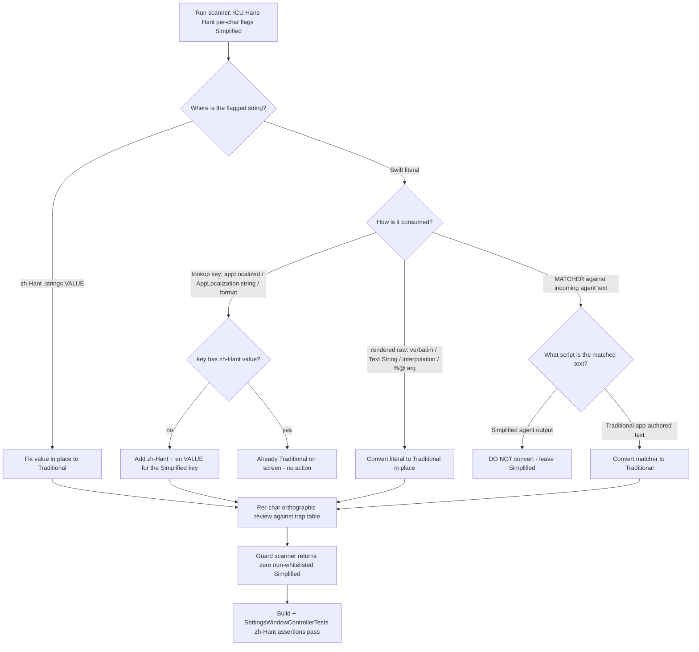

# Full-App Traditional Chinese Sweep — Design Spec

Date: 2026-07-04
Status: Design (implementation deferred; audit + plan only)
Owner goal: ZERO Simplified Chinese anywhere a user can see it — including picker/dropdown option labels and strings previously treated as "dictionary/lookup keys". A prior partial pass shipped in 0.24.4 (converted much of the app 簡→繁, made the language menu Traditional-only) but Simplified still leaks in the Settings GUI, dropdown menus, and runtime status text.

---

## 1. Problem Statement

The 0.24.4 pass fixed most `.strings` values but left three residual leak channels:

1. `.strings` values (right-hand side) that were only partially converted — a Simplified character survived inside an otherwise-Traditional value.
2. Localization **keys** referenced at runtime that have **no zh-Hant value** — `String(localized:)` falls back to the key itself, and the key is written in Simplified, so Simplified renders on screen.
3. **Hardcoded Simplified literals** that never went through localization at all — enum `title`/`subtitle` used as picker labels, `Text(verbatim:)` literals, and model-layer strings built by interpolation.

This spec inventories every leak, classifies each by fix strategy, and defines a guard so Simplified cannot reappear.

---

## 2. Localization Architecture (confirmed)

`PingIsland/Utilities/AppLocalization.swift`:

```
@MainActor enum AppLocalization {
    static func string(_ key) -> String            // String(localized: key, bundle: .main, locale: AppSettings.shared.locale)
    static func format(_ key, _ args...) -> String  // string(key) then String(format:)
}
extension Text { init(appLocalized key) { self.init(LocalizedStringKey(key)) } }
```

Locale bundles present: `PingIsland/Resources/en.lproj/Localizable.strings` and `PingIsland/Resources/zh-Hant.lproj/Localizable.strings`. There is **no** `zh-Hans.lproj`. The language menu (`AppLanguage` in `PingIsland/Core/Settings.swift`) offers only `system` / `traditionalChinese` / `english` — no Simplified case.

### The KEY-vs-VALUE rule (the crux)

- **Keys** (left of `=` in `.strings`; the string argument to `AppLocalization.string`/`format`/`Text(appLocalized:)`) are written in Simplified Chinese by project convention. They are **lookup identifiers, not display text**. Leaving keys Simplified is CORRECT and MUST NOT change — the existing test `PingIslandTests/SettingsWindowControllerTests.swift` deliberately asserts on Simplified key text (`"进入独立悬浮宠物模式后…" = …`) and its comment states the convention.
- **Values** (right of `=` in `zh-Hant.lproj`) are the on-screen text and MUST be Traditional. `en.lproj` values MUST be English.
- **Implication**: the sweep touches (a) every `zh-Hant` value, and (b) every user-visible hardcoded literal. It NEVER rewrites a key.

### Three ways a Simplified literal reaches the user

| Consumption | Localized? | Simplified leaks when… | Fix |
|---|---|---|---|
| `Text(appLocalized: key)` / `AppLocalization.string(key)` / `AppLocalization.format(key, …)` | Yes (looks up `key`) | `key` has no zh-Hant value → falls back to the Simplified key text | Add a zh-Hant (+en) **value** for that key. No code change. |
| `Text(verbatim: literal)` / `Text(stringVariable)` / string interpolation `"…\(x)…"` | No (rendered raw) | literal itself is Simplified | Convert the literal to Traditional in place (or route it through `AppLocalization`). |
| Simplified literal passed as a `%@` **argument** (e.g. `AppLocalization.format("%@ %@", kind.title, …)`) | No (argument is raw) | the argument value is Simplified | Convert the source literal (usually an enum `title`) to Traditional. |

`Text(verbatim: AppLocalization.format(key, …))` is safe once `key` has a zh-Hant value — `verbatim` only renders the already-localized result. The Simplified string there is a KEY.

---

## 3. End-to-End Conversion & Verification Flow



---

## 4. Inventory

Numbers below come from an ICU `Hans-Hant` per-character scanner run against `PingIsland/`, `PingIslandTests/`, `PingIslandUITests/`, `Prototype/Sources/` (scanner reproduced verbatim in the plan as the guard). "Flagged" = at least one CJK character whose Hans→Hant single-char transform changes it. Counts are a triage aid; the authoritative pass/fail is the guard scanner returning zero non-whitelisted hits.

### 4.1 Headline counts

| Bucket | Count | Action |
|---|---|---|
| `zh-Hant` `.strings` VALUES containing Simplified | 2 entries | Fix value in place |
| Keys present in `en.lproj` but MISSING from `zh-Hant.lproj` | 1 key | Add zh-Hant value |
| Distinct localization keys referenced from app Swift with NO zh-Hant value (fall back to Simplified) | ~41 keys (47 call sites) | Add zh-Hant (+en) values |
| App-code Swift literal rows flagged | 729 | see 4.4 |
| — of those: literal IS a registered key WITH a value | 350 | mostly no action (audit verbatim/`%@` sub-cases) |
| — of those: on a lookup-call line, key MISSING zh-Hant value | 47 (41 distinct) | add values |
| — of those: literal NOT a registered key | 146 | split below |
| Test-code Swift literal rows flagged | 315 | not user-visible; leave (adjust only if a test asserts a converted value) |

### 4.2 `.strings` value violations (fix in place)

`PingIsland/Resources/zh-Hant.lproj/Localizable.strings`:

| Line | Current value (Simplified survivor) | Corrected value |
|---|---|---|
| 54 | `在展開面板頂部顯示 Claude 與 Codex 的額度**占**用率與重置時間` | `…的額度**佔**用率與重置時間` |
| 168 | `最大日誌**占**用` | `最大日誌**佔**用` |

Missing key (in `en.lproj`, absent from `zh-Hant.lproj`) → add a zh-Hant value:

- Key `这会重新生成 %@ 的 Island 插件目录，并覆盖旧的 Island 托管版本。` (used by `ClientProfile.reinstallDescriptionFormat`, rendered at `IntegrationSettingsView.swift:32` via `Text(verbatim: AppLocalization.format(profile.reinstallDescriptionFormat, profile.title))`).

### 4.3 Missing-value lookup keys → add zh-Hant (+en) values (41 distinct)

These are Simplified strings passed to `Text(appLocalized:)` / `AppLocalization.string` / `AppLocalization.format` whose keys have no zh-Hant value, so the Simplified key renders. **Fix = add `.strings` entries; no Swift change.** Grouped by call site file:

| File | Keys (representative) |
|---|---|
| `UI/Views/Settings/Categories/AboutSettingsView.swift` (13) | `静默更新中`, `等待重启安装`, `正在安装更新`, `正在后台检查更新`, `发现新版本 v%@，将静默下载并安装`, `正在后台下载更新`, `正在准备安装更新`, `v%@ 已就绪，可立即重启安装，或等空闲时自动安装`, `正在静默安装并重启`, `后台更新失败，点击后重新检查` |
| `UI/Views/Settings/Categories/IntegrationSettingsView.swift` (11) | `添加自定义配置`, `添加自定义 Hook 配置`, `选择应用`, `请选择...`, `安装目录`, `选择目录`, `OpenClaw 可选择 ~/.openclaw 根目录，或已配置到 extraDirs 的 hooks 目录。`, `Hermes 可选择 ~/.hermes 根目录，或 plugins 目录。`, `安装后将写入: %@/%@`, `安装后将写入: %@`, `选择 Hook 配置目录`, `选择`, `静默时长` |
| `UI/Views/Settings/SettingsDetailRouter.swift` (5) | `正在加载%@设置…`, `正在刷新显示器与用量展示状态`, `正在扫描可用声音主题包`, `正在检查 Hooks、IDE 扩展与客户端安装状态`, `马上就好` |
| `UI/Views/ChatView.swift` (4) | `打开终端`, `%@ 已在客户端中发起追问，请打开并继续回答。`, `终端`, `已保留在终端中处理` |
| `UI/Views/SessionListView.swift` (3) | `Native runtime 正在处理…`, `Native session 已就绪`, `Native session 已结束` |
| `UI/Views/MascotSettingsView.swift` (2) | `空闲保护`, `全局键鼠静默达到设定时长后，宠物右下角会显示绿色盾牌，表示后续新审批和提问将保留在终端。` |
| `UI/Components/MascotView.swift` (1) | `%@ %@ 空闲保护中` |
| `UI/Views/CodexSessionView.swift`, `UI/Views/SessionHoverPreviewView.swift` | `终端` (shared key) |
| `UI/Views/Settings/Categories/DisplaySettingsView.swift` (1) | `宠物大小` |
| `UI/Views/Settings/Categories/RemoteSettingsView.swift` (1) | `端口需为 1 到 65535` |
| `Services/Remote/RemoteConnectorManager.swift` (1) | `下载地址无效：%@` |

Note: `IntegrationSettingsView.swift:1377 静默时长` and `DisplaySettingsView.swift:229 宠物大小` are also enum/label sites — same fix (add value).

### 4.4 Hardcoded display literals → convert to Traditional (≈117 sites, 23 files)

Simplified literals not registered as keys and rendered raw (`Text(verbatim:)`, `Text(String)`, interpolation, or `%@` argument). These are the picker/dropdown labels the owner explicitly called out (下拉選單) plus model-layer display text.

**Picker / dropdown option labels (enum `title`/`subtitle`, `displayName`)** — `PingIsland/Core/Settings.swift`:

| Enum | Sites | Simplified → Traditional |
|---|---|---|
| `UserIdleAutoProtectionDuration.title` | :164–170 | `10 分钟`→`10 分鐘`, `20 分钟`→`20 分鐘`, `30 分钟`→`30 分鐘`, `1 小时`→`1 小時` |
| `FloatingPetSizeMode.title`/`subtitle` | :272–286 | `标准`→`標準`, `较大`→`較大`, `按显示器分辨率调整，高分屏会更醒目`, `固定为旧版悬浮宠物尺寸`, `在所有显示器上放大宠物形象` |
| `SubagentVisibilityMode.title`/`subtitle` | :299–310 | `不显示`→`不顯示`, `主列表里隐藏挂靠在主 Agent 下的子 Agent 项`, `主列表里将明确的子 Agent 挂靠在主 Agent 下展示` |
| Mascot style `title` | :345–361 | `果冻史莱姆`, `团子猫`, `坐着猫`, `豆豆鸮`, `雪团鸮`, `正面团子兽`, `天线豆豆`, `侧身小恐龙` |
| Mascot style `subtitle` | :368–386 | `经典横向步行动画`, `软弹变形与高光晃动`, `尾巴摆动和眨眼反馈`, `一直端坐，支持更多表情动作`, `轻拍翅膀和点头观察`, `圆脸立姿与扑翼巡航`, `条纹圆身与振翅动画`, `早期口袋宠物式正面团子构图`, `大头小身与双角剪影`, `侧身尾巴外扩的经典小兽构图` |

`AppLanguage.title` (`Settings.swift:36`) `跟随系统`→`跟隨系統` — verify consumption; if via `Text(appLocalized:)` and a value exists it is safe, otherwise convert.

**Other enum/label sites**:
- `UI/Views/Settings/SettingsCategory.swift`: `实验室`→`實驗室`, `Agent、Token 与工具`→`Agent、Token 與工具`, `试验性特性`→`試驗性特性` (category titles; also consumed via `Text(appLocalized: category.title)` at `SettingsRootView`/`SettingsDetailRouter`, so `.strings` values are the alternative fix).
- `Core/SoundPackCatalog.swift:272`: `未选择`→`未選擇` (sound pack fallback `displayName`, shown raw in the sound picker).
- `UI/Components/MascotView.swift` `kind.subtitle` (:81–113) integration blurbs and `defaultMascotName` (:313–338): `桌前橘猫`, `终端云团`, `蓝色双子星灵`, `翼盔信使狐`, `π 轨道终端星核`, `薄荷围巾卡皮巴拉`, `双钳小龙虾`, `高高的白色小章鱼`, `黑曜晶体`, `Q 仔`, `宇航员猫`, `黑框眼镜机器人`, `Kimi 蓝色键盘球`, plus the hook-summary lines (`Hermes plugin hooks 与翼盔信使狐`, etc.). `kind.title` is used three ways (`Text(kind.title)` raw, `%@` arg, `AppLocalization.string(kind.title)` lookup) → convert the literal to Traditional for uniform display.

**Model-layer interpolated display strings** (nonisolated — CANNOT call `AppLocalization`; convert literal in place):
- `Models/SessionState.swift` — see 4.5 for the matcher vs display split.
- `Models/SessionEvent.swift:382,383,452,453,467,469`: `\(actorName) 请求处理`, waiting/summary/question strings → Traditional.
- `Models/SessionProvider.swift:477,1081`: `\(ideTitle) 终端`, intervention hint → Traditional.
- `Services/Session/ConversationParser.swift:1045,1048,1240,1241,1258,1480,1481,1487`: `问题：`/`回答：` preview builders, Qoder question titles → Traditional.
- `Services/State/SessionStore.swift:4147,4148,4173,4198,4199,4205`: question card titles/messages → Traditional (the 4243–4288 block is a MATCHER, see 4.5).
- `Models/ClientProfile.swift:300–304` `reinstallDescriptionFormat` and `subtitle` fields (`管理 ~/.pi/agent/... 接入 Island`, etc.) → Traditional.

**View-layer raw literals**:
- `Services/Update/NotchUserDriver.swift` (17 sites, :37–603): update status/error messages (`更新源已准备就绪`, `当前系统版本过低，无法安装可用更新`, `更新失败，请稍后再试`, `网络不可用，请检查连接后重试`, …). `@MainActor` class → may convert literal or route through `AppLocalization`; convert-in-place is minimal.
- `UI/Views/NotchView.swift:750,1872`: `需要处理`→`需要處理`, `设置`→`設定`.
- `UI/Views/SessionListView.swift:385,386`: `选择 \(provider.displayName) Native Runtime 工作目录`, `启动`→`啟動`.
- `UI/Views/Settings/Categories/AboutSettingsView.swift:21,23,29,59,60`: `隐私与分析`, `匿名使用统计`, `采集范围`, `立即重启安装`, `不等待空闲，立即退出 Ping Island 并完成已下载的更新`.
- `UI/Views/Settings/Categories/DisplaySettingsView.swift:35,99,100`: display-mode blurb, `宠物大小`, auto-mode blurb.
- `UI/Views/Settings/Categories/IntegrationSettingsView.swift:89,90,96,98,99`: idle-protection toggle labels/blurbs.
- `UI/Views/Settings/Categories/LabsSettingsView.swift:6,30,34`: `实验室`, `暂无可用实验`, labs blurb.
- `UI/Views/Settings/Categories/SoundSettingsView.swift:390`: `试听`→`試聽`.
- `UI/Views/Settings/Categories/RemoteSettingsView.swift:324` and `Services/Remote/RemoteConnectorManager.swift:1841,2068,2395`: SSH/remote error strings.
- `UI/Views/Settings/SettingsPanelViewModel.swift:470`: Qoder CLI detection blurb.
- `UI/Views/ChatView.swift:683`, `UI/Views/CodexSessionView.swift:197`, `UI/Views/SessionHoverPreviewView.swift:667`: `已保留在%@中处理。Ping Island 只提醒，不接管此处响应。` — this literal is the KEY of a `Text(verbatim: AppLocalization.format(…))` call, so it is fixed by adding a zh-Hant value (4.3-style), NOT by editing the literal.

### 4.5 MUST-NOT-CONVERT: matcher literals against incoming Simplified agent text

These Simplified literals are compared with `.contains`/equality against text produced by the agent CLIs, which emit Simplified. Converting them silently breaks matching. They are never rendered.

| File | Lines | What it matches |
|---|---|---|
| `Models/SessionState.swift` | :725,726,728,729,731 (exact), :745,746,748 (contains), :797,798,800,801,817,818 | progress/phase detection: `处理中`, `正在处理`, `加载中`, `准备中`, `正在压缩上下文`, `工作中`, `思考中`, `压缩上下文`, `运行中` |
| `Services/State/SessionStore.swift` | :4243,4244,4252,4253,4268,4269,4270,4271,4280,4281,4287,4288 | Qoder question-intent detection: `问您一个问题`, `询问\s*(\d+)\s*个问题`, `使用提问工具向您询问`, `问我一个问题`, … |

These 26 rows are the guard whitelist. (Optional robustness, OUT OF SCOPE: additionally accept Traditional variants so the matcher also fires on Traditional agent output — a behavior change, not a display fix.)

### 4.6 Special case: matcher against Traditional app-authored text → CONVERT

`Services/Update/UpdateReleaseNotes.swift:35,39,47` — `iconSymbolName` does `title.contains("亮点")`, `.contains("修复")`, `.contains("关联 pr")` against release-notes section titles. Release notes are authored in **Traditional** (`releases/notes/<version>.md` per the repo Release Notes Rule), so these Simplified matchers never fire on real notes. Converting them to `亮點` / `修復` / `關聯 pr` both removes Simplified AND fixes the icon selection. This is the inverse of 4.5 — same "matcher" shape, opposite decision, because the matched text is Traditional here.

---

## 5. Character-Correction Rules (orthographic verification)

The ICU `Hans-Hant` transform is a hint, not authority. Per the owner's rule (verify each character; never substitute a visually/phonetically similar wrong form), the following one-to-many mappings appear in the data and MUST be hand-checked. ICU is WRONG or INCOMPLETE for the first block.

### 5.1 Traps — ICU/naive conversion is WRONG here

| Word (Simplified) | ICU/naive (WRONG) | Correct | Why | Sites |
|---|---|---|---|---|
| 复制 | 復製 | **複製** | 复=complex/duplicate → 複; 制 here = 製 | `RemoteConnectorManager` `SCP 复制失败` |
| 回复 | 回復 | **回覆** | 复=reply → 覆 | `Hermes 的真实回复内容`, `这是模型最后一句真正的回复。` |
| 答复 | 答復 | **答覆** | 复=reply → 覆 | `最终答复` |
| 标准 | 標准 | **標準** | 准 here = 準 (standard); ICU leaves 准 unchanged | `Settings.swift 标准`, `…固定为标准尺寸…` |
| 准备 | 准备 | **準備** | 准 here = 準 (prepare); ICU leaves 准 unchanged | `准备中`, `更新源已准备就绪`, `正在准备安装更新` |
| …列表里 / 这里 / 预览里 | …里 | **…裡** (or 裏) | 里 (locative) → 裡; ICU leaves 里 (valid as village/li) | `主列表里…`, `显示在这里`, `hover 预览里…` (19 literals) |
| 对应关系 | 對應关係→系 | **對應關係** | 系 here = 係 (relation); ICU leaves 系 | `客户端对应关系` |

### 5.2 Confirmed-correct (still verify, but ICU is right in context)

| Word | Correct | Note |
|---|---|---|
| 占用(率) | **佔用** | occupancy — the actual `.strings` survivor (占>佔) |
| 后台 / 之后 / 后续 | **後**台 / 之後 / 後續 | all temporal/background 後; none are 皇后 (90 literals) |
| 发现 / 发送 / 转发 / 发起 / 触发 / 发布 / 开发 | **發** / 轉發 / 觸發 / 發布 / 開發 | all 發; none are 頭髮 (31 literals) |
| 范围 | **範圍** | scope 範; not surname 范 (7 literals) |
| 干净 | **乾淨** | clean 乾; not 幹 (do) (1 literal) |
| 修复 / 恢复 | **修復** / 恢復 | 复=resume/restore → 復 (correct, unlike 4.1) |
| 系统 | **系統** | 系 stays 系 here (system), unlike 关系→關係 |
| 只显示 / 只提醒 / 只保留 | **只**顯示 / 只提醒 / 只保留 | adverb "only" → 只 unchanged; not measure word 隻 |

### 5.3 Full distinct Simplified→Traditional pairs found (reference)

与與 专專 两兩 个個 临臨 为為 么麼 义義 乐樂 于於 云雲 仅僅 从從 仓倉 价價 优優 会會 传傳 体體 侧側 关關 兴興 兽獸 内內 写寫 冻凍 净淨 凭憑 击擊 刘劉 则則 刚剛 删刪 别別 务務 动動 区區 协協 单單 占佔 历歷 压壓 双雙 发發 变變 号號 后後 听聽 启啓 员員 响響 团團 围圍 图圖 圆圓 块塊 声聲 处處 备備 复復 头頭 学學 实實 宠寵 审審 宽寬 对對 导導 将將 层層 属屬 岛島 带帶 帮幫 干乾 并並 库庫 应應 开開 异異 弹彈 当當 录錄 径徑 态態 悬懸 户戶 扑撲 执執 扩擴 扫掃 护護 拟擬 择擇 挂掛 换換 据據 摆擺 数數 断斷 无無 旧舊 时時 显顯 暂暫 机機 权權 条條 来來 构構 标標 桥橋 检檢 横橫 欢歡 没沒 洁潔 测測 滚滾 灵靈 点點 烁爍 状狀 独獨 猫貓 环環 现現 画畫 监監 盖蓋 盘盤 着著 码碼 础礎 确確 离離 种種 称稱 稳穩 简簡 类類 约約 级級 纹紋 线線 组組 细細 终終 经經 结結 给給 络絡 绝絕 统統 继繼 绪緒 续續 绿綠 编編 缩縮 网網 联聯 胶膠 脸臉 范範 荐薦 莱萊 获獲 蓝藍 虾蝦 补補 装裝 观觀 规規 视視 览覽 触觸 计計 认認 让讓 议議 记記 设設 访訪 证證 识識 诉訴 诊診 试試 话話 询詢 该該 详詳 语語 误誤 说說 请請 读讀 调調 败敗 贴貼 费費 资資 跃躍 踪蹤 轨軌 转轉 轮輪 软軟 轻輕 载載 较較 辅輔 辑輯 输輸 达達 过過 运運 还還 这這 进進 远遠 连連 迟遲 适適 选選 采採 钟鐘 钥鑰 钮鈕 钳鉗 链鏈 错錯 键鍵 镜鏡 长長 闪閃 闭閉 问問 闲閒 间間 阶階 险險 随隨 隐隱 静靜 页頁 顶頂 项項 预預 题題 颜顏 额額 风風 饰飾 馈饋 马馬 验驗 鱼魚 鸮鴞 龙龍

(The pairs above are the mechanically-safe ones; §5.1 lists every context where the mechanical mapping is NOT safe.)

---

## 6. Edge Cases

- **Keys must stay Simplified.** Never convert a `.strings` left-hand side or a `key` argument. `SettingsWindowControllerTests` asserts on Simplified keys; those assertions must keep passing unchanged.
- **`verbatim` + `AppLocalization.format`**: the wrapped literal is a KEY; fix by adding a value, not by editing the literal (`ChatView`/`CodexSessionView`/`SessionHoverPreviewView` terminal-routed notice; `IntegrationSettingsView:32` reinstall description).
- **Enum `title` used in mixed ways** (`MascotKind.title`: `Text(String)` raw + `%@` arg + `AppLocalization.string` lookup): convert the literal to Traditional so all three paths render Traditional; the lookup path then falls back to the Traditional key text (acceptable — English was already not localized for these).
- **Matcher direction depends on the matched text's script**: agent CLI output = Simplified (leave matcher Simplified, §4.5); app-authored release notes = Traditional (convert matcher, §4.6). Decide by what the string is compared against, not by the string's shape.
- **Nonisolated model code** (`SessionState`, `SessionEvent`, `SessionProvider`, `ConversationParser`, `ClientProfile`, `SessionStore`) MUST NOT call `AppLocalization` (main-actor isolated on CI). Display literals there are converted in place; do not "route through localization".
- **Test files** (`PingIslandTests/*`, `PingIslandUITests/*`, 315 flagged rows) are not user-visible. Leave them, EXCEPT where a test asserts on a value that this sweep changes (e.g. a zh-Hant value the test string-matches) — update the assertion to the new Traditional value.
- **`Prototype/`** produced zero display violations in scope; keep it out of the sweep unless the guard flags it.
- **`.xcstrings`**: none present; only `.strings`. `InfoPlist.strings` had no violations.

---

## 7. Success Criteria

1. `PingIsland/Resources/zh-Hant.lproj/Localizable.strings` contains zero Simplified characters in any VALUE (right of `=`). Keys unchanged.
2. Every localization key referenced from app Swift has a zh-Hant value (no fallback-to-Simplified-key on screen).
3. Every user-visible hardcoded literal in app (non-test) code renders Traditional, verified by the guard scanner returning zero hits outside the §4.5 whitelist.
4. §5.1 trap words are corrected to the context-correct form (複製 / 回覆 / 答覆 / 標準 / 準備 / …裡 / 關係), not the ICU default.
5. `xcodebuild -project PingIsland.xcodeproj -scheme PingIsland -configuration Debug build` succeeds.
6. `SettingsWindowControllerTests` zh-Hant assertions still pass (keys stayed Simplified, English values unchanged).
7. A guard (test or CI ripgrep/scanner) fails if Simplified reappears in zh-Hant values or user-visible literals.
8. Manual spot-check of the Settings GUI (every dropdown/picker: display mode, pet size, subagent visibility, mascot style, sound theme + pack, idle duration, language, category sidebar) shows no Simplified.

---

## 8. Out of Scope

- Adding Simplified Chinese as a supported UI language (explicitly the opposite of the goal).
- Making matchers (§4.5) also accept Traditional agent output (robustness, not a display fix).
- English-localizing strings that currently have only Chinese values (pre-existing gap; the sweep may add en values opportunistically where it already touches the key, but is not required to backfill English everywhere).
- Refactoring nonisolated model strings to a key-based localization scheme.
