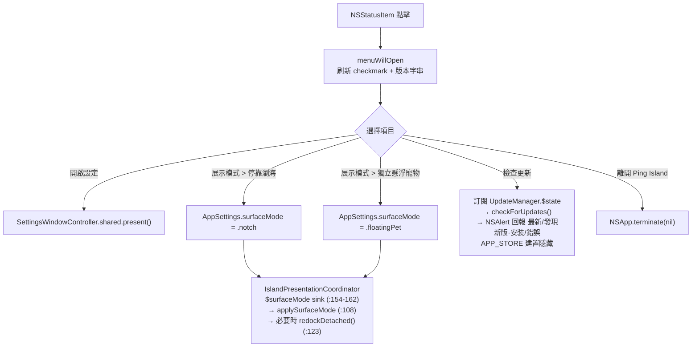
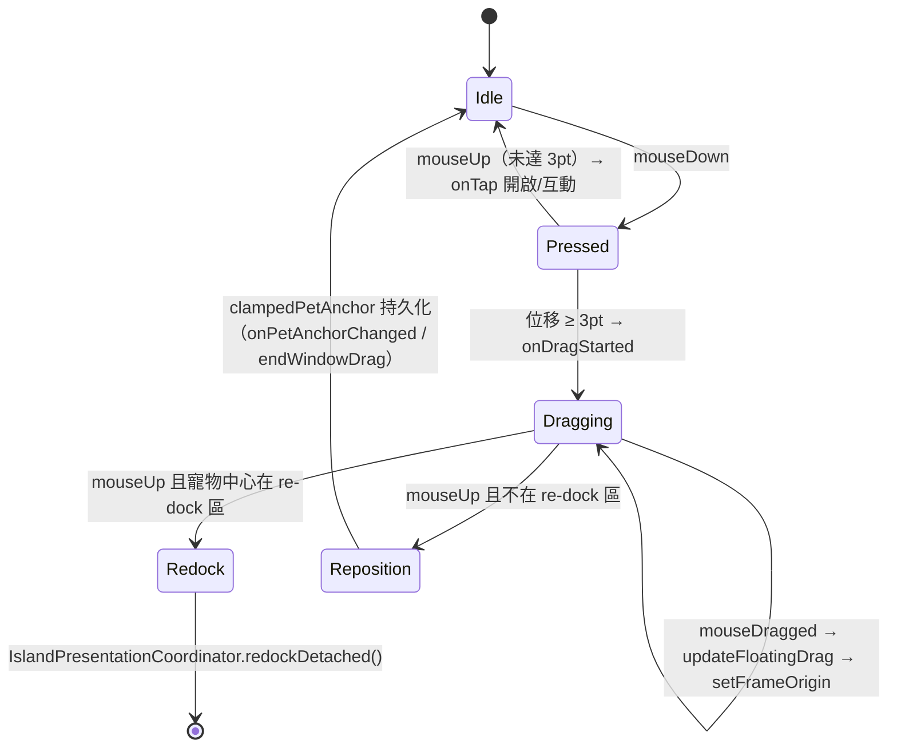

# 設計規格：常駐選單列狀態項 + 懸浮寵物拖曳修復與拖回瀏海

- 日期：2026-07-04
- 狀態：已核准（approved）
- 對應 plan：`docs/superpowers/plans/2026-07-04-menubar-status-item-and-pet-drag.md`

## 問題

PingIsland 是 accessory(輔助程式) 型 app（`NSApplication.setActivationPolicy(.accessory)`，由 `AppLaunchConfiguration` 設定），沒有 `NSStatusItem`。設定視窗唯二入口是點擊停靠瀏海或獨立懸浮寵物（`SettingsWindowController.shared.present()`）。在懸浮寵物模式（`AppSettings.surfaceMode = .floatingPet`，`PingIsland/Core/Settings.swift:230` 的 `IslandSurfaceMode { case notch, floatingPet }`，持久化 key `"surfaceMode"`）下，若寵物無法點擊或拖曳，使用者會被鎖在設定外，只剩改 `defaults` 一條路。

本規格分兩部分：

- Part A：常駐選單列狀態項，作為永遠可用的逃生口（escape hatch）。
- Part B：修復「寵物本體拖不動」的執行期問題，並新增「拖到螢幕頂部中央即重新停靠（re-dock）」。

---

## Part A：常駐選單列狀態項

### 結構

新增 `StatusBarController`（`PingIsland/App/StatusBarController.swift`，由 `AppDelegate` 持有生命週期），建立一個永遠可見的 `NSStatusItem`：

- 圖示：Ping Island template icon(範本圖示)，優先重用 bundled app icon / symbol 資產，找不到時退回 SF Symbol。
- 掛一個 `NSMenu`，`StatusBarController` 實作 `NSMenuDelegate`，在 `menuWillOpen` 時刷新 checkmark(勾選標記) 與版本字串。
- 常駐、無隱藏設定。不提供關閉此狀態項的選項（它就是逃生口，藏起來就失去意義）。

### 選單項目

| 項目 | 類型 | 行為 |
| --- | --- | --- |
| 開啟設定 | action | `SettingsWindowController.shared.present()` |
| 展示模式 | submenu | 見下表 |
| ──（分隔線） | separator | — |
| Ping Island v\<CFBundleShortVersionString\> (build \<CFBundleVersion\>) | disabled | 純顯示，`menuWillOpen` 時從 `Bundle.main` 重新讀值 |
| 檢查更新 | action | 直接彈 `NSAlert` 小視窗回報,不開設定 GUI。訂閱 `UpdateManager.shared.$state`(`.dropFirst()` 略過重播值)、呼叫 `checkForUpdates()`(`PingIsland/Services/Update/NotchUserDriver.swift:204`),用小階段機處理結果:`.upToDate` → 「目前已經是最新版本」[好];`.found` / `.readyToInstall` → 「發現新版本 v%@／是否立即重新啟動並安裝?」[安裝][取消],確認後若已下載完成即 `installAndRelaunch()`,否則等自動下載完成再裝;`.error` → 顯示訊息[好];`.checking/.downloading/.extracting/.installing/.idle` 靜默等待。accessory app 先 `NSApp.activate(ignoringOtherApps:)` 再 `runModal`。App Store 建置以 `#if APP_STORE`（同 `NotchUserDriver.swift:4` / `:46` 的既有 pattern）整個隱藏此項 |
| ──（分隔線） | separator | — |
| 離開 Ping Island | action | `NSApp.terminate(nil)` |

「展示模式」submenu：

| 項目 | checkmark 條件 | 行為 |
| --- | --- | --- |
| 停靠瀏海 | `AppSettings.surfaceMode == .notch` | 設 `AppSettings.surfaceMode = .notch`；若目前為 detached(分離) 狀態，等同重新停靠——`IslandPresentationCoordinator` 的 `$surfaceMode` sink（`IslandPresentationCoordinator.swift:154-162`）會經 `applySurfaceMode`（`:108`）套用，內部走 `redockDetached()`（`:123`） |
| 獨立懸浮寵物 | `AppSettings.surfaceMode == .floatingPet` | 設 `AppSettings.surfaceMode = .floatingPet`，同樣由 `$surfaceMode` sink 套用 |

狀態項只寫 `AppSettings.surfaceMode`，不直接呼叫 coordinator——沿用既有的單一套用路徑，避免第二條 mutation 路線。

### 選單動作流程

### i18n

依 repo 慣例：localization key 用簡體（查找識別字），`zh-Hant.lproj` value 用繁體，`en.lproj` 補英文；全部須通過 `swift scripts/check-simplified-chinese.swift`。

> 註：下表「key（簡體）」欄裡的簡體字（如 `检查更新`、`退出应用`、`打开设置`、`刘海屏方式`、`独立悬浮宠物`）是 localization **key 識別碼**，不是要顯示給使用者的文字。畫面實際顯示的一律是對應的繁體 value（例如 key `检查更新` → value「檢查更新」）。這是本專案刻意的慣例，guard scanner 只擋 `zh-Hant.lproj` 的 value 與 Swift 顯示字面量，不擋 key 也不掃 docs。

優先重用既有 key：

| 用途 | key（簡體） | 既有/新增 | 依據 |
| --- | --- | --- | --- |
| 檢查更新 | `检查更新` | 既有 | `zh-Hant.lproj/Localizable.strings:219`（value「檢查更新」） |
| 離開 Ping Island | 實作時先查 `退出应用`（`:40`，value「結束應用程式」）是否語意合用；選單需帶 app 名，若不合則新增 | 待定 | — |
| 開啟設定 | 新增（現無獨立「打开设置」key） | 新增 | grep 無 bare key |
| 展示模式 / 停靠瀏海 / 獨立懸浮寵物 | 實作時先查設定視窗 surface-mode picker 既有 key（`zh-Hant.lproj` 已有「刘海屏方式」`:69`、「独立悬浮宠物…」`:103` 等相鄰文案），有就重用，否則新增 | 待定 | — |

註：核准稿中「停靠刈海」判定為「停靠瀏海」的錯字（「刈」U+5208 為形近誤字；repo zh-Hant 既有 value 一律用「瀏海」），本規格採「瀏海」。

---

## Part B：寵物拖曳修復 + 拖到頂部中央重新停靠

### 拖曳鏈實際上是兩層，真正生效的是視窗層

診斷發現拖曳有兩條平行實作，之前的靜態讀碼只看到 NSView 那條（其實是 dead path）：

1. **NSView 層（實際 dead）**：`DetachedPetInteractionView`（`DetachedIslandPanelView.swift:1098`）以 `.overlay` 安裝（`:972-987`），有 `mouseDown`/`mouseDragged`/`mouseUp`。但它幾乎收不到 `mouseDown`，因為視窗層先攔截。
2. **視窗層（實際 live）**：`DetachedIslandWindow.sendEvent`（`DetachedIslandWindowController.swift:15-33`）攔截所有 leftMouse 事件，先問 `petMouseDownHandler` / `petMouseDraggedHandler` / `petMouseUpHandler`（`:288-296` 綁定）→ `handlePetMouseDown/Dragged/Up`（`:1065` 起）。命中寵物（`isPointInsidePet` → `petInteractionFrame`）就 `return true` 消化事件，永不 `super.sendEvent`，所以 NSView 那層拿不到 mouseDown。
3. 視窗層拖曳流向：`handlePetMouseDragged` 過 3pt 門檻 → `beginFloatingDrag`（`:457`）→ `updateFloatingDrag`（`:467`）→ `window.setFrameOrigin`；`handlePetMouseUp` 依 `isPetDragActive` 分流 `endFloatingDrag`（`:484`）或 `onPetTap`。

### 根因判定（執行期實測）

**核准稿的「寵物拖不動」在現行 HEAD 無法重現。以視窗層 instrumentation 實測(2026-07-05)確認拖曳與點擊都正常：**

- `handlePetMouseDown` `inside=true`、`handlePetMouseDragged` 98 筆 `active=true`、`window.setFrameOrigin` 逐格移動視窗、`handlePetMouseUp active=true → endFloatingDrag` — 拖曳完整生效。
- 另有兩次 `mouseUp active=false insideOnUp=true → onPetTap` — 點擊生效（開通知泡泡）。
- 第一輪把 log 加在 NSView 層看到 `mouseDown=0`，是因為量錯層(視窗層先消化),不是 bug。

**先前候選表全部作廢**：transform 順序、first-mouse、狀態閘門、bubble 搶 hit-test 均非根因，因為視窗層根本不經過那些路徑。

真正的問題有二，都不是「拖曳鏈壞掉」：

1. **設定無明顯入口**：左鍵開通知泡泡、右鍵才開設定（`handlePetSecondaryClick → SettingsWindowController.present()`），右鍵完全沒有提示。這是 lockout 的主因，由 Part A 常駐選單解決。
2. **偶發卡頂**：使用者回報「卡在 top menu 上面」（寵物拖到螢幕頂端系統選單列一帶後短暫點不到/拖不動），為 transient，實測期間無法穩定重現。Part A 常駐選單讓此情況不再是死路（永遠能開設定切回停靠瀏海）。若日後能穩定重現再獨立追。

**Part B 因此縮編**：無拖曳修復可做（Task 4 取消）；拖到頂部中央 re-dock 已於 `#219`（commit `805d4fb`）實作(`isPetAnchorInNotchZone` + `endFloatingDrag → onRedockRequested`)，Task 5 降為驗證既有行為。核心交付集中在 Part A。

### 行為契約（behavior contract）

| 情境 | 預期行為 |
| --- | --- |
| 在寵物本體按下並拖曳（任何寵物狀態：compact、hover bubble、notification bubble、pinned bubble） | 懸浮視窗跟隨移動；放開後以 clamp(夾限) 後的 anchor 持久化（`clampedPetAnchor` `DetachedIslandWindowController.swift:945`、`onPetAnchorChanged` `:491`、`endWindowDrag` `:497`） |
| 拖曳中進入頂部中央 re-dock 區並放開 | 呼叫 `IslandPresentationCoordinator.redockDetached()`（`IslandPresentationCoordinator.swift:123`）回到停靠瀏海 |
| 拖曳到其他位置放開 | 純 reposition（重新定位），維持現行為 |
| 點一下（未達 3pt 門檻） | 照舊開啟 / 互動（`onTap`），不觸發拖曳或 re-dock |

### 拖曳狀態機

### Re-dock 區幾何

鏡射停靠側 drag-to-detach 既有機制（`NotchViewModel` 的 `DockedDetachmentTracking` + `onDetachmentRequested/Updated/Finished`，coordinator 側 `beginDetachment/updateDetachment/finishDetachment`，binding 位於 `IslandPresentationCoordinator.swift:142-152`）。

| 參數 | 值 | 說明 |
| --- | --- | --- |
| 判定點 | 寵物 hit frame 中心（螢幕座標） | 拖曳中每次位移後計算 |
| 區域 | 以目前螢幕 `screenRect.midX` 為中心、寬 240pt、自螢幕頂緣向下 60pt 的矩形 | 對準停靠瀏海位置；數值為初始值，實作時可依 notch 實寬微調，但變更須回寫本表 |
| 觸發條件 | mouseUp 時中心在區域內，且拖曳已越過 3pt 門檻 | 純點擊永不觸發 |
| 判定實作 | 純函式 `contains(petCenter:screenRect:) -> Bool` | 可單元測試，不依賴視窗 |
| 拖曳中回饋 | 進入區域時視窗端切換一個「即將停靠」狀態旗標（最小實作：無視覺亦可，但旗標須存在以供測試與後續 UI 掛載） | 不做新動畫，避免超出範圍 |

### 檔案改動清單

| 檔案 | 改動 |
| --- | --- |
| `PingIsland/App/StatusBarController.swift`（新增） | NSStatusItem + NSMenu + NSMenuDelegate；選單建構抽成純邏輯以便測試 |
| `PingIsland/App/AppDelegate.swift` | 持有並初始化 `StatusBarController` |
| `PingIsland/App/IslandPresentationCoordinator.swift` | 提供選單「展示模式」切換入口（改寫 `AppSettings.surfaceMode` 即走既有 `$surfaceMode` sink，無需新增方法） |
| `PingIsland/Resources/zh-Hant.lproj/Localizable.strings`、`en.lproj/Localizable.strings` | Part A 新增字串 |
| `PingIslandTests/`（root Xcode 測試 target） | 選單建構純邏輯測試（項目順序、checkmark 跟隨 surfaceMode、版本字串、App Store 分支不含檢查更新） |
| `AGENTS.md` | 補 StatusBarController 入口與 change-routing 條目 |

Part B 診斷後不再有程式改動：拖曳修復取消（無 bug），re-dock 已於 `#219` 實作，僅驗證。

### 邊界條件

- App Store 建置：`檢查更新` 以 `#if APP_STORE` 隱藏或走 stub `UpdateManager`（`NotchUserDriver.swift:46-86`），不得引入 Sparkle 相依。
- 多螢幕：re-dock 區以寵物視窗當下所在螢幕的 `screenRect` 計算，不寫死主螢幕。
- 停靠模式下狀態項仍常駐；「展示模式 > 停靠瀏海」在已停靠時為 no-op（sink 套用同值）。
- 拖放 re-dock 與 submenu 切模式最終走同一條 `redockDetached()` 路徑，不得出現重複視窗（對應 AGENTS.md 驗證清單的 detach/re-dock 條目）。
- 右鍵寵物開設定的既有行為不受拖曳修復影響。

### 成功條件

1. 任何模式下選單列都有 Ping Island 狀態項；開啟設定、切換展示模式、檢查更新、離開全部可用；checkmark 與版本字串在 `menuWillOpen` 時正確。
2. 懸浮寵物在 compact 與各 bubble 狀態下，按住本體拖曳都能移動視窗並持久化 clamp 後位置。
3. 拖到頂部中央區放開會 re-dock；其他位置放開為 reposition；純點擊行為不變。
4. `swift scripts/check-simplified-chinese.swift`、`./scripts/test.sh`、root `PingIslandTests` 全數通過；主 scheme 可建置。
