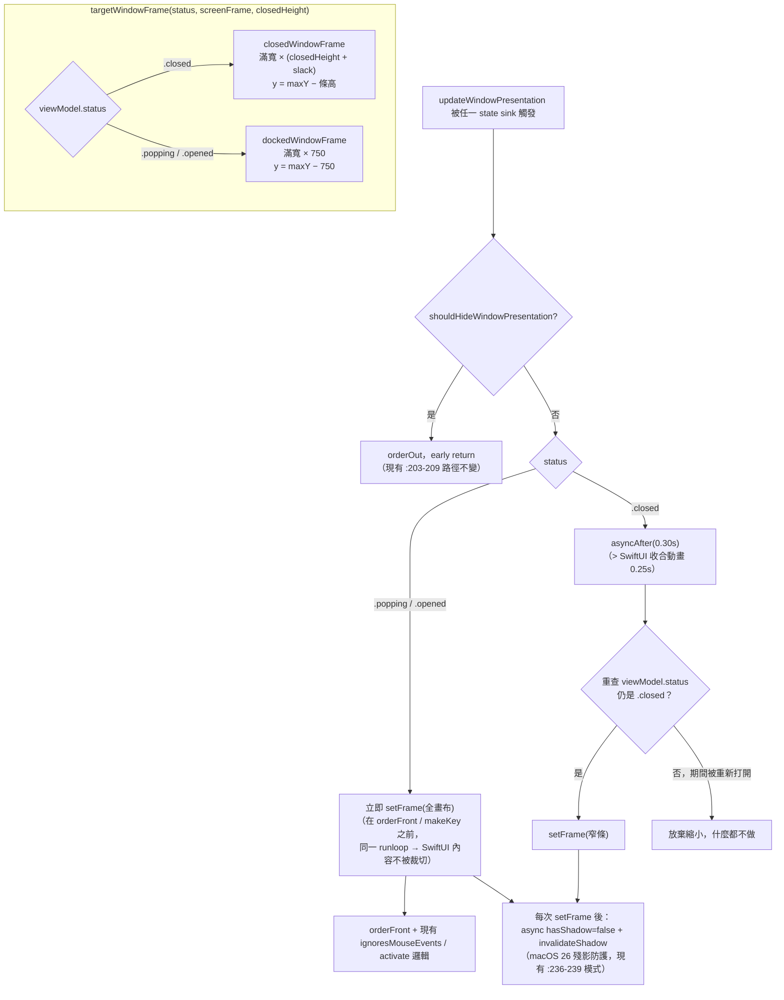

# Notch 閒置視窗框縮減（state-based frame scaling）Design

> 停靠 notch 視窗（`NotchPanel`）目前無論開合都是固定 750pt 高、滿螢幕寬、貼頂的透明框。改成依 `NotchViewModel.status` 縮放：`.closed` 用貼頂窄條（closedHeight + slack），`.popping` / `.opened` 才撐回 750 全畫布。開啟前先長大（同一 runloop），關閉後延遲 0.30s 再縮小。

日期：2026-07-04
狀態：已核准，待實作

## 問題

`NotchWindowController` 建出的 `NotchPanel` 是固定的 `dockedWindowFrame`：滿螢幕寬 × 750pt、貼頂（`PingIsland/UI/Window/NotchWindowController.swift:18` `static let windowHeight: CGFloat = 750`，`:21-28` `dockedWindowFrame(screenFrame:)`）。這個框永遠不縮——關閉時也是 750。

視窗在螢幕上、alpha 1、透明（`PingIsland/UI/Window/NotchWindow.swift:32` `isOpaque = false`、`:35` `backgroundColor = .clear`、`:36` `hasShadow = false`、`:50` `level = .mainMenu + 3`），`sharingType` 維持預設。所以截圖工具的視窗選取器（CGWindowList 為基礎）會把它整塊框出來：一個蓋住螢幕上半（1440pt 高螢幕約 52%）的可選取區域，壓在前景 app 上。點擊會穿透（關閉時 `ignoresMouseEvents = true`），使用者操作上看不到它，但擷取選取器看得到。這是 NotchDrop 式「固定最大畫布、SwiftUI 在裡面動畫 pill」的設計代價。

## 目標與範圍

> 修訂（2026-07-04，實機檢視後）：原本 `.closed` 用「滿螢幕寬」窄條是為了不動 hitTest 的水平置中數學。改成**置中窄框**——視窗寬固定為 `panelWindowWidth`（≈ 最大 docked 展開面板寬 600 + hit padding，取 700），置中在螢幕中央；`.opened`/`.popping` 同樣只有 700 寬（展開面板最寬 `min(screenWidth-64, 600)`，放得下），不再滿螢幕寬。`.closed` 高度 = `closedHeight` + 小 slack（24，動態跟著 closedHeight）。擷取框因此在寬與高兩個方向都縮到面板本身大小。

做：

1. 新增 `panelWindowWidth`（常數 700）；`dockedWindowFrame` 與 `closedWindowFrame` 都改成**置中**（`x = screenFrame.midX − panelWindowWidth/2`、`width = panelWindowWidth`）。`closedWindowFrame(screenFrame:closedHeight:)` 高度 = `closedHeight` + `closedFrameSlack`(24)。
2. `updateWindowPresentation` 依 `viewModel.status` 選目標框：`.closed` → 置中窄框；`.popping` / `.opened` → 置中全高框（700 × 750）。開啟前先長大、關閉後延遲縮小（時序見下方流程圖）。
3. `NotchViewController.panelHitRect` 的水平置中改用**視窗寬**（closure 傳 `view.window?.frame.width`），不再用 `geometry.screenRect.width`；高度來源改讀即時視窗高（`view.window?.frame.height`，nil 時 fallback `geometry.windowHeight` / `screenRect.width`），讓 hit-test 跟著置中窄框走。
4. `moveToScreen` 依「當前 status」重算框（置中窄框 vs 置中全高框）。

不做（明確排除，無 scope creep）：

- **不改 `sharingType`**：設成 `.none` 會連使用者自己的截圖／錄影都看不到 notch UI，對這個產品是倒退。維持預設，明確接受下方「殘留限制」。
- 不做 pill-only-box 變體（視窗縮到只剩 pill 大小、hit-test 全面重寫置中座標）——那才能讓擷取選取器完全看不到，但改動面大很多，未被選擇。
- 不加設定開關。

## 方案：status 驅動的目標框 + 時序

單一 resolver 決定目標框，`updateWindowPresentation` 與 `moveToScreen` 共用，避免兩處各算一份。

時序規則（文字為準，圖只示意流向）：

- **先長大再顯示**：長到全畫布必須發生在視窗 show／開啟動畫之前的同一 runloop（`updateWindowPresentation` 內 setFrame 本來就在 `:215-217` orderFront 之前，維持這個順序），SwiftUI 展開內容才不會被舊的窄框裁掉。
- **延遲縮小**：回到 `.closed` 時延遲 **0.30s**（大於 `NotchViewModel.swift:240-241` `.easeOut(duration: 0.25)` 的 SwiftUI 收合動畫）再縮，縮之前**重查一次 `viewModel.status == .closed`**——延遲期間若被重新打開就放棄縮小。多個排隊中的縮小 callback 各自重查，天然冪等，不需要 generation token。
- **隱藏路徑不變**：`shouldHideWindowPresentation`（`NotchViewModel.swift:669`；detached / fullscreen-browser-hidden / edge-reveal / idle-auto-hide / quiet-background）仍走 `:203-209` 的 orderOut early-return，在任何框邏輯之前。
- **陰影重申不變且擴大覆蓋**：macOS 26 會在內容繪製後重推導 window shadow，現有 `:236-239` 的 `hasShadow = false` + `invalidateShadow()` async 重申必須在**每一條 setFrame 路徑之後**都跑到，包含新的延遲縮小路徑與 `moveToScreen`。

## 資料契約

| 項目 | 值 | 說明 |
|---|---|---|
| `.opened` 視窗框 | 滿寬 × 750，`y = screen.maxY − 750` | 現有 `dockedWindowFrame`（`NotchWindowController.swift:21-28`）不變 |
| `.popping` 視窗框 | 同 `.opened`（750 全畫布） | boot 動畫／completion popup 的放大不被裁切 |
| `.closed` 視窗框 | 滿寬 × (`closedHeight` + `closedFrameSlack`)，`y = screen.maxY − 條高` | 新 `closedWindowFrame(screenFrame:closedHeight:)` |
| 隱藏狀態 | orderOut，框不重要 | 現有路徑，不動 |
| `closedHeight` | `NotchViewModel.swift:72-76`：實體 notch 高或偵測到的 menu bar 高 | 既有值，逐螢幕不同 |
| `closedFrameSlack` | 具名常數，**安全預設 96pt**，實作時實測釘死 | 必須蓋住 `.closed`／`.popping` 初幀在 pill 下緣以下繪製的一切：popping/boot 放大的第一幀（status sink 與 SwiftUI 重繪都是 main queue 下一輪，理論上有一幀競態）、mascot 溢出 pill 下緣的部分。常數旁註解寫明它要蓋什麼 |
| 縮小延遲 | 具名常數 0.30s | > 0.25s SwiftUI 收合動畫（`NotchViewModel.swift:240-241`） |
| hitTest 高度來源 | `view.window?.frame.height ?? geometry.windowHeight` | 取代 `NotchViewController.swift:82` 硬讀 `geometry.windowHeight`（=750） |
| `geometry.windowHeight` | 維持 750，**不改** | SwiftUI 畫布參考值（`NotchGeometry.swift:15`，由 `IslandPresentationCoordinator.swift:6` `dockedWindowHeight = 750` 餵入）；內容貼頂排版不受視窗框縮放影響 |
| `sharingType` | 不設定（維持預設） | 決策見「目標與範圍」 |

尺寸直覺：1440pt 高螢幕上，關閉條約 `closedHeight(~32-38) + 96 ≈ 130pt`，佔螢幕 ~9%，且壓在 menu bar 帶上，不再蓋到 app 內容（今天是 750pt ≈ 52%）。

## 檔案改動清單

以 2026-07-04 的行號為準（實作前用 rg 再確認一次）：

| 檔案 | 位置 | 改動 |
|---|---|---|
| `PingIsland/UI/Window/NotchWindowController.swift` | `:18` 附近 | 新增 `closedFrameSlack`、縮小延遲常數；新增 `closedWindowFrame(screenFrame:closedHeight:)` 與 `targetWindowFrame(status:screenFrame:closedHeight:)` 靜態方法（`dockedWindowFrame` 不動） |
| 同上 | `:194-240` `updateWindowPresentation` | `:211-213` 無條件套 `fullWindowFrame` 改成：非 `.closed` → 立即 setFrame 全畫布；`.closed` → asyncAfter(0.30) 重查後 setFrame 窄條。`:203-209` 隱藏 early-return、`:219-230` ignoresMouseEvents/activate、`:236-239` 陰影重申全部保留；延遲縮小路徑補同款陰影重申 |
| 同上 | `:243-248` `moveToScreen` | 重算並更新 `fullWindowFrame`（`:14` 儲存欄位語意不變 = 全畫布），但 setFrame 改套當前 status 的目標框 |
| `PingIsland/UI/Window/NotchViewController.swift` | `:75-108` `hitTestRect` closure，尤其 `:82` | `let windowHeight = geometry.windowHeight` 改為 `self.view.window?.frame.height ?? geometry.windowHeight`；`:93`（opened y）與 `:103`（closed y）沿用該變數即自動正確 |
| `PingIslandTests/NotchWindowControllerFrameTests.swift` | 全檔（現有 2 個 `dockedWindowFrame` 測試） | 擴充逐 status 框斷言，見 plan Task 1 |

不改：`NotchWindow.swift`（視窗屬性、`sharingType`）、`NotchViewModel.swift`、`NotchGeometry.swift`、`IslandPresentationCoordinator.swift`、hover sensor（`NotchHoverSensorWindow`，rect 是 `closedScreenRect.insetBy(dx:-10,dy:-5)`，本來就小，非元凶）。

## 邊界條件

- **延遲期間重新打開**：close 排了縮小 → 0.2s 時 user 又點開 → status sink 立即長回全畫布 → 0.3s 縮小 callback 重查 status ≠ `.closed`，跳過。連環開合各 callback 各自重查，冪等。
- **延遲期間進入隱藏狀態**：縮小 callback 對已 orderOut 的視窗 setFrame 無害；重查條件只看 status，夠用。
- **boot 動畫**：init 時 status `.closed` → 窄條；0.3s 後 `performBootAnimation`（`NotchViewModel.swift:1010`）觸發放大 → status sink 先長回全畫布再繪製。slack 保底蓋住任何先於 setFrame 的初幀。
- **多螢幕遷移**：`moveToScreen` 依當前 status 套框；遷移前後若螢幕 frame 相同維持現有 no-op guard。`closedHeight` 逐螢幕不同（實體 notch vs 外接螢幕 menu bar），窄條高度用遷移後 viewModel 的當前值。既有順序（觀察：geometry 先更新、`moveToScreen` 後跑）不變。
- **click-open / drag-to-detach**：走全域 NSEvent monitor（螢幕座標），與視窗框無關，不受影響——列入回歸驗證。
- **hover-open**：走獨立的 `NotchHoverSensorWindow`，不受影響——列入回歸驗證。
- **hitTest fallback**：`view.window` 為 nil（view 尚未進 window）時 fallback `geometry.windowHeight`，行為等同今天。

## 殘留限制（已接受）

擷取選取器仍會看到一條**滿寬的貼頂細帶**（關閉窄條）。它不再蓋住 app 內容（只壓 menu bar 帶），但不會完全消失。要完全消失需要 pill-only-box 變體（視窗縮到 pill 尺寸 + hit-test 置中座標全面重寫），本次明確不採用。

## 成功條件

1. `PingIslandTests` 全綠，含新增的逐 status 框測試（`.closed` → 窄條高、`.opened`/`.popping` → 750、`moveToScreen` 保持逐 status 高度、hitTest 用即時視窗高）。
2. 手動驗證（需真實視窗 + 截圖工具，無法自動化）：
   - 截圖工具視窗選取器裡，關閉狀態的 notch 只剩貼頂細帶，不再蓋住前景 app 內容。
   - 點開、hover 開、拖曳 detach、re-dock、多螢幕搬移、boot 動畫、completion popup 全部行為不變且內容不被裁切。
   - 關閉收合動畫播完後視窗才縮，肉眼無裁切閃爍。
   - macOS 26 上無殘留陰影。
3. 隱藏路徑（fullscreen edge-reveal / quiet-background / idle-auto-hide / detached）行為不變。
