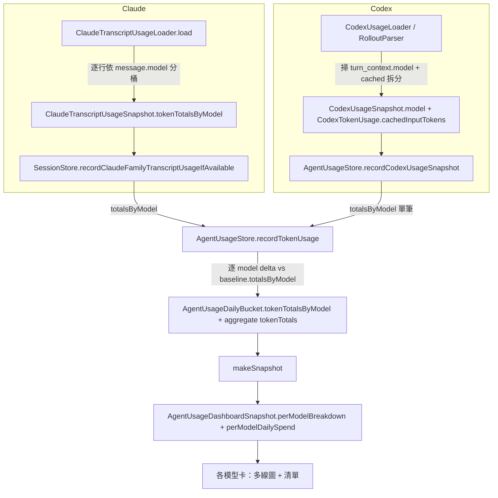
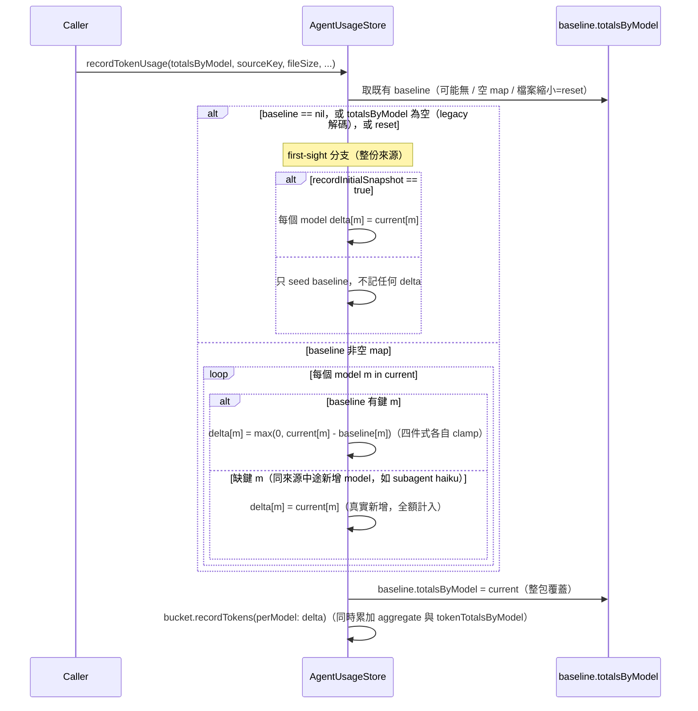

# 逐模型用量與花費分析 Design

> 統計頁把 token 用量與花費從單一 blend 費率，改成逐模型（per-model）計算：每個 model 各自的 token、各自的官方費率、各自的花費，並在頁面新增「各模型」清單與一張逐模型每日花費多線趨勢圖。Claude 與 Codex 都逐模型。

日期：2026-07-04
狀態：已實作（2026-07-04 plan 完成）

## 目標與範圍

現況：`AgentUsageCostEstimator` 只有一組 `blendedCodexClaudePricing`（input 2.375 / output 14.5，label「Codex / Claude Code 均价」）。所有 model 的 token 混在一起、套同一費率。對現行預設 Opus 4.8（實際 5/25）而言，blend 低估；對 Haiku 而言高估。使用者看不到「哪個 model 燒錢」。

本次要做：

1. 把 token 依 model 分桶累計（Claude 逐行 model、Codex 逐 thread model）。
2. 建立逐模型官方費率表，取代單一 blend；未知 model 才 fallback 到 blend。
3. Codex 補上 `cached_input_tokens` 拆分，讓 Codex 快取命中以 0.1× 計價。
4. 統計頁新增「各模型用量與花費」卡：上方逐模型每日花費多線圖、下方逐模型清單（tokens + 花費，依花費降序）。
5. 既有「Token 費用預估」headline 順帶改用逐模型加總（升級前的舊資料 fallback blend，不歸零）。

不做（YAGNI）：費率表 GUI（硬編、改碼調整）；Sonnet 5 的 9/1 日期感知切價（硬編當前值 + 註記）；1 小時快取寫入單獨計價（transcript 只給彙總 `cache_creation_input_tokens`，無法拆）；per-model 持久筆數上限（僅圖上顯示做 top-5 合併）。

## 資料可得性（已實測）

Claude transcript（`~/.claude/projects/<proj>/<uuid>.jsonl`）：每筆 assistant 訊息帶 `message.model`，例如 `claude-opus-4-8`、`claude-haiku-4-5-20251001`。**單一 transcript 可能混多 model**（主線 opus + subagent haiku），所以必須逐行分桶。usage 欄位維持四件式：`input_tokens` / `cache_creation_input_tokens` / `cache_read_input_tokens` / `output_tokens`。

Codex rollout（`~/.codex/sessions/**/rollout-*.jsonl`）：`turn_context.payload.model`，例如 `gpt-5.5`。**一個 thread 實質固定一種 model**（同檔多筆 turn_context 皆同值），所以逐 thread 掛一個 model 即可。token 來自 `event_msg` 的 `payload.type == "token_count"`，其 `info.total_token_usage` 含 `input_tokens`、`cached_input_tokens`、`output_tokens`、`total_tokens`。目前 `CodexUsage.tokenUsage` 只取 input/output、丟棄 cached。

Swift Charts：專案未 `import Charts`，所有圖表（sparkline / bar / heatmap）以 `Path` + `smoothPath(points:)` 手刻。多線圖沿用手刻，不引新依賴（deployment target 14）。

## 架構決策：per-model baseline map（選項 B）

delta/baseline 引擎目前以 `sourceKey` 為單位：每個來源存一筆 `AgentUsageTokenSourceBaseline`，新掃描的累積總量減 baseline 得 delta，delta 累加進當日 bucket。

選項 B 把 baseline 內部改成逐 model：`AgentUsageTokenSourceBaseline` 持有 `totalsByModel: [String: AgentUsageTokenTotals]`，`recordTokenUsage` 收下逐 model 的當前累積 map、對每個 model 各算 delta。一個來源仍只有一筆 baseline（不像 composite-key 方案會讓 baseline dict 依 model 數膨脹）。使用者選 B 取其最完整。

（否決的替代：composite sourceKey — baseline 較不動但 key 膨脹；dominant-model 歸戶 — 最簡但 Claude 混 model 時歸戶錯誤，失準。）

### 端到端流程



### delta 計算（recordTokenUsage 新契約）



關鍵區別（fable5 review 1a）：整份 baseline map 為空（legacy / 首見）走 first-sight，`recordInitialSnapshot:false` 時只 seed 不記 delta，避免把整份 transcript 歷史 dump 進當日；而「非空 map 缺單一鍵」代表同來源中途冒出新 model（如主線 opus 後出現 subagent haiku），該鍵全額計入才正確。兩者語意不同，不可混用。

## 資料模型改動（契約）

`AgentUsageTokenTotals`：不變（四件式 input / cacheCreation / cacheRead / output，`resolvedTotal` 排除 cacheRead）。

`AgentUsageDailyBucket`：新增 `var tokenTotalsByModel: [String: AgentUsageTokenTotals]`，預設 `[:]`（Codable，向後相容：舊桶解碼為空）。`aggregate` 的 `tokenTotals` 保留不變。新增 `mutating func recordTokens(perModel: [String: AgentUsageTokenTotals])`：對每個 (model, delta) 呼叫 `tokenTotalsByModel[model, default: .init()].add(delta)` 並 `tokenTotals.add(delta)`；`activityCount` 在整包 delta 的 `resolvedTotal > 0` 時 +1（避免逐 model 重複 +1）。**不變式：`tokenTotals` 恆等於 `tokenTotalsByModel` 各值之和**（就升級後寫入的資料而言）。

`AgentUsageTokenSourceBaseline`：`var totals: AgentUsageTokenTotals` 改為 `var totalsByModel: [String: AgentUsageTokenTotals]`。Codable：自訂解碼容忍舊形狀 —— 若只有舊 `totals` 鍵、無 `totalsByModel`，解為 `[:]`。空 map 會走上面的 first-sight 分支（因 Claude 用 `recordInitialSnapshot:false`，只把基準點移到當下、不 dump 歷史）。不 bump schemaVersion、不清舊資料。降版相容（NIT，fable5 1d）：舊版 app 讀新檔時，其 synthesized decoder 要求非 optional `totals` → 整份 `AgentUsageDocument` 解碼失敗 → `load` 回空文件、等同全清；降版非支援情境，僅此註記。

`recordTokenUsage` 簽章：`totals currentTotals: AgentUsageTokenTotals` 改為 `totalsByModel currentTotalsByModel: [String: AgentUsageTokenTotals]`。`hasTokens` 判定改為 map 中任一非空。reset 偵測（`didTokenSourceReset`，靠 fileSize）不變，reset 時全 model 重新 seed。

`CodexTokenUsage`：新增 `let cachedInputTokens: Int`（Codable，decodeIfPresent 預設 0，向後相容）。`totals` 改為：

```
input = max(0, inputTokens - cachedInputTokens)   // 假設：OpenAI usage 的 input_tokens 含 cached，扣掉避免雙計
cacheRead = cachedInputTokens                       // 快取命中，計價 0.1×
output = outputTokens
// cacheCreation = 0（OpenAI 無快取寫入加價）
```

「input_tokens 含 cached」是**已由本機樣本佐證的假設**，非官方語意證明：實測 rollout `total_token_usage` 有 `input+output == total` 且 `cached < input`（若 cached 為獨立項，total 不會等於 input+output）。實作註記為假設。

`CodexUsageSnapshot`：新增 `let model: String?`，並同步補進其自訂 `CodingKeys` + `init(from:)` 的 `decodeIfPresent`（此型別經 `UsageSnapshotCacheStore` 持久化，fable5 3d）。model 的掃描位置**不是** `snapshot(from:)`（該函式只收到單一 token_count 行）而是 `loadLatestSnapshot`（CodexUsage.swift:171-191，持有整段 suffix `contents`）：在該處掃最後一筆 `turn_context.payload.model`，作為參數傳入 `snapshot(from:)`（fable5 3a）。找不到 turn_context（實測 8 檔中有 1 檔無）時 model 為 nil。

Codex model 鍵穩定（fable5 3b BLOCKER）：一個 Codex thread 實質固定一種 model，但某次掃描可能取不到 model（nil）。若 nil 與 `gpt-5.5` 在掃描間翻轉，baseline「整包覆蓋」會讓新鍵在 baseline 缺 → 依上面規則全額計入 → 同 thread token 雙計。防法：`recordCodexUsageSnapshot` 解析鍵時，`snapshot.model` 為 nil 就**沿用該 sourceKey 既有 baseline 的唯一 model 鍵**（Codex baseline map 恆單鍵）；連前次鍵都沒有才用 `unknown`。如此同一 thread 的鍵不會翻轉。

`AgentUsageDocument.init` 遷移迴圈（fable5 1b）：現有迴圈把 legacy `codexTokenBaselines` 轉成 `AgentUsageTokenSourceBaseline(totals:)`。欄位改 `totalsByModel` 後，此建構若塞 `["unknown": …]`，下次 Codex 以真實 `gpt-5.5` 鍵記錄時該鍵缺 → 全額計入 → spike。修法：遷移一律建成**空 map**（`totalsByModel: [:]`），空 map 走 first-sight 分支即安全；`tokenBaselines` 才是 `recordCodexUsageSnapshot` 即時寫入的主資料，此遷移只為相容舊檔。

## 費率表

新增 `AgentUsageModelPricing`（enum 或 struct 註冊表），對外提供：

```
static func normalizedKey(forModel rawModel: String?) -> String   // 分桶用穩定鍵
static func pricing(forModel rawModel: String?) -> AgentUsageTokenPricing
static func displayName(forModel rawModel: String?) -> String
```

**分桶鍵在「寫入時」正規化**：`tokenTotalsByModel`、`baseline.totalsByModel`、breakdown 一律以 `normalizedKey` 為鍵，不用 raw id。鍵**保留版本、只剝日期後綴**（`opus-4.8`、`opus-4.5`、`haiku-4.5`、`sonnet-5`、`gpt-5.5` 各自成鍵），使 `claude-opus-4-8` 與其日期變體 `claude-opus-4-8-20260101` 歸同一鍵，但 `opus-4.8` 與 `opus-4.5` 分開（費率同組、顯示名不同，這樣避免 fable5 5c 的「顯示名取決於先來者」）。未知 model 以 `unknown:<小寫 raw id>` 為鍵（保留不同未知 model 的區分）、走 blend；nil / 空 → `unknown`。

`displayName` 是**正規化鍵的決定性純函式**（`opus-4.8`→「Opus 4.8」、`haiku-4.5`→「Haiku 4.5」、`unknown:<raw>`→原始 id、`unknown`→「未知模型」），不看「第一次見到」。`pricing` 由鍵映射到費率組（`opus-4.5`…`opus-4.8` 同組 5/25）。Claude loader 逐行以 `normalizedKey(message.model)` 分桶；Codex 以 `normalizedKey(snapshot.model)`（配合上面的鍵穩定規則）單鍵。

`normalizedKey` 須冪等：`makeSnapshot` 會拿已正規化的鍵回灌 `displayName`/`pricing`（其內部也走 `normalizedKey`），所以註冊表鍵（`opus-4.8` 等）與 `unknown` / `unknown:<raw>` 前綴必須原樣通過、不再被當成新 raw id 二次改寫成 `unknown:opus-4.8`。需冪等性測試（`normalizedKey(normalizedKey(x)) == normalizedKey(x)`）。

`AgentUsageTokenPricing` 結構不動（`inputUSDPerMillion`、`outputUSDPerMillion`、`cacheCreationMultiplier = 1.25`、`cacheReadMultiplier = 0.1`）。已驗證每個官方 model 的 cache 寫 = input×1.25、cache 讀（cached input / cache hit）= input×0.1，故只需逐 model 一組 (input, output)。

官方費率（USD / 百萬 token；Claude 與 OpenAI 均為使用者提供的官方牌價）：

| 正規化 family | 顯示名 | input | output |
|---|---|---|---|
| fable / mythos | Fable 5 / Mythos 5 | 10 | 50 |
| opus 4.5–4.8 | Opus 4.x | 5 | 25 |
| opus 4 / 4.1（棄用） | Opus 4 / 4.1 | 15 | 75 |
| sonnet 4.5 / 4.6 | Sonnet 4.x | 3 | 15 |
| sonnet 5 | Sonnet 5 | 2 | 10 |
| haiku 4.5 | Haiku 4.5 | 1 | 5 |
| gpt-5.5 | GPT-5.5 | 5 | 30 |
| gpt-5.5-pro / gpt-5.4-pro | GPT-5.x pro | 30 | 180 |
| gpt-5.4 | GPT-5.4 | 2.5 | 15 |
| gpt-5.4-mini | GPT-5.4 mini | 0.75 | 4.5 |
| gpt-5.4-nano | GPT-5.4 nano | 0.2 | 1.25 |
| 未知（含 gpt-5-codex 等未列） | 原始 model id | blend 2.375 | blend 14.5 |

註記：

- Sonnet 5 硬編當前 2/10；官方 2026-09-01 起漲為 3/15。以 `// ponytail: Sonnet 5 rate is the pre-2026-09-01 list price; make date-aware if the switch materially skews history` 標記，不做日期感知（180 天保留 + 切點在 9/1，不值得）。
- 1 小時快取寫入官方另有較高價（Opus $10 = ×2）；transcript 僅給彙總 `cache_creation_input_tokens`，無法拆 5 分 / 1 小時，沿用 ×1.25（Claude Code 用 5 分快取）。

### model id 正規化規則

`normalizedKey` 以小寫 raw id 依序比對（順序重要：先特例後泛用），產出「保留版本、剝日期」的鍵；`displayName`/`pricing` 再由鍵決定：

1. 空 / nil → 鍵 `unknown`、顯示「未知模型」、blend。
2. 含 `fable` → `fable-5`「Fable 5」10/50；含 `mythos` → `mythos-5`「Mythos 5」10/50。
3. 前綴 `claude-opus`：取 `opus-4-` 後第一段數字為 minor。minor ∈ {5,6,7,8} → 鍵 `opus-4.<minor>`、顯示「Opus 4.<minor>」、5/25；minor ∈ {0,1} 或為長數字（日期後綴 = 4.0）→ 鍵 `opus-4.<0或1>`、顯示「Opus 4」/「Opus 4.1」、15/75；無法判定 → 視為新版 `opus-4.x`、5/25。
4. 前綴 `claude-sonnet`：`sonnet-5*` → `sonnet-5`「Sonnet 5」2/10；`sonnet-4-5`/`sonnet-4-6` → `sonnet-4.5`/`sonnet-4.6`「Sonnet 4.5/4.6」3/15；其他 sonnet → `sonnet`「Sonnet」3/15。
5. 前綴 `claude-haiku` → `haiku-4.5`「Haiku 4.5」1/5。
6. 前綴 `gpt`：`-pro` / `-mini` / `-nano` 三個 tier 只在有列出的 5.4 / 5.5 版本上認得，且對稱處理，不猜未發布價：`gpt-5.5` 前綴 → `-pro` 得 `gpt-5.5-pro`（30/180）、無 tier 得 `gpt-5.5`（5/30）、其 `-mini` / `-nano` 未列 → 鍵 `unknown:<raw>`、blend；`gpt-5.4` 前綴 → `-pro` 得 `gpt-5.4-pro`（30/180）、`-mini` 得 `gpt-5.4-mini`（0.75/4.5）、`-nano` 得 `gpt-5.4-nano`（0.2/1.25）、無 tier 得 `gpt-5.4`（2.5/15）。其餘 gpt（含 `gpt-5-codex`、未列版本、未列版本的 mini/nano/pro）→ 鍵 `unknown:<raw>`、blend。
7. 皆不中 → 鍵 `unknown:<raw>`、顯示原始 id、blend。

需單元測試覆蓋每條規則與 fallback，並斷言 `displayName` 純由鍵決定（同鍵永遠同顯示名）。

## 花費計算

新增逐 model 加總 API：

```
static func estimateUSD(perModel totalsByModel: [String: AgentUsageTokenTotals]) -> Double
// = Σ over model of AgentUsageModelPricing.pricing(forModel: model).estimateUSD(totals)
```

每日 / 區間花費改用：

```
// 逐 model 部分走官方費率；aggregate 減掉逐 model 之和的殘量走 blend。
// 不變式下，純升級後的桶殘量=0；純舊桶 map 空、殘量=整個 aggregate；升級當天
// 混合桶殘量=升級前那段（fable5 6a：避免混合桶的升級前花費消失）。
residual = componentwiseMax0(bucket.tokenTotals - sum(bucket.tokenTotalsByModel.values))
dayCost = estimateUSD(perModel: bucket.tokenTotalsByModel)
        + AgentUsageCostEstimator.estimateUSD(for: residual)   // blend
```

`AgentUsageCostMetric` / `AgentUsageDailySpendPoint` / `AgentUsageSpendSummary` 的 `estimatedUSD` 全部改走此邏輯。既有 `AgentUsageSpendFooter` 的 label 由「Codex / Claude Code 均价」改為「按模型官方定价」（新 i18n key），僅在有逐 model 資料時；退回 blend 的舊桶不影響此標示（footer 為區間彙總，混合時以逐 model 為主）。

## 快照（snapshot）新增欄位

`AgentUsageDashboardSnapshot` 新增：

```
struct AgentUsageModelBreakdownItem: Identifiable, Equatable, Sendable {
    let modelKey: String       // 正規化後用於配色的穩定鍵
    let displayName: String
    let tokenTotals: AgentUsageTokenTotals
    let estimatedUSD: Double
    var id: String { modelKey }
    var tokenTotal: Int { tokenTotals.resolvedTotal }
}

struct AgentUsageModelDailySpend: Identifiable, Equatable, Sendable {
    let modelKey: String
    let displayName: String
    let points: [AgentUsageDailySpendPoint]   // 對齊 spendDayCount(30) 天，缺日補 0
    var id: String { modelKey }
    var totalUSD: Double { points.reduce(0) { $0 + $1.estimatedUSD } }   // computed，非 stored（fable5 6b）
}

let perModelBreakdown: [AgentUsageModelBreakdownItem]     // 依 estimatedUSD 降序，範圍隨 selectedRange
let perModelDailySpend: [AgentUsageModelDailySpend]       // 30 天，逐 model 一條線，依 totalUSD 降序
```

`makeSnapshot` 內計算：對包含的 bucket，把 `tokenTotalsByModel` 依 modelKey 彙總 → breakdown；對近 30 天，逐 modelKey 逐日算花費 → dailySpend。顯示名由 `AgentUsageModelPricing.displayName(forModel: modelKey)` 決定性推得（非「第一次見到」）。

## UI

新卡插在「Token 費用預估」（`spendCard`）與「活躍地图」（`activityMapCard`）之間，`AnalyticsSettingsView.AgentUsageAnalyticsContent.body`：

```
SettingsSectionCard(title: "各模型用量与花费") {
    AgentUsagePerModelPanel(
        breakdown: viewModel.snapshot.perModelBreakdown,
        dailySpend: viewModel.snapshot.perModelDailySpend
    )
}
```

`AgentUsagePerModelPanel`（新檔 `AgentUsagePerModelViews.swift`）：

- 上方 `AgentUsagePerModelSpendChart`：x = 近 30 天、每 model 一條線、y = 每日花費 $。手刻 `Path`（複用 `smoothPath`），y 以全 model 全期最大值正規化。model 太多時取 `totalUSD` 前 5 條線，其餘合併為一條「其他」。圖例為色點 + 顯示名 chip（含「其他」）。空資料時顯示 `AgentUsageEmptyLine`。
- 下方 `AgentUsageModelBreakdownList`：每列 = 色點 + 顯示名 + tokens（`resolvedTotal`，`compactTokenCount`）+ 花費（`compactUSD`），依花費降序，列間 `AgentUsageInsetDivider`。空資料顯示 `AgentUsageEmptyLine`。

配色：以 `modelKey` 穩定映射到一組固定色盤（沿用 `TerminalColors` + `SettingsCategory.analytics.tint` 等既有色），前 5 名各一色、「其他」灰色。清單與線圖同鍵同色。

## i18n

所有新字串 key 沿專案慣例用簡體識別碼，en.lproj / zh-Hant.lproj 兩表都補值（zh-Hant 值必為繁體）。透過 `Text(appLocalized:)` 或 `AppLocalization.format` 走環境語系表。

| key（簡體識別碼） | en | zh-Hant |
|---|---|---|
| `各模型用量与花费` | Per-Model Usage & Cost | 各模型用量與花費 |
| `按模型官方定价` | Official per-model pricing | 按模型官方定價 |
| `其他` | Other | 其他 |
| `未知模型` | Unknown model | 未知模型 |
| `每日花费` | Daily cost | 每日花費 |
| `还没有可展示的模型数据` | No per-model data yet | 尚無可展示的模型資料 |

（`各模型` 清單列的 tokens / 花費沿用既有 `%@ Tokens`、`compactUSD` 等格式，不新增 key。）

## 檔案層級改動清單

- `PingIsland/Services/Usage/AgentUsageAnalytics.swift`
  - `AgentUsageDailyBucket`：加 `tokenTotalsByModel` + `recordTokens(perModel:)`。
  - `AgentUsageTokenSourceBaseline`：`totals` → `totalsByModel`（含容忍舊形狀的 Codable）。
  - `recordTokenUsage`：簽章改 `totalsByModel`、逐 model delta。
  - `recordCodexUsageSnapshot`：帶入 `snapshot.model`（nil 時沿用既有 baseline 唯一鍵）與含 cached 的 totals。
  - `AgentUsageDocument.init` 遷移迴圈：`AgentUsageTokenSourceBaseline` 建成空 `totalsByModel`（不塞 unknown 鍵）。
  - `CodexTokenUsage`：加 `cachedInputTokens`、改 `totals`。
  - `AgentUsageModelPricing`（新增，同檔或新檔 `AgentUsageModelPricing.swift`）：費率表 + 正規化 + `estimateUSD(perModel:)`。
  - `AgentUsageDashboardSnapshot`：加 `perModelBreakdown` / `perModelDailySpend` 與 `makeSnapshot` 計算；花費改逐 model 加總 + 舊桶 blend fallback。
  - 新 struct：`AgentUsageModelBreakdownItem`、`AgentUsageModelDailySpend`。
- `PingIsland/Services/Usage/ClaudeTranscriptUsage.swift`
  - loader 逐行取 `message.model`、依 model 分桶；`ClaudeTranscriptUsageSnapshot` 加 `tokenTotalsByModel`（保留彙總 `tokenTotals` 供既有用途或改為衍生）。
- `PingIsland/Services/Usage/CodexUsage.swift`
  - `loadLatestSnapshot` 掃最後一筆 `turn_context.model` 傳入 `snapshot(from:)`；`tokenUsage(from:)` 讀 `cached_input_tokens`；`CodexUsageSnapshot.model` + 同步補 `CodingKeys` / `init(from:)` decodeIfPresent。
- `PingIsland/Services/State/SessionStore.swift`
  - `recordClaudeFamilyTranscriptUsageIfAvailable`：傳 `totalsByModel`（維持 `recordInitialSnapshot: false`、sourceKey 不變）。
- `PingIsland/UI/Views/Settings/Categories/AgentUsagePerModelViews.swift`（新檔）：`AgentUsagePerModelPanel` / `AgentUsagePerModelSpendChart` / `AgentUsageModelBreakdownList`。
- `PingIsland/UI/Views/Settings/Categories/AgentUsageRows.swift`：`AgentUsageSpendFooter` 的 pricing label 改「按模型官方定价」（footer/panel 實際在此檔，fable5 7）。
- `PingIsland/UI/Views/Settings/Categories/AnalyticsSettingsView.swift`：插入新卡。
- `PingIsland/UI/Views/Settings/Categories/AgentUsageCharts.swift`：若多線圖需要，抽用 `smoothPath`（已 `func`，可直接用）。
- `PingIsland/Resources/en.lproj/Localizable.strings`、`PingIsland/Resources/zh-Hant.lproj/Localizable.strings`：新 key。
- 測試：`PingIslandTests/AgentUsageAnalyticsTests.swift`、`PingIslandTests/ClaudeTranscriptUsageLoaderTests.swift`（+ 視需要新增 `AgentUsageModelPricingTests`）。

## 測試

- `AgentUsageModelPricing`：每條正規化規則命中正確 (input, output) 與顯示名；未知 / gpt-5-codex → blend；opus minor 判定（4-8 → 5/25、4-1 → 15/75、date 後綴 → 15/75）。
- `ClaudeTranscriptUsageLoader`：混 model transcript（opus 行 + haiku 行）→ `tokenTotalsByModel` 兩鍵、各自四件式正確；彙總與各 model 之和一致。
- `CodexTokenUsage.totals`：`input_tokens=28383, cached_input_tokens=4480, output=424` → input 23903 / cacheRead 4480 / output 424；`cachedInputTokens` 預設 0 時退回舊行為。
- `recordTokenUsage`（B）：首見 + `recordInitialSnapshot:false` → 只 seed baseline.totalsByModel、當日 0；第二次成長 → 逐 model delta 正確、bucket aggregate = 各 model 之和；fileSize 縮小 → 全 model reset。
- 舊形狀 baseline（只有 `totals`）解碼 → `totalsByModel` 空、不崩、重新 seed。
- `makeSnapshot`：`perModelBreakdown` 依花費降序；`perModelDailySpend` 對齊 30 天、缺日補 0；舊桶（`tokenTotalsByModel` 空、`tokenTotals` 非空）→ dayCost 走 blend、不為 0。
- headline 花費：Opus 4.8 桶以 5/25 計、非 blend。

## 資料相容與遷移

不 bump `schemaVersion`、不清舊資料。舊 bucket 的 `tokenTotalsByModel` 解為空 → 逐模型區塊只反映升級後累積的資料；同一舊桶的 aggregate 花費仍以 blend 呈現、不歸零。舊 baseline（`totals` 形狀）解為空 totalsByModel → 下次掃描重新 seed（`recordInitialSnapshot:false` 保證不 dump 歷史）。誠實呈現、無資料損失。

## 成功條件

- 統計頁出現「各模型用量與花費」卡：清單列出各 model 的 tokens 與花費（依花費降序），上方多線圖每 model 一條每日花費線 + 「其他」。
- Opus 4.8 花費以 5/25 計；Haiku 以 1/5 計；gpt-5.5 以 5/30 計；未知 model 走 blend。
- Codex 花費反映 cached 命中折扣（0.1×）。
- 既有「Token 費用預估」headline 改用逐 model 加總、比舊 blend 準；升級前舊資料不歸零。
- `xcodebuild -scheme PingIsland -configuration Debug` 綠、`PingIslandTests` 綠。
- 英文介面全部新字串顯示英文、無簡體洩漏。
